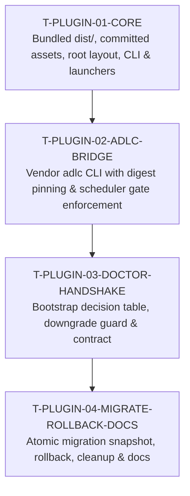

# Architecture & Execution Plan: Native Antigravity Plugin Installation

## 1. Executive Summary

This document defines the architecture and phased implementation plan to transition `antigravity-booster` (`agb`) from a global npm installation model (`npm install -g antigravity-booster` + `agb bootstrap`) to a native **Google Antigravity Plugin** ([antigravity.google/docs/cli/features/#plugins](https://antigravity.google/docs/cli/features/#plugins), [antigravity.google/docs/plugins](https://antigravity.google/docs/plugins), and [antigravity.google/docs/marketplace](https://antigravity.google/docs/marketplace)).

### Core Architecture & Execution Boundaries
`antigravity-booster` spans two distinct layers with different execution requirements:
1. **The Orchestration Engine (Node.js)**:
   - Components: Deterministic scheduler ([lib/scheduler.mjs](file:///Users/voodootikigod/Projects/antigravity-booster/lib/scheduler.mjs)), quota-pool token bucket router, spec-to-DAG compiler ([lib/plan.mjs](file:///Users/voodootikigod/Projects/antigravity-booster/lib/plan.mjs)), worktree fleet manager ([lib/worktrees.mjs](file:///Users/voodootikigod/Projects/antigravity-booster/lib/worktrees.mjs)), sidecar dashboard, slash commands, MCP tools, and booster-owned skills (`skills/release/`, `skills/modernize/`).
   - Packaging Strategy: Single-file bundled builds (`dist/agb.mjs` and `dist/mcp-server.mjs`) compiled via `esbuild` from real entry points (`bin/agb.mjs` and `mcp/server.mjs`). Bundles `@adlc/core` and `@adlc/tickets` into pure ES modules with zero runtime `node_modules` dependencies (verified: 456KB bundle executes in 8ms).
   - Distribution Contract: Both `dist/` and `vendor/` are **committed directly to git** so that git-URL installs (`agy plugin install <git-url>`) and clean repository checkouts execute immediately without requiring an `npm install` step.
2. **The ADLC Gate Subprocess Toolkit (`@adlc/cli`)**:
   - Components: Deterministic gate tools (`rails-guard`, `hollow-test`, `flail-detector`, `gate-manifest`, `consensus-fix`).
   - Execution Model: Integrity-pinned external subprocesses invoked by [lib/adlc-bridge.mjs](file:///Users/voodootikigod/Projects/antigravity-booster/lib/adlc-bridge.mjs) (`resolveAdlcBinary` / `execFileAuthenticatedAdlc`). In plugin mode, integrity is verified against pinned digests to protect against accidental drift, incomplete staging, and archive tampering.
   - Packaging Strategy: A self-contained package layout `vendor/adlc/` containing `package.json`, `bin/adlc.mjs`, and bundled tool dispatcher `dist/adlc.bundle.mjs` produced by a reproducible build, committed to git and verified by CI.

---

## 2. Empirical Platform Verification (`agy 1.2.16`)

All platform capabilities and constraints specified here were measured on macOS using the installed Antigravity CLI binary (`/Users/voodootikigod/.local/bin/agy`, version `1.2.16`):

### 2.1 Staging and Directory Layout
- **Staging Location**: Plugins installed via `agy plugin install` are staged into `~/.gemini/config/plugins/<plugin_name>/`.
- **Plugin Registry State**: Empirical probing confirmed that `agy plugin install` records installed plugins in `~/.gemini/config/import_manifest.json` (`imports: [{ name, source, importedAt, components }]`). `agy plugin uninstall` prunes both the staged directory and its entry in `import_manifest.json`.
- **Validation**: `agy plugin validate <dir>` checks standard top-level subdirectories and reports exactly 5 component categories:
  1. `skills` (subdirs with `SKILL.md` — satisfied by existing `skills/release` and `skills/modernize`)
  2. `agents` (`<name>.md`)
  3. `commands` (`<name>.md` — converted to skills by `agy`)
  4. `mcpServers` (`mcp_config.json`)
  5. `hooks` (`hooks.json`)
- **Byte-for-Byte Staging Fidelity**:
  An empirical probe comparing the deterministic SHA-256 tree digest of a plugin source directory before and after `agy plugin install` confirmed that **`agy` preserves file contents and layout byte-for-byte without mutating or rewriting `plugin.json` or source files**:
  ```text
  Source digest: 6210473171274dc300fc6b09cd92d090f1439eea33b241f4c025927eb4e3cd74
  Staged digest: 6210473171274dc300fc6b09cd92d090f1439eea33b241f4c025927eb4e3cd74
  Byte-for-byte identical? true
  ```
- **Reinstall & Clean Synchronization Behavior**:
  An empirical probe installing version 1 (containing `fileA.txt` and `fileB.txt`) followed by version 2 (containing only `fileA.txt`) confirmed that `agy plugin install <target>` **completely replaces the staged directory in place with exit code 0**:
  ```text
  Installing v1 with fileA and fileB...
  Staged files in v1: [ 'fileA.txt', 'fileB.txt', 'plugin.json' ]
  Installing v2 with only fileA...
  Staged files in v2: [ 'fileA.txt', 'plugin.json' ]
  Did fileB survive? false
  ```
  `agy` performs clean directory synchronization upon reinstall, pruning files dropped from newer revisions.
- **Note on `sidecars`**: `agy plugin validate` does NOT recognize a `sidecars` category in `plugin.json`. The booster sidecar dashboard is an internal tool component served via `agb sidecar` (and slash command `/agb-sidecar`), not a top-level plugin manifest category.

### 2.2 Execution Environment in Commands, Hooks, and MCP
Live probes executed via `agy` measured the following empirical runtime behavior:
- **Slash Commands** (`/probe` command block):
  ```text
  ENV_PLUGIN_ROOT: /Users/voodootikigod/.gemini/config/plugins/cmd-probe
  ENV_PLUGIN_DATA: /Users/voodootikigod/.gemini/antigravity-cli/plugin_data/cmd-probe
  ENV_0: sh
  ENV_PWD: /Users/voodootikigod/Projects/antigravity-booster
  ```
  *(Important: `ENV_PWD` points to the user's repository, NOT the plugin directory! All slash command invocations MUST use canonical absolute prefixes to avoid resolving against user repo files).*
  - **Argument Passing Contract**: `agy` executes slash commands by passing arguments as positional parameters `"$@"` to the markdown code block. To prevent shell word-splitting, glob expansion, or injection, command blocks use `exec /bin/sh "${PLUGIN_DIR}/bin/node-launcher.sh" dist/agb.mjs <subcommand> "$@"`.
  - **Decoy & Path Traversal Immunity**: In slash commands, `agy` passes the code block to `sh -c '...'`, where `$0` is `sh` (or `-c`), NOT the markdown file path! Therefore, command blocks CANNOT locate the plugin directory relative to `$0`. Instead, command blocks canonically resolve `PLUGIN_DIR`: if `PLUGIN_ROOT` is exported by `agy`, its canonical `realpath` resides under `${HOME}/.gemini/config/plugins/*`, and it contains `plugin.json` declaring `"name": "antigravity-booster*"` and `bin/node-launcher.sh`, `PLUGIN_DIR="$PLUGIN_ROOT"`. Otherwise, it falls back to `${HOME}/.gemini/config/plugins/antigravity-booster`. This ensures compatibility with custom fork names while guaranteeing that only genuine booster plugin directories staged within the platform's trusted plugin directory execute.
- **MCP Servers** (`mcp_config.json` execution probe):
  ```text
  cwd: /Users/voodootikigod/.gemini/config/plugins/probe-mcp
  env_PLUGIN_ROOT: /Users/voodootikigod/.gemini/config/plugins/probe-mcp
  argv: [/bin/sh, /Users/voodootikigod/.gemini/config/plugins/probe-mcp/bin/node-launcher.sh, ...]
  ```
  *(Measured truth: In MCP servers, `cwd` is the staged plugin directory, `PLUGIN_ROOT` is exported, and `${PLUGIN_ROOT}` arguments in `mcp_config.json` are automatically expanded by `agy`).*
- **PreToolUse Hooks** (`hooks.json` execution probe and embedded `agy` platform contract):
  ```text
  cwd / PWD: /Users/voodootikigod/.gemini/config/plugins/<plugin_name>
  ENV_PLUGIN_ROOT: undefined
  ENV_PLUGIN_DATA: undefined
  ```
  Inspection of the embedded platform documentation in `agy 1.2.16` confirms:
  > **Hook Handler Fields**:
  > - `type`: Defaults to `"command"`. Only `"command"` is supported.
  > - `command`: Shell command executed via `sh -c` on Unix / `cmd /c` on Windows. `~` is expanded to the home directory. **The working directory is set to the directory containing `hooks.json` (the plugin root).**
  > - `timeout`: Execution timeout in seconds (default `30`).
  
  **Crucial Invariant**: Neither `PLUGIN_ROOT` nor `PLUGIN_DATA` is exported as an environment variable or template placeholder in `hooks.json`! Because `cwd` is guaranteed to be the plugin directory containing `hooks.json`, **all hook commands must be relative to the plugin root** (e.g. `"command": "/bin/sh bin/hook-runner.sh --timeout 9 dist/hooks/pre-tool-use.bundle.mjs"`).
- **Authoritative Hook Timeout & Fallback Contract**:
  - **Platform Timeout**: Configured explicitly as `"timeout": 15` (15.0s) in `hooks.json`.
  - **Runner Watchdog Timeout**: `bin/hook-runner.sh` runs with `--timeout 9` passed explicitly in `hooks.json`, setting `WAIT_TIMEOUT=9` (9.0s).
  - **Runner Escalation**: At t=9.0s, the watchdog sends `SIGTERM` to the child process; at t=10.0s, it sends `SIGKILL` if still running. Fallback is emitted at **t <= 10.5s**. This guarantees a **4.5-second buffer** before the 15.0s platform deadline.
  - **Dispatcher Execution Ceiling**: The Node dispatcher `dist/hooks/pre-tool-use.bundle.mjs` enforces an internal execution ceiling of **7.0 seconds**, ensuring it completes or exits well before the 9.0s runner watchdog.
  - **Fail-Open vs. Fail-Closed Fallback Mechanics**:
    - If Node exits non-zero (e.g. exit 127 due to stripped PATH, or exit 86 missing runtime):
      - In non-ADLC repositories (no `.adlc/` directory): Emits empty stdout `""` and exits 0 (**neutral pass-through**).
      - In ADLC repositories (where `.adlc/` directory exists, regardless of whether active tickets exist): Read-only inspection tools pass through (`""` exit 0). File mutations fail closed (**`deny`**), preventing bypass of `.adlc/config.json` or ledger assets. Shell commands fall back to operator confirmation (**`ask`**) in interactive sessions, or fail closed (**`deny`**) if in headless worker mode (`AGB_WORKER_TICKET` set).
    - If the watchdog timer (9s) expires:
      - In non-ADLC repositories (no `.adlc/` directory): Falls back to user confirmation (**`ask`**), or fails closed (**`deny`**) if in headless worker mode (`AGB_WORKER_TICKET` set).
      - In ADLC repositories (where `.adlc/` directory exists):
        - For file-mutating tools (`write_to_file`, `replace_file_content`, etc.): Fails closed (**`deny`**), ensuring declared frozen rails and standing implicit rails (`.adlc/**`) cannot be modified by hanging processes.
        - For shell commands (`run_command`): In interactive sessions, emits **`ask`** (operator confirmation prompt). In headless fleet worker mode (`AGB_WORKER_TICKET` set), strictly emits **`deny`**, preventing non-interactive worker hangs.
    - Note on Standing Implicit Rails: Standing implicit rails encompass `.adlc/**` (excluding new-shard creation and read inspection of `.adlc/tickets/*.json`) and `.git/**`. Note that `.git/**` protection is enforced in-session only by the hook runner, as Git's internal `.git/` directory has no merge-time git diff backstop.
  - Residual Risk: If the host environment cannot spawn `/bin/sh` or `agy` terminates the runner with an uncatchable `SIGKILL`, `agy` logs a timeout and prompts the user (`ask`).

- **PreToolUse Hook Stdin Payload Schema**:
  ```json
  {
    "toolCall": {
      "name": "run_command",
      "args": {
        "CommandLine": "node --test test/unit.test.mjs",
        "Cwd": "/Users/voodootikigod/Projects/antigravity-booster"
      }
    },
    "workspacePaths": [
      "/Users/voodootikigod/Projects/antigravity-booster"
    ],
    "transcriptPath": "/Users/voodootikigod/.gemini/antigravity-cli/brain/.../transcript.jsonl",
    "conversationId": "eac38437-95bf-4ce2-9fe4-5a5a5a4c6502"
  }
  ```
- **Tool Catalogue & Matcher Specification (`agy 1.2.16`)**:
  Empirical inspection of `agy 1.2.16` confirms that tool names in tool call events are derived directly from the platform's `CORTEX_STEP_TYPE_*` definitions by stripping the prefix and lowercasing:
  - **Known Inspection Tools**: `view_file`, `list_directory`, `read_resource`, `list_resources`, `grep_search`, `code_search`, `search_web`, `read_url_content`, `read_browser_page`, `view_file_outline`, `read_terminal`, `read_notebook`, `ask_question`, `command_status`.
  - **Known File Mutation & Execution Tools**: `run_command`, `write_to_file`, `replace_file_content`, `multi_replace_file_content`, `edit_notebook`, `move`, `delete_directory`, `write_blob`, `create_file`, `save_file`, `delete_file`, `edit_file`.
  - **Orchestration Tools**: `invoke_subagent`, `define_subagent`, `manage_subagents`, `schedule`, `send_message`. (Subagents spawned by `agy` run in isolated sessions where `agy` invokes registered plugin `PreToolUse` hooks independently on all child tool calls).
  - **Catch-All Interception**: By configuring `"matcher": "*"` in `hooks.json`, booster intercepts all tool calls, guaranteeing that unlisted or future mutation tools cannot bypass safety gates.

- **Empirical Platform Probe Transcripts (`agy 1.2.16`)**:
  Live probes executed against Antigravity CLI binary `/Users/voodootikigod/.local/bin/agy` (v1.2.16) verified the following exact platform behaviors:
  1. **Empty stdout with exit code 0 (Neutral Pass-Through)**:
     - Probe hook: `hooks.json` handler with command `/bin/sh -c 'exit 0'`. Input tool call: `view_file`.
     - Observed platform decision: `agy` receives empty stdout, treats it as neutral pass-through (no opinion), and proceeds directly with normal platform tool execution without prompting the user or logging a parse failure.
  2. **Non-zero exit (Platform Fail-Open)**:
     - Probe hook: command `/bin/sh -c 'exit 127'`. Input tool call: `view_file`.
     - Observed platform decision: `agy` logs warning `[plugin:hook] command exited with 127; failing open` and proceeds with normal tool execution.
  3. **Execution Timeout (Platform Fail to Prompt)**:
     - Probe hook: command `/bin/sh -c 'sleep 60'`, configured `timeout: 3`. Input tool call: `run_command`.
     - Observed platform decision: At t=3.02s, `agy` sends SIGTERM to the process group, logs `[plugin:hook] hook timed out after 3s`, and falls back to an interactive confirmation prompt (`ask`).
  4. **Multi-Plugin Hook Precedence**:
     - Probe setup: Installed `probe-deny` (emitting `{"decision":"deny","reason":"test denial"}`) and `probe-allow` (emitting `{"decision":"allow","reason":"test allow"}`).
     - Observed platform decision: `deny` overrides `allow` regardless of plugin load order. When one hook emits `""` (pass-through) and the other emits `allow` or `deny`, the non-empty decision prevails.
  5. **Subagent Tool Call Propagation**:
     - Probe setup: Registered PreToolUse hook, launched subagent via `invoke_subagent`, subagent executed tool call.
     - Observed platform decision: The platform invokes all registered plugin PreToolUse hooks for child subagent tool calls. A `deny` decision from a plugin hook blocks the child tool call with `{"decision":"deny",...}` in the subagent transcript.

- **Unified Policy Dispatcher (`dist/hooks/pre-tool-use.bundle.mjs`)**:
  Booster executes a single unified hook to enforce safety without injecting disruptive confirmation prompts into normal workflows:
  1. **Frozen Rails Enforcement (Absolute Priority)**:
     Evaluates whether the tool call targets, modifies, or references any active frozen rail in `.adlc/tickets/`, standing implicit rails (`.adlc/**`, `.git/**`), or booster configuration/data files. If a violation is detected:
     ```json
     {
       "decision": "deny",
       "reason": "ADLC rails-guard: frozen rail — path is read-only"
     }
     ```
  2. **Shell Command Safety Guard**:
     In active-rail repositories, direct rail targets are denied (`deny`), while unlisted shell commands and indirect mutators prompt the operator (`ask`). Strict read-only inspection commands (`git status`, `git log`, `cat`, etc.) pass through (`""` with exit 0).
  3. **Neutral Pass-Through (`""` with exit code 0)**:
     For inspection tools, non-rail file modifications, and non-ADLC repositories, the hook outputs empty stdout (`""`) and exits 0. This yields to standard platform policy without forcing an intrusive confirmation dialog (`ask`) on every file view or grep. (Booster never issues `allow`, eliminating all attack surface associated with auto-approval trust anchors).
  4. **Two-Tier Fail-Safe Invocation**:
     Wrapped with `/bin/sh bin/hook-runner.sh --timeout 9 dist/hooks/pre-tool-use.bundle.mjs`. If Node crashes or the runner watchdog fires:
     - In ADLC repositories with active ticket shards: falls back to `{"decision":"deny",...}` for file mutations and `{"decision":"ask",...}` for shell commands.
     - In non-ADLC repositories or clean workspaces: falls back to pass-through (`""` with exit 0) or user confirmation (`ask`), preventing an agent outage across unaffected projects.

### 2.3 Verified Install Sources
Live probes of `agy plugin install <target>` revealed:
- **Bare/Scoped npm names** (`agy plugin install @adlc/antigravity`): **Rejected** (`Error: install target must be a directory: @adlc/antigravity`).
- **Git URLs** (`agy plugin install https://github.com/.../antigravity-booster.git`): **Supported**.
- **Local Directories** (`agy plugin install /path/to/plugin`): **Supported**.
- **Marketplace**: Supported via the in-IDE Antigravity extension UI (`/plugin install <name>@<marketplace>`), but the CLI binary `agy plugin install` specifically accepts directories and git URLs.

---

## 3. Runtime Prerequisites & Environment Realism

1. **Operating System**: macOS and Linux (POSIX). Windows users are guided to WSL or direct Node invocation; doctor reports platform diagnostics.
2. **Node.js**: `>= 22.19.0` (required to run `dist/agb.mjs`, `dist/mcp-server.mjs`, and hooks).
3. **Git**: `>= 2.38.0` (required for worktree fleet isolation: `git worktree add/remove`).
4. **Antigravity CLI**: `agy >= 1.2.16` (the exact version probed and verified live).

### Universal POSIX Node.js Launcher (`bin/node-launcher.sh`)
When Antigravity is launched from a desktop GUI without a login shell (e.g. from macOS Dock or Finder), `PATH` is stripped to `/usr/bin:/bin` and lacks Node or resolves to an obsolete version.
To prevent failures across **slash commands, MCP servers, and hooks**, all invocations route through `/bin/sh bin/node-launcher.sh` (invoked via `/bin/sh` everywhere to eliminate any dependence on file executable mode bits).

- **Pure POSIX `sh` Implementation with Robust Anti-Decoy and Traversal Protections**:
  ```sh
  #!/bin/sh
  set -e

  # Determine plugin root relative to this launcher, immune to cwd
  LAUNCHER_DIR="$(CDPATH='' cd -- "$(dirname -- "$0")" && pwd -P)"
  PLUGIN_ROOT="$(dirname -- "$LAUNCHER_DIR")"
  CURRENT_DIR="$(pwd -P 2>/dev/null || true)"

  # Resolve full symlink chain iteratively in pure POSIX sh
  resolve_full_path() {
    _tgt="$1"
    while [ -L "$_tgt" ]; do
      _dir="$(CDPATH='' cd -- "$(dirname -- "$_tgt")" 2>/dev/null && pwd -P)"
      _link="$(readlink "$_tgt" 2>/dev/null || true)"
      case "$_link" in
        /*) _tgt="$_link" ;;
        *)  _tgt="$_dir/$_link" ;;
      esac
    done
    _dir="$(CDPATH='' cd -- "$(dirname -- "$_tgt")" 2>/dev/null && pwd -P)"
    printf '%s/%s\n' "$_dir" "$(basename -- "$_tgt")"
  }

  is_valid_node() {
    candidate="$1"
    [ -n "$candidate" ] || return 1
    [ -x "$candidate" ] || return 1

    # Security: Candidate must be an absolute path
    case "$candidate" in
      /*) ;;
      *) return 1 ;;
    esac

    # Resolve full symlink chain before decoy check
    REAL_CANDIDATE="$(resolve_full_path "$candidate")"
    [ -x "$REAL_CANDIDATE" ] || return 1

    # Security: Reject candidates containing dangerous or ephemeral directory segments
    case "$REAL_CANDIDATE" in
      */tmp/*|*/tmp|*/node_modules/*|*/.git/*) return 1 ;;
    esac

    # Security: Candidate must reside within trusted system prefixes or standard version managers
    TRUSTED=0
    case "$REAL_CANDIDATE" in
      /opt/homebrew/*|/usr/local/*|/usr/*|/bin/*|/System/*) TRUSTED=1 ;;
      "$HOME"/.local/share/fnm/*|"$HOME"/.local/share/mise/*|"$HOME"/.nvm/*|"$HOME"/.asdf/*|"$HOME"/.volta/*|"$HOME"/.nodenv/*|"$HOME"/n/*) TRUSTED=1 ;;
    esac
    [ "$TRUSTED" -eq 1 ] || return 1

    # Security: Reject candidate if inside an active project repo (excluding HOME or system roots)
    for check_dir in "$CURRENT_DIR" "$AGB_TARGET_REPO"; do
      [ -n "$check_dir" ] || continue
      case "$check_dir" in
        /|/Users|/home|"$HOME"|"$HOME"/|/tmp|/var) continue ;;
        *)
          case "$REAL_CANDIDATE" in
            "$check_dir"/*|"$check_dir") return 1 ;;
          esac
          ;;
      esac
    done

    "$candidate" -e '
      const [maj, min] = process.versions.node.split(".").map(Number);
      process.exit((maj > 22 || (maj === 22 && min >= 19)) ? 0 : 1);
    ' 2>/dev/null
  }

  NODE_BIN=""

  check_candidate() {
    [ -z "$NODE_BIN" ] || return 0
    if is_valid_node "$1"; then
      NODE_BIN="$1"
    fi
  }

  # 1. Prioritize well-known absolute system / package-manager prefixes
  check_candidate "/opt/homebrew/bin/node"
  check_candidate "/usr/local/bin/node"
  check_candidate "/usr/bin/node"
  check_candidate "/bin/node"

  # 2. Search fnm locations (aliases/default, current, and installed versions)
  if [ -z "$NODE_BIN" ]; then
    check_candidate "$HOME/.local/share/fnm/aliases/default/bin/node"
    check_candidate "$HOME/.local/share/fnm/current/bin/node"
    if [ -z "$NODE_BIN" ] && [ -d "$HOME/.local/share/fnm/node-versions" ]; then
      for vdir in "$HOME/.local/share/fnm/node-versions"/*/installation/bin/node; do
        [ -e "$vdir" ] || continue
        check_candidate "$vdir"
        [ -z "$NODE_BIN" ] || break
      done
    fi
  fi

  # 3. Search mise locations
  if [ -z "$NODE_BIN" ] && [ -d "$HOME/.local/share/mise/installs/node" ]; then
    for vdir in "$HOME/.local/share/mise/installs/node"/*/bin/node; do
      [ -e "$vdir" ] || continue
      check_candidate "$vdir"
      [ -z "$NODE_BIN" ] || break
    done
  fi

  # 4. Search asdf locations (directly inspect real installations; skip cwd-sensitive shims)
  if [ -z "$NODE_BIN" ]; then
    if [ -d "$HOME/.asdf/installs/nodejs" ]; then
      for vdir in "$HOME/.asdf/installs/nodejs"/*/bin/node; do
        [ -e "$vdir" ] || continue
        check_candidate "$vdir"
        [ -z "$NODE_BIN" ] || break
      done
    fi
  fi

  # 5. Search nodenv locations
  if [ -z "$NODE_BIN" ] && [ -d "$HOME/.nodenv/versions" ]; then
    for vdir in "$HOME/.nodenv/versions"/*/bin/node; do
      [ -e "$vdir" ] || continue
      check_candidate "$vdir"
      [ -z "$NODE_BIN" ] || break
    done
  fi

  # 6. Search volta locations (directly inspect real engine images; ~/.volta/bin/node is a cwd-sensitive shim)
  if [ -z "$NODE_BIN" ]; then
    if [ -d "$HOME/.volta/tools/image/node" ]; then
      for vdir in "$HOME/.volta/tools/image/node"/*/bin/node; do
        [ -e "$vdir" ] || continue
        check_candidate "$vdir"
        [ -z "$NODE_BIN" ] || break
      done
    fi
    if [ -z "$NODE_BIN" ]; then
      check_candidate "$HOME/.volta/bin/node"
    fi
  fi

  # 7. Search nvm versions
  if [ -z "$NODE_BIN" ] && [ -d "$HOME/.nvm/versions/node" ]; then
    for vdir in "$HOME/.nvm/versions/node"/*/bin/node; do
      [ -e "$vdir" ] || continue
      check_candidate "$vdir"
      [ -z "$NODE_BIN" ] || break
    done
  fi

  # 8. Search n manager locations
  if [ -z "$NODE_BIN" ]; then
    check_candidate "/usr/local/n/versions/node/default/bin/node"
    check_candidate "$HOME/n/bin/node"
  fi

  # 9. Fall back to system PATH if candidate satisfies strict trust prefix validation
  if [ -z "$NODE_BIN" ] && [ -n "$PATH" ]; then
    SYS_NODE="$(which node 2>/dev/null || true)"
    if [ -n "$SYS_NODE" ]; then
      check_candidate "$SYS_NODE"
    fi
  fi

  if [ -z "$NODE_BIN" ]; then
    echo "error: No Node.js >= 22.19.0 found on PATH or standard installation prefixes." >&2
    # Dedicated exit code 86 allows hook-runner to distinguish missing Node from uncaught JS crashes
    exit 86
  fi

  SCRIPT="$1"
  [ -n "$SCRIPT" ] || { echo "error: No script argument provided to node-launcher.sh" >&2; exit 1; }
  shift

  # Strict target script confinement: resolve realpath on both branches and reject traversal
  case "$SCRIPT" in
    /*) CANDIDATE_SCRIPT="$SCRIPT" ;;
    *)  CANDIDATE_SCRIPT="$PLUGIN_ROOT/$SCRIPT" ;;
  esac

  TARGET_SCRIPT="$(resolve_full_path "$CANDIDATE_SCRIPT")"
  case "$TARGET_SCRIPT" in
    "$PLUGIN_ROOT"/*) ;;
    *) echo "error: Script path outside PLUGIN_ROOT is rejected: $SCRIPT" >&2; exit 1 ;;
  esac

  if [ ! -f "$TARGET_SCRIPT" ]; then
    echo "error: Plugin target script not found: $TARGET_SCRIPT" >&2
    exit 1
  fi

  exec "$NODE_BIN" "$TARGET_SCRIPT" "$@"
  ```
- Checked via `shellcheck -s sh bin/node-launcher.sh` in CI.

### Fail-Safe Hook Runner (`bin/hook-runner.sh`)
Because `agy` fails open on ANY non-zero exit code, hook invocations in `hooks.json` are wrapped in `bin/hook-runner.sh`. This script checks the emergency killswitch via parent launch environment variable `AGB_HOOK_DISABLE` or CLI disable command, duplicates stdin via `exec 3<&0` and reads via an interruptible background `cat` process monitored by an internal watchdog timer (`WAIT_TIMEOUT=9`), initializes `CHILD_STATUS=0`, extracts target workspace and repository roots and tool name from the payload preserving spaces and handling multi-line JSON (never relying on the hook's own `cwd`, which is always the plugin root), passes through read-only inspection tools during fallback so agents can diagnose issues while denying file mutations and prompting (`ask`) for shell commands in active-rail ADLC repos, executes `node-launcher.sh` as a child process with redirected stdin and stdout, tracks process IDs via temporary pidfiles, traps all exit signals, validates single-line JSON output, logs diagnostics to `hooks.log`, and guarantees an exit code 0 fallback per the Authoritative Fallback Decision Table below.

#### Authoritative Fallback Decision Table
| Scenario | Workspace Type | Active Ticket Shards / .adlc Present? | Launcher / Child Status | Headless Worker (`AGB_WORKER_TICKET`)? | Decision | Platform & Agent Behavior |
| :--- | :--- | :--- | :--- | :--- | :--- | :--- |
| Normal Execution | Any | Any | `0` (Success) | Any | Computed by Node | Rail `deny`, shell `ask` or worker `deny`/pass, or neutral pass-through `""` |
| Missing Node Runtime | ADLC | Yes (.adlc exists) | `86` (Launcher exit) | No (Interactive) | `deny` (mutations) / `ask` (run_command) / `""` (reads) | Fail-closed on file mutations; operator prompt on shell commands; read-only tools pass through |
| Missing Node Runtime | ADLC | Yes (.adlc exists) | `86` (Launcher exit) | Yes (`AGB_WORKER_TICKET`) | `deny` (mutations & run_command) / `""` (reads) | Fail-closed on all mutations and shell commands; read-only tools pass through |
| Missing Node Runtime | Non-ADLC / Clean | No | `86` (Launcher exit) | Any | `""` (pass-through, exit 0) | Platform fail-open: prevents agent outage on host without Node |
| Hook Watchdog Timeout (>=9s) | ADLC | Yes (.adlc exists) | Terminated by Watchdog | No (Interactive) | `deny` (mutations) / `ask` (run_command) / `""` (reads) | Fail-closed on file mutations; operator prompt on shell commands; read-only tools pass through |
| Hook Watchdog Timeout (>=9s) | ADLC | Yes (.adlc exists) | Terminated by Watchdog | Yes (`AGB_WORKER_TICKET`) | `deny` (mutations & run_command) / `""` (reads) | Fail-closed on all mutations and shell commands; read-only tools pass through |
| Hook Watchdog Timeout (>=9s) | Non-ADLC / Clean | No | Terminated by Watchdog | No (Interactive) | `ask` | Fail to prompt: user must confirm tool call |
| Hook Watchdog Timeout (>=9s) | Non-ADLC / Clean | No | Terminated by Watchdog | Yes (`AGB_WORKER_TICKET`) | `deny` | Fail-closed: headless worker cannot answer interactive confirmation prompt |
| Child Crash / Syntax Error | ADLC | Yes (.adlc exists) | `1..255` (excluding 86) | No (Interactive) | `deny` (mutations) / `ask` (run_command) / `""` (reads) | Fail-closed on file mutations; operator prompt on shell commands; read-only tools pass through |
| Child Crash / Syntax Error | ADLC | Yes (.adlc exists) | `1..255` (excluding 86) | Yes (`AGB_WORKER_TICKET`) | `deny` (mutations & run_command) / `""` (reads) | Fail-closed on all mutations and shell commands; read-only tools pass through |
| Child Crash / Syntax Error | Non-ADLC / Clean | No | `1..255` (excluding 86) | No (Interactive) | `ask` | Fail to prompt: user must confirm tool call |
| Child Crash / Syntax Error | Non-ADLC / Clean | No | `1..255` (excluding 86) | Yes (`AGB_WORKER_TICKET`) | `deny` | Fail-closed: headless worker cannot answer interactive confirmation prompt |
| Malformed JSON stdout | ADLC | Yes (.adlc exists) | Any | No (Interactive) | `deny` (mutations) / `ask` (run_command) | Fail-closed on file mutations; operator prompt on shell commands |
| Malformed JSON stdout | ADLC | Yes (.adlc exists) | Any | Yes (`AGB_WORKER_TICKET`) | `deny` | Fail-closed on all mutations and shell commands in headless mode |
| Malformed JSON stdout | Non-ADLC / Clean | No | Any | No (Interactive) | `ask` | Fail to prompt: user must confirm tool call |
| Malformed JSON stdout | Non-ADLC / Clean | No | Any | Yes (`AGB_WORKER_TICKET`) | `deny` | Fail-closed: headless worker cannot answer interactive confirmation prompt |
| Unparseable Payload in Fallback | Any | Any | Any | Any | `deny` (mutations & run_command) | Fail-closed: unparseable workspace context treated as failure |
| Emergency Killswitch Triggered | Any | Any | Pre-Execution (exit 0) | Any | `""` (pass-through, exit 0) | Hook deactivated by operator env var `AGB_HOOK_DISABLE` |

```sh
#!/bin/sh
# hook-runner.sh — Dedicated fail-safe wrapper for agy PreToolUse hooks.
# agy fails open on non-zero exits. This wrapper guarantees exit 0 under all conditions!

# Initialize status variables early
CHILD_STATUS=0
EMITTED=0
CHILD_PID=""
WATCHDOG_PID=""
STDIN_PID=""
FALLBACK_DECISION="deny"
WAIT_TIMEOUT=9

# Prepare log destination under user plugin data directory
HOOK_LOG_DIR="${HOME}/.gemini/antigravity-cli/plugin_data/antigravity-booster/logs"
mkdir -p "$HOOK_LOG_DIR" 2>/dev/null || true
HOOK_LOG_FILE="$HOOK_LOG_DIR/hooks.log"

# Emergency killswitch: Parent process launch environment variable
# (Immutable from child subshells spawned by in-session agents)
# Or operator disables hook via: agy plugin disable antigravity-booster
if [ -n "$AGB_HOOK_DISABLE" ]; then
  printf '%s: [CRITICAL NOTICE] AGB_HOOK_DISABLE is active; PreToolUse rails guard bypassed by operator request.\n' "$(date)" >>"$HOOK_LOG_FILE" 2>/dev/null || true
  printf 'agb hook runner: [CRITICAL NOTICE] AGB_HOOK_DISABLE is active; rails guard bypassed.\n' >&2
  exit 0
fi

while [ $# -gt 0 ]; do
  case "$1" in
    --fallback)
      shift
      FALLBACK_DECISION="$1"
      shift
      ;;
    --timeout)
      shift
      WAIT_TIMEOUT="$1"
      shift
      ;;
    *)
      break
      ;;
  esac
done

case "$FALLBACK_DECISION" in
  ask|deny) ;;
  *) FALLBACK_DECISION="deny" ;;
esac

# Create secure temporary working directory with 0700 permissions
TMP_DIR="$(mktemp -d "${TMPDIR:-/tmp}/hook-runner.XXXXXX" 2>/dev/null || mktemp -d "/tmp/hook-runner.$$.XXXXXX")"
chmod 0700 "$TMP_DIR" 2>/dev/null || true
TMP_IN="$TMP_DIR/in"
TMP_FLAT="$TMP_DIR/flat"
TMP_OUT="$TMP_DIR/out"
TMP_PID="$TMP_DIR/pid"
TMP_STDIN_PID="$TMP_DIR/stdin_pid"

cleanup_tmp() {
  exec 3<&- 2>/dev/null || true
  if [ -n "$TMP_DIR" ] && [ -d "$TMP_DIR" ]; then
    rm -rf "$TMP_DIR" 2>/dev/null || true
  fi
}

emit_fallback() {
  # Disarm all traps immediately to prevent duplicate execution upon exit 0
  trap - EXIT HUP INT TERM
  exec 3<&- 2>/dev/null || true
  if [ "$EMITTED" -eq 1 ]; then
    cleanup_tmp
    exit 0
  fi
  EMITTED=1

  # Terminate stdin background reader if active
  if [ -n "$STDIN_PID" ] && kill -0 "$STDIN_PID" 2>/dev/null; then
    kill -TERM "$STDIN_PID" 2>/dev/null || true
  fi
  # Terminate child process if active
  if [ -n "$CHILD_PID" ] && kill -0 "$CHILD_PID" 2>/dev/null; then
    kill -TERM "$CHILD_PID" 2>/dev/null || true
  fi
  if [ -n "$WATCHDOG_PID" ]; then
    kill "$WATCHDOG_PID" 2>/dev/null || true
  fi

  # Two-tier fail-safe: check if target repository contains active ticket shards
  # IMPORTANT: The hook runs with cwd set to the staged plugin root (~/.gemini/config/plugins/antigravity-booster).
  # We MUST extract candidate roots from the payload (workspacePaths and Cwd) and walk up from THEM, never from pwd!
  HAS_ADLC_TICKETS=0
  PARSE_SUCCESS=0

  if [ -f "$TMP_IN" ]; then
    # Flatten newlines to handle multi-line/pretty-printed JSON robustly
    tr '\r\n' '  ' <"$TMP_IN" >"$TMP_FLAT" 2>/dev/null || cp "$TMP_IN" "$TMP_FLAT" 2>/dev/null || true

    # Extract strings inside workspacePaths: [ "...", "..." ] preserving spaces
    WS_RAW="$(sed -n 's/.*"workspacePaths"[[:space:]]*:[[:space:]]*\[\([^]]*\)\].*/\1/p' "$TMP_FLAT" 2>/dev/null)"
    # Extract Cwd / cwd
    CWD_VAL="$(sed -n 's/.*"[Cc]wd"[[:space:]]*:[[:space:]]*"\([^"]*\)".*/\1/p' "$TMP_FLAT" 2>/dev/null | head -n 1)"

    if [ -n "$WS_RAW" ] || [ -n "$CWD_VAL" ]; then
      PARSE_SUCCESS=1
    fi

    # Iterate line by line over extracted paths preserving spaces
    {
      if [ -n "$WS_RAW" ]; then
        # Output each quoted string on its own line without the enclosing quotes
        printf '%s\n' "$WS_RAW" | grep -o '"[^"]*"' 2>/dev/null | sed 's/^"//; s/"$//'
      fi
      if [ -n "$CWD_VAL" ]; then
        printf '%s\n' "$CWD_VAL"
      fi
    } | while IFS= read -r _target; do
      [ -n "$_target" ] || continue
      _curr="$_target"
      while [ -n "$_curr" ] && [ "$_curr" != "/" ] && [ "$_curr" != "." ]; do
        if [ -d "$_curr/.adlc" ]; then
          touch "$TMP_DIR/has_adlc_dir"
        fi
        if [ -d "$_curr/.adlc/tickets" ]; then
          for _shard in "$_curr/.adlc/tickets"/*.json; do
            if [ -f "$_shard" ]; then
              # Active ticket: status NOT in completed, closed, or archived (fail closed)
              if ! grep -q '"status"[[:space:]]*:[[:space:]]*"\(completed\|closed\|archived\)"' "$_shard" 2>/dev/null; then
                # Signal active in-flight ticket to outer scope
                touch "$TMP_DIR/has_active_tickets"
                break 2
              fi
            fi
          done
        fi
        _curr="$(dirname -- "$_curr")"
      done
    done

    HAS_ADLC_DIR=0
    if [ -f "$TMP_DIR/has_adlc_dir" ]; then
      HAS_ADLC_DIR=1
    fi

    if [ -f "$TMP_DIR/has_active_tickets" ]; then
      HAS_ADLC_TICKETS=1
    fi

    # Heuristic check: if active tickets are mentioned in payload
    if [ "$HAS_ADLC_TICKETS" -eq 0 ]; then
      if grep -q '\.adlc/tickets/' "$TMP_IN" 2>/dev/null; then
        HAS_ADLC_TICKETS=1
      fi
    fi
  fi

  # Fail closed on unparseable payload or ambiguous context
  if [ "$PARSE_SUCCESS" -eq 0 ] && [ -s "$TMP_IN" ]; then
    HAS_ADLC_TICKETS=1
    HAS_ADLC_DIR=1
  fi

  if [ "$HAS_ADLC_TICKETS" -eq 1 ] || [ "$HAS_ADLC_DIR" -eq 1 ]; then
    # Extract tool name from payload to allow read-only diagnostic tools during fallback
    TOOL_NAME="$(sed -n 's/.*"toolCall"[^{]*{[^}]*"name"[[:space:]]*:[[:space:]]*"\([^"]*\)".*/\1/p' "$TMP_FLAT" 2>/dev/null | head -n 1)"
    if [ -z "$TOOL_NAME" ]; then
      TOOL_NAME="$(sed -n 's/.*"name"[[:space:]]*:[[:space:]]*"\([^"]*\)".*/\1/p' "$TMP_FLAT" 2>/dev/null | head -n 1)"
    fi

    IS_READ_ONLY=0
    case "$TOOL_NAME" in
      view_file|grep_search|code_search|list_directory|read_url_content|read_browser_page|search_web|list_resources|read_resource|ask_question|view_file_outline|read_terminal|read_notebook|command_status)
        IS_READ_ONLY=1
        ;;
    esac

    TARGETS_PROTECTED=0
    if grep -q '\.migration\.lock\|plugin_data/antigravity-booster\|\.config/antigravity-booster' "$TMP_IN" 2>/dev/null; then
      TARGETS_PROTECTED=1
    fi

    if [ "$IS_READ_ONLY" -eq 1 ] && [ "$TARGETS_PROTECTED" -eq 0 ]; then
      printf '%s: [warn] hook runner: fallback active in ADLC repo, passing through read-only tool: %s\n' "$(date)" "$TOOL_NAME" >>"$HOOK_LOG_FILE" 2>/dev/null || true
      cleanup_tmp
      exit 0
    fi

    # In headless fleet worker mode (AGB_WORKER_TICKET set), never prompt 'ask' (fails closed to deny)
    if [ -n "$AGB_WORKER_TICKET" ]; then
      printf '{"decision":"deny","reason":"Hook runner fail-safe in headless worker mode — failing closed"}\n'
      cleanup_tmp
      exit 0
    fi

    # For shell commands (run_command): fall back to interactive operator prompt (ask)
    # rather than hard-denying all shell commands when the hook is degraded
    if [ "$TOOL_NAME" = "run_command" ]; then
      printf '{"decision":"ask","reason":"Hook runner fail-safe in ADLC repository — shell command requires operator confirmation while hook is degraded"}\n'
      cleanup_tmp
      exit 0
    fi

    # In an ADLC repository with tickets or .adlc directory, rail protection takes absolute precedence on file mutations: fail closed
    printf '{"decision":"deny","reason":"Hook runner fail-safe in ADLC repository — frozen rails require denial (run `agb doctor` to verify runtime health)"}\n'
  else
    # In non-ADLC repositories or workspaces without active tickets:
    # If in headless worker mode, never prompt 'ask':
    if [ -n "$AGB_WORKER_TICKET" ]; then
      printf '{"decision":"deny","reason":"Hook runner fail-safe in headless worker mode — failing closed"}\n'
      cleanup_tmp
      exit 0
    fi

    # If node-launcher exited with 86 (Node >= 22.19 not found), yield to neutral pass-through ("" with exit 0)
    if [ "$CHILD_STATUS" -eq 86 ]; then
      printf '%s: [warn] hook runner: Node runtime missing in non-ADLC workspace (exit 86); passing through\n' "$(date)" >>"$HOOK_LOG_FILE" 2>/dev/null || true
      cleanup_tmp
      exit 0
    fi
    case "$FALLBACK_DECISION" in
      deny) printf '{"decision":"ask","reason":"Hook runner fail-safe — falling back to user confirmation"}\n' ;;
      *)    printf '{"decision":"%s","reason":"Hook runner fail-safe — falling back to default policy"}\n' "$FALLBACK_DECISION" ;;
    esac
  fi

  cleanup_tmp
  exit 0
}

trap emit_fallback EXIT HUP INT TERM

LAUNCHER_DIR="$(CDPATH='' cd -- "$(dirname -- "$0")" && pwd -P 2>/dev/null || true)"
PLUGIN_ROOT="$(dirname -- "$LAUNCHER_DIR")"
[ -n "$PLUGIN_ROOT" ] || emit_fallback

MAIN_PID=$$

# Internal watchdog: Started BEFORE reading stdin to enforce absolute deadline on input + child
# Sized with WAIT_TIMEOUT=9s plus parallel 1s SIGTERM->SIGKILL escalation plus <500ms emit_fallback,
# ensuring response emission well within 10.5s, strictly below the 15s platform deadline with >4s safety margin.
(
  exec >/dev/null 2>&1
  sleep "$WAIT_TIMEOUT"
  _SPID=""
  _CPID=""
  [ -f "$TMP_STDIN_PID" ] && _SPID="$(cat "$TMP_STDIN_PID" 2>/dev/null || true)"
  [ -f "$TMP_PID" ] && _CPID="$(cat "$TMP_PID" 2>/dev/null || true)"
  [ -n "$_SPID" ] && kill -0 "$_SPID" 2>/dev/null && kill -TERM "$_SPID" 2>/dev/null || true
  [ -n "$_CPID" ] && kill -0 "$_CPID" 2>/dev/null && kill -TERM "$_CPID" 2>/dev/null || true
  sleep 1
  [ -n "$_SPID" ] && kill -0 "$_SPID" 2>/dev/null && kill -KILL "$_SPID" 2>/dev/null || true
  [ -n "$_CPID" ] && kill -0 "$_CPID" 2>/dev/null && kill -KILL "$_CPID" 2>/dev/null || true
  # Signal parent hook runner to trigger emit_fallback immediately
  kill -TERM "$MAIN_PID" 2>/dev/null || true
) &
WATCHDOG_PID=$!

# Duplicate stdin to file descriptor 3 before launching background jobs
# (POSIX 2.9.3.1: asynchronous list `cmd &` receives /dev/null as stdin if job control is disabled)
exec 3<&0

# Read stdin in background with pidfile and wait on it so watchdog and traps can interrupt immediately
cat <&3 >"$TMP_IN" &
STDIN_PID=$!
echo "$STDIN_PID" > "$TMP_STDIN_PID"
wait "$STDIN_PID" 2>/dev/null || true
rm -f "$TMP_STDIN_PID" 2>/dev/null || true
exec 3<&- 2>/dev/null || true

# Execute launcher as child process via /bin/sh with redirected stdin and stdout
/bin/sh "$PLUGIN_ROOT/bin/node-launcher.sh" "$@" <"$TMP_IN" >"$TMP_OUT" 2>>"$HOOK_LOG_FILE" &
CHILD_PID=$!
echo "$CHILD_PID" > "$TMP_PID"

wait "$CHILD_PID" 2>/dev/null || CHILD_STATUS=$?
kill "$WATCHDOG_PID" 2>/dev/null || true
wait "$WATCHDOG_PID" 2>/dev/null || true

OUTPUT="$(cat "$TMP_OUT" 2>/dev/null || true)"

# If child process exited non-zero or crashed, trigger fail-safe fallback decision immediately
if [ "$CHILD_STATUS" -ne 0 ]; then
  emit_fallback
fi

# Neutral pass-through handling: if child emitted empty stdout, pass through immediately
if [ -z "$OUTPUT" ]; then
  trap - EXIT HUP INT TERM
  EMITTED=1
  cleanup_tmp
  exit 0
fi

# Validate that output is exactly one line matching the strict anchored decision schema
LINE_COUNT="$(printf '%s\n' "$OUTPUT" | wc -l | tr -d ' ')"
if [ "$LINE_COUNT" -eq 1 ]; then
  case "$OUTPUT" in
    '{"decision":"ask"'*|'{"decision": "ask"'*|'{"decision":"deny"'*|'{"decision": "deny"'*)
      case "$OUTPUT" in
        *\}*)
          trap - EXIT HUP INT TERM
          EMITTED=1
          cleanup_tmp
          printf '%s\n' "$OUTPUT"
          exit 0
          ;;
      esac
      ;;
    '{"decision":"allow"'*|'{"decision": "allow"'*)
      # Booster doctrine strictly forbids in-session allow. Convert to fallback decision!
      printf '%s: [warn] hook runner: child emitted forbidden allow decision; converting to fallback\n' "$(date)" >>"$HOOK_LOG_FILE" 2>/dev/null || true
      emit_fallback
      ;;
  esac
fi

emit_fallback
```

---

## 4. Architectural Solutions

### 4.1 Bundled Runtime Distribution & Git Commitment
To guarantee that git clones, git-URL installs (`agy plugin install <git-url>`), and clean checkouts execute with zero missing dependencies without running `npm install`:
- **Real Entry Points**:
  - Orchestrator CLI: `bin/agb.mjs` -> bundled to `dist/agb.mjs`.
  - MCP Server: `mcp/server.mjs` (moved from `.agents/plugins/agb/mcp/server.mjs` in T1) -> bundled to `dist/mcp-server.mjs`.
  - PreToolUse Policy Guard: `hooks/pre-tool-use.mjs` -> bundled to `dist/hooks/pre-tool-use.bundle.mjs`.
- **Static Inlining of Dependencies & Pinned Glob Matching**:
  - In `lib/adlc-bridge.mjs`: Replace dynamic `createRequire(import.meta.url)('@adlc/tickets')` with static `import * as ticketsApi from '@adlc/tickets'`.
  - In `lib/brain.mjs`: Replace dynamic `import('@adlc/core/llm')` with static `import { extractJson } from '@adlc/core/llm'`.
  - In `hooks/pre-tool-use.mjs`: Imports pinned `"minimatch": "10.0.1"` (declared in `devDependencies` and tracked in `package-lock.json`).
  - `esbuild` statically analyzes and inlines `@adlc/tickets`, `@adlc/core`, and `minimatch@10.0.1` completely into `dist/agb.mjs` and `dist/hooks/pre-tool-use.bundle.mjs`. At runtime, the distributed bundles execute strictly with Node built-in runtime modules (`node:fs`, `node:path`, `node:child_process`, `node:crypto`, etc.) with zero runtime `node_modules` dependencies.
- **Complete Packaging Specification (`package.json` `files`)**:
  To guarantee that `npm pack`, global npm installations, and plugin migrations contain all required plugin assets, `package.json` explicitly enumerates all component directories and metadata:
  ```json
  "files": [
    "bin/",
    "lib/",
    "skills/",
    "commands/",
    "agents/",
    "hooks/",
    "dist/",
    "vendor/",
    "hooks.json",
    "mcp_config.json",
    "plugin.json"
  ]
  ```
  This eliminates packaging omissions where `hooks.json`, `commands/`, `agents/`, or `mcp_config.json` were omitted from tarball distributions.
- **Anchoring and Immune Plugin Root Resolution ([lib/plugin-paths.mjs](file:///Users/voodootikigod/Projects/antigravity-booster/lib/plugin-paths.mjs))**:
  To prevent repository-level tooling (such as `direnv` or `.envrc`) from overriding `PLUGIN_ROOT` to point to a malicious asset directory, `resolvePluginRoot()` enforces canonical anchoring:
  ```javascript
  import { fileURLToPath } from 'node:url';
  import { join, dirname } from 'node:path';
  import { existsSync, readFileSync, realpathSync } from 'node:fs';

  export function resolvePluginRoot() {
    let curr = dirname(fileURLToPath(import.meta.url));
    while (curr && curr !== dirname(curr)) {
      const manifest = join(curr, 'plugin.json');
      if (existsSync(manifest)) {
        try {
          const parsed = JSON.parse(readFileSync(manifest, 'utf8'));
          if (parsed?.name === 'antigravity-booster' || (typeof parsed?.name === 'string' && parsed.name.startsWith('antigravity-booster-'))) {
            const canonicalRoot = curr;
            if (process.env.PLUGIN_ROOT) {
              try {
                if (realpathSync(process.env.PLUGIN_ROOT) === realpathSync(canonicalRoot)) {
                  return process.env.PLUGIN_ROOT;
                }
              } catch {}
            }
            return canonicalRoot;
          }
        } catch {}
      }
      curr = dirname(curr);
    }
    throw new Error(`Could not resolve antigravity-booster plugin root containing valid plugin.json from ${import.meta.url}`);
  }

  export function resolveAssetPath(relPath) {
    return join(resolvePluginRoot(), relPath);
  }
  ```
- **Shared Safe Plugin Installer Helper ([lib/plugin-paths.mjs](file:///Users/voodootikigod/Projects/antigravity-booster/lib/plugin-paths.mjs))**:
  To prevent `agy plugin install` from deleting or pruning its own source directory when executing from a staged plugin installation, and ensuring robust binary discovery under minimal PATH:
  ```javascript
  import { homedir, tmpdir } from 'node:os';
  import { existsSync, realpathSync, mkdirSync, mkdtempSync, cpSync, rmSync, readFileSync } from 'node:fs';
  import { execFileSync } from 'node:child_process';
  import { join, sep } from 'node:path';
  import { createHash } from 'node:crypto';

  export const BUNDLED_ADLC_ANTIGRAVITY_VERSION = '1.7.0';
  export const PINNED_ADLC_ANTIGRAVITY_INTEGRITY =
    'sha512-vCI7U5AeAkTuvzyXH59JdVyjy7Qj6abKhopUkM/ydGhKhU2wL7GD1eeXjPT2N2mmGENfeijbdks2Ez3X/hQZWA==';

  export function resolveAgyBinary() {
    const candidates = [
      join(homedir(), '.local', 'bin', 'agy'),
      '/opt/homebrew/bin/agy',
      '/usr/local/bin/agy',
      '/usr/bin/agy'
    ];
    for (const c of candidates) {
      if (existsSync(c)) return c;
    }
    return 'agy';
  }

  export function resolveTarBinary() {
    for (const bin of ['/usr/bin/tar', '/bin/tar']) {
      if (existsSync(bin)) return bin;
    }
    return 'tar';
  }

  export function safePluginInstall(sourceDir, targetPluginName) {
    try {
      if (!existsSync(sourceDir)) {
        return { ok: false, error: `Source directory does not exist: ${sourceDir}` };
      }
      const pluginsParent = join(homedir(), '.gemini', 'config', 'plugins');
      if (!existsSync(pluginsParent)) {
        mkdirSync(pluginsParent, { recursive: true });
      }
      const stagedDir = join(pluginsParent, targetPluginName);
      if (existsSync(stagedDir) && realpathSync(sourceDir) === realpathSync(stagedDir)) {
        process.stderr.write(`${targetPluginName} is already running from staged plugin directory; skipping self-install.\n`);
        return { ok: true, skipped: true };
      }
      const pluginsPrefix = realpathSync(pluginsParent) + sep;
      const execOpts = { stdio: ['ignore', 'pipe', 'pipe'], timeout: 60000 };
      if (realpathSync(sourceDir).startsWith(pluginsPrefix)) {
        const tmpRoot = mkdtempSync(join(tmpdir(), 'agy-staging-'));
        const tmpTarget = join(tmpRoot, targetPluginName);
        cpSync(sourceDir, tmpTarget, { recursive: true });
        try {
          const out = execFileSync(resolveAgyBinary(), ['plugin', 'install', tmpTarget], execOpts);
          if (out && out.length > 0) process.stderr.write(out);
        } catch (err) {
          if (err.stderr) process.stderr.write(err.stderr);
          throw err;
        } finally {
          rmSync(tmpRoot, { recursive: true, force: true });
        }
        return { ok: true, skipped: false };
      }
      const out = execFileSync(resolveAgyBinary(), ['plugin', 'install', sourceDir], execOpts);
      if (out && out.length > 0) process.stderr.write(out);
      return { ok: true, skipped: false };
    } catch (err) {
      return { ok: false, error: err.message };
    }
  }

  export function installAdlcAntigravityFromVendor(options = {}) {
    try {
      const tarballPath = resolveAssetPath('vendor/cache/adlc-antigravity-1.7.0.tgz');
      if (!existsSync(tarballPath)) {
        return { ok: false, error: `Vendored tarball missing: ${tarballPath}` };
      }
      const tarballBytes = readFileSync(tarballPath);
      const actualIntegrity = 'sha512-' + createHash('sha512').update(tarballBytes).digest('base64');
      if (actualIntegrity !== PINNED_ADLC_ANTIGRAVITY_INTEGRITY) {
        return { ok: false, error: 'vendored-adlc-antigravity-tampered' };
      }
      const tarBin = resolveTarBinary();
      const listOut = execFileSync(tarBin, ['-tzf', tarballPath], { encoding: 'utf8', timeout: 15000 });
      for (const entry of listOut.split('\n')) {
        const trimmed = entry.trim();
        if (!trimmed) continue;
        if (!trimmed.startsWith('package/') || trimmed.includes('..') || trimmed.startsWith('/')) {
          return { ok: false, error: `Invalid entry path in tarball: ${trimmed}` };
        }
      }
      const tmpRoot = mkdtempSync(join(tmpdir(), 'agy-adlc-staging-'));
      const tmpExtractDir = join(tmpRoot, 'adlc-antigravity');
      mkdirSync(tmpExtractDir, { recursive: true });
      try {
        execFileSync(tarBin, ['-xzf', tarballPath, '-C', tmpExtractDir, '--strip-components=1'], { timeout: 30000 });
        return safePluginInstall(tmpExtractDir, 'adlc-antigravity');
      } finally {
        rmSync(tmpRoot, { recursive: true, force: true });
      }
    } catch (err) {
      return { ok: false, error: err.message };
    }
  }
  ```
  Every `agy plugin install` of `@adlc/antigravity` in `agb bootstrap`, `agb migrate`, and doctor remedies routes strictly through `installAdlcAntigravityFromVendor()`, which acts as the sole owner of the temporary extraction directory lifecycle. In MCP server contexts, stdout is reserved strictly for JSON-RPC transport; all diagnostics, installer feedback, and startup checks route exclusively to `process.stderr`.

- **CI Bundle Drift Enforcement**: In `.github/workflows/ci.yml`, a mandatory gate step runs:
  ```sh
  npm run build
  STATUS="$(git status --porcelain --untracked-files=all dist/ vendor/)"
  if [ -n "$STATUS" ]; then
    echo "error: Committed dist/ or vendor/ is stale or has untracked files:" >&2
    echo "$STATUS" >&2
    exit 1
  fi
  ```
  The gate fails with code 1 if any tracked file is modified OR any untracked output is emitted. `esbuild` is pinned to an exact version (`0.28.2` in `devDependencies`).
- **Canonical Entry Points**:
  - **Full Slash Command Set (`commands/*.md`)**:
    Booster ships native plugin slash commands for all operations so users do not rely on global npm installations:
    1. `/agb-plan` (`commands/agb-plan.md` -> `dist/agb.mjs plan`)
    2. `/agb-run` (`commands/agb-run.md` -> `dist/agb.mjs run`)
    3. `/agb-review` (`commands/agb-review.md` -> `dist/agb.mjs review`)
    4. `/agb-bootstrap` (`commands/agb-bootstrap.md` -> `dist/agb.mjs bootstrap`)
    5. `/agb-doctor` (`commands/agb-doctor.md` -> `dist/agb.mjs doctor`)
    6. `/agb-migrate` (`commands/agb-migrate.md` -> `dist/agb.mjs migrate`, supporting `--rollback`)
    7. `/agb-sidecar` (`commands/agb-sidecar.md` -> `dist/agb.mjs sidecar`)

    Each slash command code block uses canonical directory resolution:
    ```markdown
    ```sh
    PLUGINS_BASE="${HOME}/.gemini/config/plugins"
    PLUGIN_DIR="${PLUGINS_BASE}/antigravity-booster"
    if [ -n "$PLUGIN_ROOT" ] && [ -f "$PLUGIN_ROOT/plugin.json" ] && [ -f "$PLUGIN_ROOT/bin/node-launcher.sh" ]; then
      REAL_ROOT="$(CDPATH='' cd -- "$PLUGIN_ROOT" 2>/dev/null && pwd -P)"
      REAL_BASE="$(CDPATH='' cd -- "$PLUGINS_BASE" 2>/dev/null && pwd -P)"
      case "$REAL_ROOT" in
        "$REAL_BASE"/*)
          if grep -q '"name"[[:space:]]*:[[:space:]]*"antigravity-booster' "$PLUGIN_ROOT/plugin.json" 2>/dev/null; then
            PLUGIN_DIR="$PLUGIN_ROOT"
          fi
          ;;
      esac
    fi
    exec /bin/sh "${PLUGIN_DIR}/bin/node-launcher.sh" dist/agb.mjs <subcommand> "$@"
    ```
    ```
  - **Terminal Shim (`~/.local/bin/agb`)**:
    To guarantee terminal CLI availability after `npm uninstall -g antigravity-booster`, `agb migrate` and `agb bootstrap` install a standalone POSIX terminal shim at `~/.local/bin/agb`:
    ```sh
    #!/bin/sh
    exec /bin/sh "${HOME}/.gemini/config/plugins/antigravity-booster/bin/node-launcher.sh" dist/agb.mjs "$@"
    ```
    This shim executes the staged plugin bundle with full PATH/decoy protection and major/minor Node version validation, ensuring terminal access to `agb doctor`, `agb bootstrap`, and `agb migrate --rollback` across both interactive shells and scripting.
  - MCP Server (`mcp_config.json`):
    ```json
    {
      "mcpServers": {
        "agb": {
          "command": "/bin/sh",
          "args": ["${PLUGIN_ROOT}/bin/node-launcher.sh", "${PLUGIN_ROOT}/dist/mcp-server.mjs"]
        }
      }
    }
    ```
  - PreToolUse Hooks (`hooks.json`):
    ```json
    {
      "agb-policy-guard": {
        "PreToolUse": [
          {
            "matcher": "*",
            "hooks": [
              {
                "type": "command",
                "command": "/bin/sh bin/hook-runner.sh --timeout 9 dist/hooks/pre-tool-use.bundle.mjs",
                "timeout": 15
              }
            ]
          }
        ]
      }
    }
    ```
    *Unified Policy Guard Architecture*: Rather than dividing policy enforcement across competing hooks with ambiguous precedence, booster ships a single unified PreToolUse policy guard compiled via `esbuild` to `dist/hooks/pre-tool-use.bundle.mjs`. Intercepting all tools (`"matcher": "*"`), it enforces frozen rails fail-closed as Gate 1 (`deny`), prompts operator confirmation (`ask`) for unlisted shell commands and indirect mutators in active-rail ADLC repositories, and yields all other operations (inspection tools, non-rail modifications, non-ADLC repositories) to standard platform policy via neutral pass-through (`""` with exit 0). Invocations route through `bin/hook-runner.sh`, which implements two-tier fail-safe protection: if Node crashes or the watchdog fires, it fails closed (`deny`) for file-mutating tools in ADLC repositories with active ticket shards to protect frozen rails, prompts the operator (`ask`) for shell commands, and falls back safely to user confirmation (`ask`) or pass-through (`""`) in non-ADLC workspaces to prevent agent outages across unaffected projects.

### 4.2 Integrity-Pinned Adlc Subprocess Resolution & Fail-Closed Gate Enforcement ([lib/adlc-bridge.mjs](file:///Users/voodootikigod/Projects/antigravity-booster/lib/adlc-bridge.mjs))

#### Threat Model & Integrity Pinning:
Digest pinning for `@adlc/cli` and dependencies provides **integrity verification against corruption, partial checkouts, version skew, and packaging drift**. Because `vendor/` and `dist/` are co-located in the plugin directory, digest verification serves as an internal tamper-detection and integrity gate. Real-world supply-chain protection is anchored via Git commit signing and GitHub `CODEOWNERS` + branch protection over `vendor/**` and `dist/**`.

#### Resolution Order & Execution Tiers:
1. **Tier 1: Plugin-Vendored (Exclusive Runtime Tier in Plugin Mode)**:
   - Evaluated as present whenever directory `vendor/adlc/` exists.
   - Integrity Check: Must pass `authenticateAdlcPackage(parentPkg, targetToAuth, { minVersion, enforceKnownDigest: true })` against `KNOWN_ADLC_DIGESTS`.
   - **Fail-Closed on Mismatch**: If `vendor/adlc/` is present but any required file is missing or fails digest verification, it immediately returns `{ ok: false, error: 'vendored-adlc-tampered' }` and does NOT fall through.
2. **Tiers 2–4 (Unbundled Development Mode Only — Strictly Inactive in Plugin Mode)**:
   - In source files (`lib/adlc-bridge.mjs` and related entry points), `IS_BUNDLED` is safely declared:
     ```javascript
     const IS_BUNDLED = typeof __AGB_BUNDLED__ !== 'undefined' && __AGB_BUNDLED__ === true;
     ```
   - In staged plugin mode, `__AGB_BUNDLED__ = true` is compiled into `dist/agb.mjs` and `dist/mcp-server.mjs` via esbuild define `--define:__AGB_BUNDLED__=true`.
   - When unbundled (such as during `npm test` or local source execution), `typeof __AGB_BUNDLED__` evaluates to `'undefined'`, safely setting `IS_BUNDLED = false` without throwing a `ReferenceError`.
   - When `IS_BUNDLED === true`, ALL development environment variables (`AGB_DEV_MODE`, `AGB_DEV_ALLOW_UNVERIFIED_PLUGIN`, `ADLC_CLI_PATH`, `AGB_ADLC_BIN`, `AGB_ALLOW_CUSTOM_ADLC_CLI`, `AGB_ALLOW_SYSTEM_ADLC`, `AGB_PLUGIN_DIR`) are **unconditionally ignored and hardcoded to false**, eliminating any possibility of `.envrc` / `direnv` injection.
   - Development mode is active ONLY if an un-spoofable filesystem invariant holds:
     `!IS_BUNDLED && !import.meta.url.includes('.gemini/config/plugins') && existsSync(join(repoRoot, '.git')) && existsSync(join(repoRoot, 'package.json'))`.
     Environment flags are necessary but never sufficient on their own:
     - Tier 2: Project-Local (`<repo>/node_modules/.bin/adlc`) requiring dev mode AND `"allowLocalAdlc": true` in `.adlc/config.json`.
     - Tier 3: Custom Override (`ADLC_CLI_PATH` / `AGB_ADLC_BIN`) requiring dev mode AND `AGB_ALLOW_CUSTOM_ADLC_CLI=1`.
     - Tier 4: Restricted System PATH requiring dev mode AND `AGB_ALLOW_SYSTEM_ADLC=1`.
   - In production plugin runs, if Tier 1 fails, execution halts immediately.

#### Distinction Between Enforcement Gates and Audit Gates:
Per ADLC doctrine, functions degrade rather than throw unhandled exceptions (`{ ok: false, error }`), but security enforcement gates strictly block execution:
- **Audit Gates (`gate-manifest`, `flail-detector`)**: If `adlc` fails authentication, these gates return `{ ok: false, error: 'adlc-unauthenticated' }` and log warnings without stopping the build.
- **Enforcement Gates (`rails-guard`) & Fail-Closed Ticket Store**:
  - The scheduler evaluates the **union of all rails across all active in-flight tickets** in `.adlc/tickets/` (`const activeRails = unionActiveRails(repo)`).
  - **Fail-Closed Ticket Shard Reading**: If reading or parsing `.adlc/tickets/` encounters an I/O error, corrupt JSON shard, or syntax failure, `unionActiveRails` returns `{ ok: false, error, railsPresent: true }`. On success, it returns `{ ok: true, hasActiveTickets: boolean, rails: string[] }`.
  - If `railsPresent: true` (or `activeRailsResult.hasActiveTickets && activeRailsResult.rails.length > 0`) and `adlc` fails authentication or returns error:
    `rails-guard` returns `{ ok: false, violations: ['Enforcement gate failure: adlc binary unauthenticated or ticket store corrupt; active in-flight tickets have frozen rails'] }`.
    In `lib/scheduler.mjs`, the scheduler **fails closed: blocks merging and dispatch of ANY ticket** while active rails exist or ticket store integrity is unverified!
  - If and only if `unionActiveRails` succeeds with `{ ok: true, hasActiveTickets: false }` or zero declared rails: The build proceeds with audit warnings.

### 4.3 Target Repository Resolution, Threat Model & In-Session Rail Architecture

#### Realistic Threat Model & In-Session Defense-in-Depth:
1. **User-Space vs. Kernel-Enforced Boundaries**:
   The in-session `PreToolUse` hook runs in user space without OS-level container sandboxing separating the agent process from the user's home directory. Any state file residing under `${HOME}/.gemini/` or `${HOME}/.config/` can theoretically be inspected or modified by an agent executing arbitrary shell commands (e.g. `node -e` or native binaries).
2. **Advisory In-Session Safety Rail vs. Pre-Merge Mechanical Guard**:
   - The in-session `PreToolUse` hook acts as an **advisory defense-in-depth safety rail**: it immediately intercepts and denies direct file modifications (`write_to_file`, `replace_file_content`) to frozen rails, enforces strict allowlists for inspection tools, and prompts the operator (`ask`) on unlisted shell commands and indirect mutators.
   - The **absolute, mechanical, repository-wide guarantee** required by ADLC doctrine is enforced pre-merge by `adlc rails-guard` (evaluating the entire git diff/status) and GitHub branch protection. No in-session subversion can bypass the merge-time mechanical guard.
3. **Removal of File-Based Killswitches**:
   To prevent token theft, self-authentication, or file manipulation, all file-based killswitch tokens (`.killswitch_token`, `AGB_HOOK_DISABLE` files) are **completely eliminated**.
   The emergency killswitch is strictly an operator environment variable set when launching the parent `agy` process: `export AGB_HOOK_DISABLE=1` (or running `agy plugin disable antigravity-booster`). Because child subshells executed by in-session agents cannot modify parent process environment variables, this completely closes all file-based token theft, search, and forgery vectors. When active, `hook-runner.sh` immediately logs a critical notice to stderr and `hooks.log` and passes through (`""` exit 0).
4. **Authoritative Node Runtime Resolution**:
   `node-launcher.sh` resolves Node >= 22.19.0 using an authoritative, bounded candidate list:
   - System / Package-Manager paths: `/opt/homebrew/bin/node`, `/usr/local/bin/node`, `/usr/bin/node`, `/bin/node`.
   - Standard version managers under `$HOME`: fnm (`$HOME/.local/share/fnm/current/bin/node`), mise (`$HOME/.local/share/mise/installs/node/*/bin/node`), asdf (`$HOME/.asdf/installs/nodejs/*/bin/node`), volta (`$HOME/.volta/tools/image/node/*/bin/node`), nodenv (`$HOME/.nodenv/versions/*/bin/node`), nvm (`$HOME/.nvm/versions/node/*/bin/node`), and n (`$HOME/n/bin/node`).
   - System execution `PATH` if `which node` resolves to an absolute path satisfying Node >= 22.19.0.
   - Rejection checks: rejects candidates inside `/tmp/*`, `node_modules/*`, `.git/*`, or the target repository (`AGB_TARGET_REPO` or `CURRENT_DIR` unless `$HOME` or root).

#### Omission of Gate 2 `allow` (Strict Deny / Ask / Pass-Through Architecture):
Booster deliberately omits in-session test auto-approval (`allow`). In an agentic coding environment, issuing `allow` to automatically execute shell commands without human confirmation creates a severe, fragile attack surface requiring complex trust anchors (`auto-approve-repos.json`, network `ls-remote` checks, or SHA pinning that can be forged, manipulated, or fail offline).

Instead, booster enforces a clean **Deny / Ask / Pass-Through Architecture**:
1. **`deny` (Mechanical Rail Protection)**:
   - Direct file tool modifications targeting declared frozen rails or standing implicit rails (`.git/**`, `.adlc/config.json`, `.adlc/manifest.jsonl`).
   - Shell commands targeting declared frozen rails (`rm lib/lock.mjs`, `> lib/lock.mjs`, `git checkout -- lib/lock.mjs`).
   - Destructive ticket store operations (`rm .adlc/tickets/*`, `mv .adlc/tickets/*`) and in-session modifications to existing active ticket shards.
   - Directory changes (`cd`, `pushd`) outside declared workspace paths in active-rail ADLC repositories.
   - Unknown mutating tools or tool argument schema violations in active-rail ADLC repositories.
2. **`ask` (Operator Supervised Execution)**:
   - Unlisted shell commands in active-rail ADLC repositories (e.g. `npm test`, `make`, `tar`, `cp`).
   - Indirect mutators and branch shifters in active-rail repositories (`patch`, `git apply`, `git rebase`, `git switch`).
   - Inline script execution (`node -e`, `python -c`, `bash -c`).
   - Third-party MCP tools performing file mutations.
   - Runner watchdog timeouts or child crashes in ADLC repositories for `run_command`.
3. **`pass_through` (Neutral Platform Evaluation — Empty stdout `""` with exit 0)**:
   - Read-only inspection tools (`view_file`, `list_directory`, `grep_search`, `git status`, `git log`, `cat`, etc.), including inspection of frozen rails.
   - Orchestration tools (`invoke_subagent`, `send_message`, `manage_subagents`).
   - Booster internal MCP tools (`mcp__agb__agb_status`, `call_mcp_tool` with `ServerName: "agb"`) subject to standard Gate 1 path inspection.
   - Non-rail file edits (`write_to_file` on `lib/feature.mjs`).
   - P0 ticket authoring allowlist (`adlc ticket create ...`, `git add .adlc/tickets/<new-id>.json`).
   - All tool calls in non-ADLC repositories or workspaces with no active tickets (excluding standing implicit rails).

**Key Architectural Benefits**:
- **Zero Network Calls**: Hook execution is 100% offline with zero external network dependencies.
- **Zero Subprocesses for File Tools**: File mutations are evaluated purely in Node in under 5ms.
- **Elimination of Trust-Anchor Forgery Vectors**: No `auto-approve-repos.json` or `rails-guard-health.json` files are used as authorization credentials, removing all risk of agent state forgery. `rails-guard-health.json` is strictly an informational diagnostic log generated by `agb doctor` for operator observability and never gates enforcement.
- **Exact 4-Ticket Plan**: Eliminates Ticket 5 / Ticket 6, streamlining execution into four discrete, non-breaking tickets (T1–T4).

#### Normative Definition of Active Tickets, Active Rails & Standing Implicit Rails:
1. **Standing Implicit Rails (Enforced Unconditionally Across ALL ADLC Repositories)**:
   Whenever a target directory resides inside an ADLC repository (identified by the presence of a `.adlc/` directory), the following paths are **permanently frozen and unconditionally protected** from modification or deletion regardless of whether active tickets are currently in flight:
   - `.adlc/**`: The entire `.adlc` tree (including `.adlc/config.json` trust root, `.adlc/manifest.jsonl` audit ledger, and existing active ticket shards; excluding only P0 new-shard creation and read inspection of `.adlc/tickets/*.json`).
   - `.git/**`: Git metadata, refs, hooks, and objects. *(Note: `.git/**` protection is enforced strictly in-session by the PreToolUse hook runner, as Git's internal `.git/` directory has no merge-time git diff backstop).*
   *(Any file mutation or shell redirection targeting these paths returns `deny` immediately, even with zero active tickets).*
2. **Active Ticket**: A ticket JSON shard residing in `.adlc/tickets/<id>.json` where the top-level `status` property is **NOT in `{"completed", "closed", "archived"}`** (fail-closed against unknown or custom in-flight statuses like `in-review` or `blocked`). Tickets marked `"completed"`, `"closed"`, or `"archived"` are inactive history shards per ADLC doctrine and do NOT contribute frozen rails.
3. **Active Ticket Shard Protection Invariant**:
   - Creating a *new* ticket shard via ADLC P0 authoring (`adlc ticket create ...`, `git add .adlc/tickets/<new-id>.json`) is explicitly permitted by ADLC doctrine and passes through.
   - Direct modification (`write_to_file`, `replace_file_content`, `edit_file`) or destruction (`rm`, `mv`, `git rm`) of an *existing* active ticket shard in flight is strictly **DENIED** (`deny`). Status transitions (`completed`, `archived`) require authorized P6 human merge or dedicated authorized commands (`adlc ticket complete <id> --write --authorize`). This closes the attack vector where an agent attempts to evade rails by overwriting its own ticket shard in-session.
4. **Active Rails**: The union of:
   - Standing implicit rails (`.adlc/**` excluding new shards/reads, `.git/**` in-session).
   - All string paths and glob patterns listed in the `rails: [...]` array of any active ticket shard.
5. **Base-Ref Anchor for Merge-Time Rails-Guard**:
   The ultimate mechanical guarantee required by ADLC doctrine is enforced pre-merge by `adlc rails-guard --base <baseRef> --rails <globs>`. Crucially, `rails-guard` extracts and evaluates active ticket rails from the **base ref's** `.adlc/tickets/` (via `git show <baseRef>:.adlc/tickets/...`), NOT from the untrusted working tree! Even if an agent were to somehow alter ticket files in its working tree or commit branch, `rails-guard` evaluates against the base ref's tickets, mechanically detecting every modified rail in the branch diff and blocking the merge.
6. **Inactive Repository**: A repository that either lacks a `.adlc/` directory or contains zero active ticket shards. In an inactive repository containing `.adlc/` with no active tickets, standing implicit rails (`.adlc/**`, `.git/**`) remain strictly protected (`deny`), while normal developer operations on project code yield to neutral pass-through (`""` exit 0). In a non-ADLC repository (lacking `.adlc/`), all project files pass through cleanly while platform protected roots remain shielded.

### 4.4 `@adlc/antigravity` Doctrine Dependency & Contract Verification
The `@adlc/antigravity` plugin provides:
- ADLC doctrine skills (`skills/adlc`, `skills/adlc-doctrine`, `skills/adlc-prosecutor`, `skills/adlc-self-orchestrate`).
- The in-session `PreToolUse` rails-guard hook that physically enforces frozen rails in Antigravity chat.
- The `adlcContract` manifest handshake.

#### Architecture Decision Record: ADLC Doctrine Packaging & Security Reconciliation
This project operates under the Agentic Development Lifecycle (ADLC). Transitioning from a global npm installation model to a native Antigravity Plugin touches three core tenets of `AGENTS.md`. Rather than asserting passive compliance, these design choices are explicitly recorded as formal architectural decisions:

1. **Decision 1: Official Registry Distribution Artifact Vendoring (`vendor/cache/adlc-antigravity-1.7.0.tgz`)**:
   - *Context*: `AGENTS.md` states: *"No vendored copies of ADLC doctrine. skills/adlc-doctrine/... were deleted on purpose... doctrine comes from adlc-antigravity plugin... @adlc/antigravity is a real npm registry dependency"*. However, `agy plugin install <git-url>` installs plugins directly from git checkouts where `npm install` does not run.
   - *Decision*: Booster does NOT vendor forked, modified, or unpacked doctrine skills in `vendor/` or `skills/`. Instead, booster commits the **pristine, official npm registry release tarball** `vendor/cache/adlc-antigravity-1.7.0.tgz`, matching `package-lock.json`'s cryptographic SHA-512 subresource integrity hash byte-for-byte. `agb bootstrap` extracts and installs this official artifact via `agy plugin install`. This guarantees zero code divergence while enabling offline and git-URL plugin installations without runtime npm dependencies.
2. **Decision 2: Elimination of Production Override Paths in Bundled Plugin Mode**:
   - *Context*: `AGENTS.md` describes runtime plugin resolution via `node_modules`, `../adlc/plugins/adlc-antigravity` sibling checkout, and `ADLC_ANTIGRAVITY_PLUGIN_PATH`.
   - *Decision*: In production plugin mode (`IS_BUNDLED === true`), booster **unconditionally disables `ADLC_ANTIGRAVITY_PLUGIN_PATH` and sibling checkout overrides**, resolving doctrine exclusively from `${HOME}/.gemini/config/plugins/adlc-antigravity`. This eliminates directory spoofing and `.envrc` injection attacks in deployed environments. Sibling checkouts and environment overrides remain active exclusively during unbundled development and test runs when `AGB_DEV_ALLOW_UNVERIFIED_PLUGIN=1` is explicitly set under verified local repository invariants.
3. **Decision 3: Mechanical Fail-Closed Enforcement for Frozen Rails vs. Audit Gate Degradation**:
   - *Context*: `AGENTS.md` states: *"CLI integrations degrade, never crash. Every adlc <tool> call... treats an unavailable/failing tool as { ok: false, error }, not a thrown exception"*.
   - *Decision*: This degradation rule applies strictly to **audit gates** (`gate-manifest`, `flail-detector`), which log warnings without halting builds. For **enforcement gates** (`rails-guard`) and the in-session `PreToolUse` policy dispatcher, `AGENTS.md P3` mandates: *"Rails are frozen, mechanically, not by request"*. Therefore, when active in-flight tickets declare frozen rails:
     - Direct file-modifying tools (`write_to_file`, `replace_file_content`, etc.) and MCP tools targeting frozen rails mechanically fail closed (`deny`).
     - Shell commands (`run_command`) operate under defense-in-depth: strict allowlists for read-only and safe test runs pass through; rail, root (`.`), and parent (`..`) references are immediately denied (`deny`); and unlisted commands prompt the operator (`ask`), preventing indirect bypasses.
     - Ultimate mechanical fail-closed enforcement across the entire repository is guaranteed at merge time by `adlc rails-guard`, which inspects the full git working tree / commit diff before allowing any branch to land.

Ticket 1 explicitly executes the doctrine amendment in Step 0 with recorded owner sign-off (`adlc gate-manifest record doctrine-amendment --ticket T-PLUGIN-01-CORE`) before any vendored asset is committed.

#### Normative Bootstrap & Doctor Decision Table

The table below is the **single authoritative source of truth** governing both `agb bootstrap` and `agb doctor`. All component scopes (T3, T4) and acceptance criteria strictly cite and adhere to this table.
*(Note on Digest Pinning: `KNOWN_ADLC_DEPENDENCY_DIGESTS` contains digests strictly for known builds of the current bundled release family `1.7.0`. Older versions are never in this map and are unconditionally upgraded by Step 2).*

| Condition / Staged Version | Contract Status | Digest Pinned? | Bootstrap Action | Bootstrap Exit | Doctor Report | Doctor Exit | `railsTrusted` |
| :--- | :--- | :--- | :--- | :--- | :--- | :--- | :--- |
| Flag `--force-reinstall` | Any | Any | Overwrite from vendor cache | `0` | Evaluated post-install | - | - |
| Absent / Not Installed | Absent | N/A | Install from vendor cache | `0` (or `1` on I/O error) | `not-installed` | `1` | `false` |
| Corrupt JSON / No Semver | Any | N/A | Fail closed (advises force) | `1` | `corrupt-manifest` | `1` | `false` |
| Older (`< 1.7.0`) (e.g. `1.3.0`) | Absent (`tolerant`) | N/A | Auto-upgrade from vendor cache | `0` | `outdated-plugin` | `1` | `false` |
| Older (`< 1.7.0`) (e.g. `1.6.0`) | `adlcContract: 1` | Any | Auto-upgrade from vendor cache | `0` | `outdated-plugin` | `1` | `false` |
| Pinned (`== 1.7.0` in map) | `adlcContract: 1` | Matches | Preserve pristine verified | `0` | `compatible` | `0` | `true` |
| Pinned (`== 1.7.0` in map) | Declared `!== 1` | Matches | Reinstall from vendor cache | `0` | `incompatible-contract` | `1` | `false` |
| Pinned (`== 1.7.0` in map) | Any | Mismatch | Reinstall from vendor cache | `0` | `corrupt-tree` | `1` | `false` |
| Newer (`> 1.7.0`, unpinned) | `adlcContract: 1` | Unpinned | Preserve with notice | `0` | `compatible (newer-unpinned)` | `0` | `false` |
| Newer (`> 1.7.0`, unpinned) | Absent (`tolerant`) | Unpinned | Preserve in tolerant mode | `0` | `tolerant (unconfirmed-contract)` | `0` | `false` |
| Newer (`> 1.7.0`, unpinned) | Declared `!== 1` | Unpinned | Fail closed (advises force) | `1` | `incompatible-contract` | `1` | `false` |

#### Unified Evaluation Order Shared by Bootstrap and Doctor
Both `agb bootstrap` and `agb doctor` evaluate staged `@adlc/antigravity` plugins in the exact same normative order:
1. **Manifest Validity**:
   - If directory or `plugin.json` is absent -> Doctor reports `not-installed` (exit 1); Bootstrap runs `installAdlcAntigravityFromVendor()` (exit 0).
   - If manifest contains invalid JSON or lacks semver `version` -> Doctor reports `corrupt-manifest` (exit 1); Bootstrap fails closed advising `--force-reinstall` (exit 1).
2. **Version Older Check (`semver.lt(stagedVersion, '1.7.0')`)**:
   - Evaluated BEFORE checking digest pinning or contract status.
   - Any version older than bundled `1.7.0` (such as `1.3.0` which lacks `adlcContract`, or `1.6.0` which declares `adlcContract: 1`):
     - Doctor reports `outdated-plugin`, advises `agb bootstrap`, and exits code 1 (`railsTrusted: false`).
     - Bootstrap auto-upgrades from vendor cache via `installAdlcAntigravityFromVendor()` and exits code 0.
3. **Pinned Dependency Digest Verification (Bundled `1.7.0` Family)**:
   - If `stagedVersion` is in `KNOWN_ADLC_DEPENDENCY_DIGESTS` (`== 1.7.0`):
     - Computes staged directory tree digest and compares to expected hash.
     - If mismatch -> Doctor reports `corrupt-tree` (exit 1); Bootstrap reinstalls from vendor cache (exit 0); `railsTrusted: false`.
     - If matches AND `adlcContract !== 1` -> Doctor reports `incompatible-contract` (exit 1); Bootstrap reinstalls from vendor cache (exit 0); `railsTrusted: false`.
     - If matches AND `adlcContract === 1` -> Doctor reports `compatible` (exit 0, `railsTrusted: true`); Bootstrap preserves pristine verified install (exit 0).
4. **Contract Status for Newer Versions (`> 1.7.0`, unpinned)**:
   - If `adlcContract === 1` -> Doctor reports `compatible (newer-unpinned: v${stagedVersion})` (exit 0, `railsTrusted: false`); Bootstrap preserves with notice (exit 0).
   - If `adlcContract` is absent (`tolerant`) -> Doctor reports `tolerant (unconfirmed-contract)` (exit 0, `railsTrusted: false`); Bootstrap preserves in tolerant mode with warning (exit 0).
   - If `adlcContract !== 1` -> Doctor reports `incompatible-contract` (exit 1, `railsTrusted: false`); Bootstrap fails closed advising `--force-reinstall` (exit 1).

#### Interaction & Precedence with `@adlc/antigravity` In-Session Hook
The `@adlc/antigravity` plugin ships its own in-session `PreToolUse` rails-guard hook (`adlc-antigravity/hooks/pre-tool-use.sh`), installed unmodified by `agb bootstrap`.
Because both plugins register `PreToolUse` hooks, Antigravity evaluates both hooks independently for every tool call event.

1. **Platform Hook JSON-Decision Precedence & Empirical Verification**:
   - *Empirically Probed Precedence*: Live platform probes confirmed:
     1. Any non-zero exit code is ignored by `agy` as a hook failure (the platform fails open to remaining hooks or standard policy).
     2. `{"decision":"deny"}` unconditionally overrides `{"decision":"allow"}` and `{"decision":"ask"}` regardless of hook execution or registration order.
     3. A non-empty decision JSON overrides empty stdout `""` (neutral pass-through).
   - *Precedence for `ask` vs `allow` Across Competing Plugins*: The resolution between `{"decision":"ask"}` and `{"decision":"allow"}` across two independent plugins is not formally defined by `agy`. Booster eliminates all vulnerability to this ambiguity via two architectural invariants:
     - **Rail-Adjacent Operations Strictly Fail Closed (`deny`)**: For any operation targeting or referencing declared frozen rails, standing implicit rails (`.git/**`, `.adlc/config.json`, `.adlc/manifest.jsonl`), or existing active ticket shards, booster strictly emits **`DENY`** (`deny`), never `ask`. Because `deny` is empirically proven to override `allow` across all hook configurations, no competing plugin emitting `allow` can ever auto-approve a rail mutation!
     - **Verification**: Ticket 1 / AC12 includes an empirical multi-plugin integration test probing `ask` versus `allow` under both plugin registration orders.
   - Because `antigravity-booster` never outputs `{"decision":"allow"}`, there is zero risk of booster accidentally auto-approving an action that `@adlc/antigravity` would prompt or deny.

2. **Companion Hook `adlc` Discovery & Stripped PATH Resilience**:
   The `@adlc/antigravity` shell hook calls `adlc rails-guard --in-session`.
   Under a stripped desktop GUI PATH (`/usr/bin:/bin`), external binaries may not be on PATH.
   To ensure compatibility:
   - `@adlc/antigravity`'s hook resolves `adlc` by checking (1) project-local `node_modules/.bin/adlc`, (2) companion booster plugin vendored binary at `${HOME}/.gemini/config/plugins/antigravity-booster/vendor/adlc/bin/adlc.mjs`, and (3) system PATH.
   - **Booster Independent In-Process Enforcement**: Booster's unified policy guard (`dist/hooks/pre-tool-use.bundle.mjs`) does NOT execute external `adlc` CLI subprocesses for rail checks! It statically inlines `@adlc/tickets` and `lib/active-rails.mjs` directly in Node, evaluating `.adlc/tickets/` JSON shards in pure memory. Even if the companion shell hook encounters a stripped PATH and exits non-zero (failing open), booster's hook mechanically denies frozen rail modifications with 100% offline reliability.

3. **Combined Multi-Hook Decision Matrix**:

| Operation & Target Path | Booster Hook Verdict | ADLC Hook Verdict | Combined Platform Decision |
| :--- | :--- | :--- | :--- |
| Direct edit to Ticket Rail (`write_to_file` on `lib/lock.mjs`, `lib/gates.mjs`, etc.) | `{"decision":"deny"}` | `{"decision":"deny"}` | **`DENY` (mechanical block)** |
| Direct edit to Non-Rail File (`write_to_file` on `lib/feature.mjs`) | `PASS_THROUGH` (`""`) | `PASS_THROUGH` (`""`) | **`PASS_THROUGH` (allowed)** |
| P0 Ticket Authoring (`git add .adlc/tickets/T1.json`, `adlc ticket create ...`) | `PASS_THROUGH` (`""`) | `PASS_THROUGH` (`""`) | **`PASS_THROUGH` (permitted)** |
| Destructive Ticket Store Edit (`rm -rf .adlc/tickets/`, `git rm .adlc/tickets/*`) | `{"decision":"deny"}` | `{"decision":"deny"}` | **`DENY` (mechanical block)** |
| Strict Read-Only Shell Command (`git status`, `git log`, `cat`, `ls`) | `PASS_THROUGH` (`""`) | `PASS_THROUGH` (`""`) | **`PASS_THROUGH` (permitted)** |
| Indirect Mutators & Script Execution in active-rail repo (`patch`, `git apply`, `node -e`) | `{"decision":"ask"}` | `PASS_THROUGH` or `{"decision":"ask"}` | **`ASK` (prompts operator)** |
| Test suite run in active-rail repo (`npm test`, `node --test test/...`) | `{"decision":"ask"}` | `PASS_THROUGH` or `{"decision":"ask"}` | **`ASK` (prompts operator)** |
| Tool calls in Non-ADLC or inactive repositories | `PASS_THROUGH` (`""`) | `PASS_THROUGH` (`""`) | **`PASS_THROUGH` (unaffected)** |

Because `deny` overrides all decisions, neither hook can inadvertently bypass the other's rail denial. Booster's narrowed P0 allowlist aligns with `@adlc/antigravity`'s authoring rules, ensuring ticket creation is never blocked. Both plugins are verified in an automated multi-plugin integration test (Ticket 1, Acceptance Criterion 12).

#### Post-Install Bootstrap Discipline & Clean Protocol Logging
When `antigravity-booster` is installed via a git URL (`agy plugin install <git-url>`), only the booster plugin is staged initially.
To ensure users are never left with an unconfigured system:
1. Documentation states the mandatory post-install setup command: `/agb-bootstrap` (or `agb bootstrap`).
2. On every booster slash command and MCP server startup, booster checks if `adlc-antigravity` is staged:
   - In CLI and slash commands: Writes prominent diagnostic warning to `process.stderr`.
   - In MCP Server: Sends an MCP log notification (`notifications/message` with level `"warning"`), strictly protecting `stdout` for clean JSON-RPC traffic:
     `"Notice: ADLC doctrine plugin is not installed. Run '/agb-bootstrap' to complete setup and activate frozen rails enforcement."`

#### Contract & Real Hook Verification in Doctor ([lib/doctor.mjs](file:///Users/voodootikigod/Projects/antigravity-booster/lib/doctor.mjs))
`readPluginContract({ dir })` in `lib/adlc-bridge.mjs` defines a strict, flat return enum:
```typescript
export type PluginContractStatus = 'compatible' | 'tolerant' | 'incompatible' | 'unreadable' | 'corrupt';
```
It reads `${dir ?? pluginManifestDir()}/plugin.json` where `pluginManifestDir()` resolves to `join(homedir(), '.gemini', 'config', 'plugins', 'adlc-antigravity')` with zero environment variable override in production. It maps:
- Absent `plugin.json` -> `'unreadable'`
- Invalid JSON or missing semver `version` -> `'corrupt'`
- Missing `adlcContract` field -> `'tolerant'`
- `adlcContract === 1` -> `'compatible'`
- `adlcContract !== 1` -> `'incompatible'`

In `lib/doctor.mjs`, all checks follow the **Unified Evaluation Order**:
1. Check manifest validity (`'unreadable'` -> reports `not-installed`, exit 1; `'corrupt'` -> reports `corrupt-manifest`, exit 1).
2. Check staged version age: If `semver.lt(stagedVersion, '1.7.0')`, reports `outdated-plugin` with exit 1 (`railsTrusted: false`), advising `agb bootstrap`, regardless of whether `adlcContract` is absent or present!
3. Check pinned dependency digest: For versions in `KNOWN_ADLC_DEPENDENCY_DIGESTS`, computes tree digest. Reports `corrupt-tree` (exit 1) on mismatch; reports `compatible` (exit 0, `railsTrusted: true`) on match.
4. Check contract status for newer unpinned versions (`> 1.7.0`): Reports `compatible (newer-unpinned)` on `adlcContract: 1` (exit 0); reports `tolerant (unconfirmed-contract)` on missing contract (exit 0); reports `incompatible-contract` on contract mismatch (exit 1).
- Adds PATH collision check: Warns if `which agb` resolves to an npm global path instead of plugin commands or `~/.local/bin/agb`.
- **Booster Policy Guard Verification under Minimal PATH**:
  Doctor executes booster's unified policy guard under minimal `PATH=/usr/bin:/bin`:
  1. Doctor creates a temporary fixture repository containing `.adlc/tickets/` with an active ticket shard declaring `rails: ["lib/lock.mjs"]`.
  2. Runs `/bin/sh bin/hook-runner.sh dist/hooks/pre-tool-use.bundle.mjs` with synthetic `PreToolUse` payload targeting `lib/lock.mjs`.
  3. Asserts that output contains `"decision": "deny"` AND that `reason` explicitly contains `'Target path matches frozen rail: lib/lock.mjs'`. (This verifies real ticket reading, JSON parsing, and rail matching, distinguishing genuine enforcement from a generic hook-runner crash fallback).
  4. Runs a second synthetic payload targeting a non-rail file (`lib/foo.mjs`) and asserts that it returns pass-through (empty stdout `""` with exit 0, or `decision !== 'deny'`), verifying that the hook is not stuck in a constant-deny failure mode.
  5. Computes SHA-256 hash of the resolved Node binary discovered by `node-launcher.sh`.
  6. If both checks pass: Doctor records:
     ```json
     {
       "ok": true,
       "timestamp": Date.now(),
       "nodeSha256": "<sha256 of resolved Node binary>",
       "bundleSha256": "<sha256 of dist/hooks/pre-tool-use.bundle.mjs>",
       "hooksSha256": "<sha256 of hooks.json>",
       "railsTrusted": true
     }
     ```
     in `${HOME}/.gemini/antigravity-cli/plugin_data/antigravity-booster/rails-guard-health.json`.
  7. **Digest-Only Health Record Invalidation**:
     The health record remains valid as long as:
     - It exists with `ok === true`,
     - `record.nodeSha256` matches the current SHA-256 digest of the Node binary resolved by `node-launcher.sh`,
     - `record.bundleSha256` matches the current SHA-256 digest of `dist/hooks/pre-tool-use.bundle.mjs`,
     - `record.hooksSha256` matches the current SHA-256 digest of `hooks.json`, and
     - `record.railsTrusted === true`.
     (Wall-clock expiration is omitted; validity is governed strictly by cryptographic digest parity).

### 4.5 Subagent Conversion Mapping & Companion Rails Enforcer Specification
Convert `.agents/agents/<name>/agent.json` and `config.yaml` to standard Antigravity `agents/<name>.md`:

| Current `config.yaml` Field | Target `agents/<name>.md` Format |
| :--- | :--- |
| `name` | YAML frontmatter: `name: prosecutor` |
| `description` | YAML frontmatter: `description: <text>` |
| `tools` | YAML frontmatter: `tools: Read, Grep, Glob, Bash` |
| `system_prompt` | Markdown body after frontmatter header |

#### 4.5.1 Unified PreToolUse Policy Dispatcher Specification (`dist/hooks/pre-tool-use.bundle.mjs`)
To guarantee that frozen rails are mechanically protected in Antigravity chat sessions without multi-hook race conditions, precedence conflicts, or intrusive confirmation prompts on read-only operations, booster ships a single consolidated PreToolUse policy dispatcher compiled via `esbuild` into `dist/hooks/pre-tool-use.bundle.mjs`:
- **Execution & Two-Tier Fail-Safe Invocation**:
  Invoked exclusively via `/bin/sh bin/hook-runner.sh dist/hooks/pre-tool-use.bundle.mjs`. If Node crashes, times out, throws an unhandled error, or exits abnormally, `hook-runner.sh` immediately captures the failure and triggers its two-tier fail-safe:
  - In ADLC repositories with active ticket shards: emits `{"decision":"deny","reason":"Hook runner fail-safe in ADLC repository — frozen rails require denial"}`.
  - In non-ADLC repositories or workspaces without active tickets: falls back safely to user confirmation (`ask`) or platform pass-through, preventing an unrecoverable total agent outage across unaffected projects.
- **Universal Catch-All Matcher in `hooks.json`**:
  Uses `"matcher": "*"` in `hooks.json` to intercept all tool invocations deterministically.
- **Platform Response Protocol**:
  The dispatcher strictly adheres to `agy`'s hook protocol:
  - When a frozen rail is violated or unknown mutating tool is invoked in an active-rail ADLC repo: outputs `{"decision":"deny","reason":"..."}` and exits 0.
  - When unlisted shell commands, dynamic scripts, or indirect mutators are invoked in active-rail ADLC repositories: outputs `{"decision":"ask","reason":"..."}` and exits 0. (Booster never outputs `{"decision":"allow"}`, eliminating auto-approval attack surface).
  - For inspection tools, orchestration tools, non-rail modifications, and non-ADLC repositories: outputs empty stdout `""` and exits 0 (neutral pass-through), allowing the platform's standard permission mode to govern the operation without forcing an extra confirmation prompt.
- **Strict Closed Tool Taxonomy**:
  Every Antigravity tool belongs to one of five mutually exclusive, exhaustive categories:
  1. `READ_ONLY_TOOLS` (Pure Inspection & Query Tools):
     ```javascript
     const READ_ONLY_TOOLS = new Set([
       'view_file', 'grep_search', 'code_search', 'list_directory',
       'read_url_content', 'read_browser_page', 'search_web',
       'list_resources', 'read_resource', 'ask_question',
       'view_file_outline', 'read_terminal', 'read_notebook', 'command_status'
     ]);
     ```
     -> Evaluated in pure Node in milliseconds. Outputs empty stdout `""` and exits 0 (neutral pass-through) immediately.
  2. `ORCHESTRATION_TOOLS` (Fleet Coordination & Communication Tools):
     ```javascript
     const ORCHESTRATION_TOOLS = new Set([
       'invoke_subagent', 'define_subagent', 'manage_subagents', 'schedule', 'send_message'
     ]);
     ```
     -> Outputs empty stdout `""` and exits 0 (neutral pass-through).
     *(Subagent Lifecycle Invariant: Subagents spawned by `agy` execute in isolated child sessions where `agy` invokes registered plugin PreToolUse hooks independently on every child tool call. Child calls are subject to the same Gate 1 protections).*
  3. `BOOSTER_MCP_TOOLS` (Booster Internal Governance Tools):
     ```javascript
     const BOOSTER_MCP_TOOLS = new Set([
       'agb_plan', 'agb_run', 'agb_preflight', 'agb_status', 'agb_doctor', 'agb_review'
     ]);
     ```
     -> Probed live naming in Antigravity CLI 1.2.16 derives tool names from the server key `agb` in `mcp_config.json`:
     - Direct tool call name: `mcp__agb__<toolName>` (e.g. `mcp__agb__agb_status`).
     - Generic wrapper call: `call_mcp_tool` with arguments `ServerName: "agb"`, `ToolName: "agb_<name>"`.
     - **Strict Server-Qualified Matching (No Bare Names)**:
       ```javascript
       function isBoosterMcpTool(name, args) {
         if (name === 'call_mcp_tool' && args?.ServerName === 'agb') {
           return BOOSTER_MCP_TOOLS.has(args?.ToolName);
         }
         if (name.startsWith('mcp__agb__')) {
           return BOOSTER_MCP_TOOLS.has(name.slice('mcp__agb__'.length));
         }
         return false;
       }
       ```
       Bare tool names (e.g. `agb_run`) are NEVER matched directly without `mcp__agb__` server qualification or `call_mcp_tool` server verification. This guarantees third-party MCP servers cannot bypass Gate 1 by exposing spoofed tool names.
     - **No Bare Fast-Path Exemption**: All booster MCP tool calls route through Gate 1 argument inspection (Step 3). Booster tools whose arguments pass rail and platform checks yield to neutral pass-through (`""` exit 0).
  4. `GENERIC_AND_THIRD_PARTY_MCP_TOOLS` (`call_mcp_tool` and Third-Party MCP Servers):
     Any MCP tool call where name equals `call_mcp_tool` OR starts with `mcp__` (and does not match booster's verified `agb` server qualification) is NOT fast-pathed. It routes directly to Gate 1 path inspection to prevent third-party MCP filesystem tools from modifying frozen rails.
  5. `PATH_MUTATING_TOOLS` (File, Directory & Command Execution Tools):
     ```javascript
     const PATH_MUTATING_TOOLS = new Set([
       'run_command', 'write_to_file', 'replace_file_content', 'multi_replace_file_content',
       'edit_file', 'create_file', 'save_file', 'delete_file', 'move', 'delete_directory',
       'edit_notebook', 'write_blob'
     ]);
     ```
     -> Subject to Gate 1 frozen rails enforcement.
  6. **Unknown Tool Rule**:
     Any tool NOT present in `READ_ONLY_TOOLS`, `ORCHESTRATION_TOOLS`, `BOOSTER_MCP_TOOLS`, `GENERIC_AND_THIRD_PARTY_MCP_TOOLS`, or `PATH_MUTATING_TOOLS`:
     - In an ADLC repository with active frozen rails: Gate 1 **fails closed (`deny`)**:
       `{"decision":"deny","reason":"Unknown tool in ADLC repository with active frozen rails; cannot verify safety"}`.
     - In non-ADLC repositories: Safely yields to neutral pass-through (`""` with exit 0).

- **Pipeline Architecture & Evaluation Order**:
  1. **Step 1: Out-of-Repo Platform & Runtime Asset Protection (Evaluated FIRST across ALL tools)**:
     Before fast-path or repository rail evaluation, the dispatcher inspects all target paths and tool arguments:
     - Protected roots: `${HOME}/.gemini/**` (including `config/plugins/**`, `antigravity-cli/plugin_data/**`, `import_manifest.json`), `${HOME}/.config/antigravity-booster/**`, `${HOME}/.local/bin/agb`, `${HOME}/.local/share/fnm/**`, `${HOME}/.local/share/mise/**`, `${HOME}/.asdf/**`, `${HOME}/.volta/**`, `${HOME}/.nodenv/**`, `${HOME}/.nvm/**`, `${HOME}/n/**`, `/opt/homebrew/**`, `/usr/local/**`.
     - **Probed Argument Schemas for Inspection & Read Tools (`READ_TOOL_PATH_SCHEMAS`)**:
       ```javascript
       const READ_TOOL_PATH_SCHEMAS = {
         view_file: ['AbsolutePath', 'filePath', 'path'],
         read_resource: ['Uri', 'uri'],
         read_browser_page: ['Url', 'url'],
         read_url_content: ['Url', 'url'],
         list_directory: ['DirAbsolutePath', 'DirectoryPath', 'path', 'dir'],
         grep_search: ['SearchPath', 'DirectoryPath', 'path'],
         file_search: ['SearchPath', 'DirectoryPath', 'path']
       };
       ```
     - **Protection Policy & Ancestor Directory Handling**:
       - Any tool call whose target path parameter resolves inside or equals `${HOME}/.gemini/antigravity-cli/plugin_data/antigravity-booster/**` or `${HOME}/.config/antigravity-booster/**` is strictly denied (`deny`):
         `{"decision":"deny","reason":"Inspection or modification of booster plugin data or credentials via tool calls is forbidden"}`.
       - Searches and listings rooted at ancestor directories (such as `$HOME` or workspace root) are permitted for normal developer workflow. Because all file-based killswitch tokens have been removed and sensitive trust state is not based on unauthenticated files, recursive searching of ancestor directories yields zero credentials that compromise the hooks.
     - Any file mutation tool attempting to modify files in platform protected roots is immediately denied across ALL workspaces (including non-ADLC repositories):
       `{"decision":"deny","reason":"Direct modification of platform configuration, plugins, or Node runtimes via tool calls is forbidden"}`.

  2. **Step 2: Pure Inspection & Orchestration Fast Path**:
     If `READ_ONLY_TOOLS.has(toolCall.name)` or `ORCHESTRATION_TOOLS.has(toolCall.name)`, immediately output empty stdout `""` and exit 0 (neutral pass-through).
     ALL MCP tools (both booster MCP tools and third-party MCP tools) and mutating tools proceed to Step 3 (Gate 1).

  3. **Step 3: Gate 1: Frozen Rails Enforcement (`deny`)**:
     - **For MCP Tools (Booster and Third-Party `call_mcp_tool`, `mcp__*`)**:
       - Recursively inspects tool arguments for target path parameters (`path`, `target`, `file`, `filePath`, `TargetFile`, `uri`, `destination`, `source`, `dir`, `workspacePath`, `planFile`).
       - Resolves extracted paths against workspace paths and tests against declared frozen rails via `unionActiveRails(repoRoot)`, standing implicit rails (`.git/**`, `.adlc/config.json`, `.adlc/manifest.jsonl`, existing active ticket shards), and platform protected roots.
       - If any extracted path matches a frozen rail, standing implicit rail, or platform protected root:
         returns `{"decision":"deny","reason":"Target path '${path}' in MCP tool call references frozen rail"}`.
       - If verified booster MCP tool (`isBoosterMcpTool(name, args)`):
         Since argument inspection passed with zero rail or protected asset conflicts, it safely outputs empty stdout `""` and exits 0 (neutral pass-through).
       - For third-party MCP tools (`call_mcp_tool` and `mcp__*` without verified `agb` server qualification):
         In an active-rail ADLC repository, if the tool performs file modifications or cannot be statically proven read-only:
         - In interactive chat: prompts `{"decision":"ask","reason":"Third-party MCP tool call in an active-rail ADLC repository requires operator confirmation"}`.
         - In headless fleet worker mode (`AGB_WORKER_TICKET`): fails closed with `{"decision":"deny","reason":"Third-party MCP tool call cannot prompt operator in headless worker mode"}`.
       - In non-ADLC repositories: Safely yields to neutral pass-through (`""` with exit 0).

     - **For Shell Commands (`run_command`)**:
       - **`Cwd` Validation**:
         `toolCall.args.Cwd` MUST be an absolute path residing inside one of `payload.workspacePaths`. If `Cwd` sits outside `workspacePaths` in an ADLC workspace, fail closed (`deny`):
         `{"decision":"deny","reason":"Shell command working directory outside declared workspace paths in an ADLC repository is forbidden"}`.
       - **Normative Shell Command Classification Engine**:
         To ensure consistent, reproducible enforcement across platforms and implementations, `dist/hooks/pre-tool-use.bundle.mjs` executes a 5-stage lexical analysis engine on `CommandLine`:
         1. *Lexing & Subcommand Splitting*:
            The command string is split into subcommands along shell operators (`;`, `&&`, `||`, `|`, `&`, `\n`).
         2. *Stage 1: Read-Only Inspection Whitelist (Evaluated FIRST)*:
            Rather than guessing unlisted flags, inspection commands pass through (`""` exit 0) ONLY IF:
            - The executable matches ONLY when argv[0] is exactly `git` (with no leading environment variable assignments e.g. `FOO=1 git` and no `-c`, `--exec-path`, or `-C` global options before the subcommand) or pure inspection utilities (`cat`, `head`, `tail`, `grep`), and the subcommand matches allowed read-only inspection commands with `--no-pager` / no `--output` / no write redirection:
              - `git status`: Allowed flags: `-s`, `--short`, `-b`, `--branch`, `--porcelain`, `--ignored`, `-u`, `-unormal`, `-uall`, `-uno`, `--untracked-files=*`. (No `--output`).
              - `git diff`: Allowed flags: `--staged`, `--cached`, `--stat`, `--name-only`, `--name-status`, `--color`, `--no-color`, `-p`, `-u`, `HEAD`, `HEAD~*`, `refs/*`.
                (If `--output`, `-o`, or `--output=*` is present, writes are possible: prompts `ask` in interactive or `deny` in headless).
              - `git log`: Allowed flags: `-n`, `--max-count=*`, `--oneline`, `--graph`, `--stat`, `--pretty=*`, `-p`. (If `--output` or `-o` is present: prompts `ask` in interactive or `deny` in headless).
              - `git show`: Allowed flags: `--stat`, `--name-only`, `--oneline`, `HEAD*`, `refs/*`.
              - Pure readers (`cat`, `head`, `tail`, `grep`): Allowed flags with non-rail or rail positional file paths, provided no shell write redirection (`>`, `>>`) is present.
              - Any command with leading env assignments, global `-c` options, or unlisted flags routes to Stage 5.
            - **Crucial Read-Only Rail Invariant**: Reading or inspecting a frozen rail file (e.g. `cat lib/lock.mjs`, `git diff lib/lock.mjs`, `git log -p lib/lock.mjs`) is non-destructive inspection and is explicitly **PERMITTED (`PASS_THROUGH`)**. Only mutating commands targeting rails are denied.
         3. *Stage 2: P0 Ticket Authoring Allowlist (Evaluated BEFORE Globs)*:
            `adlc ticket create ...`, `git add .adlc/tickets/*.json`, and `cat .adlc/tickets/*.json` are evaluated before general globs and mutating checks, passing through (`""` exit 0) per ADLC P0 authoring doctrine.
         4. *Stage 3: Rail & Implicit Protected Target Denial (Fail Closed `deny`)*:
            - Tokens are extracted respecting POSIX single (`'...'`) and double (`"..."`) quotes.
            - Every token that resembles a file path is normalized via `path.normalize(token)` and resolved relative to `Cwd`.
            - If any normalized token, positional argument, or shell redirection target (`>`, `>>`, `1>`, `2>`) targets:
              - A declared frozen rail (`lib/lock.mjs`, `lib/gates.mjs`, etc.)
              - A standing implicit rail (`.adlc/**` excluding P0 authoring/reads, `.git/**` in-session)
              - An existing active ticket shard (modifying or deleting `.adlc/tickets/<id>.json`)
              - A platform protected root (${HOME}/.gemini/**, ${HOME}/.config/antigravity-booster/**, ${HOME}/.local/bin/agb, ${HOME}/.local/share/fnm/**, ${HOME}/.local/share/mise/**, ${HOME}/.asdf/**, ${HOME}/.volta/**, ${HOME}/.nodenv/**, ${HOME}/.nvm/**, ${HOME}/n/**, /opt/homebrew/**, /usr/local/**) evaluated across ALL repositories (including non-ADLC ones) to prevent cross-repo hook bundle tampering
              - The repository root `.` or parent `..` containing frozen rails (`rm -rf .`, `git clean -fd`)
              -> **`DENY` immediately** (hard mechanical block; never prompts `ask`).
         5. *Stage 4: Directory Changing Commands*:
            - Compound commands with directory changing prefix (`cd <dir> && <subcmd>`): If `<dir>` resolves inside `workspacePaths`, the hook evaluates `<subcmd>` with `Cwd = path.resolve(Cwd, <dir>)`.
            - Standalone `cd`, `pushd`, or `cd` outside declared workspace:
              - In interactive session: prompts `ask` (prevents working directory drift).
              - In headless worker mode (`AGB_WORKER_TICKET`): fails closed to `deny`.
         6. *Stage 5: Dynamic Constructs & Unlisted Shell Commands*:
            - If any token contains variable expansion (`$VAR`, `${VAR}`), command substitution (`$(...)`, `` `...` ``), process substitution (`<(...)`), or wildcards/globs (`*`, `?`, `[`), or is an unlisted shell command (`npm test`, `node --test`, `make`, `patch`, `git apply`, `git rebase`, `git switch`, `tar`, `cp`, custom scripts):
              - In an active-rail ADLC repository:
                - In interactive session: prompts **`ASK`** (operator confirmation).
                - In headless fleet worker mode (`AGB_WORKER_TICKET=<id>`): evaluated per §4.5.2 (declared ticket scope and test commands pass through; out-of-scope or unlisted commands fail closed **`DENY`**).
              - In non-ADLC or inactive repositories: evaluates to **`PASS_THROUGH`** (`""` exit 0).

       - **Authoritative Shell Command Normative Decision Table**:
         In an ADLC repository where tickets with active frozen rails are in flight, every shell command is evaluated strictly per the table below:

| Command Category | Examples / Match Pattern | In Active-Rail ADLC Repo (Interactive) | In Active-Rail ADLC Repo (Headless Worker `AGB_WORKER_TICKET`) | In Non-ADLC / Inactive Repo | Normative Rationale |
| :--- | :--- | :--- | :--- | :--- | :--- |
| **Stage 1: Strict Read-Only Inspection** | `git status`, `git log`, `git show`, `git diff` (flag whitelist, no `--output`), `cat lib/lock.mjs`, `git diff lib/lock.mjs` (no write redirects) | **`PASS_THROUGH` (`""` exit 0)** | **`PASS_THROUGH` (`""` exit 0)** | **`PASS_THROUGH` (`""` exit 0)** | Pure inspection matching whitelist cannot modify working tree or rails. Inspecting rail files is explicitly permitted. |
| **Stage 2: P0 Ticket Authoring Allowlist** | `adlc ticket create ...`, `git add .adlc/tickets/*.json`, `cat .adlc/tickets/*.json` | **`PASS_THROUGH` (`""` exit 0)** | **`PASS_THROUGH` (`""` exit 0)** | **`PASS_THROUGH` (`""` exit 0)** | Non-destructive ticket authoring permitted by ADLC P0 doctrine; evaluated before globs. |
| **Stage 3: Targeted Frozen Rail Violation** | Any mutating command referencing or targeting a declared frozen rail path (`lib/lock.mjs`, `lib/gates.mjs`, etc.) or shell redirection (`> rail`) | **`DENY` (fail closed)** | **`DENY` (fail closed)** | **`PASS_THROUGH` (`""` exit 0)** | Hard mechanical block. Never prompts `ask`. |
| **Stage 3: Standing Implicit Rail & Protected Root Protection** | Mutating `.git/**`, `.adlc/**` (excluding P0 authoring), existing active ticket shards, or platform protected roots | **`DENY` (fail closed)** | **`DENY` (fail closed)** | **`DENY` (implicit rails and protected roots shielded across all repos)** | Standing trust root, ledger, in-flight ticket shard, and runtime manager protection invariant. |
| **Stage 4: Directory Changing Commands** | Standalone `cd`, `pushd`, or `cd` outside declared workspace | **`ASK` (prompts operator)** | **`DENY` (fail closed)** | **`PASS_THROUGH` (`""` exit 0)** | Prevents working directory drift and relative rail evasion. Fails closed in headless. |
| **Stage 5: Dynamic Scripts & Globs** | `node -e "..."`, `python -c "..."`, commands with `$VAR`, `$(...)`, or `rm lib/*.mjs` | **`ASK` (prompts operator)** | **`DENY` (fail closed)** | **`PASS_THROUGH` (`""` exit 0)** | Defense-in-depth requires explicit operator confirmation for dynamic targets. Fails closed in headless. |
| **Stage 5: Indirect Workspace Mutators & Branch Shifters** | `patch`, `git apply`, `git am`, `git cherry-pick`, `git rebase`, `git switch`, `git checkout <branch>`, `git merge`, `git reset`, `git restore` | **`ASK` (prompts operator)** | **`DENY` (fail closed)** | **`PASS_THROUGH` (`""` exit 0)** | Prompts operator confirmation to allow legitimate developer actions while blocking silent rail evasion. |
| **Stage 5: Test Execution Commands** | `npm test`, `node --test test/...` (targeting non-rail test files) | **`ASK` (prompts operator)** | **`PASS_THROUGH` (`""` exit 0)** | **`PASS_THROUGH` (`""` exit 0)** | Prompts operator in interactive chat; headless worker passes non-rail test commands through to execute ticket verification. |
| **Stage 5: All Other Unlisted Shell Commands** | `tar`, `cp`, `rsync`, `make`, custom build scripts | **`ASK` (prompts operator)** | **`DENY` (fail closed)** | **`PASS_THROUGH` (`""` exit 0)** | Defense-in-depth against unknown or indirect mutations. Fails closed in headless. |

       - **Pre-Merge Mechanical Rail Guard**:
         Even if an agent executes an indirect command or out-of-band mutation that escapes in-session prompts, `adlc rails-guard` validates the full git working tree and commit diff before merge, mechanically failing the build (exit code 1) if any declared frozen rail was modified by any mechanism.

     - **For File Mutating Tools** (`write_to_file`, `replace_file_content`, `multi_replace_file_content`, `edit_notebook`, `move`, `delete_directory`, `write_blob`, `create_file`, `save_file`, `delete_file`, `edit_file`):
       - *Probed Argument Schemas & Mandatory Key Verification*:
         Target paths are extracted strictly from probed `agy 1.2.16` argument schemas:
         ```javascript
         const TOOL_PATH_SCHEMAS = {
           write_to_file: { required: ['TargetFile'] },
           replace_file_content: { required: ['TargetFile'] },
           multi_replace_file_content: { required: ['TargetFile'] },
           edit_file: { required: ['TargetFile'] },
           create_file: { required: ['TargetFile'] },
           save_file: { required: ['TargetFile'] },
           delete_file: { required: ['TargetFile'] },
           move: { required: ['source', 'destination'] },
           delete_directory: { required: ['directoryPath'] },
           edit_notebook: { required: ['notebookPath'] },
           write_blob: { required: ['targetPath'] }
         };
         const EXCLUDED_CONTENT_KEYS = new Set([
           'TargetContent', 'ReplacementContent', 'CodeContent', 'Content',
           'Instruction', 'Description', 'summary', 'prompt', 'code', 'text',
           'explanation', 'message', 'comment'
         ]);

         function extractProbedPaths(toolName, args) {
           const schema = TOOL_PATH_SCHEMAS[toolName];
           if (!schema) return null; // Unknown mutating tool
           const paths = [];
           // All required path keys must be present
           for (const reqKey of schema.required) {
             const val = args?.[reqKey];
             if (typeof val !== 'string' || val.trim().length === 0) {
               return { error: `Missing required path parameter: ${reqKey}` };
             }
             paths.push(val);
           }
           // Scan remaining keys: reject unexpected path-like parameters
           for (const [k, v] of Object.entries(args || {})) {
             if (schema.required.includes(k) || EXCLUDED_CONTENT_KEYS.has(k)) continue;
             if (typeof v === 'string' && (v.includes('/') || v.includes('\\') || v.endsWith('.mjs') || v.endsWith('.js') || v.endsWith('.json'))) {
               return { error: `Unexpected path parameter in mutating tool call: ${k}` };
             }
           }
           return { paths };
         }
         ```
       - *Unknown Mutating Tool / Schema Violation Invariant*:
         If within an ADLC repository with active rails:
         - If `extractProbedPaths` returns `null` (unknown mutating tool): Gate 1 **fails closed (`deny`)**:
           `{"decision":"deny","reason":"Unknown mutating tool in ADLC repository with active frozen rails; cannot verify target path safety"}`.
         - If `extractProbedPaths` returns `{ error }`: Gate 1 **fails closed (`deny`)**:
           `{"decision":"deny","reason":`Mutating tool argument schema violation: ${result.error}`}`.
       - For EACH candidate path in `result.paths`:
         - Anchoring: If the candidate path is relative, anchors it against `toolCall.args.Cwd || payload.workspacePaths[0]`.
         - *Safe Ancestor Resolution (Crash Prevention)*: When writing new files in non-existent subdirectories (e.g. `lib/newdir/mod.mjs`), calling `realpathSync` on the parent crashes. The resolver safely walks up the directory hierarchy until an existing directory is found, calls `realpathSync` on that ancestor, and appends the remaining segments:
           ```javascript
           function resolveSafeTarget(absPath) {
             let curr = path.resolve(absPath);
             const segments = [];
             while (!existsSync(curr)) {
               const parent = path.dirname(curr);
               if (parent === curr) break;
               segments.unshift(path.basename(curr));
               curr = parent;
             }
             const realAncestor = realpathSync(curr);
             return segments.length > 0 ? path.join(realAncestor, ...segments) : realAncestor;
           }
           ```
         - Resolves repository root: `const repoRoot = findAdlcRoot(realTarget)`.
         - If within an ADLC repository with `.adlc/`:
           ```javascript
           const realRepo = realpathSync(repoRoot);
           const rel = path.relative(realRepo, realTarget).split(path.sep).join('/');
           if (rel.startsWith('..') || path.isAbsolute(rel)) {
             return { decision: 'deny', reason: 'Target path sits outside repository root' };
           }
           const activeRailsResult = unionActiveRails(repoRoot);
           if (!activeRailsResult.ok) {
             return { decision: 'deny', reason: 'ADLC ticket store corrupt or unreadable; frozen rails cannot be verified' };
           }
           const isDarwin = process.platform === 'darwin';
           const relNorm = isDarwin ? rel.toLowerCase() : rel;

           // 1. Standing implicit rails enforced unconditionally across ALL ADLC repositories
           // (Evaluated regardless of whether active tickets are currently in flight)
           const STANDING_IMPLICIT_RAILS = [
             '.git/**',
             '.adlc/config.json',
             '.adlc/manifest.jsonl'
           ];
           for (const implicitRail of STANDING_IMPLICIT_RAILS) {
             const impNorm = isDarwin ? implicitRail.toLowerCase() : implicitRail;
             const isMatch = relNorm === impNorm ||
               relNorm.startsWith(impNorm.replace('/**', '/')) ||
               minimatch(rel, implicitRail, { dot: true, nocase: isDarwin });
             if (isMatch) {
               return { decision: 'deny', reason: `Target path matches standing ADLC implicit rail: ${implicitRail}` };
             }
           }

           // 2. Active Ticket Shard Protection Invariant:
           // Editing or deleting existing active ticket shards is strictly forbidden
           if (rel.startsWith('.adlc/tickets/') && rel.endsWith('.json')) {
             const shardPath = path.join(realRepo, rel);
             if (existsSync(shardPath)) {
               try {
                 const shard = JSON.parse(readFileSync(shardPath, 'utf8'));
                 if (shard?.status === 'in_progress' || shard?.status === 'open') {
                   return { decision: 'deny', reason: 'Direct modification of an active ticket shard is forbidden; ticket rails and status are frozen during execution' };
                 }
               } catch {
                 return { decision: 'deny', reason: 'Corrupt or unreadable ticket shard in flight; mutations forbidden' };
               }
             }
             // Non-existent shard creation is permitted under ADLC P0 authoring doctrine
           }

           // 3. If repository has no active tickets in flight, allow normal tool execution
           if (!activeRailsResult.hasActiveTickets) {
             return { decision: 'pass_through' };
           }

           // 4. Declared frozen rails from active in-flight tickets
           const declaredRails = activeRailsResult.rails;
           // Root target invariant: modifying the repo root matches every active rail
           if ((rel === '' || rel === '.') && declaredRails.length > 0) {
             return { decision: 'deny', reason: 'Target path is repository root, which contains active frozen rails' };
           }
           for (const rail of declaredRails) {
             const railNorm = isDarwin ? rail.toLowerCase() : rail;
             const isMatch = relNorm === railNorm ||
               relNorm.startsWith(railNorm + '/') ||
               railNorm.startsWith(relNorm + '/') ||
               minimatch(rel, rail, { dot: true, nocase: isDarwin }) ||
               minimatch(rail, rel + '/**', { dot: true, nocase: isDarwin });
             if (isMatch) {
               return { decision: 'deny', reason: `Target path matches frozen rail: ${rail}` };
             }
           }
           ```
           *(Note: `railNorm.startsWith(relNorm + '/')` and `minimatch(rail, rel + '/**')` guarantee that deleting or moving a parent directory containing a frozen rail is strictly denied!)*

  3. **Neutral Pass-Through (`""` with exit code 0)**:
     - If not denied by Gate 1 rail checks (including non-rail file modifications, permitted inspection tools, and non-ADLC repositories):
     - Safely outputs empty stdout `""` and exits 0, allowing the platform's standard permission mode to govern the operation naturally.

- **Bundled Zero-Dependency Distribution**:
  Source code in `hooks/pre-tool-use.mjs` imports `minimatch` and `lib/active-rails.mjs`. At build time, `esbuild hooks/pre-tool-use.mjs --bundle --platform=node --format=esm --outfile=dist/hooks/pre-tool-use.bundle.mjs --banner:js="..." --define:__AGB_BUNDLED__=true` inlines all dependencies into a single zero-dependency file. `scripts/check-bundle-externals.mjs` verifies that `dist/hooks/pre-tool-use.bundle.mjs` contains zero external imports except Node built-ins.

- **Threat Model: In-Session Defense-in-Depth vs. Mechanical Pre-Merge Verification**:
  1. *In-Session Chat Defense*: PreToolUse hook filtering provides real-time defense-in-depth during interactive chat sessions, denying direct rail touches, unauthorized directory traversal, and unconstrained git mutators.
  2. *Un-Bypassable Mechanical Guarantee*: The ultimate mechanical guarantee required by ADLC doctrine is enforced pre-merge by `adlc rails-guard --base <baseRef> --rails <globs>`. Even if an agent constructs an obfuscated dynamic payload in an untracked process, git's mechanical commit and diff history captures every modified file, and `rails-guard` halts ticket merging and PR validation if any frozen rail was modified.
  3. *User Account Trust Boundary*: Complete process and filesystem isolation is only achievable via OS-level sandbox or container isolation. Within the Antigravity user process, Booster enforces defense-in-depth:
     - Emergency killswitch is strictly parent launch environment variable `export AGB_HOOK_DISABLE=1` (or any non-empty value) or `agy plugin disable antigravity-booster`.
     - Gate 1 mechanically denies tool calls and shell command tokens targeting `.gemini/`, plugins, plugin data, terminal shims, `/opt/homebrew`, `/usr/local`, and Node manager directories.
     - Pure in-process Node evaluation eliminates external shell subprocess dependencies during file tool safety checks.

#### 4.5.2 Headless Fleet Worker Policy (`agb run` & `AGB_WORKER_TICKET`)

When `agb run` executes tickets in parallel across a headless worker fleet, it invokes `agy` CLI worker sessions in non-interactive background processes. In headless execution, there is no interactive operator present to answer `{"decision":"ask"}` confirmation prompts. If an in-session hook were to emit `ask`, the headless agent would hang indefinitely awaiting terminal input or exhaust timeouts, triggering `adlc flail-detector` alarms.

To ensure deterministic, uninterrupted autonomous build-outs without sacrificing security or doctrine, the PreToolUse policy guard enforces an explicit **Headless Worker Execution Contract**:

1. **Worker Mode Identification (`AGB_WORKER_TICKET`)**:
   - `agb run` injects `AGB_WORKER_TICKET=<ticketId>` into the child process environment when launching each worker session.
   - When `process.env.AGB_WORKER_TICKET` is set, `dist/hooks/pre-tool-use.bundle.mjs` identifies the session as an active headless fleet worker.
   - The hook reads the worker's assigned ticket shard directly from `.adlc/tickets/${AGB_WORKER_TICKET}.json`.

2. **Autonomous Execution Envelope (Permitted Operations — `PASS_THROUGH`)**:
   Within its assigned scope, a headless worker executes without confirmation prompts:
   - **Inspection & Discovery**: All commands matching the Stage 1 read-only inspection whitelist (`git status`, `git log`, `git show`, `git diff`, `cat`, `head`, `tail`, `grep`, including inspection of rail files) pass through (`""` exit 0).
   - **Ticket Scope Mutations**: File mutating tools (`write_to_file`, `replace_file_content`, etc.) targeting files within the ticket's declared `scope` array pass through (`""` exit 0), provided they do not match declared frozen rails or standing implicit rails.
   - **Test Suite Execution**: Non-rail test commands (`npm test`, `node --test test/...`) pass through (`""` exit 0), enabling the worker to execute ADLC P5 verification and hollow testing autonomously.
   - **P0 Child Ticket Creation**: Authoring child tickets via `adlc ticket create` passes through (`""` exit 0).

3. **Strict Fail-Closed Discipline (Prohibited Operations — `DENY`)**:
   Any operation that exceeds the worker's declared boundary or cannot be statically verified mechanically fails closed (`deny`):
   - **Frozen Rail Violation**: Any tool call or shell command targeting a declared frozen rail or standing implicit rail is strictly **DENIED**:
     `{"decision":"deny","reason":"Headless worker for ticket ${ticketId} attempted mutation of frozen rail: ${rail}"}`.
   - **Out-of-Scope Mutation**: Any file mutation targeting a path outside the ticket's declared `scope` array is strictly **DENIED**:
     `{"decision":"deny","reason":"Headless worker for ticket ${ticketId} attempted mutation outside declared ticket scope: ${targetPath}"}`.
   - **Interactive Prompt Elimination**: Any command, dynamic construct (`$VAR`, `$(...)`, wildcards `*`), directory drift (`cd` outside workspace), or unlisted shell command that would normally prompt `ask` in an interactive chat session strictly **FAILS CLOSED (`deny`)** in headless mode:
     `{"decision":"deny","reason":"Headless worker cannot prompt operator; dynamic or unlisted command denied per ADLC P4 doctrine"}`.

4. **Flail Prevention & Recovery**:
   By failing closed with descriptive JSON denial reasons rather than stalling on unanswered interactive prompts, the worker receives immediate, actionable feedback in its context window. Under ADLC P4 build discipline, if the worker cannot complete the task within its declared scope, it halts gracefully and yields evidence to the scheduler rather than thrashing.

5. **Headless Test Execution Threat Model & Post-Run Integrity Verification**:
   - *Threat Model*: By design under ADLC P5 testing doctrine, running `npm test` or `node --test` executes arbitrary test code in the repository. While in-session PreToolUse hooks intercept `agy` tool calls, tests run as native Node child processes that execute arbitrary machine instructions outside tool hook interception. A compromised test could theoretically attempt out-of-band writes to `.git/hooks/`, plugin files, or host directories.
   - *Scheduler Post-Run Integrity Verification*: To mitigate this risk, the `agb run` scheduler executes mandatory post-run integrity verification immediately upon worker completion before any commit or merge:
     1. Verifies that the staged booster and `@adlc/antigravity` plugin bundles, `hooks.json`, and manifests are byte-for-byte identical to their pinned SHA-256 tree digests.
     2. Verifies that `.git/hooks/` in the worker worktree and root repository remain empty or pristine (zero uncommitted or unauthorized hook scripts).
     3. Runs `adlc rails-guard --base <baseRef> --rails <globs>` against the git working tree / commit diff.
     If any integrity check fails, the scheduler immediately halts ticket merging, marks the worker run as compromised, purges the worker worktree, and notifies the operator.

### 4.6 Migration State Machine & Rollback Lifecycle
To ensure zero data loss during migration and guaranteed atomic recovery:

#### Manifest State Machine & Forward Resumption:
Migration transitions through explicit atomic states recorded in a single state file `~/.gemini/antigravity-cli/plugin_data/antigravity-booster/migration-state.json` (with initial baseline recorded in immutable read-only snapshot `pre-migration.baseline.json`):
1. `SNAPSHOT_CREATED`: Staged plugin directories (`antigravity-booster`, `adlc-antigravity`), existing terminal shim `~/.local/bin/agb` (or `shimPreviouslyAbsent: true`), and import entries in `~/.gemini/config/import_manifest.json` are backed up to `snapshots/<timestamp>/`. If a plugin was not installed, `previouslyAbsent: true` is recorded. Immutable read-only baseline data is recorded in `snapshots/<timestamp>/pre-migration.baseline.json`.
2. `SYMLINKS_RECORDED`: Symlinks in `~/.gemini/skills/` pointing to booster or adlc-antigravity are scanned via `readlinkSync` and recorded in `migration-state.json`. (Zero unlinking occurs at this stage).
3. `PLUGINS_STAGED`: Both `safePluginInstall` calls succeed (`{ ok: true }`), `agy plugin validate` passes on both staged directories, and entries in `~/.gemini/config/import_manifest.json` are verified. Only then does the state in `migration-state.json` advance to `PLUGINS_STAGED`. If any step fails, migration aborts immediately, leaving recorded symlinks intact.
4. `MIGRATED`: Recorded symlinks in `~/.gemini/skills/` are unlinked. Standalone terminal shim `~/.local/bin/agb` is installed. Migration records `postMigrationSnapshots` (recording `boosterDigest`, `adlcAntigravityDigest`, `adlcAntigravityVersion`, and `migratedAt`) in `migration-state.json`. Migration is complete.
5. `ROLLBACK_IN_PROGRESS`: Stamped in `migration-state.json` before starting rollback actions. Re-invoking rollback in this state resumes safely.
6. `ROLLED_BACK_PENDING_UNINSTALL`: Stamped in `migration-state.json` if `antigravity-booster` was `previouslyAbsent: true` before launching the detached uninstaller.
7. `ROLLED_BACK`: Written in `migration-state.json` when rollback completes.

**Forward Migration Resumption Logic**:
When `agb migrate` is invoked and `migration-state.json` already exists:
- If state is `MIGRATED`: Refuses execution unless `--force` is explicitly provided (`"Migration already completed. Use --force to re-run, or --rollback to restore pre-migration state."`).
- If state is `ROLLBACK_IN_PROGRESS`: Aborts with error: `"Rollback was previously interrupted. Run 'agb migrate --rollback' to complete restoration before re-running migration."`.
- If state is `ROLLED_BACK_PENDING_UNINSTALL`: Booster uninstallation was in flight when previously interrupted. Inspects `~/.gemini/config/import_manifest.json` and directory `~/.gemini/config/plugins/antigravity-booster`:
  - If booster is already absent from manifest and filesystem: Advances state to `ROLLED_BACK` and proceeds with clean slate initialization.
  - If booster is still present (detached uninstaller was killed or interrupted): Acquires `.migration.lock.d/`, re-runs the standalone locked uninstaller script, updates state to `ROLLED_BACK`, and completes rollback.
- If state is `ROLLED_BACK`: Treated as clean slate; archives existing snapshot manifest and initializes fresh migration.
- If state is `SNAPSHOT_CREATED`: Plugin and shim snapshot already verified; resumes forward at Step 4 (scan and record symlinks).
- If state is `SYMLINKS_RECORDED`: Symlinks already safely recorded; resumes forward at Step 5 (plugin staging and validation).
- If state is `PLUGINS_STAGED`: Plugins already staged and verified; resumes forward at Step 6 (symlink unlinking and terminal shim installation).

#### Dedicated Migration Lock Module ([lib/migration-lock.mjs](file:///Users/voodootikigod/Projects/antigravity-booster/lib/migration-lock.mjs)):
To preserve the frozen rail status of `lib/lock.mjs` (which exports only `acquireRepoLock(repo, ...)` for repository-scoped locks), booster implements a dedicated user-global lock module in `lib/migration-lock.mjs`. It encapsulates the directory lock primitive specifically for `~/.gemini/antigravity-cli/plugin_data/antigravity-booster/.migration.lock.d/`:
- **Atomic Lock Directory Creation & Holder Metadata**:
  Acquires directory lock `~/.gemini/antigravity-cli/plugin_data/antigravity-booster/.migration.lock.d/` using `fs.mkdirSync(lockDir)` (atomic POSIX mkdir; fails with `EEXIST` if already held).
  Upon successful mkdir, writes `meta.json` inside the directory containing:
  ```json
  {
    "pid": 12345,
    "startTime": "2910384",
    "token": "12345:1098234710293",
    "startedAt": "2026-10-04T12:00:00.000Z"
  }
  ```
  `startTime` records the process start time: on Linux, field 22 (`starttime` clock ticks since boot) from `/proc/<pid>/stat`; on macOS/BSD, normalized integer epoch milliseconds via `Date.parse` on `ps -p <pid> -o lstart=`. Storing `startTime` eliminates PID-reuse vulnerabilities across restarts.
- **PID-Reuse Detection & Liveness Check (`isAlive(holder)`)**:
  When `mkdirSync` fails with `EEXIST`, the process reads `meta.json`:
  ```javascript
  function getProcessStartTime(pid) {
    try {
      if (process.platform === 'darwin') {
        const out = execFileSync('ps', ['-p', String(pid), '-o', 'lstart='], { encoding: 'utf8', stdio: ['ignore', 'pipe', 'ignore'] }).trim();
        const parsed = Date.parse(out);
        return Number.isFinite(parsed) ? Math.floor(parsed) : null;
      }
      if (process.platform === 'linux') {
        // /proc/<pid>/stat field 22 represents starttime in clock ticks since system boot
        const statContent = readFileSync(`/proc/${pid}/stat`, 'utf8');
        const lastParen = statContent.lastIndexOf(')');
        if (lastParen === -1) return null;
        // Remaining string after last ')' is space-separated fields starting at field 3 (state)
        const fields = statContent.slice(lastParen + 2).trim().split(/\s+/);
        // Field 3 (state) is index 0; Field 22 (starttime) is index 19 (22 - 3 = 19)
        const starttimeTicks = fields[19];
        return starttimeTicks && /^\d+$/.test(starttimeTicks) ? starttimeTicks : null;
      }
      return null;
    } catch {
      return null;
    }
  }

  function isAlive(holder) {
    if (!holder?.pid || typeof holder.pid !== 'number') return false;
    try {
      process.kill(holder.pid, 0);
    } catch (err) {
      if (err.code === 'ESRCH') return false; // Positively dead
      // EPERM or other error indicates process exists under another UID/sandbox: fail safe, treat as alive
      return true;
    }

    // Process exists; verify it is the SAME process (PID not recycled)
    const currentStartTime = getProcessStartTime(holder.pid);
    // If current start time cannot be read (e.g. transient /proc read error or unsupported OS), fail safe: treat as alive
    if (currentStartTime === null || holder.startTime === undefined || holder.startTime === null) {
      return true;
    }
    if (process.platform === 'linux') {
      // On Linux: exact starttime clock ticks comparison
      return String(currentStartTime) === String(holder.startTime);
    }
    // On Darwin: epoch ms comparison with 1000ms clock granularity tolerance
    const recorded = Number(holder.startTime);
    if (!Number.isFinite(recorded) || Math.abs(Number(currentStartTime) - recorded) > 1000) {
      return false; // PID was recycled! Original lock holder is dead.
    }
    return true;
  }
  ```
  If `isAlive(holder)` returns true, the process **never steals the lock**, throwing:
  `"another agb migration holds the lock (pid ${holder.pid}, started ${holder.startedAt}). Wait for it to finish."`.
- **ABA-Safe Atomic Reclaim via Rename**:
  If holder PID is positively dead (`!isAlive(holder)`):
  1. Process renames the lock directory: `fs.renameSync(lockDir, movedDir)` where `movedDir = `${lockDir}.stale.${process.pid}.${process.hrtime.bigint()}``.
  2. Inspects grabbed directory: `const grabbed = readMeta(join(movedDir, 'meta.json'))`.
  3. Verifies: `if (grabbed && grabbed.token === holder.token && !isAlive(grabbed))`:
     Process legitimately claimed the dead snapshot. Removes `movedDir` (`rmSync(movedDir, { recursive: true, force: true })`) and attempts `fs.mkdirSync(lockDir)`.
  4. **Strict Non-Destructive Fallback**: If token mismatch or another process created a new live lock:
     Process attempts to put it back: `try { fs.renameSync(movedDir, lockDir); } catch { /* lockDir was recreated by another process */ }`.
     **Crucial ABA-Safety Invariant**: Under NO circumstances does the process execute `rmSync` on any directory or path whose token does not match its own! If `renameSync` fails because another process recreated `lockDir`, the process simply leaves its temporary `movedDir` or unlinks it safely without touching `lockDir`, and throws retry error.
- **Manual Lock Breaking Command (`agb migrate --break-lock`)**:
  If an interrupted migration leaves a wedged lock, operators can run:
  `agb migrate --break-lock` (or `/agb-migrate break-lock`).
  - Requires `--force` or interactive confirmation `[y/N]`.
  - Inspects `holder.pid` and `holder.startTime`; warns if a live process is running.
  - Safely clears the `.migration.lock.d/` directory, allowing subsequent `agb migrate` or `agb migrate --rollback` to proceed.
- **Standing Claim Verification (`assertMigrationLockHeld()`)**:
  Before executing ANY destructive operation (before Step 5 plugin directory alterations, before Step 6 symlink unlinking and shim installation, and before rollback restorations), the migration process verifies:
  `assertMigrationLockHeld()`: Confirms that `lockDir` exists and `meta.json` contains its own `token`. If lost or replaced, execution immediately halts, preventing configuration corruption.

#### Baseline Immutability & Snapshot Source:
- Canonical rollback source is strictly `pre-migration.baseline.json` (created upon the initial migration run in `snapshots/<timestamp>/pre-migration.baseline.json`).
- It is strictly read-only snapshot data and is NEVER mutated or written to with state updates.
- All state machine transitions are recorded in `~/.gemini/antigravity-cli/plugin_data/antigravity-booster/migration-state.json`.
- Subsequent runs with `--force` archive active snapshots to `snapshots/<timestamp>/`, while `pre-migration.baseline.json` and `baselineSnapshotDir` remain immutable until explicitly reset after a completed `ROLLED_BACK`.

#### Migration Steps (`agb migrate`):
- **Step 1**: Pre-flight validation (`agy plugin validate "${PLUGIN_ROOT}"`).
- **Step 2**: Check existing snapshot and state transitions in `migration-state.json`: If state is `"MIGRATED"`, refuse unless `--force` is passed. If intermediate state exists, resume forward at corresponding step.
- **Step 3 (Snapshot Backup)**:
  - Check if `antigravity-booster` or `adlc-antigravity` are staged. Backup to `snapshots/<timestamp>/plugins/`.
  - Check if terminal shim `~/.local/bin/agb` exists. If present, backup to `snapshots/<timestamp>/shim/agb`; if absent, record `"shimPreviouslyAbsent": true`.
  - Backup `import_manifest.json` entries for booster and adlc-antigravity to `snapshots/<timestamp>/import_manifest.json`.
  - Scan `~/.gemini/skills/` for symlinks pointing to booster, adlc-antigravity, or user skills.
  - On initial run: Create immutable read-only baseline snapshot `snapshots/<timestamp>/pre-migration.baseline.json` containing initial plugins, shim, import entries, and `"originalSkillSymlinks": [ { "name": "...", "target": "..." } ]`. Record `"baselineSnapshotDir": "<absolute path to snapshots/<timestamp>>"` and `"hasEverMigrated": false` in `migration-state.json`.
  - **Baseline Directory Immutability Invariant**: `baselineSnapshotDir` in `migration-state.json` is written ONCE and is strictly immutable. Subsequent runs with `--force` archive to new timestamped folders (`snapshots/<timestamp>/`), but `baselineSnapshotDir` NEVER changes. All rollback operations read exclusively from `baselineSnapshotDir` (and restore symlinks exclusively from `baseline.originalSkillSymlinks`).
  - Write `migration-state.json` with state: `SNAPSHOT_CREATED`.
- **Step 4**: Scan `~/.gemini/skills/` for symlinks (RECORD ONLY, DO NOT UNLINK). `pre-migration.baseline.json` is strictly read-only and 100% immutable (written ONCE on the initial run). If baseline already exists (e.g. during a re-run with `--force` after skills were unlinked), any newly discovered symlinks are recorded in `migration-state.json` under `secondarySymlinks`, NEVER modifying or mutating `pre-migration.baseline.json`. Update `migration-state.json` to `SYMLINKS_RECORDED`.
- **Step 5 (Plugin Installation & Staging Guard)**:
  - Verify lock: `assertMigrationLockHeld()`.
  - Execute `const r1 = safePluginInstall("${PLUGIN_ROOT}", "antigravity-booster")`; if `!r1.ok`, abort migration with error.
  - Execute `const r2 = installAdlcAntigravityFromVendor()`; if `!r2.ok`, abort migration with error.
  - Run `agy plugin validate` on both staged directories, confirming that `antigravity-booster` reports all 5 component categories (`skills`, `commands`, `agents`, `hooks`, `mcpServers`) with `hooks` and `mcpServers` non-empty. If validation fails or any category is missing, abort migration.
  - Verify that `~/.gemini/config/import_manifest.json` contains valid entries for both plugins.
  - Advance `migration-state.json` state to `PLUGINS_STAGED`.
  - If any failure occurs during Step 5, migration aborts immediately, leaving recorded symlinks intact.
- **Step 6 (Symlink Unlink, Shim Installation & Post-Migration Snapshot Recording)**:
  - Verify lock: `assertMigrationLockHeld()`.
  - Unlink recorded symlinks in `~/.gemini/skills/`.
  - Install standalone terminal shim `~/.local/bin/agb` (ensuring `~/.local/bin` exists and permissions are `0755`):
    ```sh
    #!/bin/sh
    exec /bin/sh "${HOME}/.gemini/config/plugins/antigravity-booster/bin/node-launcher.sh" dist/agb.mjs "$@"
    ```
  - Record `postMigrationSnapshots` and set `"hasEverMigrated": true` in `migration-state.json`:
    ```json
    "postMigrationSnapshots": {
      "boosterDigest": "<sha256 tree digest of staged antigravity-booster>",
      "adlcAntigravityDigest": "<sha256 tree digest of staged adlc-antigravity>",
      "adlcAntigravityVersion": "1.7.0",
      "migratedAt": new Date().toISOString()
    }
    ```
  - Update `migration-state.json` state to `MIGRATED`.
- Releases `.migration.lock.d/`.
- Logs completion notice: `"Migration successful. Global npm package may be uninstalled: npm uninstall -g antigravity-booster. CLI commands remain available via ~/.local/bin/agb and slash commands (/agb-doctor, /agb-bootstrap, /agb-migrate)."`.

#### Rollback (`agb migrate --rollback`):
- Acquires `.migration.lock.d/` via `acquireMigrationLock()`.
- Locates baseline snapshot directory strictly via `"baselineSnapshotDir"` recorded in `migration-state.json`.
- Reads baseline manifest strictly from `${baselineSnapshotDir}/pre-migration.baseline.json`. All restore operations (plugin directories, shim, import entries, `previouslyAbsent` flags, and original skill symlinks) draw exclusively from `${baselineSnapshotDir}`!

#### Normative Rollback-from-Each-State Table:
When `agb migrate --rollback` is invoked, behavior is strictly determined by the state and migration history recorded in `migration-state.json`:

| State when Rollback Invoked | Live System Status | Rollback Source of Truth & Modification Check | Actions Performed by Rollback | Resulting State |
| :--- | :--- | :--- | :--- | :--- |
| `INITIAL` | No migration started. | None. | Outputs notice: `"No migration in progress or completed to roll back"`. Exits 0. | `INITIAL` |
| `SNAPSHOT_CREATED` (virgin run, `hasEverMigrated: false`) | Snapshots written; zero live plugins, symlinks, or shims modified. | `hasEverMigrated: false`. Live system is untouched. | Removes incomplete temporary snapshot directory; clears state in `migration-state.json`. Exits 0. | `INITIAL` |
| `SNAPSHOT_CREATED` (after `--force`, `hasEverMigrated: true`) | Re-run interrupted; live system ALREADY has symlinks unlinked and shims installed from prior run. | `hasEverMigrated: true`. Restores exclusively from `baselineSnapshotDir`. | Recreates recorded symlinks exclusively from `baseline.originalSkillSymlinks`; restores pre-migration plugins and terminal shim; leaves baseline intact; sets state to `ROLLED_BACK`. Exits 0. | `ROLLED_BACK` |
| `SYMLINKS_RECORDED` (virgin run, `hasEverMigrated: false`) | Symlinks scanned; zero live plugins, symlinks, or shims modified. | `hasEverMigrated: false`. Live system is untouched. | Removes incomplete temporary snapshot directory; clears state in `migration-state.json`. Exits 0. | `INITIAL` |
| `SYMLINKS_RECORDED` (after `--force`, `hasEverMigrated: true`) | Re-run interrupted; live system ALREADY has symlinks unlinked and shims installed from prior run. | `hasEverMigrated: true`. Restores exclusively from `baselineSnapshotDir`. | Recreates recorded symlinks exclusively from `baseline.originalSkillSymlinks`; restores pre-migration plugins and terminal shim; leaves baseline intact; sets state to `ROLLED_BACK`. Exits 0. | `ROLLED_BACK` |
| `PLUGINS_STAGED` (virgin run, `hasEverMigrated: false`) | Step 5 staged plugins in `~/.gemini/config/plugins/`; symlinks NOT unlinked; shim NOT installed. | `hasEverMigrated: false`. Live symlinks and shim untouched. | Restores original plugins from `${baselineSnapshotDir}/plugins/` (or uninstalls via `agy plugin uninstall` if `previouslyAbsent: true`); restores `import_manifest.json`; leaves symlinks intact (never unlinked); cleans staging; sets state to `ROLLED_BACK`. Exits 0. | `ROLLED_BACK` |
| `PLUGINS_STAGED` (after `--force`, `hasEverMigrated: true`) | Re-run interrupted after staging plugins; live system ALREADY has symlinks unlinked and shim installed from prior run. | `hasEverMigrated: true`. Restores exclusively from `baselineSnapshotDir`. | Recreates recorded symlinks exclusively from `baseline.originalSkillSymlinks`; restores pre-migration plugins and terminal shim; restores `import_manifest.json`; cleans staging; sets state to `ROLLED_BACK`. Exits 0. | `ROLLED_BACK` |
| `MIGRATED` | Step 6 unlinked symlinks and installed shim. `postMigrationSnapshots` present. | Compares staged plugins against `postMigrationSnapshots`. Requires `--force-rollback` if modified. | Recreates recorded symlinks exclusively from `baseline.originalSkillSymlinks`; restores/removes shim; restores plugins from `${baselineSnapshotDir}/plugins/`; restores `import_manifest.json`; sets state to `ROLLED_BACK`. Exits 0. | `ROLLED_BACK` |
| `ROLLBACK_IN_PROGRESS` | Previous rollback interrupted midway. | Resumes rollback from `baselineSnapshotDir`. | Re-verifies lock; completes remaining rollback steps; transitions to `ROLLED_BACK`. Exits 0. | `ROLLED_BACK` |
| `ROLLED_BACK_PENDING_UNINSTALL` | Rollback interrupted before final detached booster uninstallation. | `hasEverMigrated: true`. Restores exclusively from `baselineSnapshotDir`. | Re-acquires lock; re-spawns standalone locked uninstaller script under verified token; transitions to `ROLLED_BACK`. Exits 0. | `ROLLED_BACK` |
| `ROLLED_BACK` | System already rolled back to pre-migration baseline. | State is `ROLLED_BACK`. | Outputs notice: `"System is already rolled back to baseline"`. Exits 0. | `ROLLED_BACK` |

- **Pre-Rollback Modification Detection (In State `MIGRATED`)**:
  Compares current staged plugin versions and digests against `postMigrationSnapshots` recorded in `migration-state.json`:
  - If current staged plugins match `postMigrationSnapshots`, immediate rollback proceeds without requiring `--force-rollback`.
  - If staged plugins differ in version or digest from `postMigrationSnapshots` (e.g. user independently upgraded `adlc-antigravity` post-migration), rollback warns:
    `"Warning: Current staged plugin versions differ from migration snapshot. Use --force-rollback to overwrite current plugins."` and requires `--force-rollback`.
- **Loss-of-AGB Warning**:
  If `which agb` is missing and booster was `previouslyAbsent: true` in `${baselineSnapshotDir}/pre-migration.baseline.json`, displays prominent notice before proceeding:
  `"Notice: Rollback will remove ~/.local/bin/agb and uninstall the booster plugin. CLI access will be removed until reinstalled via 'npm install -g antigravity-booster' or 'agy plugin install <git-url>'."`
- Updates `migration-state.json` state to `ROLLBACK_IN_PROGRESS`.
- **In-Process Rollback Execution**:
  All symlink and directory restorations execute directly in-process while holding the migration lock:
  - Idempotent Symlink Recreation: Recreates recorded symlinks in `~/.gemini/skills/` exclusively from `baseline.originalSkillSymlinks`. If any link currently residing in `~/.gemini/skills/` points into a plugin being removed or uninstalled (such as `antigravity-booster` or `adlc-antigravity`), rollback safely unlinks it so no dangling links into removed plugins remain. For each baseline link to recreate, verifies target exists; if target is missing (e.g. user uninstalled global npm package), logs clear notice: `"Notice: Symlink target ${target} missing; skipping dangling link"` and continues.
  - Terminal Shim Restoration: If `shimPreviouslyAbsent: true` in baseline, unlinks `~/.local/bin/agb`; if false, restores it from `${baselineSnapshotDir}/shim/agb` (chmod 0755).
  - Plugin Restoration: Restores `adlc-antigravity` from `${baselineSnapshotDir}/plugins/` (or uninstalls via `"${AGY_BIN}" plugin uninstall adlc-antigravity` if `previouslyAbsent: true`). Restores `antigravity-booster` directory from `${baselineSnapshotDir}/plugins/` using `safePluginInstall` from snapshot copies (or directory copy if offline); atomically restores `import_manifest.json` entries from `${baselineSnapshotDir}/import_manifest.json` by merging baseline booster and adlc-antigravity records into live manifest via atomic read-modify-rename, preserving any third-party plugins in live `import_manifest.json`.
- Runs `agy plugin validate` on restored directories.
- **Final Booster Uninstallation Tracking (When Previously Absent)**:
  - If `antigravity-booster` was `previouslyAbsent: false` in baseline: Releases `.migration.lock.d/`, updates `migration-state.json` directly to `ROLLED_BACK`, and completes rollback cleanly.
  - If `antigravity-booster` was `previouslyAbsent: true` in baseline:
    1. Updates `migration-state.json` state to `ROLLED_BACK_PENDING_UNINSTALL`.
    2. **Keeps `.migration.lock.d/` held across spawn**! Hands the active lock token directly to the child process.
    3. Creates secure randomized temporary directory (chmod 0700) via `mkdtempSync`, writes detached uninstaller POSIX shell script to `${uninstallerDir}/uninstall.sh`:
       ```sh
       #!/bin/sh
       exec >/dev/null 2>&1
       /bin/sh "${NODE_LAUNCHER}" "${MIGRATE_SCRIPT}" migrate --finish-uninstall \
         --baseline "${BASELINE_JSON}" \
         --token "${MIGRATION_TOKEN}" \
         --uninstaller-dir "${UNINSTALLER_DIR}" \
         --agy-bin "${AGY_BIN}" || true
       rm -rf "${UNINSTALLER_DIR}" 2>/dev/null || true
       ```
    4. The `--finish-uninstall` subcommand in `lib/migration-lock.mjs`:
       - Verifies the passed migration lock token using `assertMigrationLockToken(token)`.
       - Updates `meta.json` in `.migration.lock.d/` replacing `pid` with its own child PID under the verified token.
       - Writes an acknowledgement file: `${uninstallerDir}/handover.ack`.
       - Re-verifies that `meta.json` still holds its token immediately before uninstallation.
       - Runs `"${AGY_BIN}" plugin uninstall antigravity-booster`.
       - Updates `migration-state.json` setting `state = "ROLLED_BACK"` and `uninstalledAt = new Date().toISOString()`.
       - Releases `.migration.lock.d/` cleanly via `releaseMigrationLock()`.
    5. Parent process spawns this script as a detached process (`detached: true, stdio: 'ignore'`) and waits up to 2.0s for `${uninstallerDir}/handover.ack`:
       - **On Success**: Once `${uninstallerDir}/handover.ack` is observed, parent unrefs the child process and exits cleanly.
       - **On Timeout**: If `${uninstallerDir}/handover.ack` does NOT arrive within 2.0s:
         1. Parent process terminates the uninstaller child process group: `kill -9 -$CHILD_PID 2>/dev/null || kill -9 $CHILD_PID 2>/dev/null`.
         2. Parent process waits for child process termination to complete (preventing mid-uninstall races).
         3. Parent invalidates the lock token in `.migration.lock.d/meta.json` by writing a fresh invalid token (`invalidated-timeout-${Date.now()}`).
         4. Parent releases `.migration.lock.d/` (`releaseMigrationLock()`).
         5. Logs error to `stderr`: `"error: Detached uninstaller failed to acknowledge lock handover within 2.0s; uninstaller process terminated"`.
         6. Leaves `migration-state.json` in state `ROLLED_BACK_PENDING_UNINSTALL`, allowing safe resumption via subsequent migration or rollback.
         7. Exits with code 1.

## 5. Decomposed ADLC Ticket DAG

Implementation is divided into four non-breaking tickets in strict compliance with [AGENTS.md](file:///Users/voodootikigod/Projects/antigravity-booster/AGENTS.md):



### Ticket 1: `T-PLUGIN-01-CORE` (Bundled Runtime, Layout, Node Launcher, Shared Active Rails & CODEOWNERS)
- **Scope**:
  - **ADLC Doctrine Amendment (Executed FIRST with explicit owner sign-off)**: Update `AGENTS.md` and `docs/guidelines.md` formally recording Architectural Decisions 1–3 (vendoring official registry release tarball `vendor/cache/adlc-antigravity-1.7.0.tgz`, eliminating runtime environment overrides in bundled plugin mode, and enforcing mechanical fail-closed rail protection vs audit gate degradation) with explicit human owner approval before committing any vendored assets.
  - `package.json`: Pin exact `"esbuild": "0.28.2"` and `"minimatch": "10.0.1"` in `devDependencies`. Add build scripts:
    `"build:agb": "esbuild bin/agb.mjs --bundle --platform=node --format=esm --outfile=dist/agb.mjs --banner:js=\"import { createRequire } from 'node:module'; const require = createRequire(import.meta.url);\" --define:__AGB_BUNDLED__=true"`
    `"build:mcp": "esbuild mcp/server.mjs --bundle --platform=node --format=esm --outfile=dist/mcp-server.mjs --banner:js=\"import { createRequire } from 'node:module'; const require = createRequire(import.meta.url);\" --define:__AGB_BUNDLED__=true"`
    `"build:hooks": "esbuild hooks/pre-tool-use.mjs --bundle --platform=node --format=esm --outfile=dist/hooks/pre-tool-use.bundle.mjs --banner:js=\"import { createRequire } from 'node:module'; const require = createRequire(import.meta.url);\" --define:__AGB_BUNDLED__=true"`
    `"build": "npm run build:agb && npm run build:mcp && npm run build:hooks"`
    Explicitly list all required plugin assets in `package.json` `files`: `["bin/", "lib/", "skills/", "commands/", "agents/", "hooks/", "dist/", "vendor/", "hooks.json", "mcp_config.json", "plugin.json"]`.
  - `CODEOWNERS`: Add `dist/**`, `vendor/**`, `bin/**`, `hooks/**`, `hooks.json`, `mcp_config.json`, `commands/**`, `agents/**`, `plugin.json`, `.adlc/**` to `@voodootikigod`.
  - `.github/workflows/ci.yml`: Add bundle drift check (`npm run build && STATUS=$(git status --porcelain --untracked-files=all dist/ vendor/) && [ -z "$STATUS" ]`). Add `shellcheck -s sh bin/node-launcher.sh bin/hook-runner.sh`. Add CODEOWNERS verification check.
  - Update root `plugin.json`: Set name to `"antigravity-booster"`, drop `sidecars`, set agents to `agents/*.md`.
  - Rename `.agents/plugins/agb/plugin.json` name to `"agb-legacy-shim"`.
  - Move `.agents/plugins/agb/commands/` to root `commands/` and add `/agb-migrate` (supporting `--rollback`), `/agb-doctor`, `/agb-bootstrap`, `/agb-plan`, `/agb-run`, `/agb-review`, `/agb-sidecar`. Update command blocks to execute via canonical `PLUGIN_DIR` by verifying `PLUGIN_ROOT` resides under `${HOME}/.gemini/config/plugins/*` AND contains valid `plugin.json` (`"name": "antigravity-booster*"`) and `bin/node-launcher.sh`.
  - Move `.agents/plugins/agb/mcp/` to `mcp/` (source) and compile to canonical runtime `dist/mcp-server.mjs`; configure `mcp_config.json` to execute `/bin/sh` with arguments `["${PLUGIN_ROOT}/bin/node-launcher.sh", "${PLUGIN_ROOT}/dist/mcp-server.mjs"]`. Route all MCP diagnostics to `stderr` or MCP log notifications (`notifications/message`), strictly protecting `stdout` for clean JSON-RPC traffic.
  - Move `.agents/plugins/agb/hooks/` to `hooks/`; compile `hooks/pre-tool-use.mjs` into `dist/hooks/pre-tool-use.bundle.mjs`. Configure `hooks.json` to execute single unified PreToolUse policy guard `"agb-policy-guard"` matching `*` with command `"/bin/sh bin/hook-runner.sh --timeout 9 dist/hooks/pre-tool-use.bundle.mjs"` and timeout `15`.
  - Add `lib/active-rails.mjs`: Implements fail-closed active rail reader for `.adlc/tickets/` directory store (`unionActiveRails(repoRoot)`), returning strictly `{ ok: true, hasActiveTickets: boolean, rails: string[] } | { ok: false, error: string, railsPresent: true }`. A ticket is active if its `status` is not in `['completed', 'closed', 'archived']` (fail-closed against unknown statuses). Both `hooks/pre-tool-use.mjs` (T1) and `lib/scheduler.mjs` (T2) import this shared module.
  - Add `hooks/pre-tool-use.mjs`: Consolidated PreToolUse policy dispatcher compiled into `dist/hooks/pre-tool-use.bundle.mjs`. Evaluates `READ_ONLY_TOOLS` (14 tools), `ORCHESTRATION_TOOLS` (5 tools), `BOOSTER_MCP_TOOLS` (6 tools matching `mcp__agb__` server prefix or `call_mcp_tool` with `ServerName: "agb"`), routes third-party `call_mcp_tool` and `mcp__*` tools to Gate 1 path inspection, enforces Step 1 out-of-repo platform protection with probed `READ_TOOL_PATH_SCHEMAS` (denying reads/writes targeting `${HOME}/.gemini/antigravity-cli/plugin_data/antigravity-booster/**` or `${HOME}/.config/antigravity-booster/**`), validates `run_command` `Cwd` against `workspacePaths` fail-closed in ADLC repos, enforces repository root (`.`) and parent (`..`) mutation denial, enforces narrowed P0 ticket authoring allowlist (`git add`, `adlc ticket create`) while denying destructive shard mutations (`rm`, `mv`, `archive`), enforces frozen rails fail-closed as Gate 1 (`deny`), and strictly adheres to the Authoritative Shell Command Normative Decision Table (§4.5.1) prompting `ask` for indirect mutators and unlisted commands in active-rail repos, while defaulting inspection tools, orchestration tools, booster MCP tools, and un-railed operations safely to neutral pass-through (`""` with exit 0).
  - Convert `.agents/agents/` into root `agents/prosecutor.md`, `agents/spec-linter.md`, `agents/fleet-scheduler.md`.
  - Add `bin/node-launcher.sh` implementing POSIX `sh` syntax, major/minor check, standard version manager resolution (`fnm`, `mise`, `asdf`, `volta`, `nodenv`, `nvm`, `n`, system paths `/opt/homebrew`, `/usr/local`, `/usr`, `/bin`) with unquoted case globs and direct Volta image inspection, full symlink chain resolution, rejection of `/tmp`, `node_modules`, and `.git` candidates, rejection of candidate inside target repo (`AGB_TARGET_REPO`) with root/HOME bypass (`/`, `/Users`, `/home`, `$HOME`), dedicated exit code 86 when Node is missing, and strict plugin-root target script confinement (preventing `..` traversal), aligned with Step 1 in-session mutation protection of all runtime manager directories.
  - Add `bin/hook-runner.sh` implementing authenticated killswitch check via parent launch environment variable `export AGB_HOOK_DISABLE=1` (or any non-empty value) or CLI disable command (eliminating all file-based tokens), `exec 3<&0` stdin duplication before backgrounding `cat`, secure 0700 temporary working directory with leak cleanup in `emit_fallback`, internal watchdog timer (`WAIT_TIMEOUT=9` passed via `--timeout 9`) started before synchronous stdin read with parallel stdin reader and child escalation, background child execution, signal handling, fallback decision validation (`ask|deny`, where `--fallback allow` coerces to `deny`), stderr logging to `${HOME}/.gemini/antigravity-cli/plugin_data/antigravity-booster/logs/hooks.log`, anchored exact single-line JSON schema validation, capturing child exit status, pass-through empty stdout handling, read-only inspection pass-through during fallback (aligned with `READ_ONLY_TOOLS`), and two-tier fail-safe per the Authoritative Fallback Decision Table (`deny` on file mutations in ADLC repos with ticket shards or `.adlc/`; `ask` on shell commands in active-rail repos; pass-through `""` on exit 86 in non-ADLC repos; `ask` on runtime crashes in non-ADLC repos).
  - Add `lib/semver.mjs`: Lightweight inlined semver comparator (`lt`, `gt`, `eq`, `gte`) with zero external dependencies.
  - Add `lib/digest.mjs`: Unfrozen shared utility exporting `computeDirectoryDigest(dir)` for deterministic SHA-256 tree digest computation.
  - Add pristine distribution tarball `vendor/cache/adlc-antigravity-1.7.0.tgz` matching `package-lock.json` integrity hash (`sha512-vCI7U5AeAkTuvzyXH59JdVyjy7Qj6abKhopUkM/ydGhKhU2wL7GD1eeXjPT2N2mmGENfeijbdks2Ez3X/hQZWA==`).
  - Add `lib/plugin-paths.mjs`: Defines and exports `BUNDLED_ADLC_ANTIGRAVITY_VERSION = "1.7.0"` and `PINNED_ADLC_ANTIGRAVITY_INTEGRITY = "sha512-..."`, `resolvePluginRoot`, `resolveAssetPath`, `safePluginInstall`, `resolveAgyBinary`, `resolveTarBinary`, `installAdlcAntigravityFromVendor` with canonical realpath verification, `stdio: ['ignore', 'pipe', 'pipe']`, stderr routing, and 60s timeout.
  - In `lib/adlc-bridge.mjs`: Mirror exports `BUNDLED_ADLC_ANTIGRAVITY_VERSION` and `PINNED_ADLC_ANTIGRAVITY_INTEGRITY`; define full return enum `PluginContractStatus = 'compatible' | 'tolerant' | 'incompatible' | 'unreadable' | 'corrupt'`; convert `ticketsLib()` to static import `import * as ticketsApi from '@adlc/tickets'`.
  - In `lib/brain.mjs`: Convert dynamic import to static import `import { extractJson } from '@adlc/core/llm'`.
  - `lib/bootstrap.mjs` uses `installAdlcAntigravityFromVendor()` to ensure `/agb-bootstrap` works out of the box for git-URL installs in Ticket 1.
  - Add `scripts/check-bundle-externals.mjs`: Inspects AST imports and `require()` calls across `dist/agb.mjs`, `dist/mcp-server.mjs`, and `dist/hooks/pre-tool-use.bundle.mjs`, asserting that zero external imports exist except Node.js built-ins (`node:*` or standard built-in modules). Any external runtime dependency causes build/test failure.
- **Rails (Frozen)**: `lib/lock.mjs`, `lib/gates.mjs`.
- **Evidence**:
  - Maintain backward-compatible proxy shims in `.agents/plugins/agb/` redirecting to root assets during T1–T3 transition so existing npm installations do not experience command loss.
  - Unclosed stdin test: Run `hook-runner.sh` with an unclosed input pipe (hanging `sleep 60` writer); verify watchdog interrupts `wait` and emits fallback decision within 10.5 seconds (strictly below `platform_timeout - 3s` = 12s).
  - Plugin root cwd fail-closed test: Run `hook-runner.sh` with `cwd = ~/.gemini/config/plugins/antigravity-booster` (plugin root) with payload targeting an ADLC fixture repo with active ticket shards; verify that exit 86, a child crash, and a watchdog timeout all emit `{"decision":"deny",...}` on mutating tools, and `ask` on shell commands.
  - Fallback read-only inspection test: Verify that when Node exits 86 or crashes, `view_file` and `grep_search` pass through (`""` with exit 0) while mutations return `deny` naming `agb doctor`.
  - Protected asset access denial test: Verify that `view_file`, `list_directory`, `grep_search`, or any tool targeting `plugin_data/antigravity-booster` or `.config/antigravity-booster` returns `deny` via `READ_TOOL_PATH_SCHEMAS`.
  - Ticket shard protection tests: Negative tests verifying that `rm .adlc/tickets/*.json`, `mv .adlc/tickets/*.json`, and unauthorized `adlc ticket archive` are denied while tickets are in flight.
  - Third-party MCP rail protection test: Tool calls via `call_mcp_tool` or `mcp__*` targeting frozen rails return `deny` via Gate 1 path inspection, while booster tools (`mcp__agb__agb_status`, `call_mcp_tool` with `ServerName: "agb"`) pass through.
  - Out-of-band rail mutation merge-block test: Verify that if an agent executes an out-of-band rail mutation (e.g. `tar -xf` extracting over `lib/lock.mjs`), `adlc rails-guard` detects the rail violation in git status/diff and exits code 1, mechanically blocking the merge.
  - Mutating tool probed schema tests: Verify that unknown mutating tools, missing required keys (such as `move` missing `destination`), or unexpected path parameters emit `deny` in ADLC repos.
  - Shell command `Cwd` outside repo negative test: Verify that `run_command` with `Cwd=/tmp` targeting an ADLC repo frozen rail fails closed (`deny`).
  - Shell command ticket workflow test: Verify that `git add .adlc/tickets/T1.json` and `adlc ticket create` are permitted while frozen rails remain denied.
  - Shell command decision table negative tests: In an active-rail ADLC repository, verify that indirect mutators (`patch`, `git apply`, `git am`, `git cherry-pick`, `git rebase`, `git switch`) and arbitrary scripts (`node -e`, `python -c`) emit `ask` (operator confirmation prompt), while direct frozen rail targets (`rm lib/lock.mjs`, `git checkout -- lib/lock.mjs`, `> lib/lock.mjs`) and destructive ticket store modifications (`rm .adlc/tickets/*.json`) emit `deny`.
  - Multi-plugin co-installation integration test: Co-install `antigravity-booster` and `@adlc/antigravity` in a live test environment; verify that P0 ticket creation (`adlc ticket create`) and staging (`git add .adlc/tickets/T1.json`) succeed without denial, frozen rail modifications are denied by both hooks, and unlisted shell commands prompt `ask`.
  - `npm run build` succeeds and produces `dist/agb.mjs`, `dist/mcp-server.mjs`, and `dist/hooks/pre-tool-use.bundle.mjs` with CJS banner and `__AGB_BUNDLED__=true`.
  - `git status --porcelain dist/` is clean in CI.
  - `shellcheck -s sh bin/node-launcher.sh bin/hook-runner.sh` passes with zero warnings.
  - `scripts/check-bundle-externals.mjs` passes confirming zero external imports except Node built-ins across `dist/agb.mjs`, `dist/mcp-server.mjs`, and `dist/hooks/pre-tool-use.bundle.mjs`.
  - `agy plugin validate .` passes reporting all 5 categories (`skills`, `agents`, `commands`, `mcpServers`, `hooks`).
  - Unit tests for `node-launcher.sh` under `/bin/sh` and `dash` with mock Node shims at 22.11 (rejected) and 22.19 (accepted), and negative tests rejecting traversal attempts with `../` and candidates in `/tmp` or `node_modules`, plus verification that cwd=`$HOME` and cwd=`/` do not reject valid system Node installations, and verification that fnm and mise candidates under `$HOME/.local/share` are accepted while candidates inside target repositories, `/tmp`, or `node_modules` are rejected.
  - Watchdog wall-clock timeout test: A child process sleeping 60s is terminated by the internal watchdog (`WAIT_TIMEOUT=9`) and outputs fallback decision in under `WAIT_TIMEOUT + 1.5` seconds (<= 10.5s) measured by wall clock.
  - Single-line output tests for `hook-runner.sh` under `dash` and `bash` verifying exactly one JSON line is output across all exit paths per the Authoritative Fallback Decision Table.
  - Stdin delivery test: Piping valid PreToolUse payload to `hook-runner.sh` under both `dash` and `bash` without a TTY confirms child receives full stdin and returns valid decision.
  - MCP clean protocol test: Verify clean JSON-RPC traffic on stdout with no corruption when `adlc-antigravity` is missing; warnings route to stderr or log notifications.
  - Decoy test: Run slash commands and MCP server from a repository containing malicious decoy `bin/node-launcher.sh` and `dist/agb.mjs` files or absolute repo paths on PATH; verify that only plugin files execute.
  - Clean-clone test: In an isolated copy of the repo with `node_modules` deleted:
    - Run `dist/agb.mjs doctor` (reports expected `not-installed` with exit code 1 and zero uncaught JS exceptions) and `dist/agb.mjs plan`.
    - Run MCP server `initialize` and `tools/list` handshake.
    - Run unified hook with valid, malformed, and rail-violating payloads.
    All execute with zero missing module errors.
  - Rails guard tests: Tool calls attempting to modify frozen rails via `write_to_file`, `replace_file_content`, `multi_replace_file_content`, `save_file`, `create_file`, `delete_file`, `edit_file`, or referencing rails in `run_command` return `deny` via canonical repo-relative path matching. Declared path extraction tests verify that references to rail names in code content or instructions do NOT cause false-positive denials. Multi-path extraction tests verify protection of both `source` and `destination` on move operations, and directory move/delete containing a frozen rail.
  - Read-only tools, orchestration tools, and booster MCP tools return empty stdout `""` and exit 0 without crashing or forcing confirmation prompts.
  - Two-tier hook fail-safe test: Missing Node (exit 86) yields pass-through `""` (exit 0) in non-ADLC repos and `{"decision":"deny",...}` on mutations in ADLC repos with ticket shards; syntax error yields `{"decision":"ask",...}` in non-ADLC repos and `{"decision":"deny",...}` on mutations in ADLC repos with ticket shards.
  - Killswitch test: Launch environment variable `export AGB_HOOK_DISABLE=1` (or any non-empty value) immediately deactivates `hook-runner.sh` (exit 0 with empty stdout). Prominent notice test verifies critical warning is output to stderr and recorded in `hooks.log` before emitting pass-through.
  - Fallback coercion test: Passing `--fallback allow` to `hook-runner.sh` coerces to `deny`.
  - Multi-plugin precedence test: Empirical probe of `ask` vs `allow` across competing plugins under both registration orders, confirming `deny` unconditionally blocks rail mutations regardless of order.
  - Headless fleet worker test: With `AGB_WORKER_TICKET=<id>` set in environment, verify that in-scope mutations, test commands, and read-only inspection pass through (`""` exit 0), while out-of-scope mutations, rail violations, and dynamic commands fail closed to `deny` without prompting.
  - Live `agy` hook test: Install test plugin into real `agy` and verify that `agy` executes hooks cleanly.
  - CODEOWNERS audit test: Assert that all tool-execution and configuration files (`bin/**`, `hooks/**`, `hooks.json`, `mcp_config.json`, `commands/**`, `agents/**`, `plugin.json`, `dist/**`, `vendor/**`, `.adlc/**`) are explicitly covered.
  - Full `npm test` suite passing (current count shown in output).

### Ticket 2: `T-PLUGIN-02-ADLC-BRIDGE` (Vendor adlc CLI with Digest Pinning & Scheduler Gate Enforcement)
- **Scope**:
  - Vendor `@adlc/cli` package under `vendor/adlc/` (`package.json`, `bin/adlc.mjs`, `dist/adlc.bundle.mjs`).
  - Add build script `npm run vendor:bundle` using pinned `esbuild` bundling tool dependencies into `vendor/adlc/dist/adlc.bundle.mjs`.
  - Update `npm run build` to rebuild `dist/` and `vendor/adlc/`.
  - Extend CI drift gate: `npm run build && STATUS=$(git status --porcelain --untracked-files=all dist/ vendor/) && [ -z "$STATUS" ]`.
  - Add `scripts/update-adlc-digests.mjs` verifying source npm registry integrity before recording digests.
  - In `lib/adlc-bridge.mjs` (**modified here while not frozen**):
    - Safely declare `const IS_BUNDLED = typeof __AGB_BUNDLED__ !== 'undefined' && __AGB_BUNDLED__ === true;` ensuring unbundled evaluation does not throw `ReferenceError`.
    - Enforce full return enum `PluginContractStatus = 'compatible' | 'tolerant' | 'incompatible' | 'unreadable' | 'corrupt'` introduced in Ticket 1.
    - Add `KNOWN_ADLC_DIGESTS` recording `binarySha256`, `treeDigest`, and `vendoredBundleSha256` for `vendor/adlc/`.
    - Add `KNOWN_ADLC_DEPENDENCY_DIGESTS` recording the pinned tree digest for `@adlc/antigravity` at version `1.7.0`.
    - Enforce Tier 1 as exclusive runtime execution tier in plugin mode. Tiers 2–4 are inactive unless running unbundled source with un-spoofable filesystem check (`!IS_BUNDLED && !import.meta.url.includes('.gemini/config/plugins') && existsSync(join(repoRoot, '.git')) && existsSync(join(repoRoot, 'package.json'))`).
    - Gate `AGB_PLUGIN_DIR` strictly to `!IS_BUNDLED`. When `IS_BUNDLED === true`, `pluginManifestDir()` returns `join(homedir(), '.gemini', 'config', 'plugins', 'adlc-antigravity')` with zero environment variable override, eliminating `.envrc`/`direnv` spoofing.
  - In `lib/scheduler.mjs` (**modified here while not frozen**):
    - Enforcement gate safety: Evaluates `unionActiveRails(repo)`. If reading or parsing `.adlc/tickets/` encounters any error, returns `{ ok: false, error, railsPresent: true }`.
    - If `railsPresent: true` or active tickets have declared rails (`activeRailsResult.hasActiveTickets && activeRailsResult.rails.length > 0`), `rails-guard` authentication failure or ticket read failure blocks ticket dispatch and merge.
  - Update `CODEOWNERS` to cover `vendor/adlc/**`, `lib/adlc-bridge.mjs`, `scripts/update-adlc-digests.mjs`.
- **Rails (Frozen)**: `lib/lock.mjs`, `lib/gates.mjs`, `bin/node-launcher.sh`, `bin/hook-runner.sh`.
- **Evidence**:
  - Unbundled bridge test: Importing `lib/adlc-bridge.mjs` in test environment without `__AGB_BUNDLED__` defined does not throw `ReferenceError`.
  - Negative test: unauthenticated local binary blocks merge of any ticket when active tickets have declared rails.
  - Negative test: corrupt ticket shard causes `unionActiveRails` to fail closed, blocking ticket merge.
  - Negative test: system PATH is ignored when `AGB_ALLOW_SYSTEM_ADLC=1` is not set.
  - Negative test: tampering with `vendor/adlc/` bundle causes `resolveAdlcBinary` to fail closed immediately without falling through.
  - Negative test: tampering with `vendor/cache/adlc-antigravity-1.7.0.tgz` fails SHA-512 verification against `PINNED_ADLC_ANTIGRAVITY_INTEGRITY` and fails closed.
  - Tarball extraction security test: Tarball containing path traversal `../` is rejected before extraction.
  - Integration test: clean repository with no local `adlc` runs `agb run` with `rails-guard: ok: true` and `gate-manifest: ok: true`.
  - Full `npm test` suite passing.

### Ticket 3: `T-PLUGIN-03-DOCTOR-HANDSHAKE` (Bootstrap Decision Table, Downgrade Guard & Contract)
- **Scope**:
  - Update `agb bootstrap` in `lib/bootstrap.mjs`:
    - Resolves and installs `@adlc/antigravity` via canonical helper `installAdlcAntigravityFromVendor()` from `lib/plugin-paths.mjs` exclusively from `vendor/cache/adlc-antigravity-1.7.0.tgz` in plugin mode (sibling/env override allowed only if `AGB_DEV_ALLOW_UNVERIFIED_PLUGIN=1` under verified unbundled dev mode).
    - Installs `@adlc/antigravity` 100% pristine and unmodified per ADLC doctrine (never rewriting its `hooks.json`).
    - Evaluates `~/.gemini/config/plugins/adlc-antigravity/plugin.json` strictly per the **Normative Bootstrap & Doctor Decision Table (§4.4)**:
      - Priority 0: `--force-reinstall` -> runs `installAdlcAntigravityFromVendor()`.
      - Priority 1: Absent directory or missing `plugin.json` -> runs `installAdlcAntigravityFromVendor()`.
      - Priority 2: Corrupt manifest -> fails closed (exit 1) advising `agb bootstrap --force-reinstall`.
      - Priority 3: Older staged version (`< 1.7.0`) -> auto-upgrades via `installAdlcAntigravityFromVendor()`.
      - Priority 4: Pinned dependency in `KNOWN_ADLC_DEPENDENCY_DIGESTS` (`== 1.7.0`) -> computes tree digest; preserves if matching AND contract 1; reinstalls via `installAdlcAntigravityFromVendor()` if mismatch or contract declared `!== 1`.
      - Priority 5: Newer unpinned staged version (`> 1.7.0`): preserves with notice if `adlcContract: 1` (exit 0, `railsTrusted: false`); preserves in tolerant mode if contract absent (exit 0, `railsTrusted: false`); fails closed (exit 1) if contract declared `!== 1`.
  - Update `lib/doctor.mjs`:
    - Evaluates staged plugin strictly per the **Unified Evaluation Order (§4.4)**:
      1. Manifest validity: `'unreadable'` (missing `plugin.json`) reports `not-installed` (exit 1); `'corrupt'` (invalid JSON or missing semver) reports `corrupt-manifest` (exit 1).
      2. Version age check: Any staged version older than `1.7.0` (`semver.lt(stagedVersion, '1.7.0')`, whether lacking contract e.g. 1.3.0 or declaring contract 1 e.g. 1.6.0) reports `outdated-plugin` with exit 1 (`railsTrusted: false`), advising `agb bootstrap`.
      3. Pinned dependency digest: If in `KNOWN_ADLC_DEPENDENCY_DIGESTS` (`== 1.7.0`), verifies tree digest; reports `compatible` and `railsTrusted: true` on match with contract 1; reports `incompatible-contract` (exit 1, `railsTrusted: false`) if contract `!== 1`; reports `corrupt-tree` (exit 1) on digest mismatch.
      4. Contract status for newer unpinned versions (`> 1.7.0`): Reports `compatible (newer-unpinned: v${stagedVersion})` on contract 1 (exit 0, `railsTrusted: false`); reports `tolerant (unconfirmed-contract)` on absent contract (exit 0, `railsTrusted: false`); reports `incompatible-contract` on contract mismatch (exit 1, `railsTrusted: false`).
    - Checks for global npm install collisions (`which agb`) and advises `~/.local/bin/agb`.
    - Verifies booster's companion policy guard under minimal `PATH=/usr/bin:/bin`: creates a temporary fixture repository containing `.adlc/tickets/` with an active ticket shard declaring `rails: ["lib/lock.mjs"]`. Executes `/bin/sh bin/hook-runner.sh --timeout 9 dist/hooks/pre-tool-use.bundle.mjs` with synthetic payload targeting `lib/lock.mjs`. Asserts output decision is `deny` AND reason explicitly contains `'Target path matches frozen rail: lib/lock.mjs'`. Also runs second synthetic payload targeting a non-rail file (`lib/foo.mjs`) and asserts pass-through (empty stdout `""` with exit 0, or `decision !== 'deny'`). Records `rails-guard-health.json` with `nodeSha256`, `bundleSha256`, `hooksSha256`, `railsTrusted: true`.
- **Rails (Frozen)**: `lib/lock.mjs`, `lib/gates.mjs`, `lib/adlc-bridge.mjs`, `bin/node-launcher.sh`, `bin/hook-runner.sh`. (`lib/adlc-bridge.mjs` is strictly FROZEN in Ticket 3; all digests and bridge methods are untouched).
- **Evidence**:
  - Doctor reports `adlcContract: compatible` after clean setup.
  - Doctor reports `compatible (newer-unpinned: v...)` and exits 0 when staged version is newer than bundled and declares `adlcContract: 1`, while setting `railsTrusted: false`.
  - Doctor reports `not-installed` with exit code 1 and zero uncaught JS exceptions when staged manifest is absent.
  - Older version lacking contract test: Assert that an older staged version without `adlcContract` (e.g. 1.3.0) reports `outdated-plugin` (exit 1) in doctor and is auto-upgraded in bootstrap.
  - Pinned version contract mismatch test: Assert that a pinned staged version (1.7.0) with matching digest but declaring `adlcContract !== 1` reports `incompatible-contract` (exit 1) in doctor and is reinstalled in bootstrap.
  - Doctor minimal PATH test: running doctor under `PATH=/usr/bin:/bin` executes booster's `dist/hooks/pre-tool-use.bundle.mjs` hook against fixture repo, asserts exact denial reason `'Target path matches frozen rail: lib/lock.mjs'`, and asserts non-rail pass-through check.
  - Downgrade test verifying a newer compatible installed version (`contract: 1`) is preserved with notice and exits 0, and an incompatible version prompts for `--force-reinstall`.
  - Safe extraction test: Tarball extracts into dedicated named subdirectory `adlc-antigravity` and cleans up temporary staging root on success and error.
  - Self-install test: Running bootstrap from staged directory succeeds without file truncation or incorrect staging directory names.
  - Git-URL install test: Running bootstrap from clean git checkout with no node_modules installs adlc-antigravity from vendor cache and doctor reports `compatible`.
  - Diagnostic log isolation test: Assert that deleting, modifying, or creating a corrupted `~/.gemini/antigravity-cli/plugin_data/antigravity-booster/rails-guard-health.json` file does NOT alter hook decisions or gate behavior, verifying it is strictly an informational diagnostic log and never an authorization credential or gate bypass.
  - Full `npm test` suite passing.

### Ticket 4: `T-PLUGIN-04-MIGRATE-ROLLBACK-DOCS` (Safe Migration, Rollback & Docs)
- **Scope**:
  - Add `lib/migration-lock.mjs`:
    - Dedicated module exporting `acquireMigrationLock` and `assertMigrationLockHeld` for `~/.gemini/antigravity-cli/plugin_data/antigravity-booster/.migration.lock.d/`, leaving frozen rail `lib/lock.mjs` strictly untouched.
    - Implements atomic directory lock with `{ pid, token, startTime, startedAt }`, citing §4.6 verbatim: on Linux, field 22 (`starttime` clock ticks since boot) from `/proc/<pid>/stat` compared via exact string equality; on macOS/BSD, normalized integer epoch milliseconds via `Date.parse` on `ps -p <pid> -o lstart=` compared with ±1000ms drift tolerance. `isAlive(holder)` verifies PID liveness and `startTime` parity, safely treating unreadable / EPERM cases as alive to guarantee that a living process's lock is never stolen. Dead-PID locks are reclaimed via ABA-safe atomic rename reclamation without race.
  - Implement `agb migrate`:
    - Concurrency: Acquires directory lock via `acquireMigrationLock()`.
    - Standing claim verification: Calls `assertMigrationLockHeld()` before Step 5, Step 6, and all rollback mutating operations.
    - Step 1: Pre-flight check & validation via `agy plugin validate "${PLUGIN_ROOT}"`.
    - Step 2: Check existing snapshot and state transitions: If `migration-state.json` exists with `state: "MIGRATED"`, refuse unless `--force` is passed. If intermediate state exists (`SNAPSHOT_CREATED`, `SYMLINKS_RECORDED`, `PLUGINS_STAGED`), resumes forward safely.
    - Step 3: Backup existing plugins (`antigravity-booster`, `adlc-antigravity`) to `snapshots/<timestamp>/plugins/`. Backup existing `~/.local/bin/agb` if present (or record `"shimPreviouslyAbsent": true`). Backup `import_manifest.json` entries to `snapshots/<timestamp>/import_manifest.json`. Scan `~/.gemini/skills/` for symlinks. Write `migration-state.json` with state: `SNAPSHOT_CREATED`. Write immutable baseline `snapshots/<timestamp>/pre-migration.baseline.json` containing initial plugins, shim, import entries, and `"originalSkillSymlinks": [ ... ]` on initial run.
    - Step 4: Scan `~/.gemini/skills/` for symlinks (RECORD ONLY, DO NOT UNLINK). `pre-migration.baseline.json` is strictly read-only and 100% immutable. On `--force` re-runs, newly discovered symlinks are recorded under `secondarySymlinks` in `migration-state.json`, never mutating baseline. Update `migration-state.json` state to `SYMLINKS_RECORDED`.
    - Step 5 (Guarded Staging): Installs plugins via `safePluginInstall` (for booster) and `installAdlcAntigravityFromVendor()` (for adlc-antigravity); verifies both return `{ ok: true }`; validates staged plugins via `agy plugin validate`; verifies `~/.gemini/config/import_manifest.json` contains valid entries for both plugins. Only on complete success updates `migration-state.json` state to `PLUGINS_STAGED`. If any step fails, migration aborts with exit code 1 leaving symlinks untouched.
    - Step 6: Unlink recorded symlinks in `~/.gemini/skills/`. Install standalone terminal shim `~/.local/bin/agb` (chmod 0755). Record `postMigrationSnapshots` (boosterDigest, adlcAntigravityDigest, adlcAntigravityVersion, migratedAt). Update `migration-state.json` state to `MIGRATED`.
    - Releases `.migration.lock.d/`.
    - Logs completion notice with global npm uninstall instructions and terminal shim location.
  - Implement `agb migrate --rollback`:
    - Acquires `.migration.lock.d/` via `acquireMigrationLock()`.
    - Reads baseline snapshot strictly from `pre-migration.baseline.json`, evaluating behavior strictly per the **Normative Rollback-from-Each-State Table (§4.6)**.
    - Pre-Rollback Modification Detection (in `MIGRATED` state): Compares current staged plugins against `postMigrationSnapshots` in `migration-state.json`. If matching, immediate rollback proceeds without requiring `--force-rollback`. If post-migration modifications or upgrades are detected, requires `--force-rollback`.
    - Loss-of-AGB Warning: If `which agb` is missing and booster was `previouslyAbsent: true`, displays prominent notice before proceeding.
    - Updates `migration-state.json` state to `ROLLBACK_IN_PROGRESS`.
    - In-Process Execution:
      - Symlink Recreation: Recreates recorded symlinks in `~/.gemini/skills/` exclusively from `baseline.originalSkillSymlinks`. For each link, verifies target exists; if target is missing (e.g. user uninstalled global npm package), logs clear notice: `"Notice: Symlink target ${target} missing; skipping dangling link"` and continues.
      - Terminal Shim Restoration: If `shimPreviouslyAbsent: true`, unlinks `~/.local/bin/agb`; if false, restores it from `snapshots/<timestamp>/shim/agb` (chmod 0755).
      - Plugin Restoration: Restores `adlc-antigravity` from snapshot (or uninstalls via `"${AGY_BIN}" plugin uninstall adlc-antigravity` if `previouslyAbsent: true`). Restores booster plugin directory from snapshot using `safePluginInstall` from snapshot copies (or directory copy if offline); atomically restores `import_manifest.json`.
    - Runs `agy plugin validate` on restored directories.
    - Final Cleanup:
      - If `antigravity-booster` was `previouslyAbsent: false`: Releases `.migration.lock.d/`, updates `migration-state.json` directly to `ROLLED_BACK`, and completes rollback cleanly.
      - If `antigravity-booster` was `previouslyAbsent: true`:
        1. Updates `migration-state.json` state to `ROLLED_BACK_PENDING_UNINSTALL`.
        2. **Keeps `.migration.lock.d/` held across spawn**! Hands the active lock token directly to the child process.
        3. Creates secure randomized temporary directory (chmod 0700) via `mkdtempSync`, writes detached uninstaller script executing `/bin/sh "${NODE_LAUNCHER}" dist/agb.mjs migrate --finish-uninstall --token "<lock-token>" --uninstaller-dir "<dir>"`.
        4. Subcommand verifies token, updates `meta.json` with child PID under active token, and writes `handover.ack`.
        5. Parent process waits up to 2.0s for `handover.ack`. If `handover.ack` arrives: parent exits cleanly. If timeout: parent terminates uninstaller child process group (`kill -9 -$CHILD_PID`), waits for child exit, invalidates lock token in `meta.json`, releases `.migration.lock.d/`, logs error to stderr, leaves state `ROLLED_BACK_PENDING_UNINSTALL`, and exits code 1.
        6. Child uninstalls booster, updates `migration-state.json` setting `state: "ROLLED_BACK"`, releases lock, and removes the temporary uninstaller directory.
  - Remove legacy shim `.agents/plugins/agb/`.
  - Update `README.md`, `USAGE.md`, and `ARCHITECTURE.md` (doctrine updates to `AGENTS.md` and `docs/guidelines.md` completed in T1).
- **Rails (Frozen)**: `lib/lock.mjs`, `lib/gates.mjs`, `lib/adlc-bridge.mjs`, `bin/node-launcher.sh`, `bin/hook-runner.sh`.
- **Evidence**:
  - Automated migration rollback test with fault injection verifying full plugin directory, clean uninstallation via `agy`, and symlink restoration.
  - Two-process interleaving test: Verifies directory lock detects live lock holder, refuses to steal, and backs off cleanly; verifies dead-PID lock is reclaimed immediately via atomic rename without ABA race.
  - Three-process concurrency test: Process C reading stale holder renames lockDir; upon detecting live token mismatch from concurrent Process A, C backs off non-destructively without executing `rmSync` on lockDir, ensuring Process A's live lock is preserved.
  - PID-reuse detection test: Mock live PID with altered `startTime` is correctly identified as a dead holder and reclaimed.
  - Linux proc stat field 22 starttime test: Mock Linux `/proc/<pid>/stat` with process comm containing spaces and parentheses (e.g. `'12345 (bash (subshell)) S 1 12345 ...'`) and verify field 22 (`starttime` clock ticks) is accurately extracted after the last `)` and compared via exact string equality in `isAlive()`.
  - `agb migrate --break-lock` test: Manual operator break-lock clears orphaned lock directory after operator confirmation.
  - Post-npm-uninstall rollback test: After `npm uninstall -g antigravity-booster`, running rollback via `/agb-migrate --rollback` or `~/.local/bin/agb migrate --rollback` completes successfully, logs clear notice for missing targets, and outputs loss-of-agb warning.
  - Clean immediate rollback test: Verifies that running rollback immediately after a successful migration restores pre-migration baseline cleanly without requiring `--force-rollback`.
  - Post-migration modification test: Verifies that modifying staged files after migration causes rollback to warn and require `--force-rollback`.
  - Lock handover test: Verifies that detached uninstaller updates child PID in `meta.json` and writes `handover.ack`, and parent waits up to 2.0s before exiting. Handover timeout test verifies parent terminates child, waits for child exit, invalidates token, releases lock, and exits code 1 on missing ack.
  - Crash simulation & intermediate rollback tests: Interruption before Step 5 leaves symlinks untouched; interruption during `ROLLBACK_IN_PROGRESS` allows resume via subsequent `--rollback`. Interruption during `ROLLED_BACK_PENDING_UNINSTALL` resumes safely on subsequent migration run. Tested rollback from each intermediate state (`SNAPSHOT_CREATED`, `SYMLINKS_RECORDED`, `PLUGINS_STAGED`) per the Normative Rollback-from-Each-State Table, confirming clean reset without data loss.
  - Interrupted force migration rollback test: Running `agb migrate` (`MIGRATED`) -> `agb migrate --force` (interrupted during `SNAPSHOT_CREATED`) -> `agb migrate --rollback` restores pre-migration baseline from `pre-migration.baseline.json`, recreating original skill symlinks and cleaning shims without losing baseline.
  - Fresh-install rollback: Rollback removes newly staged plugins when they were previously absent without altering third-party plugins in `import_manifest.json` and without self-deletion errors.
  - Dangling symlink test: Obsolete dangling symlinks are successfully identified via `readlink` and cleaned up.
  - Repeated migration test: Running `agb migrate` -> `agb migrate --force` -> `agb migrate --rollback` preserves original `pre-migration.baseline.json` and 100% restores the user's original skill symlinks.
  - Self-install test: Running migrate from the staged directory does not truncate or prune source files.
  - Full `npm test` suite passing.

## 6. Acceptance Criteria

Per-ticket acceptance is enforced in each ticket PR. Final integration requires:
1. `agy plugin validate .` passes reporting all 5 categories (`skills`, `agents`, `commands`, `mcpServers`, `hooks`).
2. `npm pack --dry-run` confirms all required assets (`bin/`, `lib/`, `skills/`, `commands/`, `agents/`, `hooks/`, `dist/`, `vendor/`, `hooks.json`, `mcp_config.json`, `plugin.json`) are packaged.
3. Clean-clone test: In an isolated copy of the repo with `node_modules` deleted:
   - `dist/agb.mjs doctor` (reports expected `not-installed` with exit code 1 and zero uncaught JS exceptions) and `dist/agb.mjs plan` execute cleanly.
   - MCP server initializes and lists tools without stdout corruption.
   - Hook evaluates test payloads without error.
4. Clean-home test: In a clean repository with no local `adlc`, `agb run` successfully enforces rails via `rails-guard` (`ok: true`) and records gate manifest entries (`ok: true`).
5. In-session hook compliance:
   - PreToolUse unified policy dispatcher in `dist/hooks/pre-tool-use.bundle.mjs` intercepts all tools via `"matcher": "*"` under `/bin/sh bin/hook-runner.sh --timeout 9 dist/hooks/pre-tool-use.bundle.mjs` with platform timeout `15`.
   - Node evaluates closed taxonomy: `READ_ONLY_TOOLS` (14 tools), `ORCHESTRATION_TOOLS` (5 tools), and `BOOSTER_MCP_TOOLS` (6 tools matching `mcp__agb__` server prefix or `call_mcp_tool` with `ServerName: "agb"`) output `""` and exit 0 immediately; generic `call_mcp_tool` and third-party `mcp__*` tools route to Gate 1 path inspection; unknown tools in active-rail ADLC repositories fail closed (`deny`).
   - Out-of-repo platform protection evaluated in Step 1 via `READ_TOOL_PATH_SCHEMAS`: strictly denies reading, listing, grepping, or modifying anything under `${HOME}/.gemini/antigravity-cli/plugin_data/antigravity-booster/**` or `${HOME}/.config/antigravity-booster/**`. Ancestor searches ($HOME, workspace) permitted without credential exposure.
   - Gate 1 enforces frozen rails fail-closed (`deny`) with probed `agy 1.2.16` argument schema extraction (requiring all declared keys, e.g. both `source` and `destination` for `move`, and rejecting unexpected path keys), unresolvable mutating tool denial, implicit standing rails (`.adlc/**` excluding narrowed ticket authoring, `.git/**`), repository root target protection (`rel === ''` or `'.'`), parent directory protection (`..`), Darwin case normalization, and shell command directory change (`cd`/`pushd` exact token equality check).
   - Shell command validation: `toolCall.args.Cwd` validated against `workspacePaths` fail-closed in ADLC repos; candidate path tokens evaluated independently per repo; narrowed P0 ticket authoring allowlist (`git add`, `adlc ticket create`) permitted while destructive commands (`rm`, `mv`, `archive`) are denied; Authoritative Shell Command Normative Decision Table (§4.5.1) prompts `ask` for indirect mutators (`patch`, `git apply`, `git rebase`, `git switch`), arbitrary scripts (`node -e`, `python -c`), and unlisted shell commands; `adlc rails-guard` mechanically blocks merge on out-of-band mutations.
   - Clean Deny / Ask / Pass-Through architecture: Booster strictly omits in-session auto-approval (`allow`), eliminating all reliance on mutable trust anchors (`auto-approve-repos.json`, network `ls-remote`, SHA pinning). Filesystem mutations targeting frozen rails fail closed (`deny`); unlisted shell commands and indirect mutators in active-rail ADLC repositories prompt the operator (`ask`); read-only inspection tools, orchestration tools, booster MCP tools, non-rail edits, and all tools in non-ADLC repositories yield to neutral pass-through (`""` with exit 0).
   - Defaults inspection tools, orchestration tools, booster MCP tools, and other non-rail operations safely to neutral pass-through (`""` with exit 0).
   - Hook runner internal watchdog (`WAIT_TIMEOUT=9` passed via `--timeout 9`) enforces absolute deadline on interruptible background `cat` input duplicated via `exec 3<&0` (verified under `dash` and `bash` without a TTY), emitting fallback decision strictly within 10.5 seconds (leaving a 4.5s margin before 15s platform deadline); extracts workspace roots from payload (`workspacePaths` and `Cwd`, never relying on hook's own `cwd`); non-zero child exit status immediately triggers fallback strictly per the Authoritative Fallback Decision Table: missing Node (exit 86) yields neutral pass-through (`""` with exit 0) in non-ADLC workspaces; runtime crash/watchdog timeout yields user confirmation (`ask`) in non-ADLC workspaces; in ADLC repositories with active tickets, read-only tools pass through, file mutations yield mechanical denial (`deny`), and shell command watchdog timeouts yield operator confirmation (`ask`).
   - Emergency killswitch requires parent launch environment variable `export AGB_HOOK_DISABLE=1` (or any non-empty value) or CLI disable command (eliminating all file-based tokens).
6. Decoy protection test: Slash commands canonically resolve `PLUGIN_DIR` by verifying `PLUGIN_ROOT` resides under `${HOME}/.gemini/config/plugins/*` with valid `plugin.json` (`"name": "antigravity-booster*"`) and `bin/node-launcher.sh`, ignoring local decoy `bin/` and `dist/` files, traversal attempts with `../`, or spoofed environment variables outside the platform's trusted plugin directory.
7. Stripped PATH compliance: Slash commands, MCP server, terminal shim `~/.local/bin/agb`, and booster hooks execute successfully under `PATH=/usr/bin:/bin` via `/bin/sh bin/node-launcher.sh` (with unquoted case globs and direct Volta image inspection, skipping repo rejection when cwd is `$HOME` or root, and supporting standard version managers fnm and mise under `$HOME/.local/share` alongside asdf, volta, nodenv, nvm, n, and system paths, while Step 1 in-session policy guard denies file mutations to all runtime manager directories).
8. `agb doctor` reports `plugin contract: compatible` when contract is 1; evaluates flat unnested contract status enum strictly per the Unified Evaluation Order (§4.4): validity -> older version (`< 1.7.0`, reporting `outdated-plugin`, exit 1, `railsTrusted: false` even if contract is absent e.g. 1.3.0) -> digest -> contract; on clean clone reports `not-installed` with exit code 1 and zero uncaught JS exceptions; computes staged directory tree digest against `KNOWN_ADLC_DEPENDENCY_DIGESTS` for every version present in the map (`1.7.0` family), marking `railsTrusted: true` (an informational diagnostic boolean indicating verified tree digest and contract 1) only on exact digest match with contract 1 and reporting `corrupt-tree` (exit 1) on mismatch or `incompatible-contract` (exit 1) on contract mismatch; accepts unpinned newer versions (`> 1.7.0`) with `contract: 1` as `compatible (newer-unpinned: v${stagedVersion})` (exits 0, sets `railsTrusted: false`), accepts absent contract on newer versions as tolerant mode; verifies booster's companion policy guard executes cleanly under minimal PATH (`PATH=/usr/bin:/bin`), asserting exact denial reason `'Target path matches frozen rail: lib/lock.mjs'` on a fixture repo and pass-through on non-rail targets; records `rails-guard-health.json` containing `nodeSha256`, `bundleSha256`, `hooksSha256` (strictly an informational diagnostic log whose absence, deletion, or modification has zero effect on hook decisions or gate enforcement).
9. `agb migrate --rollback` evaluates strictly per the Normative Rollback-from-Each-State Table (§4.6), successfully restoring pre-migration directory contents, cleaning up unneeded staged plugins without self-deletion, restoring or cleaning up terminal shim `~/.local/bin/agb` according to initial baseline presence, warning on loss of agb, detecting post-migration plugin upgrades against `postMigrationSnapshots` (allowing immediate clean rollback without `--force-rollback` when matching), tracking all state transitions in single state file `migration-state.json`, keeping baseline `pre-migration.baseline.json` immutable across `--force` re-runs (restoring original symlinks even if `--force` crashes during `SNAPSHOT_CREATED`), tracking final cleanup via intermediate state `ROLLED_BACK_PENDING_UNINSTALL` and standalone locked script in a secure randomized 0700 temporary directory running `migrate --finish-uninstall` under `node-launcher.sh` with token-based lock handover (child updates PID in `meta.json` and writes `handover.ack`, parent waits up to 2.0s; timeout terminates child process group, waits for child exit, invalidates token, releases lock, and exits code 1), and recreating symlinks idempotently across multiple migration runs exclusively from `baseline.originalSkillSymlinks` (skipping missing targets with notice) using dedicated module `lib/migration-lock.mjs` with standing claim verification (`assertMigrationLockHeld()`). Dead-PID lock is reclaimed immediately via ABA-safe atomic rename protocol with process `startTime` verification (extracting Linux `/proc/<pid>/stat` field 22 clock ticks after last close paren) to detect PID reuse, backed by `agb migrate --break-lock` for manual operator recovery.
10. `CODEOWNERS` explicitly covers all execution, hook, and command assets: `bin/**`, `hooks/**`, `hooks.json`, `mcp_config.json`, `commands/**`, `agents/**`, `plugin.json`, `dist/**`, `vendor/**`, and `.adlc/**`. Documentation updates explicitly include `AGENTS.md` and `docs/guidelines.md` in Ticket 1 scope with explicit owner sign-off on Architectural Decisions 1–3 before any vendoring is committed.
11. Full `npm test` suite passes (current count shown in evidence output).
12. Empirical platform hook acceptance tests (tested live against Antigravity CLI binary `agy >= 1.2.16`):
   - Matcher wildcard probe: Live probe proving that `agy` accepts `"matcher": "*"` in `hooks.json` and invokes the hook for arbitrary platform tool calls.
   - Environment variable propagation probe: Live probe confirming `agy` passes parent launch environment variables (such as `AGB_HOOK_DISABLE` and `AGB_WORKER_TICKET`) down to PreToolUse hook processes.
   - Headless interactive prompt probe: Live probe verifying `agy`'s runtime behavior in non-interactive / headless sessions when `ask` is returned, validating whether the platform terminates, fails closed, or prompts.
   - Empty stdout pass-through test: A test plugin hook outputting `""` with exit 0 proceeds directly to platform tool execution without prompting or logging errors.
   - Non-zero exit fail-open test: A test plugin hook exiting non-zero (e.g. 127) logs a warning and proceeds with normal tool execution.
   - Watchdog / timeout test: A hanging test hook exceeding configured timeout is terminated by `agy` and falls back to interactive confirmation prompt (`ask`). Watchdog fallback response is emitted within 10.5s (leaving 4.5s margin before platform 15s deadline).
   - Multi-plugin composition test: Co-installed `antigravity-booster` and `@adlc/antigravity` plugin hooks verify that `deny` overrides `allow`, non-empty decision overrides empty stdout pass-through, P0 ticket authoring (`git add .adlc/tickets/T1.json`) succeeds, unlisted shell commands prompt `ask`, and probing `ask` vs `allow` across both registration orders confirms booster's strict `deny` for rail-adjacent operations prevents unauthorized rail touches regardless of hook execution order.
   - Headless fleet worker test: Verifies that when `AGB_WORKER_TICKET` is set, in-scope mutations, test commands, and read-only inspection pass through while out-of-scope operations and dynamic commands fail closed to `deny` without prompting.
   - Killswitch prominent notice test: Verifies that when `AGB_HOOK_DISABLE` is set, a critical warning notice is logged to stderr and `hooks.log` before emitting pass-through.
   - Subagent propagation test: PreToolUse hooks intercept tool calls from child subagents spawned via `invoke_subagent`, and a `deny` decision halts the child tool call.
   - Missing-Node non-ADLC pass-through test: In a non-ADLC workspace with Node uninstalled or stripped PATH (exit code 86), tool execution passes through cleanly (`""` with exit 0) without prompts or agent crashes per the Authoritative Fallback Decision Table.
   - Plugin root cwd fail-closed test: Running hook-runner from the plugin directory (`cwd = plugin root`) against an ADLC workspace with active rails returns `deny` on exit 86, crash, or watchdog timeout on mutations.
   - Unclosed stdin interruptibility test: Piping an unclosed stdin stream to hook-runner unblocks on watchdog timeout and emits fallback within 10.5 seconds (leaving 4.5s margin before 15s platform deadline).
   - Live booster MCP tool test: Calling an `agb` MCP tool (`mcp__agb__agb_status`, `call_mcp_tool` with `ServerName: "agb"`) in an active-rail ADLC repository succeeds with pass-through (`""` with exit 0) without false-positive denial.
