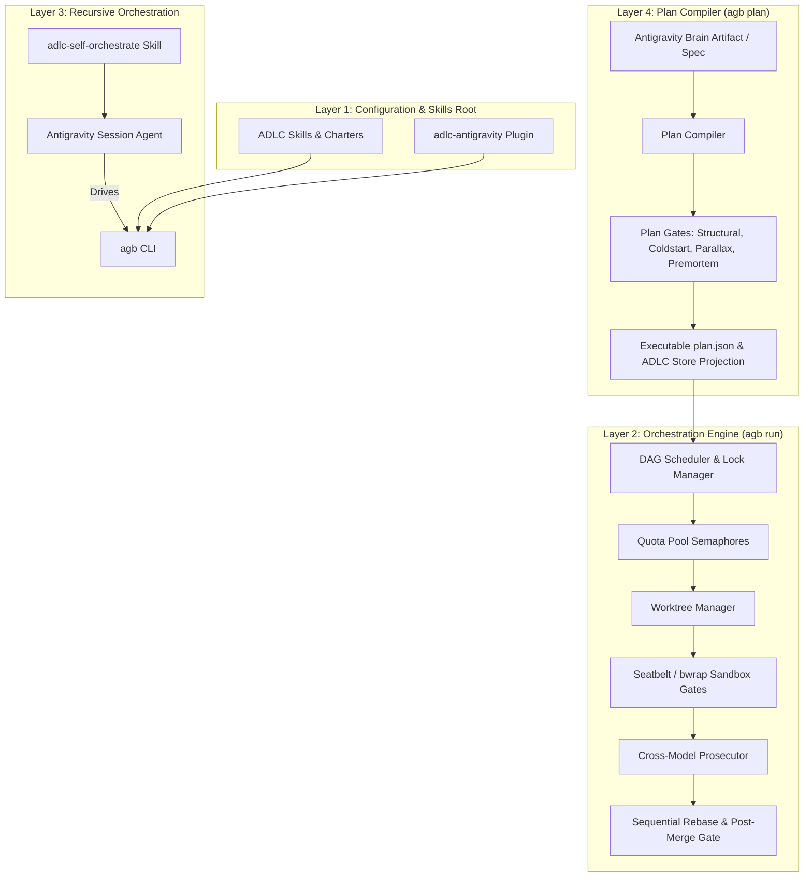
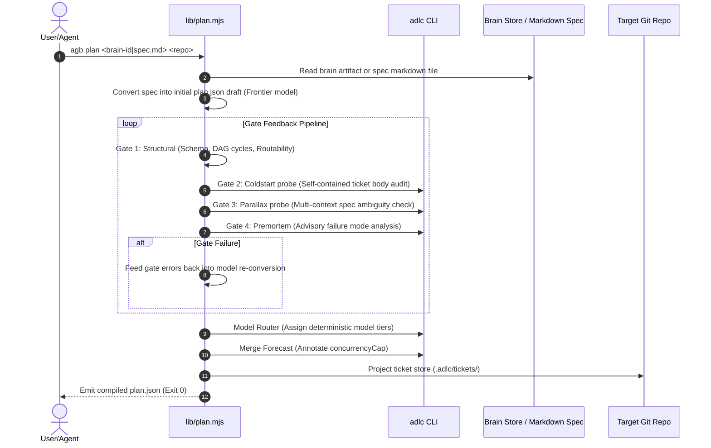
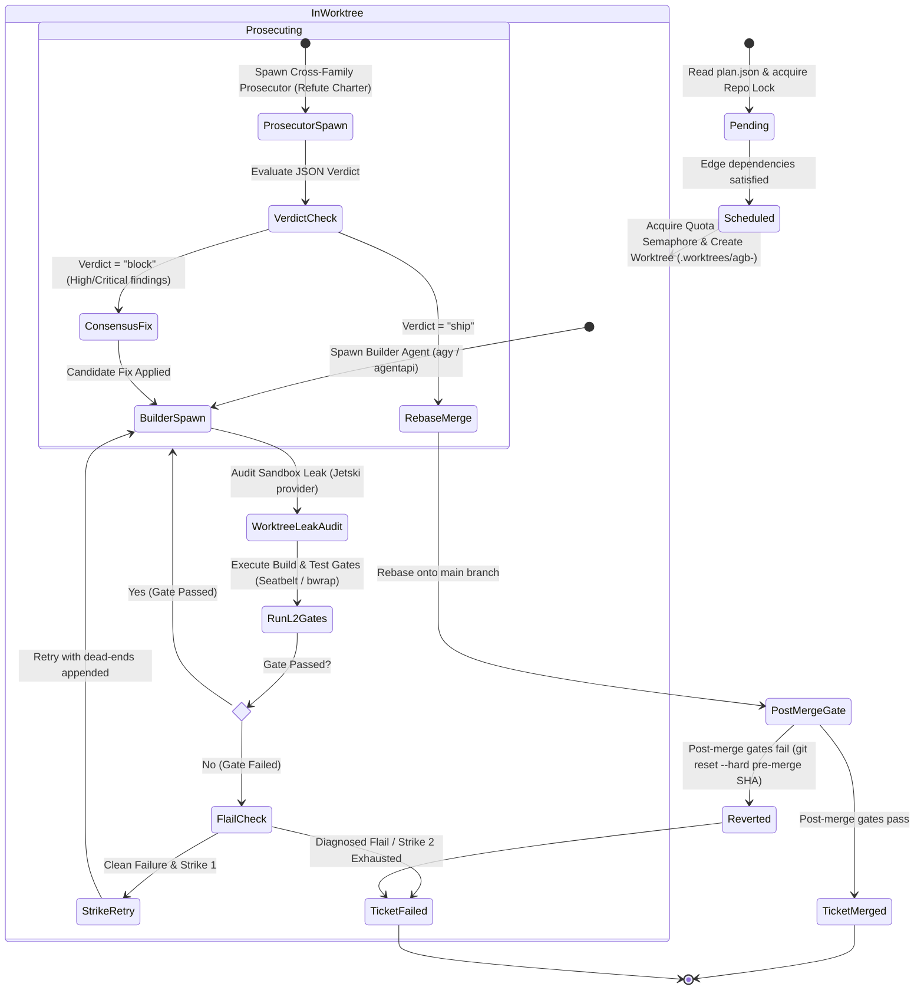

# Antigravity Booster Architecture

This document provides a comprehensive architectural specification of **Antigravity Booster** (`agb`), detailing its design, core components, gate pipeline, cross-model prosecution flow, and integration with **Google Antigravity** (`agy` CLI) and **JetSki** (`agentapi` subagent environment).

---

## 1. System Purpose & Value Proposition

Google Antigravity and JetSki provide powerful AI agent execution capabilities and model access across multiple model families (Gemini Flash, Gemini Pro, Claude Sonnet/Opus, GPT-OSS). However, executing large, multi-component build-outs manually faces several challenges:
- **Sequential Bottlenecks**: Single-agent chat sessions execute work sequentially, leading to high wall-clock latency for multi-file features.
- **Quota Misallocation**: Models from separate providers/families sit idle while a single model's quota exhausts.
- **Unsupervised Drift & Flailing**: Unsupervised agents burn quota making repeated failing edits or straying outside their assigned task scope.
- **Merge Conflicts & Data Loss**: Concurrent edits across subtasks cause dirty working tree corruption and broken main branches.

**Antigravity Booster (`agb`)** solves these problems by providing a deterministic, quota-aware parallel execution engine that imposes the **Agentic Development Lifecycle ([ADLC](AGENTS.md))** on Antigravity (`agy >= 1.2.8`) and JetSki. While Antigravity 2.0 provides the built-in [`/boost`](https://antigravity.google/docs/boost/) command for interactive in-chat multi-agent reasoning, `agb` is designed for autonomous, repository-scale multi-ticket build-outs across physical git worktrees.

### What `agb` Adds to Antigravity & JetSki

```
┌─────────────────────────────────────────────────────────────────────────────┐
│                         Antigravity Booster (agb)                           │
│  Deterministic Execution Engine | Quota Pool Routing | ADLC Gate Pipeline   │
└──────────────────────┬──────────────────────┴──────────────────────────────┘
                       │
        ┌──────────────┴───────────────┐
        ▼                              ▼
┌───────────────────────────────┐      ┌───────────────────────────────┐
│     Antigravity (agy CLI)     │      │     JetSki (agentapi Env)     │
│  - CLI / Desktop App planning │      │  - Subagent context isolation │
│  - Stream-json subprocesses   │      │  - Worktree leak defense      │
│  - Multi-model pool access    │      │  - Dashboard sidecar auth     │
└───────────────────────────────┘      └───────────────────────────────┘
```

1. **Deterministic Parallel Orchestration**:
   - Converts natural language specs and Antigravity brain artifacts (`implementation_plan.md`) into executable ticket DAGs (`plan.json`).
   - Dispatches workers in isolated git worktrees ([`lib/worktrees.mjs`](lib/worktrees.mjs)), running non-interfering tasks concurrently while respecting dependency edges.
2. **Quota Pool Management & Concurrency Multiplier**:
   - Manages independent concurrency semaphores per model pool ([`lib/pools.mjs`](lib/pools.mjs)): Gemini Flash, Gemini Pro, and Claude.
   - Routes Gemini 3.8/3.7 models across metered pools, throttling and metering requests per pool independently to prevent rate limits and maximize parallel throughput.
3. **ADLC Enforcement & Gate Pipeline**:
   - Enforces deterministic build/test gates in Seatbelt (macOS), `bwrap` (Linux), or AppContainer (Windows) sandboxes before work can be merged ([`lib/gates.mjs`](lib/gates.mjs)).
   - Integrates ADLC tools (`adlc spec-lint`, `adlc coldstart`, `adlc parallax`, `adlc premortem`, `adlc rails-guard`, `adlc hollow-test`, `adlc flail-detector`, `adlc model-router`, `adlc merge-forecast`, `adlc ticket doctor`).
4. **Cross-Model Prosecution**:
   - Implements adversarial refute-charter code reviews ([`lib/prosecute.mjs`](lib/prosecute.mjs)). Diffs built by Gemini models are prosecuted by Claude models (and vice versa) with structured JSON verdicts (`ship` vs `block`).
   - Integrates `adlc hollow-test` mutation evidence into prosecution decisions.
5. **Flail Detection & Two-Strike Protection**:
   - Detects worker flailing (repeated errors, scope violations, edit churn, oversized logs) via `adlc flail-detector`. Skip wasted retries on diagnosed dead ends.
6. **JetSki Environment Native Integration**:
   - In JetSki (`AGB_PROVIDER=jetski`), executes subagents via `agentapi` ([`lib/agy.mjs`](lib/agy.mjs)) in fresh context windows.
   - Enforces active worktree sandbox leak detection (prevents edits outside designated worktrees, `.git/hooks` modification, `.git/config` tampering, or git ref manipulation).
   - Provides native REST & WebSocket dashboard sidecars ([`sidecars/server.mjs`](sidecars/server.mjs)) authenticated via secure POSIX `0o600` token files.

---

## 2. Four-Layer Architectural Model

`antigravity-booster` is structured across 4 functional layers:



### Layer Details

- **Layer 1: Configuration & Skills Root** ([`skills/`](skills/)): Installs global skills, charters, and plugin links under `~/.gemini/skills` and `~/.gemini/config/plugins/adlc-antigravity`.
- **Layer 2: Orchestration Engine** ([`lib/scheduler.mjs`](lib/scheduler.mjs)): Core engine managing parallel ticket execution, quota pools, sandboxed gates, cross-model prosecution, sequential rebase/merge, and post-merge revert safety.
- **Layer 3: Recursive Orchestration**: Enables Antigravity agents to drive `agb` directly via the `adlc-self-orchestrate` skill, decomposing complex features into ticket DAGs.
- **Layer 4: Plan Compiler** ([`lib/plan.mjs`](lib/plan.mjs)): Compiles planning artifacts into validated `plan.json` files, running structural, coldstart, parallax, and premortem plan-time gates.

---

## 3. Core Component Architecture

```
                                  ┌────────────────────────┐
                                  │       bin/agb.mjs      │
                                  └───────────┬────────────┘
                                              │
         ┌────────────────────────────────────┼──────────────────────────────────┐
         ▼                                    ▼                                  ▼
┌─────────────────┐                  ┌──────────────────┐               ┌──────────────────┐
│   lib/plan.mjs  │                  │lib/scheduler.mjs │               │lib/bootstrap.mjs │
│ (Plan Compiler) │                  │ (Engine / DAG)   │               │ (Plugin / Skills)│
└────────┬────────┘                  └────────┬─────────┘               └────────┬─────────┘
         │                                    │                                  │
         │  ┌─────────────────────────────────┼──────────────────────────────┐   │
         │  │                                 │                              │   │
         ▼  ▼                                 ▼                              ▼   ▼
┌──────────────────┐                 ┌──────────────────┐           ┌──────────────────────┐
│lib/adlc-bridge.mjs│                │  lib/pools.mjs   │           │   lib/doctor.mjs     │
│(ADLC Projection) │                 │  (Quota Pools)   │           │(Environment Doctor)  │
└──────────────────┘                 └────────┬─────────┘           └──────────────────────┘
                                              │
                                              ▼
                                     ┌──────────────────┐
                                     │   lib/agy.mjs    │
                                     │ (agy / JetSki)   │
                                     └────────┬─────────┘
                                              │
                      ┌───────────────────────┴───────────────────────┐
                      ▼                                               ▼
           ┌──────────────────────┐                       ┌──────────────────────┐
           │   Standard agy CLI   │                       │   JetSki agentapi    │
           │ (--print completer)  │                       │ (Subagent Runner)    │
           └──────────────────────┘                       └──────────────────────┘
```

### Module Descriptions & Symbol Map

| Module | Core Responsibility | Key Exported Functions / Classes |
| :--- | :--- | :--- |
| [`bin/agb.mjs`](bin/agb.mjs) | CLI Entry point & subcommand dispatcher | Subcommands: `bootstrap`, `brains`, `plan`, `validate`, `preflight`, `run`, `sweep`, `review`, `doctor`, `status`, `sidecar`, `probe` |
| [`lib/scheduler.mjs`](lib/scheduler.mjs) | Ticket DAG execution, rebase/merge, rollback, 2-strike flail handling | `runPlan()`, `executeTicket()`, `rebaseAndMerge()` |
| [`lib/pools.mjs`](lib/pools.mjs) | Per-model-family semaphore pools and rate limiting | `PoolManager`, `acquirePool()`, `releasePool()` |
| [`lib/agy.mjs`](lib/agy.mjs) | Completer invocation for `agy` CLI & JetSki `agentapi` | `runAgy()`, `poolOf()`, `familyOf()`, `isAgyTimeout()` |
| [`lib/worktrees.mjs`](lib/worktrees.mjs) | Git worktree lifecycle management | `createWorktree()`, `removeWorktree()`, `cleanWorktrees()` |
| [`lib/gates.mjs`](lib/gates.mjs) | Sandboxed build and test command execution | `runGate()`, `gateSandboxAvailable()` |
| [`lib/prosecute.mjs`](lib/prosecute.mjs) | Cross-family model prosecution & review | `prosecute()`, `prosecuteDiff()` |
| [`lib/plan.mjs`](lib/plan.mjs) | Spec / brain plan compilation & plan gates | `compilePlan()`, `validatePlan()`, `preflightPlan()` |
| [`lib/adlc-bridge.mjs`](lib/adlc-bridge.mjs) | ADLC ticket store projection & rails handshake | `projectTicketStore()`, `readPluginContract()` |
| [`lib/lock.mjs`](lib/lock.mjs) | Target repository cross-process locking | `acquireRepoLock()`, `releaseRepoLock()`, `assertStillHeld()` |
| [`lib/doctor.mjs`](lib/doctor.mjs) | Environment, tool binary, and auth diagnostics | `runDoctor()`, `checkAgyAuth()`, `checkSandbox()` |
| [`lib/bootstrap.mjs`](lib/bootstrap.mjs) | Installation of plugins, skills, and sidecar integration | `bootstrap()`, `resolvePluginPath()` |
| [`sidecars/server.mjs`](sidecars/server.mjs) | Native dashboard REST/WebSocket telemetry sidecar | `startSidecarServer()` |

---

## 4. Key Execution Flows

### 4.1 Plan Compilation Flow (`agb plan`)



### 4.2 Ticket Execution Lifecycle (`agb run`)



---

## 5. Sandboxing, Security & Data Loss Defenses

### 5.1 Platform-Native Sandboxing (macOS, Linux, Windows)

Build and test commands specified in `plan.json` are executed via [`lib/gates.mjs`](lib/gates.mjs) inside platform-native sandboxes:
- **macOS Seatbelt**: `sandbox-exec -p <profile>` restricts filesystem writes exclusively to the target worktree and temporary directories.
- **Linux Bubblewrap (`bwrap`)**: Mounts system root read-only, isolates filesystem namespaces, binds the worktree read-write, allocates private `/tmp`, masks sensitive host directories (`~/.gnupg`, package manager credential stores), and verifies symlink containment.
- **Windows AppContainer & Job Objects**: Uses Windows AppContainer security profiles with active differential syscall probing (asserting `EACCES` file denial and `WSAEACCES` loopback TCP denial) combined with multi-factor nonce attestation ledgers. Process tree termination is enforced via Windows Job Objects on abort / SIGKILL.
- **Fail-Closed Policy**: If sandboxing is requested but unavailable on the host platform, gate execution fails closed unless `AGB_SANDBOX_GATES=0` is explicitly set for containerized environments.

### 5.2 JetSki Subagent Context & Worktree Leak Defenses

When running inside **JetSki** (`AGB_PROVIDER=jetski`), subagents are launched via `agentapi new-conversation`. `agb` enforces strict post-execution audits to prevent subagent containment breaches:

```
┌─────────────────────────────────────────────────────────────────────────────┐
│                          JetSki Sandbox Auditor                             │
├─────────────────────────────────────────────────────────────────────────────┤
│ 🛡️ Leaked File Audit      │ Detects files modified outside worktree root   │
│ 🛡️ Git Hooks Audit        │ Detects unauthorized edits to .git/hooks       │
│ 🛡️ Git Config Audit       │ Prevents tampering with .git/config            │
│ 🛡️ Git Refs Audit         │ Prevents unauthorized ref/branch creation      │
│ 🛡️ Exclude/Attrs Audit    │ Blocks modifications to info/exclude & attrs  │
└─────────────────────────────────────────────────────────────────────────────┘
```

If any violation occurs, the ticket is immediately aborted with a sandbox security violation error before any changes reach the target repository.

### 5.3 Data Loss Guards & Rebase Safety

- **Clean Working Tree Requirement**: `agb run` refuses to run on a target repository with uncommitted changes. (Override via `AGB_ALLOW_DIRTY=1` produces explicit warning).
- **Atomic Rollback**: If a ticket passes its local worktree gate but fails the post-merge gate on the main branch, `agb` immediately executes `git reset --hard <pre-merge-sha>`, restoring the main branch to its exact pre-merge state.
- **Cross-Process Repository Locking**: [`lib/lock.mjs`](lib/lock.mjs) creates POSIX directory locks with JSON metadata (`.booster/lock.json`), ensuring only one `agb` process can mutate a repository at a time.

### 5.4 Transactional Integration Journal & Pinned Binary Staging

- **Integration Journal (`.adlc/integration_journal.jsonl`)**: Tracks phase transitions across merge, rebase, and gate execution with atomic markers (`TRANSACTION_BEGIN`, `TRANSACTION_COMMIT`). In the event of an ungraceful termination or crash, stale or partial transactions roll back automatically, and unsupported phase states are safely quarantined.
- **Approved Pinned Executable Cache (`~/.adlc/pinned/`)**: When resolving and pinning `@adlc/cli` or tool shims, binaries are staged in a dedicated, permission-restricted (`0o700`) user directory rather than system temporary directories, avoiding execution blocks on Linux filesystems mounted with `noexec`.

---

## 6. File & Directory Artifact Layout

```
<target-repo>/
├── .adlc/
│   ├── config.json                 # ADLC trust root configuration
│   └── tickets/                    # Canonical ADLC ticket store (directory format)
│       ├── .store.json             # Ticket store metadata
│       └── t-*.json                # Individual ticket JSON shards
├── .booster/
│   ├── lock.json                   # Cross-process repository lock metadata
│   ├── status.json                 # Live run status snapshot for UI/CLI
│   ├── report.json                 # Final execution report & token counts
│   ├── token                       # Dashboard sidecar auth token (mode 0o600)
│   └── logs/
│       └── <runId>/
│           ├── events.jsonl        # Global run lifecycle events stream
│           └── <ticketId>.jsonl    # Per-ticket builder & prosecutor transcripts
└── .worktrees/
    └── agb-<runId>-<ticketId>/     # Isolated git worktrees during active runs
```

---

## 7. Integration Matrix: Antigravity vs. JetSki

| Feature / Capability | Standalone Antigravity (`agy`) | JetSki Environment (`agentapi`) |
| :--- | :--- | :--- |
| **Provider Env** | Default / `AGB_PROVIDER=agy` | `AGB_PROVIDER=jetski` |
| **Worker Subprocess** | `agy --print --model <m>` | `agentapi new-conversation --model <m>` |
| **Context Isolation** | Per-process CLI invocation | Isolated subagent context window |
| **Model Pools** | Gemini Flash, Gemini Pro, Claude, GPT-OSS | Mapped to Gemini Flash/Pro tiers |
| **ADLC Ticket Store** | Directory store (`.adlc/tickets/`) | Directory store (`.adlc/tickets/`) |
| **Worktree Sandboxing** | Seatbelt / `bwrap` gates | Seatbelt / `bwrap` + Subagent Leak Audit |
| **Dashboard Sidecar** | `agb sidecar <repo>` (Port 3333) | `agb sidecar <repo>` (Port via `ANTIGRAVITY_SIDECAR_WEB_PORT`) |
| **Sidecar Security** | Mode `0o600` token at `.booster/token` | Mode `0o600` token at `.booster/token` |
| **Diagnostic Verification** | `agb doctor` checks `agy` binary & auth | `agb doctor` checks `agentapi` & JetSki provider |
