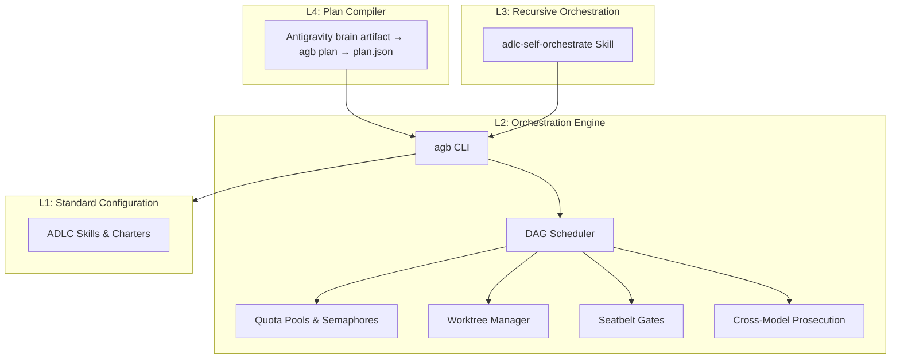

# Antigravity Booster Documentation

Welcome to the documentation for **antigravity-booster** (`agb`). This tool implements the ADLC (Agentic Software Development Lifecycle) on top of Google Antigravity 2.0 (`agy`), enabling massive, parallel, and disciplined agentic code build-outs.

## Table of Contents

| Section | Description |
| :--- | :--- |
| 🏗️ **[Architecture Specification](../ARCHITECTURE.md)** | System design, 4-layer architectural model, execution state machines, and sandbox leak defenses. |
| 📖 **[CLI Operational Manual](../USAGE.md)** | Root operational reference for CLI subcommands, plan schemas, environment variables, and JetSki integration. |
| 🚀 **[CLI Usage & Configuration](usage.md)** | Full guide to commands, schemas (`plan.json` and `sweep.json`), environment variables, and running runs. |
| 🛡️ **[Guidelines & Doctrine](guidelines.md)** | Core principles, the ADLC doctrine (P0-P7), cross-model prosecution flow, sandboxing, and execution gates. |
| 📖 **[Execution Example](execution-example.md)** | Step-by-step example showing how to decompose a spec into a plan.json DAG and run it with agb. |
| 📊 **[Calibration Probes](calibration/probes-2026-06-11.md)** | Empirical measurements of latency, concurrency curves, and Seatbelt sandbox safety profiles. |
| 🔍 **[Research & Platform Discovery](research/)** | Analysis of the Antigravity CLI and GUI limits, capabilities, and platform quirks. |

---

## Architecture Overview

Antigravity Booster is organized in a 4-layered architecture:



- **L1 Config**: Skills, charters, and `AGENTS.md` templates installed into `~/.gemini/` that improve any standalone `agy` session.
- **L2 Engine**: The `agb` CLI and scheduler that orchestrates worktrees, runs sandboxed verification, manages concurrency, and drives cross-family model reviews.
- **L3 Recursive**: Agent skills that teach a top-level agent how to decompose tasks and drive the `agb` fleet.
- **L4 Hybrid**: The plan compiler (`agb plan`). Planning happens in Antigravity exactly as it already does (GUI plan mode or an agy planning session — `agb` does not replace or supplement that phase); the compiler converts the resulting brain artifact into a gated, provenance-stamped ticket DAG.

## Quick Reference

- **To compile a plan made in Antigravity:**
  ```bash
  agb brains                     # list plan artifacts
  agb plan <brain-id> /repo      # convert → gates → plan.json
  ```
- **To run a ticket plan:**
  ```bash
  agb run plan.json
  ```
- **To check a hand-written plan (escape hatch — `agb plan` does this for you):**
  ```bash
  agb validate plan.json
  agb preflight plan.json
  ```
- **To inspect a live run:**
  ```bash
  agb status /path/to/target-repo
  ```
- **To run a cheap-tier fanout sweep:**
  ```bash
  agb sweep sweep.json
  ```
- **To run read-only codebase reviews:**
  ```bash
  agb review /repo
  ```
