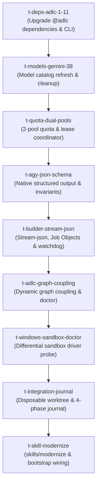

# Roadmap: antigravity-booster adaptation to Antigravity 2.15 / agy 1.2.8 & ADLC 1.11.1

This is a comprehensive adaptation plan for the `antigravity-booster` (`agb`) codebase.
It benchmarks all changes from Antigravity 2.3.0 (July 13, 2026) through Antigravity 2.15.1 / agy 1.2.8 (September 2026), alongside the upgraded `@adlc` 1.11.1 suite.

Claims marked `[probed]` were verified live on this machine; claims marked `[changelog]` are drawn from `https://antigravity.google/changelog` (digest `52da0789b7fe6eb634d5dbf3288b51b600d5401a1374c415a83b8e99d70951e3`) and `https://raw.githubusercontent.com/voodootikigod/adlc/902f5a6b189ffaa0119a6d47d4e56574fbcda712/CHANGELOG.md` (digest `d5558cd419c8d46bdc958064cb97f963d1ea793866414c025906ec15033512ed`).

---

## 1. Probed Live Facts & Upstream Delta

### Antigravity & `agy` Runtime
- **Installed agy binary**: `1.2.8` [probed]. Booster's codebase baseline was calibrated against `1.1.1` and `1.1.11`.
- **Live Models (`agy models`)** [probed]:
  - `gemini-3.8-flash-high`, `gemini-3.8-flash-medium`, `gemini-3.8-flash-low`
  - `gemini-3.7-flash-high`, `gemini-3.7-flash-medium`, `gemini-3.7-flash-low`
  - `gemini-3.6-flash-high`, `gemini-3.6-flash-medium`, `gemini-3.6-flash-low`
  - `gemini-3.1-pro-high`, `gemini-3.1-pro-low`
  - `claude-sonnet-4-6` (Thinking)
  - `claude-opus-4-6-thinking` (Thinking)
  - `gpt-oss-120b-medium` (Medium)
  - *Delta*: `gemini-3.5-flash` has been retired upstream; `gemini-3.8-flash` is now available and default.
- **Quota Pool Architecture (`agy -p "/quota"`)** [probed]:
  - Upstream now meters across exactly **TWO** pools: `"Gemini Models"` and `"Claude and GPT models"`.
  - Each pool enforces dual limits: **Weekly Limit Remaining** and a rolling **Five Hour Limit Remaining**.
  - *Delta*: Booster's `lib/pools.mjs` previously assumed 4 independent pools (`gemini-flash`, `gemini-pro`, `claude`, `gpt-oss`). Concurrency and quota depletion must now be tracked across the two true underlying quota pools.
- **Subprocess Protocols & Flags (`agy --help`)** [probed]:
  - `--output-format {text, json, stream-json}`: Native JSON mode returns `{ conversation_id, status, response, duration_seconds, num_turns, usage: { input_tokens, output_tokens, thinking_tokens, cache_read_tokens, total_tokens }, structured_output }`.
  - `--json-schema <schema>`: Direct schema enforcement for structured output.
  - `--input-format stream-json`: Reads NDJSON messages per line from stdin and emits per-step streaming events.
  - `--print-timeout <duration>`: Accepts `0` (or `0s`) to wait until turn completion with **no artificial timeout ceiling** (CLI 1.2.6 unlimited timeouts) [changelog].
  - `--effort {low, medium, high}`: Granular reasoning effort per invocation.
- **Platform & Security** [changelog]:
  - Antigravity 2.15.1 added file and network sandboxing on Windows.
  - CLI 1.1.10 enforced read-only `.git` in sandbox.

### ADLC Suite (v1.11.1)
- **Current Published Versions** [probed]:
  - `@adlc/cli`: `1.11.1` (the authoritative CLI umbrella executable package providing `adlc`)
  - `@adlc/core`: `1.11.1`
  - `@adlc/tickets`: `1.11.1`
  - `@adlc/antigravity`: `1.7.0`
- **Key Upstream ADLC Features** [changelog]:
  - `adlc merge-forecast --graph-coupling`: Semantic graph coupling signals detecting non-obvious file dependencies (#958).
  - `adlc ticket doctor`: Sets real exit codes on `ok: false` (#793) and identifies orphaned anchors/stale lineage tokens (#516).
  - `adlc hollow-test`: Fails closed on starved selected files and zero-mutant diffs; sizes hollow-test draw by measured test suite cost (#657, #914, #947).
  - `adlc rails-guard`: Discloses `--sanctioned-add` exemptions and anchors ticket-store add-vs-alter to merge-base (#512, #571, #968).
  - `@adlc/autopilot`: Quota-gated single-issue autopilot (#913).

---

## 2. Architectural Decisions (Aligned via Grill-Me)

1. **Dual Quota Pool & Model Catalog Alignment**:
   - Restructure `lib/pools.mjs` and `lib/agy.mjs` to recognize the 2 true upstream quota pools: `"gemini"` and `"claude-gpt"`.
   - Track both rolling 5-hour limits and weekly limits from `agy -p "/quota"`.
   - Update `MODELS` and `TIER_CANDIDATES`:
     - `cheap`: `gemini-3.8-flash-low`, `gemini-3.8-flash-medium`, `gemini-3.7-flash-low`, `gemini-3.6-flash-low`
     - `mid`: `gemini-3.8-flash-high`, `gemini-3.7-flash-high`, `gemini-3.6-flash-high`, `gemini-3.1-pro-low`
     - `frontier`: `gemini-3.1-pro-high`, `claude-sonnet-4-6`, `claude-opus-4-6-thinking`
     - `prosecutors`: gemini -> `claude-sonnet-4-6` or `gpt-oss-120b-medium`; claude -> `gemini-3.1-pro-high`; gpt-oss -> `gemini-3.1-pro-high`.
2. **Dual-Mode Subprocess Execution**:
   - Single-shot verdict calls (`prosecute`, `review`, `coldstart`, `parallax`, `brainToPlan`) transition to mandatory native `--output-format json` + `--json-schema`.
   - Builder runs transition to `--output-format stream-json`, capturing live step telemetry, logging token consumption, and honoring configurable orchestrator wall-clock watchdogs.
3. **Clear Boundary between Booster and ADLC**:
   - Booster remains the specialized Antigravity DAG fleet orchestrator: it owns multi-worktree parallel execution, Antigravity brain plan compilation (`implementation_plan.md` -> DAG), `agy` process supervision, and cross-family prosecution.
   - Booster offloads static and behavioral analysis to ADLC: wires `merge-forecast --graph-coupling`, integrates `adlc ticket doctor` into `agb doctor`, and relies on hardened ADLC 1.11.1 `hollow-test` / `rails-guard`.
4. **Reusable Modernization Skill**:
   - Introduce `skills/modernize/SKILL.md` to automate auditing changelogs, probing live runtimes, analyzing delta matrices, and synthesizing ADLC ticket DAGs.

---

## 3. Subsystem Delta Matrix

| Subsystem | Existing Implementation | Upgraded Architecture (agy 1.2.8 + ADLC 1.11.1) |
| :--- | :--- | :--- |
| `lib/agy.mjs` | Models include `gemini-3.5-flash`; raw text print-mode; regex-based timeout check `isAgyTimeout`. | Require `agy >= 1.2.6`; add `gemini-3.8-flash` & `3.7-flash`; alias `3.5` to `3.8`; dual output modes (`json` with schema & `stream-json`); parse native status envelopes and token telemetry. |
| `lib/pools.mjs` | 4 independent pools (`gemini-flash`, `gemini-pro`, `claude`, `gpt-oss`). | Map concurrency semaphores to 2 upstream quota pools (`gemini`, `claude-gpt`); dynamic quota-scaled caps; version-quarantined file lock (`agb_pools_v2.json`) with token-validated renewable leases and idempotent release; 5-hour/weekly reset resumption timestamps. |
| `lib/prosecute.mjs` | Passes prompt via plain `--print`; extracts verdict via regex `extractJson`. | Enforces versioned verdict JSON schema (`prosecution_verdict.v1`) via `--json-schema`; semantic invariants enforced in code; fail-closed schema validation. |
| `lib/preflight.mjs` | Calls `adlc merge-forecast --tickets <path> --json`; uses `gemini-3.5-flash-medium` for coldstart. | Passes `--graph-coupling` to `merge-forecast`; updates coldstart to `gemini-3.8-flash-low` with JSON schema enforcement (`coldstart_verdict.v1`); uses `resolveAdlcBinary()` for local `node_modules/.bin/adlc` resolution. |
| `lib/plan.mjs` | Uses hardcoded `gemini-3.5-flash-medium` for parallax reading. | Migrates parallax reader to `gemini-3.8-flash-medium` with structured schema enforcement (`parallax_verdict.v1`); binds trusted host gates over LLM output in `brain_plan.v1`. |
| `lib/doctor.mjs` | Marks Windows sandbox as unsupported; does not invoke `adlc ticket doctor`. | Adds active differential Windows sandbox detection verifying file write containment, loopback socket denial, and AppContainer driver signature; verifies HMAC-signed bypass attestation; enforces `agy >= 1.2.6` and `@adlc/cli >= 1.11.1` runtime floors; invokes `adlc ticket doctor` via `resolveAdlcBinary()`. |
| `lib/scheduler.mjs` | Assumes ~5m hardcoded print ceiling (`AGB_BUILD_TIMEOUT = '5m'`). | Uses `--output-format stream-json`; enforces orchestrator wall-clock safety ceiling and event progress watchdogs; OS process-group/Job-Object containment; root repository pre/post exact integrity verification; `baseRefSha` diff-tree anti-no-op gate; serialized integration merge mutex (`.adlc/merge.lock`) with conflict quarantine; per-attempt unique worktrees with cross-process lease locks. |
| `package.json` | Depends on `@adlc/*@^1.6.0`. | Upgrades to `@adlc/core@^1.11.1`, `@adlc/tickets@^1.11.1`, `@adlc/antigravity@^1.7.0`, and adds direct dependency on `@adlc/cli@^1.11.1`. |
| `skills/**` | Only contains `release`. | Adds `skills/modernize/SKILL.md`. |

---

## 4. System Failure Contracts & Operational Specifications

### 4.1 Quota Concurrency, Dynamic Caps & Shared State Lifecycle
- **Upstream Pools & Model Mapping**:
  - `gemini`: all `gemini-3.8-flash-*`, `gemini-3.7-flash-*`, `gemini-3.6-flash-*`, and `gemini-3.1-pro-*` models.
  - `claude-gpt`: all `claude-sonnet-*`, `claude-opus-*`, and `gpt-oss-*` models.
- **Raw Quota Probe CLI Adapter & Mapping Contract**:
  - `agy -p "/quota"` returns raw pool telemetry from the upstream Google Antigravity service.
  - **Upstream Response Fixture & Structure**:
    ```json
    {
      "pools": [
        {
          "name": "Gemini Models",
          "fiveHour": { "remainingPercent": 85.0, "resetTime": "2026-09-22T17:00:00Z" },
          "weekly": { "remainingPercent": 92.5, "resetTime": "2026-09-29T00:00:00Z" }
        },
        {
          "name": "Claude and GPT models",
          "fiveHour": { "remainingPercent": 40.0, "resetTime": "2026-09-22T18:30:00Z" },
          "weekly": { "remainingPercent": 65.0, "resetTime": "2026-09-29T00:00:00Z" }
        }
      ]
    }
    ```
  - **Adapter Extraction, Strict Name Allowlist & Cardinality Algorithm**:
    1. Parse probe stdout as JSON. If stdout is unparseable, empty, or lacks an object envelope, fail closed immediately (`kind="quota_parse_failure"`).
    2. Extract `pools` array.
    3. **Exact Cardinality & Canonical Pool Allowlist**:
       - The upstream schema defines an exact 1:1 mapping against canonical pool display names:
         - Canonical Gemini pool: `"Gemini Models"` -> maps to key `"gemini"`.
         - Canonical Claude/GPT pool: `"Claude and GPT models"` -> maps to key `"claude_gpt"`.
       - **Strict Cardinality Assertion**: The `pools` array must contain **exactly 2 entries** (`pools.length === 2`).
       - Exactly one entry must match `"Gemini Models"` (exact string match).
       - Exactly one entry must match `"Claude and GPT models"` (exact string match).
       - If any unknown pool, duplicate matching pool, missing pool, or unexpected array length is encountered, the adapter fails closed immediately with `kind="ambiguous_quota_pools"`, refusing to dispatch against unverified quota telemetry.
    4. **Raw RFC 3339 UTC Pre-Validation & Field Extraction**:
       - For each pool:
         a) **Raw String Validation (Anti-Normalization Guard)**:
            The raw timestamp strings `pool.fiveHour.resetTime` and `pool.weekly.resetTime` directly from upstream stdout must match the canonical RFC 3339 UTC pattern `RFC3339_UTC_RE = /^\d{4}-\d{2}-\d{2}T\d{2}:\d{2}:\d{2}(?:\.\d{1,3})?Z$/` BEFORE any JavaScript Date parsing or normalization. If either raw string includes a non-UTC timezone offset (e.g. `+02:00`, `-04:00`), lacks an uppercase `'Z'`, uses space delimiters, or is malformed, the adapter fails closed immediately with `kind="invalid_quota_timestamp"`. Date parsing normalization (`new Date().toISOString()`) is strictly prohibited from masking or converting non-canonical timestamps into synthetic UTC strings.
          b) **Strict Primitive Type Check & Numerical Validation (Anti-Coercion Guard)**:
             To prevent JavaScript's loose `Number(null)` or `Number("")` from coercing missing, blank, or null fields into `0` (which would falsely trigger a 0-capacity quota pause):
             - The orchestrator validates `rawVal = pool[window].remainingPercent`.
             - `rawVal` must NOT be `null`, `undefined`, or a boolean.
             - If `rawVal` is a string, it must match `^-?\d+(?:\.\d+)?$` and not be empty or whitespace; if a number, it must be a finite IEEE 754 float.
             - Converted value `val = typeof rawVal === 'number' ? rawVal : Number(rawVal)`.
             - `val` must satisfy `!Number.isNaN(val) && Number.isFinite(val) && val >= 0.0 && val <= 100.0`.
             - Any `null`, blank, missing, boolean, negative, `NaN`, or > 100.0 value fails closed immediately with `kind="invalid_quota_percentage"`.
             - Timestamps are parsed to epoch milliseconds via `Date.parse(rawString)`. Both epoch values must be finite numbers and satisfy future ordering: `resetTimeMs >= Date.now() - 10000ms` (allowing up to 10s server/client clock skew).
             - Canonical strings `fiveHourResetTime = pool.fiveHour.resetTime` and `weeklyResetTime = pool.weekly.resetTime` are retained verbatim.
    5. Construct normalized object `{ gemini: { ... }, claude_gpt: { ... } }` and pass to JSON schema validator (`quota_response.v1`).
- **Fail-Closed Startup & Strict Semantic Quota Schema**:
  - At fleet initialization (Turn 0), `agb` **fails closed**: it requires a verified, semantically valid response from `agy -p "/quota"` processed through the adapter above before any ticket dispatch.
  - The quota payload is validated against strict semantic invariants:
    1. **Finite Range**: `fiveHourRemainingPercent` and `weeklyRemainingPercent` must be finite numbers in `[0.0, 100.0]`.
    2. **Strict Canonical RFC 3339 UTC Reset Timestamps**: `fiveHourResetTime` and `weeklyResetTime` must match `RFC3339_UTC_RE` verbatim without transformation.
    3. **Future Ordering & Clock Skew**: Timestamps must satisfy `resetTimeMs >= Date.now() - 10000ms`.
  - If the probe fails, times out, returns unparseable data, or violates semantic invariants, the fleet halts immediately: `CRITICAL: Quota validation failed: [reason]; cannot start unmetered fleet`.
- **Authoritative Zero-Capacity Predicate & Dynamic Capacity Algorithm**:
  - Base concurrency caps: `gemini`: 12 concurrent workers; `claude-gpt`: 4 concurrent workers.
  - Dynamic scaling derived from `effectivePercent = min(fiveHourRemainingPercent, weeklyRemainingPercent)` polled from `/quota`:
    - `effectivePercent >= 50%`: 100% of base cap (12 for Gemini, 4 for Claude/GPT).
    - `25% <= effectivePercent < 50%`: 50% of base cap (6 for Gemini, 2 for Claude/GPT).
    - `10% <= effectivePercent < 25%`: throttled to 1 concurrent worker per pool.
    - `effectivePercent < 10%`: **0 capacity; dispatch is paused**.
- **Deterministic Quota Pause Resumption Contract**:
  - `agy -p "/quota"` returns exact ISO timestamps: `fiveHourResetTime` and `weeklyResetTime`.
  - When `effectivePercent < 10%`, dispatch is paused with an authoritative, deterministic resumption timestamp `resumesAt` (incorporating a 30-second clock-skew buffer):
    - **Case 1 (5-Hour Depletion)**: If `fiveHourRemainingPercent < 10%` AND `weeklyRemainingPercent >= 10%`:
      `resumesAt = fiveHourResetTime + 30s`.
    - **Case 2 (Weekly Depletion)**: If `weeklyRemainingPercent < 10%` AND `fiveHourRemainingPercent >= 10%`:
      `resumesAt = weeklyResetTime + 30s`.
    - **Case 3 (Dual Depletion)**: If `fiveHourRemainingPercent < 10%` AND `weeklyRemainingPercent < 10%`:
      `resumesAt = max(fiveHourResetTime, weeklyResetTime) + 30s`.
  - Every zero-capacity state emits an explicit log message specifying the exact depletion cause, remaining percentages, and `resumesAt` ISO timestamp. Dispatchers sleep until `resumesAt` before probing `/quota` again.
- **Cross-Process Mutex, Process Start Identity & Heartbeat Leases**:
  - State coordination is persisted in `agb_pools_v2.json`, guarded by an exclusive advisory file lock (`agb_pools_shared.lock` via `openSync` / `flock`, shared across all versions).
  - **Process Identity, PID Reuse Protection & Parent-Mediated Heartbeat Leases**:
    - **Sandbox Non-Interference**: Child builder processes execute inside kernel-enforced sandboxes where `.adlc/`, `.git/`, and repository root are strictly read-only. Therefore, the **host parent orchestrator process (`agb`) owns and maintains all lease lifecycle operations on the host**, entirely outside the child sandbox boundary:
      - Upon worker dispatch, the host orchestrator acquires the lease, generating a cryptographically random `ownerToken = randomUUID()`.
      - Lease record:
        `{ leaseId, ownerToken, orchestratorPid: process.pid, workerPid: child.pid, workerStartTime, ticketId, createdAtMs, heartbeatMs, leaseExpiryMs }`.
      - `workerStartTime` records the worker's OS process start time (read from `/proc/${workerPid}/stat` field 22 on Linux, or kernel process creation timestamp via OS API on Windows/macOS).
      - **Host Heartbeat Timer & Atomic Lease Expiry Renewal**:
        While the spawned worker process remains alive and actively responsive (emitting valid stdout or `stream_event.v1` events without tripping watchdogs), the **host orchestrator's interval timer** executes every `HEARTBEAT_INTERVAL_MS = 15s`:
        1. Writes and updates `.adlc/leases/${leaseId}.heartbeat` containing `{ ownerToken, timestamp: Date.now() }`.
        2. Under `agb_pools_shared.lock`, atomically updates the registered lease in `agb_pools_v2.json`:
           `lease.heartbeatMs = Date.now()`
           `lease.leaseExpiryMs = Date.now() + LEASE_TTL_MS` (where `LEASE_TTL_MS = 45s`).
        This guarantees that healthy, long-running workers running past 45 seconds are never prematurely reclaimed while actively responsive, as each successful heartbeat pushes `leaseExpiryMs` forward, while overall execution is strictly bounded by the non-extendable orchestrator wall-clock ceiling (`AGB_BUILD_MAX_TIMEOUT`, default 30m).
      - **Worker Sandbox Protection**: The sandboxed builder process has zero write access to `.adlc/leases/` or `agb_pools_v2.json`. It cannot forge, extend, or corrupt leases, and its read-only sandbox boundary never blocks lease heartbeats.
  - **Reconciliation & Idempotent Release**:
    - A lease is considered active IF AND ONLY IF:
      1. `Date.now() <= lease.leaseExpiryMs` AND `(Date.now() - lease.heartbeatMs) < 45s`.
      2. The heartbeat file exists and contains the matching `ownerToken`.
      3. The host orchestrator process (`orchestratorPid`) is alive (`process.kill(orchestratorPid, 0)` succeeds).
      4. If `/proc` is available, the worker child process `/proc/${workerPid}/stat` process start time matches `workerStartTime`.
    - If `process.kill(orchestratorPid, 0)` throws `ESRCH`, OR if the heartbeat file is stale (> 45s), OR if `Date.now() > lease.leaseExpiryMs`, OR if `/proc/${workerPid}/stat` indicates PID reuse or process exit, the lease is immediately marked `"RECLAIMED"` and its capacity slot is refunded under lock.
    - Every reservation release or refund requires matching the registered `ownerToken`.
    - If a delayed release arrives for a lease already in state `"RECLAIMED"` or `"TERMINATED"`, it is safely ignored as a no-op, preventing double-refunds and counter underflow.
  - State files are persisted crash-safely via write-temp-then-rename (`writeFileSync(tmp, ...)` + `renameSync(tmp, stateFile)`).
  - Unified admission check: `(pool.inFlight + pool.reserved) < pool.concurrencyCap`.
  - **Crash-Atomic Generation Journal & Durability**:
    - `agb_pools_v2.json` is the sole authoritative transactional record, versioned with a strictly monotonic integer `generation: number` and guarded by `agb_pools_shared.lock`.
    - Every state commit executes a durable journal sequence:
      1. Write payload to temporary file `agb_pools_v2.json.tmp`.
      2. Force data to physical disk via `fs.fsyncSync(fd)`.
      3. Synchronously rename `agb_pools_v2.json.tmp` -> `agb_pools_v2.json`.
      4. `fsyncSync` the parent directory descriptor to guarantee directory entry durability.
      5. Atomically publish the coarse derivative read cache to `agb_pools_shared.json` containing `{ generation: v2.generation, activeSchemaVersion: 2, v2ActiveLeaseCount: activeCount, totalReserved }`.
    - **Startup & Crash Recovery**:
      Under `agb_pools_shared.lock`, `agb_pools_v2.json` is authoritative. If `agb_pools_shared.json` is missing, corrupted, or has `generation < v2.generation` (indicating a crash between steps 3 and 5), the coordinator reconciles active unexpired leases from `agb_pools_v2.json` and updates `agb_pools_shared.json` before any worker admission. If `agb_pools_v2.json` is corrupted, admission fails closed immediately.
  - **Bi-Directional Upgrade & Downgrade Fleet Handoff Contract**:
    - `agb_pools_shared.lock` is acquired before any coordinator startup, state inspection, or modification.
    - **New Coordinator Startup Protection (v0.8+)**:
      1. On startup under lock, the v0.8 coordinator reads `agb_pools_shared.json`.
      2. If `agb_pools_shared.json` exists without `"activeSchemaVersion": 2` (e.g. legacy v0.7 payload or `activeSchemaVersion: 1`), and indicates an active legacy fleet (`inFlight > 0` or active legacy workers), the v0.8 coordinator **halts immediately** with:
         `LegacyFleetActiveError: Active legacy (v0.7) fleet detected in agb_pools_shared.json. Concurrent execution of v0.7 and v0.8 coordinators is strictly prohibited. Wait for legacy workers to complete or run 'agb pool drain' before launching v0.8.`
      3. If no legacy fleet is active, the v0.8 coordinator atomically writes `{ "activeSchemaVersion": 2, "generation": v2.generation, "v2ActiveLeaseCount": activeCount, "totalReserved": 0 }` to `agb_pools_shared.json` via write-temp-fsync-rename before admitting any worker.
    - **Legacy Coordinator Downgrade Protection (v0.7)**:
      - If operators invoke a v0.7 binary while v0.8 leases are active, 0.7 reads `agb_pools_shared.json`, detects `"activeSchemaVersion": 2` with `v2ActiveLeaseCount > 0`, and safely halts with `ActiveV2LeasesPresentError: Cannot run older binary while v2 leases are active. Run 'agb pool drain' or wait for workers to complete.`
  - **Authenticated Coordinated Pool Drain with Identity-Bound Signaling (`agb pool drain`)**:
    - To eliminate over-dispatch and prevent signaling an unrelated process after PID reuse:
      1. Acquires `agb_pools_shared.lock`.
      2. Sets pool state to `status: "DRAINING"`, rejecting new admissions.
      3. For every active worker in `activeTickets`:
         - **Linux (PID Identity Check)**: Re-reads `/proc/${workerPid}/stat` immediately before signaling. If field 22 (`starttime`) does not match `workerStartTime`, or if `pidfd_open(workerPid, 0)` fails with `ESRCH`, PID reuse is detected! The orchestrator logs `PID reuse detected during drain for PID ${workerPid}; skipping signal`, does NOT signal the unrelated process, and marks the lease `"RECLAIMED"`. If start time matches, signals `-workerPid` via process group `SIGTERM` (followed by 10s grace timer and `SIGKILL`).
         - **Windows (Kernel Handle Termination)**: Uses the pinned kernel process handle / Job Object handle opened at process creation (which uniquely identifies the process instance independent of PID reuse) to terminate descendant trees.
      4. Confirms active worker process count is exactly 0.
      5. Removes all heartbeat files (`.adlc/leases/*.heartbeat`).
      6. Resets lease records and writes clean downgrade tombstone (`activeSchemaVersion: 1, v2ActiveLeaseCount: 0`).
      7. Releases lock.
- **Shared Quota Outage State Machine & Bounded Stale Admission**:
  - `agb_pools_v2.json` tracks shared failure state: `{ quotaRefreshFailures: number, lastSuccessfulRefresh: string, circuitBreakerTripped: boolean }`.
  - When a background `/quota` refresh fails or times out:
    1. **Immediate Admission Freeze**: No new ticket reservations or dispatches are admitted while a `/quota` probe is in failure state (`circuitBreakerTripped = true`). Stale capacity is never assumed to be available. In-flight workers already dispatched continue running until completion or timeout, but `reserved` slots cannot be newly allocated.
    2. **Bounded Retry Probes**: The coordinator retries `/quota` probes using exponential backoff (5s, 10s, 20s).
    3. **Circuit Breaker**: If 3 consecutive refresh probes fail, an operator alert is logged (`CRITICAL: Quota probe failing consecutively; fleet dispatch suspended`).
    4. **Automatic Recovery**: Upon the next successful, schema-validated `/quota` response, `quotaRefreshFailures` is reset to 0, `circuitBreakerTripped` is cleared, dynamic capacity is re-computed from fresh data, and normal admission resumes immediately.

### 4.2 Worktree Isolation, Process Containment & Attempt Scoping
- **Strict Worktree Isolation & Sanitized Slugs**:
  - `ticket.id` is strictly validated against `TICKET_ID_RE = /^[A-Za-z0-9][A-Za-z0-9_.-]*$/`. Path traversal characters (e.g. `/`, `\`, leading `.`) are rejected at schema validation time.
  - Every attempt runs in a collision-free directory: `.worktrees/agb-${ticket.id}-attempt-${attempt}-${ownerToken.slice(0, 8)}`.
  - The path is validated via `realpathSync` to guarantee canonical containment strictly inside `join(repo, '.worktrees')`.
- **OS-Enforced Filesystem Boundary, Sanitized HOME & Secret Scrubbing**:
  - Rather than relying solely on mutable environment variables, Booster enforces an **OS-level kernel filesystem sandbox** (Linux Landlock / mount namespaces, Windows AppContainer file isolation, macOS seatbelt) via `agy --sandbox`:
    1. **OS Kernel Deny-by-Default Filesystem Boundary**:
       - **Read-Only Root Repository & Git Metadata**: The host OS kernel mounts the root checkout and the root `.git` directory strictly **READ-ONLY** (or unmounts/hides them entirely from the child namespace). Even if a malicious builder process unsets all `GIT_*` environment variables, overrides `GIT_DIR`, or issues direct Win32/POSIX file syscalls to write to `.git` or root checkout paths, the OS kernel unconditionally intercepts and denies the operation with `EACCES` / `EROFS`.
       - **Strict Worktree-Only Write Boundary**: The ONLY writable filesystem location granted to the child process tree is its dedicated attempt worktree directory (`join(repo, '.worktrees', attemptSlug)`). All parent directories, root repository directories, host configuration paths, and temporary paths outside the worktree are denied write access by the kernel sandbox.
       - **Dedicated Per-Attempt Writable Git Database with Read-Only Alternates**: To reconcile read-only root Git metadata with builder commits without relaxing root protections, each attempt is provisioned with its own independent, writable Git repository at `join(worktreePath, '.git')`. Access to historical commit history is mediated via `objects/info/alternates` pointing to the host's `.git/objects` in strictly read-only mode. Sandboxed builder commits write loose objects and refs *strictly* into their private worktree `.git`, leaving the root repository's `.git` 100% untouched and unexposed.
    2. **Sanitized Disposable `HOME` & Environment Allowlist**:
       Subprocesses are spawned with an explicit environment allowlist:
       `['PATH', 'USER', 'LANG', 'TERM', 'NODE_ENV', 'TMPDIR', 'GIT_DIR', 'GIT_WORK_TREE', 'GIT_CEILING_DIRECTORIES', 'GIT_CONFIG_NOSYSTEM', 'GIT_CONFIG_GLOBAL']`.
       `HOME` and `XDG_CONFIG_HOME` are explicitly set to a sanitized disposable directory inside the attempt worktree (`join(worktreePath, '.agb_home')`), populated with empty default configurations. The host user's real home directory is never passed, physically denying child access to `~/.ssh`, `~/.npmrc`, `~/.gitconfig`, `~/.aws`, or `~/.gemini`.
       `process.env` is **never** inherited wholesale. Host administrative secrets—including `ADLC_ADMIN_KEY`, API tokens, and provider credentials—are strictly stripped and excluded from builder child environments. Attestation signing is strictly confined to the parent orchestrator process.
    3. **Invocation Environment & Git Isolation**:
       Builders are spawned with working directory (`cwd`) set strictly to the attempt worktree. Environment variables `GIT_DIR = join(worktreePath, '.git')`, `GIT_WORK_TREE = worktreePath`, and `GIT_CEILING_DIRECTORIES = join(repo, '.worktrees')` are explicitly exported, with `GIT_CONFIG_NOSYSTEM=1`, `GIT_CONFIG_GLOBAL=/dev/null`, and worktree configuration enabled (`core.worktreeConfig true`).
    4. **Subprocess Sandbox & Attested Bypass Binding**:
       Antigravity builder subprocesses are unconditionally executed with `--sandbox` enabled. The sandbox flag may only be omitted if a valid, unexpired, cryptographic attestation exists in `.adlc/config.json` (`sandboxBypassAttestation`), signed with HMAC-SHA256 using `process.env.ADLC_ADMIN_KEY`, explicitly authorizing the current host OS platform (as specified in Section 4.6). Any ad-hoc, untrusted, or unsigned bypass is default-denied and fails closed.
- **Pre/Post Comprehensive Root Git Integrity Gate & Host-Mediated Ref Ingestion**:
  - **Isolated Commit Execution & Host-Mediated Ref Ingestion**:
    1. Inside the sandboxed child process, the builder executes standard Git operations, committing candidate changes to branch `refs/heads/candidate` within its private worktree Git directory (`join(worktreePath, '.git')`). The child process is physically denied access to the root `.git` and NEVER interacts directly with root ref storage.
    2. Under `agb_pools_shared.lock`, the coordinator registers each attempt's private namespace slug:
       `attemptNamespace = "attempts/${ticket.id}/${attempt}/${ownerToken.slice(0, 8)}"`.
       The coordinator maintains `activeAttemptNamespaces`: the set of all namespace slugs currently allocated to active parallel attempts across the fleet.
    3. **Host-Side Authenticated Fetch**: When the builder process terminates cleanly and kernel process tree reaping is verified, the trusted parent orchestrator (running on the host outside the sandbox with host Git privileges) imports the candidate commit into the root repository:
       `git fetch --no-tags "file://${worktreePath}/.git" refs/heads/candidate:refs/namespaces/${attemptNamespace}/refs/heads/candidate`
       This atomically pulls the candidate commit object and loose objects into the root repository, assigning it strictly to `refs/namespaces/${attemptNamespace}/refs/heads/candidate`.
  - **Pre-Dispatch Comprehensive Snapshot of All Mutable Root Git State**:
    Immediately before dispatching any builder attempt, the orchestrator records a complete manifest of root repository state:
    - Root HEAD commit SHA: `preHeadSha = git rev-parse HEAD` (run in root repository).
    - Root porcelain status: `preStatus = git status --porcelain=v1 -z` (run in root repository).
    - Root refs: `preRefs = git show-ref` (recording all branch/tag SHAs across repository).
    - Root Git config hash: `preConfigHash = SHA256(fs.readFileSync('.git/config'))`.
    - Root Git hooks hash: `preHooksHash = SHA256(all files in '.git/hooks/')`.
    - Root Git index hash: `preIndexHash = fs.existsSync('.git/index') ? SHA256(fs.readFileSync('.git/index')) : null`.
    - Root packed-refs hash: `prePackedRefsHash = fs.existsSync('.git/packed-refs') ? SHA256(fs.readFileSync('.git/packed-refs')) : null`.
    - Root reflogs digest: `preLogsHash = SHA256(all files and contents under '.git/logs/' excluding attempt namespaces)`.
    - Root objects inventory: `preObjectsManifest = Set(all loose and pack files under '.git/objects/')`.
    - Root administrative metadata: `preInfoHash = SHA256(all files in '.git/info/')`.
  - **Post-Run Concurrency-Safe Equality Verification (Post-Reap)**:
    Immediately following verified process tree termination:
    - **Porcelain Byte-Equality**: `postStatus = git status --porcelain=v1 -z`; orchestrator asserts `postStatus.equals(preStatus)`.
    - **HEAD Commit Equality**: `postHeadSha = git rev-parse HEAD`; orchestrator asserts `postHeadSha === preHeadSha`.
    - **Config & Hooks Hash Equality**: Orchestrator asserts `postConfigHash === preConfigHash` and `postHooksHash === preHooksHash`.
    - **Index & Metadata Byte-Equality**: Orchestrator asserts `postIndexHash === preIndexHash`, `postPackedRefsHash === prePackedRefsHash`, and `postInfoHash === preInfoHash` (verifying index, packed refs, and metadata were never touched).
    - **Reflogs Scope Equality**: Orchestrator asserts all reflog records outside `refs/namespaces/attempts/*` match `preLogsHash` byte-for-byte.
    - **Concurrency-Safe Object Database Assertion**:
      Every newly created object file in `.git/objects/` MUST belong strictly to the commit object graph imported by the host-side authenticated fetch (`refs/namespaces/${attemptNamespace}/*`) or active concurrent attempt namespaces registered in `activeAttemptNamespaces`. Zero stray, unreachable, or unauthenticated loose/pack objects are permitted in root object storage.
    - **Concurrency-Safe Ref Scope Equality**:
      In `postRefs = git show-ref`:
      1. Every protected ref outside `refs/namespaces/attempts/*` (all `refs/heads/*`, `refs/tags/*`, and `refs/remotes/*`) must match `preRefs` byte-for-byte.
      2. Inside `refs/namespaces/attempts/*`, this attempt's host-mediated fetch must have modified ONLY its own assigned namespace `refs/namespaces/${attemptNamespace}/*`.
      3. For any other namespace `refs/namespaces/attempts/${otherSlug}/*` present in `postRefs`:
         - It must be registered in the coordinator's `activeAttemptNamespaces`.
         - The completing worker does NOT assert that foreign active namespaces match its pre-dispatch snapshot (since concurrent peer workers legitimately commit to their own assigned namespaces).
         - The completing worker asserts that zero unregistered, orphaned, or unallocated attempt namespaces exist.
    - If ANY assertion fails (e.g. porcelain differs, HEAD changed, protected ref modified, index/packed-refs/metadata altered, unauthorized object introduced, foreign namespace modified by this attempt, or unregistered namespace detected), the orchestrator halts immediately with a critical security violation: `kind="root_integrity_violation"`.
    - Any root mutation consumes all strikes immediately (`strikes = 2`), quarantines the ticket as failed, and aborts fleet execution without touching or merging the corrupted attempt.
  - The root repository working directory and administrative metadata are **never mutated, reset, or cleaned** during builder failure handling.
  - **End-to-End Test Verification (`test/git-sandbox-candidate-isolation.test.mjs`)**:
    An automated integration test verifies that:
    1. A sandboxed builder process running in an isolated worktree with read-only root repository mounts receives `EACCES` / `EROFS` when attempting to write to the root `.git` or root working tree.
    2. The sandboxed builder successfully commits changes to `refs/heads/candidate` within its private worktree `.git`.
    3. The host orchestrator successfully executes host-mediated fetch into `refs/namespaces/${attemptNamespace}/refs/heads/candidate`.
    4. Protected root branches, index, reflogs, packed refs, and foreign attempt namespaces remain completely unchanged.
- **Kernel-Enforced Process Containment Floor & Subtree Reaping**:
  - To eliminate escape vulnerabilities inherent in simple POSIX process groups (which can be bypassed by `setsid()` or double-forking into new sessions), Booster enforces a **strict, non-negotiable kernel-level containment floor**:
    - **Linux (cgroups v2 or PID Namespaces)**: Child processes MUST be isolated in a dedicated cgroups v2 subtree (`/sys/fs/cgroup/agb-${ticket.id}-${token}`) with `cgroup.kill = 1`, OR spawned within an isolated Linux PID namespace (`unshare(CLONE_NEWPID)`). Termination of the cgroup or PID namespace leader unconditionally reaps all descendant processes regardless of daemonization, `setsid`, or double-forks. If neither cgroups v2 nor PID namespace containment is available on the host, Booster refuses to launch untrusted builder processes and fails closed immediately with `kind="containment_unavailable"`. No command-line flag, environment variable, or unvetted bypass is permitted.
    - **Windows (Job Objects)**: Child processes are assigned to a dedicated Windows Job Object with `JOB_OBJECT_LIMIT_KILL_ON_JOB_CLOSE` and `JOB_OBJECT_LIMIT_BREAKAWAY_OK = 0` (preventing any child or descendant from breaking away). Termination uses the pinned kernel Job Object handle, guaranteeing that all descendant processes are forcefully reaped by the OS kernel.
    - **macOS / BSD**: Descendant trees are tracked via `kqueue` (`EVFILT_PROC` / `NOTE_FORK` / `NOTE_EXEC`) and mach task ports, asserting zero surviving descendants before verification proceeds. If subtree containment cannot be kernel-verified, execution fails closed.
  - Root integrity verification is executed **strictly after** confirming complete process tree termination.
- **Watchdogs & Process Cancellation Escalation**:
  - Unlimited mode (`--print-timeout 0`) is bounded by an **orchestrator wall-clock ceiling** (`AGB_BUILD_MAX_TIMEOUT`, default `30m`).
  - An **event progress watchdog** (`AGB_EVENT_PROGRESS_TIMEOUT`, default `5m`) monitors stream progression.
  - Progress is reset upon receipt of any valid NDJSON event conforming strictly to `stream_event.v1` (`step_update`, `heartbeat`, `result`). Valid periodic heartbeats reset the short-interval event watchdog to accommodate long-running computation or tool execution, while the non-resettable orchestrator wall-clock ceiling (`AGB_BUILD_MAX_TIMEOUT`, default `30m`) provides the hard backstop against infinite loop evasion. Malformed lines, non-delimited data, or unparseable byte bursts do not reset the timer.
  - If more than 5 MB of consecutive garbage/unparseable bytes are received without a valid event (`MAX_CONSECUTIVE_GARBAGE_BYTES`), the stream is immediately aborted with `kind="stream_corruption"`.
  - Escalation: `SIGTERM` / Job terminate -> 10s grace timer -> `SIGKILL`. Worker capacity is refunded under lock.

### 4.3 Exhaustive Stream-JSON Failure Classification & Comprehensive Scope Gates
- **Memory & Stream Bounds**:
  - Maximum NDJSON line size: `MAX_STREAM_LINE_BYTES = 1024 * 1024` (1 MB). If an un-delimited line exceeds 1 MB, the stream is aborted with `kind="stream_overflow"`.
  - Maximum total stream size: `MAX_STREAM_TOTAL_BYTES = 50 * 1024 * 1024` (50 MB) per turn.
- **Deterministic Strike & Retry State Machine**:
  - `ticket.strikes`: per-ticket strike counter (initial: 0, max allowed: 2 before terminal failure).
  - `ticket.attempts`: per-ticket attempt counter (initial: 1, increments on every dispatch).
  - `fleet.cliFailures`: fleet-wide unattributed CLI failure counter (initial: 0, max allowed: 3 across run).
  - **Unified Retry Classification**:
    - **Recoverable Errors** (`kind="timeout"`, `kind="server"`, `kind="server_shutdown_error"`, `kind="missing_terminal_result"`): `strikes += 1`. If `strikes < 2`, retry attempt 2 is dispatched. If `strikes >= 2`, ticket fails terminally (`status="failed"`).
    - **Non-Recoverable Violations** (`kind="stream_overflow"`, `kind="stream_corruption"`, `kind="root_integrity_violation"`, `kind="scope_violation"`): Terminal strikes are consumed immediately (`strikes = 2`). Retry is strictly prohibited; ticket transitions immediately to terminal `status="failed"`.
    - **Unattributed CLI Errors** (`kind="cli"`): Handled by fleet budget (`cliFailures += 1`). If `cliFailures < 3`, attempt is retried without consuming ticket strikes.
- **Exhaustive Stream Event & Exit Truth Table**:

| Condition | Terminal Result Event | Exit Code | Classification | Retry Allowed? | Strike Consumed? | Action Taken |
| :--- | :--- | :--- | :--- | :--- | :--- | :--- |
| Orchestrator kill flag set | Any / None | Any | `kind="timeout"` | If post-increment `strikes < 2` | Yes (`strikes += 1`) | Clean attempt worktree, refund capacity, retry if `strikes < 2` |
| Line > 1MB or Total > 50MB | Any / None | Any | `kind="stream_overflow"` | No | Yes (`strikes = 2`) | Kill process group, clean attempt worktree, ticket fails |
| > 5MB unparseable garbage | Any / None | Any | `kind="stream_corruption"` | No | Yes (`strikes = 2`) | Kill process group, clean attempt worktree, ticket fails |
| Normal run | None | !== 0 | `kind="cli"` | Yes (if `cliFailures < 3`) | No (`cliFailures += 1`) | Re-create fresh attempt worktree; if `cliFailures >= 3` abort run |
| Normal run | None | === 0 | `kind="missing_terminal_result"` | If post-increment `strikes < 2` | Yes (`strikes += 1`) | Clean attempt worktree, retry if `strikes < 2` |
| Normal run | `status: "ERROR"` | Any | `kind="server"` | If post-increment `strikes < 2` | Yes (`strikes += 1`) | Record error, clean attempt worktree, retry if `strikes < 2` |
| Normal run | `status: "SUCCESS"` | !== 0 | `kind="server_shutdown_error"` | If post-increment `strikes < 2` | Yes (`strikes += 1`) | Process died abnormally despite result; reject turn |
| Root integrity check fails | Any / None | Any | `kind="root_integrity_violation"` | No | Yes (`strikes = 2`) | Quarantine ticket, emit security alarm, abort fleet |
| Normal run | `status: "SUCCESS"` | === 0 | Candidate Success | N/A | N/A | Proceed to Comprehensive Scope Gates below |
| Normal run | Duplicate `result` | === 0 | First `result` wins | N/A | N/A | Log warning on duplicate event |
| Normal run | Duplicate `result` | === 0 | First `result` wins | N/A | N/A | Log warning on duplicate event |

- **Comprehensive Scope & Anti-No-Op Verification (Authoritative Baseline Diff & Dual Path Handling)**:
  - When the attempt worktree is created, the baseline commit SHA is pinned: `baseRefSha = git rev-parse baseRef`.
  - Upon builder completion (with exit 0 and valid terminal success):
    1. **Stage Any Uncommitted Changes**: The orchestrator checks `git status --porcelain=v1 -z` in the worktree. If uncommitted modifications, additions, or untracked files exist, they are committed to the attempt branch (`git add -A && git commit -m "agb: candidate attempt commit"`).
    2. **Authoritative Candidate Comparison against `baseRefSha`**: The candidate diff is extracted comparing the attempt branch against `baseRefSha`:
       `git diff-tree -r --name-status -M -C -z "${baseRefSha}" HEAD`.
    3. **Anti-No-Op Gate**: If the parsed diff against `baseRefSha` contains 0 file records (or `git rev-parse HEAD === baseRefSha`), the attempt is rejected as `kind="empty_diff"` and consumes 1 strike.
    4. **Exhaustive Scope Inspection with Dual Path Resolution**:
       - The diff records against `baseRefSha` are inspected across all operations: `A` (added), `M` (modified), `D` (deleted), `R` (renamed - both old path and new path), `C` (copied - both source and destination), `T` (type change), and submodules.
       - **Lexical Normalization**: Every candidate path is lexically normalized via `path.posix.normalize(path)`. Paths with leading `/`, `\`, or traversal segments `..` are immediately rejected as `kind="scope_violation"`.
       - **Existing Paths (A, M, C dest, R dest)**: Validated via `realpathSync(join(worktreePath, path))` to guarantee physical containment strictly inside the attempt worktree.
       - **Deleted / Missing Paths (D, R src)**: Because deleted paths do not exist on disk, filesystem `realpathSync` is skipped. The orchestrator verifies that the path existed in the baseline commit via `git cat-file -e "${baseRefSha}:${path}"`.
       - **Scope Matching**: All normalized paths (existing and deleted) must match the ticket's declared repository-relative `scope` pathspecs. Any out-of-scope path change of any type fails the turn with `kind="scope_violation"` and consumes 1 strike.
    5. **Deterministic Gates**: Both `ticket.gate.build` and `ticket.gate.test` must execute inside the attempt worktree and pass (exit 0).

### 4.4 Explicit JSON Schemas & Strict Semantic Invariants
- **Gate Command Trust Boundary & Mandatory Host Binding**:
  - LLMs are strictly forbidden from authoring shell commands for `gate.build` or `gate.test`.
  - In `compilePlan`, the gate object is mandatory; any plan lacking valid `build` and `test` gate commands is rejected. Gate commands are populated **strictly from trusted CLI invocation options (`--gate-build`, `--gate-test`) or pre-configured `package.json` scripts**. To eliminate un-vetted build file inclusion attacks (e.g. modifying `Makefile` or `*.mk` includes), gate commands are strictly confined to npm scripts (`^npm (test|run [a-zA-Z0-9_-]+)$`). If a repository uses Make or other build tools, they must be invoked via an npm script declared in `package.json`, which is then strictly hashed and verified against `baseRefSha:package.json` before execution. Any model-emitted gate strings are discarded and overwritten with the trusted host gate configurations before DAG scheduling.
  - **Comprehensive Package Script & Dynamic Lifecycle Tampering Protection**:
    When `gate.build` or `gate.test` invokes an npm command, the orchestrator enforces an immutable baseline contract against `baseRefSha:package.json`:
    1. **Dynamic Target Script Derivation**:
       - For `npm test`: `scriptName = "test"`.
       - For `npm run <name>`: `scriptName = name`.
       - npm automatically executes lifecycle hooks `pre${scriptName}` and `post${scriptName}` surrounding `scriptName`.
    2. **Immutable Baseline Extraction**:
       From `baseRefSha:package.json`, the orchestrator extracts:
       - `baselineMain = scripts[scriptName]` (mandatory; must exist in baseline `package.json`).
       - `baselinePre = scripts["pre" + scriptName]` (if present).
       - `baselinePost = scripts["post" + scriptName]` (if present).
       - Global package lifecycle hooks: `GLOBAL_HOOKS = ["install", "postinstall", "preinstall", "prepare", "prepack", "postpack", "publish"]`.
    3. **Strict Candidate Assertions**:
          Before running the gate in any candidate worktree or integration worktree, the orchestrator inspects the candidate's `package.json` and asserts:
          a) **Main Script Command String Equality**: The command string `candidate.scripts[scriptName]` matches `baselineMain` byte-for-byte:
             `crypto.createHash('sha256').update(candidate.scripts[scriptName]).digest('hex') === crypto.createHash('sha256').update(baselineMain).digest('hex')`.
             (Note: The SHA-256 hash check applies strictly to the script command string, NOT to the entire `package.json` document).
          b) **Target Lifecycle Hook Injection Denial**:
             - For `pre${scriptName}`: If absent in baseline, candidate `package.json` must NOT define it. If present in baseline, candidate command string must match byte-for-byte (`SHA256(candidateHook) === SHA256(baselineHook)`).
             - For `post${scriptName}`: If absent in baseline, candidate `package.json` must NOT define it. If present in baseline, candidate command string must match byte-for-byte.
          c) **Global Lifecycle Hook Denial**:
             For every hook in `GLOBAL_HOOKS`: If absent in baseline, candidate `package.json` must NOT define it. If present in baseline, candidate command string must match byte-for-byte.
    4. **Scope Isolation vs Script Tampering Boundary**:
          The immutable baseline script assertion applies strictly to `scripts[scriptName]` and its lifecycle hooks. Changes to dependencies (`dependencies`, `devDependencies`, `peerDependencies`), version numbers, or other package metadata in `package.json` are explicitly permitted IF AND ONLY IF `package.json` is declared within the ticket's repo-relative `scope` (as in Ticket 0 `t-deps-adlc-1-11`). If a ticket mutates `package.json` when `package.json` is NOT in its declared `scope`, the candidate is rejected by the Anti-Scope Gate (`kind="scope_violation"`). If a ticket mutates `package.json` with `package.json` in scope, but alters the gate script command string or injects un-vetted lifecycle hooks, it is rejected by the Script Tampering Gate (`kind="gate_script_tampering"`). Both gates operate independently and fail closed.
    5. If ANY script string modification, hook injection, or unauthorized tampering is detected, gate execution is aborted immediately with `kind="gate_script_tampering"`, consuming all strikes and quarantining the attempt.
  - **Trusted Baseline Test Oracle Protocol**:
    While hashing the package script command string in `package.json` guarantees that the test runner invocation (`node --test`) cannot be altered or bypassed, a candidate whose declared ticket scope includes `test/**` could otherwise alter or delete existing test assertions in `test/**` to mask an incomplete or broken implementation. To eliminate this test-gutting attack, the orchestrator enforces the **Trusted Baseline Test Oracle Protocol**:
    1. **Pass 1: Baseline Regression Testing (Unmodified Baseline Oracle)**:
       - When candidate commits are rebased inside the disposable integration worktree `integrationPath`, before accepting any candidate test modifications, the orchestrator checks out the authoritative baseline test suite from `baseRef`:
         `git checkout baseRef -- test/` (restoring `baseRef:test/**`).
       - It runs `ticket.gate.test` (`npm test`) inside `integrationPath`.
       - The candidate's implementation changes (in `lib/**` or declared scope) must pass 100% of the UNTOUCHED baseline tests.
       - If any baseline test fails, the candidate has introduced a regression or broken existing functionality. The turn fails immediately with `kind="baseline_regression_failure"`, strikes are consumed, and the candidate is rejected.
    2. **Pass 2: Load-Bearing Mutation Verification of New / Modified Tests**:
       - The candidate's newly added or modified tests are restored from the candidate commit:
         `git checkout candidateSha -- test/`.
       - All tests must pass: `npm test`.
       - To guarantee that new or modified tests are truly load-bearing and not hollow/tautological assertions (e.g. `assert(true)` or empty tests):
         The orchestrator executes mutation prosecution (`adlc hollow-test --test-cmd "npm test" --base baseRef`) across the diff.
         If newly added or modified test files survive mutation without detecting deliberate mutant perturbations in the changed implementation files, the test gate rejects the ticket with `kind="hollow_test_rejection"`.
    3. **Strict Out-of-Scope Byte-Identity Invariant**:
       - Every file outside `ticket.scope` in the candidate commit is diffed against `baseRefSha` using `git diff-tree -r --name-only baseRefSha candidateSha`.
       - If any file outside `ticket.scope` differs, the candidate is rejected with `kind="scope_violation"`.
  - **Environment Scrubbing in Gate Execution**:
    Gate commands (`gate.build`, `gate.test`) in both candidate worktrees and disposable integration worktrees are executed strictly under the same sanitized environment allowlist as builder subprocesses (Section 4.2): sanitized disposable `HOME` (`.agb_home`), empty `XDG_CONFIG_HOME`, `GIT_CEILING_DIRECTORIES` set to worktree parent, and complete stripping of host administrative secrets (`ADLC_ADMIN_KEY`, npm tokens, git credentials). This prevents candidate tests from accessing host credentials or escaping directory containment.
- **Scope & Rail Pathspec Grammar & Anti-Traversal Normalization**:
  - Ticket `scope` and `rails` must be POSIX-style repository-relative pathspecs matching the segment-isolated regular expression:
    `^(?:[a-zA-Z0-9_][a-zA-Z0-9_.-]*|\.[a-zA-Z0-9_][a-zA-Z0-9_.-]*)(?:/(?:[a-zA-Z0-9_][a-zA-Z0-9_.-]*|\.[a-zA-Z0-9_][a-zA-Z0-9_.-]*))*(?:/\*{1,2}(?:\.[a-zA-Z0-9]+)?)?$`.
  - **Anti-Traversal Segment Isolation**: Each segment must either begin with an alphanumeric/underscore (`[a-zA-Z0-9_]`) or begin with a dot followed by alphanumeric/underscore (`\.[a-zA-Z0-9_]`). This strictly prohibits parent directory traversal segments (`..`), current directory segments (`.`), empty segments (`//`), or leading/trailing slashes, while preserving support for dotfiles/dotdirs (`.github/**`, `.adlc/**`).
  - **Canonical Normalization & Code Assertions**: Before validating against the schema pattern, `compilePlan` normalizes directory shorthand: if a declared path ends with `/` (e.g. `test/`, `lib/`), it is deterministically normalized to `/**` (e.g. `test/**`, `lib/**`). In addition to regex pattern matching, the orchestrator asserts:
    `path.posix.normalize(p) === p && !p.startsWith('/') && !p.split('/').some(s => s === '.' || s === '..' || s === '')`.
  - Absolute paths (`/etc`, `C:\`), parent directory traversals (`../`), and bare root wildcards (`*`, `**`, `.`) are strictly rejected.
  - Path matching is performed against normalized POSIX paths and validated via dual physical containment (`realpathSync`) for existing files or baseline git tree confirmation for deleted files. Symlinks pointing outside the repository boundary fail closed.
- **Versioned JSON Schemas**:
  - **`quota_response.v1`**:
    ```json
    {
      "$schema": "http://json-schema.org/draft-07/schema#",
      "type": "object",
      "additionalProperties": false,
      "required": ["gemini", "claude_gpt"],
      "properties": {
        "gemini": {
          "type": "object",
          "additionalProperties": false,
          "required": ["fiveHourRemainingPercent", "weeklyRemainingPercent", "fiveHourResetTime", "weeklyResetTime"],
          "properties": {
            "fiveHourRemainingPercent": { "type": "number", "minimum": 0.0, "maximum": 100.0 },
            "weeklyRemainingPercent": { "type": "number", "minimum": 0.0, "maximum": 100.0 },
            "fiveHourResetTime": {
              "type": "string",
              "format": "date-time",
              "pattern": "^\\d{4}-\\d{2}-\\d{2}T\\d{2}:\\d{2}:\\d{2}(?:\\.\\d{1,3})?Z$"
            },
            "weeklyResetTime": {
              "type": "string",
              "format": "date-time",
              "pattern": "^\\d{4}-\\d{2}-\\d{2}T\\d{2}:\\d{2}:\\d{2}(?:\\.\\d{1,3})?Z$"
            }
          }
        },
        "claude_gpt": {
          "type": "object",
          "additionalProperties": false,
          "required": ["fiveHourRemainingPercent", "weeklyRemainingPercent", "fiveHourResetTime", "weeklyResetTime"],
          "properties": {
            "fiveHourRemainingPercent": { "type": "number", "minimum": 0.0, "maximum": 100.0 },
            "weeklyRemainingPercent": { "type": "number", "minimum": 0.0, "maximum": 100.0 },
            "fiveHourResetTime": {
              "type": "string",
              "format": "date-time",
              "pattern": "^\\d{4}-\\d{2}-\\d{2}T\\d{2}:\\d{2}:\\d{2}(?:\\.\\d{1,3})?Z$"
            },
            "weeklyResetTime": {
              "type": "string",
              "format": "date-time",
              "pattern": "^\\d{4}-\\d{2}-\\d{2}T\\d{2}:\\d{2}:\\d{2}(?:\\.\\d{1,3})?Z$"
            }
          }
        }
      }
    }
    ```
  - **`stream_event.v1`**:
    ```json
    {
      "$schema": "http://json-schema.org/draft-07/schema#",
      "type": "object",
      "oneOf": [
        {
          "additionalProperties": false,
          "required": ["type", "step", "action"],
          "properties": {
            "type": { "type": "string", "enum": ["step_update"] },
            "step": { "type": "integer", "minimum": 0 },
            "action": { "type": "string", "minLength": 1, "maxLength": 1024 }
          }
        },
        {
          "additionalProperties": false,
          "required": ["type", "status", "exit_code"],
          "properties": {
            "type": { "type": "string", "enum": ["result"] },
            "status": { "type": "string", "enum": ["SUCCESS", "ERROR"] },
            "exit_code": { "type": "integer" },
            "telemetry": {
              "type": "object",
              "additionalProperties": false,
              "properties": {
                "input_tokens": { "type": "integer", "minimum": 0 },
                "output_tokens": { "type": "integer", "minimum": 0 }
              }
            }
          }
        },
        {
          "additionalProperties": false,
          "required": ["type", "timestamp"],
          "properties": {
            "type": { "type": "string", "enum": ["heartbeat"] },
            "timestamp": { "type": "integer", "minimum": 0 }
          }
        }
      ]
    }
    ```
  - **`prosecution_verdict.v1`**:
    ```json
    {
      "$schema": "http://json-schema.org/draft-07/schema#",
      "type": "object",
      "additionalProperties": false,
      "required": ["verdict", "findings"],
      "properties": {
        "verdict": { "type": "string", "enum": ["ship", "block"] },
        "findings": {
          "type": "array",
          "items": {
            "type": "object",
            "additionalProperties": false,
            "required": ["severity", "charge", "claim"],
            "properties": {
              "severity": { "type": "string", "enum": ["critical", "high", "medium", "low"] },
              "charge": { "type": "string" },
              "claim": { "type": "string" }
            }
          }
        }
      }
    }
    ```
  - **`coldstart_verdict.v1`**:
    ```json
    {
      "$schema": "http://json-schema.org/draft-07/schema#",
      "type": "object",
      "additionalProperties": false,
      "required": ["gaps"],
      "properties": {
        "gaps": { "type": "array", "items": { "type": "string" } }
      }
    }
    ```
  - **`parallax_verdict.v1`**:
    ```json
    {
      "$schema": "http://json-schema.org/draft-07/schema#",
      "type": "object",
      "additionalProperties": false,
      "required": ["ambiguities"],
      "properties": {
        "ambiguities": { "type": "array", "items": { "type": "string" } }
      }
    }
    ```
  - **`brain_plan.v1`**:
    ```json
    {
      "$schema": "http://json-schema.org/draft-07/schema#",
      "type": "object",
      "additionalProperties": false,
      "required": ["repo", "gate", "tickets"],
      "properties": {
        "repo": { "type": "string" },
        "base": { "type": "string", "pattern": "^[a-zA-Z0-9_.-]+$" },
        "concurrencyCap": { "type": ["integer", "null"], "minimum": 1 },
        "gate": {
          "type": "object",
          "additionalProperties": false,
          "required": ["build", "test"],
          "properties": {
            "build": { "type": "string", "pattern": "^npm (test|run [a-zA-Z0-9_-]+)$" },
            "test": { "type": "string", "pattern": "^npm (test|run [a-zA-Z0-9_-]+)$" }
          }
        },
        "tickets": {
          "type": "array",
          "minItems": 1,
          "items": {
            "type": "object",
            "additionalProperties": false,
            "required": ["id", "title", "body", "scope", "rails", "edges", "tier"],
            "properties": {
              "id": { "type": "string", "pattern": "^[A-Za-z0-9][A-Za-z0-9_.-]*$" },
              "title": { "type": "string", "minLength": 1 },
              "body": { "type": "string", "minLength": 1 },
              "scope": {
                "type": "array",
                "items": { "type": "string", "pattern": "^(?:[a-zA-Z0-9_][a-zA-Z0-9_.-]*|\\.[a-zA-Z0-9_][a-zA-Z0-9_.-]*)(?:/(?:[a-zA-Z0-9_][a-zA-Z0-9_.-]*|\\.[a-zA-Z0-9_][a-zA-Z0-9_.-]*))*(?:/\\*{1,2}(?:\\.[a-zA-Z0-9]+)?)?$" }
              },
              "rails": {
                "type": "array",
                "items": { "type": "string", "pattern": "^(?:[a-zA-Z0-9_][a-zA-Z0-9_.-]*|\\.[a-zA-Z0-9_][a-zA-Z0-9_.-]*)(?:/(?:[a-zA-Z0-9_][a-zA-Z0-9_.-]*|\\.[a-zA-Z0-9_][a-zA-Z0-9_.-]*))*(?:/\\*{1,2}(?:\\.[a-zA-Z0-9]+)?)?$" }
              },
              "edges": {
                "type": "array",
                "items": {
                  "type": "object",
                  "additionalProperties": false,
                  "required": ["to"],
                  "properties": {
                    "to": { "type": "string" },
                    "contract": { "type": "string" }
                  }
                }
              },
              "tier": { "type": "string", "enum": ["cheap", "mid", "frontier"] },
              "pool_hint": { "type": "string", "enum": ["gemini", "claude", "claude-gpt", "auto"] }
            }
          }
        }
      }
    }
    ```
- **Semantic Invariants (Enforced in Code)**:
  - **Verdict Invariant 1 (Strict Severity Gate)**: If `findings` contains any item with `severity === 'critical'` or `severity === 'high'`, the effective verdict is forced to `'block'`, overriding any contradictory `'ship'` in the model output.
  - **Verdict Invariant 2 (Block Justification)**: If `verdict === 'block'`, `findings` must be non-empty. An empty findings array under a `block` verdict is classified as `kind="schema_violation"`.
  - **Verdict Invariant 3 (Clean Ship)**: If `verdict === 'ship'`, there must be 0 critical/high findings.
  - **Verdict Invariant 4 (Envelope Status)**: `status: "ERROR"` in the result envelope **NEVER produces a pass or ship verdict**, regardless of structured output contents.
  - **DAG Invariant 1 (ID Uniqueness & Path Safety)**: Every ticket ID must be strictly unique within the plan. No IDs may contain traversal sequences.
  - **DAG Invariant 2 (Outgoing Dependency Edge Contract & Scheduler Precedence)**: Edge semantics in `antigravity-booster` are strictly defined as **outgoing dependency edges** (`ticket.id -> edge.to`). A ticket's `edges` array names the downstream tickets that depend upon it: `ticket.id` is the prerequisite predecessor that MUST complete and merge successfully before `edge.to` can be scheduled/dispatched. The orchestrator constructs incoming predecessor sets via `preds[e.to].push(t.id)`. In Mermaid notation `A --> B` corresponds directly to ticket A declaring `{ "to": "B" }` in its `edges`.
  - **DAG Invariant 3 (Edge Target Validity & Self-Edge Denial)**: Every `edge.to` must name a valid ticket ID present in the `tickets` array of the same plan. Self-dependencies (`edge.to === ticket.id`) are strictly rejected.
  - **DAG Invariant 4 (Acyclicity)**: The ticket graph must be an acyclic DAG; topological sort (`topoSort`) must verify zero dependency cycles.
  - **DAG Invariant 5 (Mandatory Gates)**: Both `gate.build` and `gate.test` must be non-empty, valid commands.

### 4.5 Serialized Merge, Disposable Integration Worktree & Durable Rollback Journal
- **Root Repository Protection & Pre-Fleet Cleanliness Contract**:
  - The root checkout is protected against destructive operations (`git clean -fd`, `git reset --hard`):
    1. **Turn 0 Cleanliness Guard**: At fleet initialization, `git status --porcelain=v1 -z` must be clean in the root checkout. If dirty, execution halts unless `AGB_ALLOW_DIRTY=1` is explicitly set.
    2. **Zero In-Tree Root Integration**: Neither candidate merging, rebase, nor post-merge gate execution is EVER run in the root repository checkout. The root checkout working directory is never checked out, reset, or cleaned during ticket integration.
- **Exclusive Integration Mutex (`.adlc/merge.lock`)**:
  - All integration merges into `baseRef` (e.g. `main`) are strictly serialized under an exclusive advisory file lock: `.adlc/merge.lock` (`openSync` / `flock`). Only one ticket integration transaction may proceed at any given moment.
- **Dedicated Disposable Integration Worktree**:
  - All candidate rebasing and post-merge gate execution occur inside an isolated, disposable integration worktree:
    `integrationPath = .worktrees/agb-integration-${ownerToken.slice(0, 8)}`.
  - Step 1 (Attempt Rebase in Isolation): Inside `integrationPath`, the candidate commit is fetched and rebased against the current `baseRef`: `git rebase baseRef`.
  - **Conflict Quarantine & DAG State Transition**:
    - If a rebase or merge conflict occurs:
      - The candidate branch is preserved in an immutable quarantine ref: `refs/quarantine/agb-${ticket.id}-attempt-${attempt}`.
      - The disposable integration worktree is cleanly removed.
      - Ticket transitions to terminal `status="failed"` with failure classification `kind="merge_conflict"`.
      - The root checkout and `baseRef` remain 100% untouched.
      - All downstream dependent tickets in the DAG that declare this ticket in `edges` are immediately transitioned to `status="blocked"`.
- **Durable Integration Journal, Transaction Provenance & 4-Phase Crash-Recoverable Protocol**:
  - Under `.adlc/merge.lock`, the orchestrator executes a crash-recoverable integration protocol across **four atomic persisted phases (`"PREPARED" | "GATES_PASSED" | "REF_ADVANCED" | "FINALIZED"`)**, secured by a cryptographic **transaction provenance marker**:
    - **Crash-Atomic Phase Write Protocol**: Every journal write and phase transition (`PREPARED`, `GATES_PASSED`, `REF_ADVANCED`, `FINALIZED`) writes to a unique temporary file (`.adlc/integration_journal_tmp_${ticket.id}_${phase}_${Date.now()}_${process.pid}.json` with `O_WRONLY | O_CREAT | O_EXCL`, mode 0o600) using a short-write loop, followed by `fs.fsyncSync(tempFd)` and `fs.closeSync(tempFd)`. Before committing, the orchestrator reads back the temporary file and validates that `JSON.parse` succeeds without error. It then atomically commits the file via `fs.renameSync(tempPath, journalPath)`. On POSIX platforms, the orchestrator opens the parent `.adlc/` directory descriptor (`O_RDONLY`), calls `fs.fsyncSync(dirFd)`, and closes it, guaranteeing crash-durability against sudden OS crash or power loss.
    1. **Pre-Merge Recording & Transaction Initialization (`PREPARED`)**:
       - Generate high-entropy `transactionToken = randomUUID()`.
       - Record `preMergeSha = git rev-parse baseRef`.
       - Commit journal entry `.adlc/integration_journal.json` using the crash-atomic write protocol:
         `{ "ticketId": ticket.id, "transactionToken": transactionToken, "preMergeSha": preMergeSha, "candidateSha": candidateSha, "phase": "PREPARED", "timestamp": Date.now() }`.
    2. **Post-Merge Gate Execution (Inside Disposable Worktree)**:
       Execute post-merge gates strictly under the **Trusted Baseline Test Oracle Protocol** and sanitized environment allowlist:
       - **Pass 1 (Baseline Regression)**: Extract unmodified baseline test suite (`baseRef:test/**`) into `integrationPath` and run `ticket.gate.test`. All baseline tests must pass.
       - **Pass 2 (Load-Bearing Mutation)**: Restore candidate tests (`candidateSha:test/**`) and run `npm test`. Newly added or modified tests must undergo mutation verification (`adlc hollow-test --test-cmd "npm test" --base baseRef`) proving they are load-bearing.
       - **Out-of-Scope Invariant**: Assert all files outside `ticket.scope` are byte-identical to `baseRefSha`.
    3. **Failure Rollback (Zero Root Impact)**:
       - If post-merge gates fail inside `integrationPath`:
         - Remove `integrationPath`.
         - Candidate ref is preserved in `refs/quarantine/agb-${ticket.id}-failed-post-merge`.
         - Unlink `.adlc/integration_journal.json`.
         - The root repository checkout and `baseRef` remain 100% untouched.
         - Ticket transitions to `status="failed"` (`kind="post_merge_gate_failure"`).
         - Downstream dependent tickets are transitioned to `status="blocked"`.
    4. **Post-Merge Gates Passed (`GATES_PASSED`)**:
       - If post-merge gates pass, update journal phase using the crash-atomic write protocol:
         `{ ..., "phase": "GATES_PASSED" }`.
    5. **Durable Transaction Marker & Atomic Ref Advancement (`REF_ADVANCED`)**:
       - **Transaction Provenance Stamp**: Before touching `baseRef`, write a durable, transaction-owned advancement marker ref:
         `markerRef = "refs/transactions/${ticket.id}/${transactionToken}"`.
         `git update-ref ${markerRef} ${candidateSha}` with `fs.fsyncSync`.
       - **Atomic Compare-and-Swap**: Advance `baseRef` atomically:
         `git update-ref refs/heads/${baseRef} ${candidateSha} ${preMergeSha}`.
       - Update journal phase using the crash-atomic write protocol:
         `{ ..., "phase": "REF_ADVANCED" }`.
    6. **Integration Finalization & Transaction Commit (`FINALIZED`)**:
       - **Write-Ahead Phase Persistence**:
         - Ticket transitions to `status="merged"` in `.adlc/tickets/`.
         - **FIRST**: Persist `FINALIZED` phase to the journal before deleting markers or worktrees using the crash-atomic write protocol:
           `{ ..., "phase": "FINALIZED" }`.
       - **Idempotent Cleanup Sequence**:
         - Downstream dependent tickets whose complete prerequisite sets are in `status="merged"` are unlocked and enqueued for dispatch.
         - Remove disposable `integrationPath`.
         - Delete transaction marker ref: `git update-ref -d ${markerRef}`.
         - Unlink `.adlc/integration_journal.json`.
         - Release `.adlc/merge.lock`.
- **Decoupled Root Working Tree Synchronization (Non-Transactional Advisory Sync)**:
  - The atomic integration transaction commits strictly to the Git object and reference database (`git update-ref refs/heads/${baseRef}`) and **never mutates the root working tree**.
  - Following transaction release, the orchestrator performs an optional, non-destructive advisory working tree synchronization:
    1. **Fresh Cleanliness & Branch CAS Assertion**:
       The orchestrator inspects the root checkout:
       `if (currentBranch(repo) === baseRef && git status --porcelain=v1 -z === "" && git rev-parse HEAD === preMergeSha)`:
       Then, and only then, it fast-forwards the root working tree: `git merge --ff-only refs/heads/${baseRef}`.
    2. **Graceful Non-Interference**:
       If the root working tree contains uncommitted edits, is checked out on a different branch, or if HEAD moved externally, Booster **leaves the root working tree 100% untouched** and logs an informational notice:
       `Notice: baseRef advanced to ${candidateSha}. Root working tree was not updated (uncommitted changes or active branch '${branch}'). Run 'git checkout ${baseRef} && git merge --ff-only' when ready.`
       This guarantees zero root working tree race conditions and complete data-loss protection.
- **Startup Crash Reconciliation & Provenance-Safe Ref Recovery Across All 4 Phases**:
  - Whenever `agb` starts up, under `.adlc/merge.lock`:
    - **Startup Journal Validation & Corruption Quarantine**:
      If `.adlc/integration_journal.json` is present:
      The orchestrator attempts to read and parse the journal file with `JSON.parse`. If the journal file is zero-byte, truncated, or malformed, it is immediately quarantined to `.adlc/integration_journal_corrupt_${Date.now()}.json`. The orchestrator then scans `refs/transactions/` for any outstanding transaction marker:
      - If an outstanding transaction marker exists (`refs/transactions/${ticketId}/${token}` pointing to `candidateSha`), the orchestrator determines whether `baseRef` was already advanced (`git rev-parse refs/heads/${baseRef} === candidateSha`). If advanced, it finalizes the transaction, deletes the marker, and releases the lock. If not advanced, it derives `preMergeSha` from the candidate's parent, safely rolls back the candidate to quarantine, deletes the marker, and cleans up.
      - If no marker exists, any orphaned integration worktrees are reaped, and startup continues cleanly.
    - If `.adlc/integration_journal.json` is valid:
      1. Read and parse journal: `{ ticketId, transactionToken, preMergeSha, candidateSha, phase, timestamp }`.
      2. Query current base ref commit: `currentBaseSha = git rev-parse refs/heads/${baseRef}`.
      3. Query transaction provenance marker:
         `markerRef = "refs/transactions/${ticketId}/${transactionToken}"`.
         `markerSha = git rev-parse --verify ${markerRef}` (returns SHA if marker exists, null if missing).
      4. Execute provenance-safe idempotent reconciliation across all crash points:
         - **If `journal.phase === "PREPARED"`**:
           - In `PREPARED`, this transaction NEVER passed gates, never wrote `markerRef`, and never attempted ref advancement.
           - **Data-Loss Prevention**: If `currentBaseSha !== preMergeSha` (even if `currentBaseSha === candidateSha`), this advancement was performed by an EXTERNAL or parallel authorized process! Booster **strictly refuses to roll back `baseRef`**!
             Halts immediately with critical safety alarm: `kind="external_ref_divergence"`. The journal is archived to `.adlc/journal_conflict_${Date.now()}.json` and operator intervention is required.
           - If `currentBaseSha === preMergeSha`: Clean rollback. Mark ticket `status="failed"`, preserve candidate ref in `refs/quarantine/agb-${ticketId}-failed-crash`, and unlink journal.
         - **If `journal.phase === "GATES_PASSED"`**:
           - **With Provenance Marker (`markerSha === candidateSha`)**:
             - If `currentBaseSha === candidateSha`: The ref advancement was committed by this transaction immediately prior to the crash. Provenance is verified! Transition ticket to `status="merged"`, persist journal `phase="FINALIZED"`, delete `markerRef`, unlink journal, and unlock dependents.
             - If `currentBaseSha === preMergeSha`: The ref update was not yet applied. Advance it atomically: `git update-ref refs/heads/${baseRef} ${candidateSha} ${preMergeSha}`. Transition ticket to `status="merged"`, persist journal `phase="FINALIZED"`, delete `markerRef`, unlink journal, and unlock dependents.
             - If `currentBaseSha` is neither: Divergent external branch mutation detected. Halt immediately with `kind="unexpected_base_ref_mutation"`. Do not roll back.
           - **Without Provenance Marker (`markerSha === null`)**:
             - If `currentBaseSha !== preMergeSha`: Unproven ref movement. Halt with `kind="unproven_ref_advancement_requires_operator"`. Do not roll back.
             - If `currentBaseSha === preMergeSha`: Re-execute step 5: write marker ref, advance `baseRef`, transition to `FINALIZED`, clean up.
         - **If `journal.phase === "REF_ADVANCED"`**:
           - **Ref Advancement Recovery & Marker Resilience**:
             - If `currentBaseSha === candidateSha`:
               - If `markerSha === candidateSha`: Provenance marker is intact.
               - If `markerSha === null`: Marker was already cleaned up during finalization before the journal could be unlinked. Because `currentBaseSha === candidateSha` matches the journal's recorded `candidateSha` and `preMergeSha` is its direct parent, the transaction completed successfully!
               - Transition ticket to `status="merged"` in `.adlc/tickets/`, unlock downstream dependents, update journal to `phase="FINALIZED"` with `fsyncSync`, delete `markerRef` if present (`git update-ref -d`), remove `integrationPath` if present, and unlink journal.
             - If `currentBaseSha === preMergeSha`: Ref advancement was not applied before crash. Apply CAS advancement: `git update-ref refs/heads/${baseRef} ${candidateSha} ${preMergeSha}`, transition ticket to `status="merged"`, persist `FINALIZED`, delete `markerRef`, and unlink journal.
             - If `currentBaseSha` is neither `candidateSha` nor `preMergeSha`: Divergent external mutation detected. Halt with `kind="unexpected_base_ref_mutation"`.
         - **If `journal.phase === "FINALIZED"`**:
           - Ticket is already marked `status="merged"` in `.adlc/tickets/`.
           - Complete remaining idempotent cleanup: remove `integrationPath` if present, delete `markerRef` if present, unlink journal, and release lock.
    - Any orphaned integration worktrees (`.worktrees/agb-integration-*`) are reaped before new tickets are dispatched.

### 4.6 Windows Sandbox Active Verification (Safe Differential & Loopback Denial)
- **Active Differential Verification Suite (Deterministic OS Syscall Protocol)**:
  - Rather than relying on non-authoritative model output or CLI diagnostic strings, `checkSandbox()` in `lib/doctor.mjs` executes an explicit, deterministic probe helper (`lib/sandbox-probe-helper.mjs`) inside child `agy --sandbox`:
    1. **File Containment (Direct OS Syscall & Host Assertion)**:
       - The parent generates a unique canary path outside the repository: `%LOCALAPPDATA%\\Temp\\agb_canary_${randomUUID()}.tmp` (verifying path is not a symlink/reparse point).
       - Inside `agy --sandbox`, the helper attempts a direct Win32 file creation (`fs.openSync(canaryPath, 'wx')` calling Win32 `CreateFileW` with `GENERIC_WRITE`).
       - The parent process directly inspects the host filesystem and OS process result, asserting:
         a) The child process caught an OS-level error matching code `'EACCES'` / Win32 `ERROR_ACCESS_DENIED` (5).
         b) The file physically does NOT exist on the host filesystem (`fs.existsSync(canaryPath) === false`).
    2. **Network Isolation (Local Loopback TCP Denial)**:
       - The parent spawns an ephemeral TCP server listening on `127.0.0.1:0`.
       - Inside `agy --sandbox`, the helper attempts a direct TCP socket connection (`net.connect(port, '127.0.0.1')`).
       - The parent process asserts:
         a) Zero incoming connections were accepted by the TCP server (`server.connections === 0`).
         b) The helper reported socket connection error `'EACCES'` / Winsock `WSAEACCES` (10013).
    3. **Positive Worktree Access (Nonce Verification)**:
       - The parent generates a high-entropy nonce (`randomUUID()`).
       - The helper writes the nonce to a canary file inside the attempt worktree (`.worktrees/sandbox_canary.tmp`).
       - The parent directly reads the file from disk and asserts `fs.readFileSync(worktreeCanary, 'utf8') === nonce`.
    4. **Driver Attestation Signature**: Probes `agy` diagnostic output for the explicit initialization string emitted by the Antigravity 2.15.1 Windows AppContainer sandbox driver (`[sandbox] active AppContainer policy`).
    5. **Cleanup**: Ephemeral TCP server, canary paths, and worktree files are closed and unlinked in a `finally` block.
- **Fail-Closed Doctrine & Cryptographic Attestation with Multi-Factor Host & Cross-Clone Replay Defense**:
  - Model prose, conversational text, and unverified diagnostic logs are treated as strictly non-authoritative. If the driver signature is absent, or host file containment fails, or TCP server connection occurs, `checkSandbox()` returns `level: 'fail'`.
  - In accordance with repository doctrine in `AGENTS.md` ("Security self-attestation requires explicit, specific confirmation"), ad-hoc environment bypasses are forbidden. Bypassing sandbox requirements requires an explicit, cryptographic, replay-defended attestation block in `.adlc/config.json`:
    ```json
    "sandboxBypassAttestation": {
      "installationId": "8f3b21c4... (host-unique installation token from ~/.adlc/installation_id)",
      "repositoryRootCommit": "7a3f8b9e... (git root commit SHA via git rev-list --max-parents=0 HEAD)",
      "repositoryOrigin": "git@github.com:voodootikigod/antigravity-booster.git (git config remote.origin.url)",
      "repositoryPath": "/home/voodootikigod/Projects/voodootikigod/antigravity-booster",
      "nonce": "c6a1e3b2-9d84-4e2b-b8f2-892410a74e51",
      "runId": "run-m18x49ab",
      "acknowledgedPlatform": "win32",
      "authorizedBy": "operator@example.com",
      "timestamp": "2026-09-22T10:00:00Z",
      "expiresAt": "2026-09-22T11:00:00Z",
      "signature": "hmac_sha256_of_installationId_rootCommit_origin_path_nonce_runId_platform_authorizedBy_timestamp_expiresAt"
    }
    ```
  - **Comprehensive Multi-Factor Anti-Replay Verification Protocol**:
    1. **Host Installation & Repository Multi-Factor Binding**:
       - `installationId` must match the host machine's private installation token stored at `~/.adlc/installation_id` (mode `0600`, inaccessible to child sandbox processes).
       - `repositoryRootCommit` must match the root commit SHA of the current repository (`git rev-list --max-parents=0 HEAD`).
       - `repositoryOrigin` must match the canonical remote URL (`git config --get remote.origin.url`).
       - `repositoryPath` must match the real, normalized absolute path of the repository checkout (`realpathSync(repo)`).
       - Copying an attestation to a different clone, fork, directory, or machine fails closed immediately (`cross_repository_attestation_rejected`).
    2. **Host-Protected Single-Use Nonce Ledger**:
       - The `nonce` is validated against BOTH the repository ledger (`.adlc/consumed_attestations.jsonl`) AND the host-protected registry outside the checkout: `~/.adlc/consumed_attestations.jsonl` (mode `0600`, guarded by exclusive flock `~/.adlc/consumed_attestations.lock`).
       - If the nonce was previously consumed in either registry, it is rejected with `replayed_attestation_rejected`.
       - Upon successful verification, the nonce is atomically appended to both ledgers with `fsyncSync` before dispatch proceeds.
    3. **Bounded TTL & Signature Verification**:
       - `expiresAt` must be <= 1 hour from `timestamp`, and `Date.now() < Date.parse(expiresAt)`.
       - The signature is verified using HMAC-SHA256 over `${installationId}:${repositoryRootCommit}:${repositoryOrigin}:${repositoryPath}:${nonce}:${runId}:${acknowledgedPlatform}:${authorizedBy}:${timestamp}:${expiresAt}` using `process.env.ADLC_ADMIN_KEY`.
    4. Any unsigned, expired, replayed, mismatched, or invalid attestation fails closed immediately, halting fleet dispatch.

### 4.7 Strict Compatibility Floor, Binary Resolution & Package Authority
- **Authoritative CLI Executable Package & Cryptographic Provenance Sequence**:
  - The authoritative `adlc` executable is provided by the direct dependency `@adlc/cli@^1.11.1` in `package.json`.
  - To prevent supply-chain spoofing, malicious PATH hijacking, and untrusted environment interception, `resolveAdlcBinary()` in `lib/prosecute.mjs`, `lib/preflight.mjs`, and `lib/doctor.mjs` enforces a **strict, authenticated resolution sequence**:
    1. **Primary Authority (Project-Local Authenticated Dependency & Package Containment)**:
       `candidate = join(repo, 'node_modules/.bin/adlc')` relative to repository root.
       - **Canonical Package Containment & Symlink Denial**:
         The orchestrator validates `pkgDir = join(repo, 'node_modules/@adlc/cli')` via `lstat`, asserting it physically exists and is a genuine physical directory (`!stat.isSymbolicLink() && stat.isDirectory()`). Reparse points or symlinks for the package directory itself are strictly rejected. The orchestrator asserts `fs.realpathSync(pkgDir) === path.resolve(repo, 'node_modules/@adlc/cli')`.
       - **Executable Shim Target Containment & Manifest Entrypoint Binding**:
         The orchestrator inspects `candidate = join(repo, 'node_modules/.bin/adlc')`, asserting `fs.existsSync(candidate)`. It resolves `realpath = fs.realpathSync(candidate)` and asserts that it resides strictly within `path.resolve(repo, 'node_modules/@adlc/cli')`. It asserts that `realpath` matches the manifest-declared entrypoint (`realpath === fs.realpathSync(resolve(pkgDir, packageJson.bin.adlc || packageJson.bin))`).
       - **Package Manifest Authentication**: The orchestrator inspects `packageJson = join(pkgDir, 'package.json')`, asserting it declares `"name": "@adlc/cli"` with semver `>= 1.11.1`.
       - **Pre-Execution Revalidation**: Immediately before executing `adlc` across all call sites, `resolveAdlcBinary()` revalidates `lstat` on both `pkgDir` and `candidate` to prevent TOCTOU symlink substitution.
       - **Mandatory Package Artifact & Unpacked Package Tree Content Authentication**:
           - **Domain 1: Package Archive Artifact Integrity (Pre-Unpack)**:
             - During installation and verification, the downloaded package archive artifact is authenticated against `package-lock.json`'s authoritative SRI integrity record (`packages["node_modules/@adlc/cli"].integrity`). Never compare an unpacked script or file bytes directly with archive tarball SRI.
           - **Domain 2: Complete Unpacked Package Tree Content Authentication (Runtime Resolution)**:
             - The resolver authenticates the entire installed directory tree `join(repo, 'node_modules/@adlc/cli')`:
               1. **Physical Containment & Symlink Denial**: Resolves `realpath = realpathSync(candidate)` and asserts that it and all descendant files and directories reside strictly within `join(repo, 'node_modules/@adlc/cli')`. Symlinks, hardlinks to outside files, and reparse points inside the package tree are strictly rejected.
               2. **File Permissions & Ownership**: Asserts all files inside `node_modules/@adlc/cli` are owned by current user / root and are strictly non-world-writable (`(stat.mode & 0o002) === 0`).
               3. **Two-Factor Operator-Authenticated Content Verification**:
                  - Repository-local `.adlc/config.json` is **never** accepted as an unauthenticated self-certifying trust root. To prevent in-repo tampering where an attacker modifies both `node_modules/@adlc/cli` and `.adlc/config.json` on a branch, the unpacked tree is validated via two independent, operator-authenticated trust mechanisms:
                    a) **Direct Verification against Lockfile-Resolved Archive**: The orchestrator unpacks the exact tarball matching the `package-lock.json` SRI integrity record in an isolated ephemeral directory (`mktemp -d`, `0700`), computes its deterministic composite SHA-512 digest across all canonical relative paths, and asserts that the installed `node_modules/@adlc/cli` directory is bit-for-bit identical to the lockfile-authenticated archive.
                    b) **External Operator Trust Anchor Outside Mutable Checkout**: For pin assertions without re-unpacking, the expected composite tree SHA-512 digest must match an operator-managed trust store located strictly **outside the git repository checkout**: `~/.adlc/trusted_packages.json` (owned by host user, mode `0600`, inaccessible to sandboxed builders or branch PRs). In headless CI environments, this digest is provided via an authenticated environment secret (`ADLC_TRUSTED_PACKAGE_TREE_SHA512`) signed with HMAC-SHA256 using `process.env.ADLC_ADMIN_KEY`. Any repository-local `.adlc/config.json` digest setting that lacks matching host-level operator attestation or HMAC signature is rejected.
                  - If the installed tree fails either verification, or if any file in `node_modules/@adlc/cli` is modified, added, or missing, resolution **fails closed immediately** with `kind="adlc_integrity_unverified"`: `CRITICAL: Installed @adlc/cli package tree failed mandatory content integrity verification against operator trust root. Refusing to execute unverified binary.`
     2. **Default Denial of System PATH in Security-Sensitive Operations**:
        - In security-critical operations (`agb run`, `agb prosecute`, `agb preflight`), fallback to unauthenticated system `PATH` is **strictly disabled by default**. If the project-local `@adlc/cli` dependency is absent or unverified, execution halts immediately with `kind="adlc_binary_unverified"`: `CRITICAL: Project-local @adlc/cli dependency missing or unverified. Run npm install or agb bootstrap.`
        - System `PATH` fallback is evaluated IF AND ONLY IF:
          a) The operator explicitly enables system fallback via `--allow-system-adlc` or `AGB_ALLOW_SYSTEM_ADLC=1`.
          b) The resolved system executable's canonical realpath does NOT reside in world-writable or temporary directories (`/tmp`, `/var/tmp`, `%TEMP%`, `%TMP%`).
          c) The executable's parent package manifest `join(dirname(realpath), '../package.json')` exists, declares `"name": "@adlc/cli"`, and satisfies semver `>= 1.11.1`.
     3. **Restricted Operator Override Contract**:
        An environment override via `process.env.ADLC_CLI_PATH` is **ignored by default**. It is evaluated IF AND ONLY IF:
        - The operator explicitly passes `AGB_ALLOW_CUSTOM_ADLC_CLI=1`.
        - `realpathSync(process.env.ADLC_CLI_PATH)` does NOT reside inside world-writable or temporary directories.
        - The binary's adjacent package manifest `join(dirname(realpath), '../package.json')` contains `"name": "@adlc/cli"` with semver `>= 1.11.1`.
        Any override failing these constraints is rejected, and resolution fails closed.
   - `checkAdlcBinary()` in `lib/doctor.mjs` executes `resolveAdlcBinary() --version` and enforces semver **`adlc >= 1.11.1`**.
 - **Runtime Floors**:
   - `antigravity-booster >= 0.8.0` establishes hard runtime prerequisites:
     - **`agy >= 1.2.6`** (supporting `--output-format stream-json`, `--input-format stream-json`, and `--print-timeout 0`).
     - **`adlc >= 1.11.1`** (supporting `--graph-coupling`, non-zero `ticket doctor` exits, and hardened mutation gates).
   - `checkAgyBinary()` and `checkAdlcBinary()` in `lib/doctor.mjs` verify these minimum semver floors. Any environment below `agy 1.2.6` or `adlc 1.11.1` is reported as `level: 'fail'`, halting execution with explicit instructions to upgrade.
 - **External Documentation & Changelog Supply-Chain Provenance Boundary**:
   - To prevent upstream untrusted or compromised external content from altering ticket execution parameters:
      1. **Versioned Release Artifacts & Authenticated Operator Trust Anchors**:
         Workflows accept explicit target version parameters (`TARGET_ADLC_VERSION`, `PINNED_ADLC_REF`, `TARGET_AGY_VERSION`) with operator-configurable defaults, fetching version-tagged, immutable release artifacts (`AGY_RELEASE_URL`, `ADLC_CHANGELOG_URL`) rather than tracking mutable branch tips or rolling unversioned pages. Baseline releases (`1.11.1` and `1.2.8`) are anchored to immutable built-in cryptographic digests. For newer releases, an operator trust store located strictly outside the checkout (`~/.adlc/trusted_packages.json`) provides release-specific trust anchors (`releases[targetVer]`), requiring owner-only permissions (`0600` on POSIX), UID ownership (with Windows platform guards), and an HMAC-SHA256 signature verified against `process.env.ADLC_ADMIN_KEY` over recursively canonicalized JSON (`canonicalJson(payload)`). The resolver enforces **strict target release binding** (`payload.releases[targetVersion]`), failing closed immediately without generic or cross-version fallbacks. Antigravity release notes are strictly validated against `EXPECTED_AGY_CHANGELOG_SHA256` for `TARGET_AGY_VERSION` (failing closed on mismatch), and `TARGET_AGY_VERSION` and `AGY_RELEASE_URL` are explicitly bound into every provenance ledger record. If a global rolling changelog URL is supplied, the audit parses and extracts the exact release section using an EOF-safe parser that handles release notes extending to end-of-file without regex anchor bugs. When auditing a new upstream release without an existing anchor, discovery mode computes the actual digests, outputs a canonical signing template, and halts execution (`exit 1`) for controlled trust rotation, rather than proceeding with unverified upstream content.
      2. **Comprehensive 5-Stage Automated Audit, Crash-Durable Commits, & Bounded Ledger Writes (`.adlc/modernize_provenance.jsonl`)**:
         The modernization audit is implemented as a standalone, zero-dependency Node.js script (`skills/modernize/scripts/audit.mjs`) executing a complete 5-stage automated pipeline portably across Linux, macOS, and Windows:
         - **Stage 1 (Live Runtime Probes)**: Captures installed `agy` (target `1.2.8`) and `adlc` (target `1.11.1`) CLI versions, discovers active model catalog variants (Gemini 3.8/3.7/3.6, Claude, GPT), and asserts support for key CLI flags (`--output-format stream-json`, `--json-schema`, `--sandbox`, `--print-timeout`).
         - **Stage 2 (Static Codebase Audit)**: Scans 8 core repository modules (`lib/prosecute.mjs`, `lib/preflight.mjs`, `lib/doctor.mjs`, `lib/agy.mjs`, `lib/pools.mjs`, `lib/plan.mjs`, `lib/bootstrap.mjs`, `package.json`), verifying syntax, symlink rejection, and baseline `@adlc` dependency versions.
         - **Stage 3 (Subsystem Delta Matrix)**: Synthesizes modernization requirements across the 5 architectural pillars (model catalog, structured output, process containment/timeouts, ADLC integration, platform sandboxing).
         - **Stage 4 (Roadmap DAG Validation)**: Parses the canonical ticket plan from `docs/research/roadmap-agy-1.2.8-adlc-1.11.1.md` and executes booster's native `validatePlan()` from `lib/plan.mjs`, verifying 9 tickets, complete acyclicity, and strict protection of mandatory candidate rails (`lib/lock.mjs`, `lib/gates.mjs`).
         - **Stage 5 (Cryptographic Provenance & Release Digest Verification)**:
           a) **Pre-Upgrade Discovery (`phase: "pre_upgrade_discovery"`)**: In a baseline repository where `@adlc/cli` is not yet installed or locked in `package-lock.json`, the audit downloads the target package tarball bytes into an isolated workspace, authenticates its SHA-512 SRI digest against the immutable/operator trust anchor, unpacks the reference archive using a built-in pure JavaScript tar parser to compute the composite package tree SHA-512 digest, records discovered provenance into `.adlc/modernize_provenance.jsonl` with `installedStatus: "missing_upgrade_required"`, and schedules `t-deps-adlc-1-11`. If `package-lock.json` exists on disk, it is strictly validated; any unreadable, malformed, or missing-integrity entry fails closed immediately.
           b) **Post-Upgrade Verification (`phase: "post_upgrade_verified"`)**: Once `@adlc/cli` has been installed and locked in `package-lock.json`, the audit enforces mandatory lockfile SRI matching, validates physical repository containment of `node_modules/@adlc/cli` (rejecting symlinks for the package directory itself), validates the `node_modules/.bin/adlc` executable shim, and asserts that the installed directory tree matches the reference archive bit-for-bit before recording `installedStatus: "installed_and_verified"`.
           - **Continuous Directory Containment & Descriptor Retention**: Validates `.adlc` containment at startup via `lstat` and `realpath`, retains an open directory descriptor (`O_RDONLY | NO_FOLLOW` on POSIX), and continuously re-asserts directory device and inode identity (`assertAdlcContained`) immediately before every lock, prune, write, and rename operation to eliminate parent-directory replacement.
           - **Cross-Platform PID Reuse Defense & Safe Advisory Lock Lease Protocol**: `.adlc/modernize_provenance.lock` is created with `O_CREAT | O_EXCL | O_NOFOLLOW` and an atomic PID start-time lease protocol (`{ pid, startTime, token, platform, createdAt }`). Process start time is inspected across Linux (`/proc/<pid>/stat`), macOS (`ps -p <pid> -o lstart=`), and Windows (PowerShell `Get-Process StartTime`). A lock is **never unlinked based solely on elapsed time** while the recorded owner process is alive. Stale reclamation occurs only when the holder process is positively confirmed dead or recycled. Standing lock ownership (`assertStillHeld()`) is re-verified before any file write or atomic rename.
           - **Executable Shim Authentication**: On POSIX platforms, opaque regular-file shims at `node_modules/.bin/adlc` are strictly rejected; the shim must be an authentic symlink resolving strictly within `node_modules/@adlc/cli` and matching the manifest-declared `bin` entrypoint. On Windows, wrappers are structurally inspected for canonical npm boilerplate. The shim SHA-256 digest (`shimDigest`) is bound into the committed provenance record. Tooling invokes the manifest entrypoint directly with Node.
           - **Bounded Retention & Total Storage Budget Pruning**: Ledger growth is strictly bounded to `MAX_ACTIVE_ENTRIES = 500` (10 MB cap; archives excess to `modernize_provenance_archive_<timestamp>.jsonl`, retaining 100 recent entries). A comprehensive total storage budget is enforced across all active, archive, and quarantine files (`MAX_TOTAL_ARCHIVES = 5`, `MAX_TOTAL_QUARANTINES = 3`, `MAX_TOTAL_STORAGE_BYTES = 25 MB`), pruning the oldest archives and quarantines upon exceeding budget to prevent disk exhaustion.
           - **Corruption Quarantine & Crash-Durable Directory Commit**: Pre-write validation inspects all existing ledger lines; if prior interruption left malformed lines, it is quarantined to `modernize_provenance_corrupt_<timestamp>.jsonl` to restore clean operation without data loss. Writes use an atomic temporary file (`provenance_tmp_...`, `O_NOFOLLOW | O_EXCL`) with an explicit short-write loop (`while (totalWritten < buf.length)`), temp file `fsync`, line-by-line post-write JSON verification, atomic rename, parent directory metadata `fsync` on POSIX, and post-rename reopening verification before reporting success.
     3. **Strict Human Review & Scope Boundary**:
       Untrusted external text MUST NEVER directly generate or mutate ticket `scope`, `rails`, or build `gate` commands. All proposed code changes, dependency bumps, or script changes must undergo explicit human review and approval before tickets can be committed to `.adlc/tickets/` or dispatched. Ticket scopes are strictly bounded to internal repository paths and candidate rails (`lib/lock.mjs`, `lib/gates.mjs`) remain permanently frozen under ADLC P3 doctrine.

---

## 5. Implementation Ticket DAG



### Ticket Details & Acceptance Criteria

1. **`t-deps-adlc-1-11` (P0)**
   - **Scope**: `package.json`, `package-lock.json`, `lib/doctor.mjs`
   - **Rails**: `lib/lock.mjs`, `lib/gates.mjs`, `lib/scheduler.mjs`, `lib/pools.mjs`, `lib/agy.mjs`
   - **Edges**: `[{"to": "t-models-gemini-38"}]`
   - **Tier**: `cheap`, **Pool**: `gemini`
   - **Description**: Bump `@adlc/core` and `@adlc/tickets` to `^1.11.1`, `@adlc/antigravity` to `^1.7.0`, and add `@adlc/cli@^1.11.1` to direct dependencies. Introduce hardened `resolveAdlcBinary()` resolving project-local `node_modules/.bin/adlc` first, validating adjacent `package.json` has `"name": "@adlc/cli"` with semver `>= 1.11.1`, authenticating package archive lockfile SRI integrity against `package-lock.json`, enforcing mandatory two-factor unpacked package tree content authentication against operator trust roots outside the mutable checkout (`~/.adlc/trusted_packages.json` or signed attestation) and direct lockfile-resolved archive comparison, and default-denying system PATH fallback in security-sensitive operations (`run`, `prosecute`, `preflight`).
   - **Acceptance Criteria**:
     - `npm install` runs cleanly without peer dependency conflicts and installs `node_modules/.bin/adlc`.
     - `resolveAdlcBinary()` authenticates local `node_modules/.bin/adlc` via package manifest (`@adlc/cli >= 1.11.1`), separate package archive lockfile SRI verification, and mandatory two-factor unpacked package tree content authentication against external operator trust root and direct lockfile-resolved archive comparison; fails closed if tree is tampered or unauthenticated.
     - Unauthenticated system PATH fallback is default-denied in security-sensitive operations unless `--allow-system-adlc` is explicitly passed and manifest is verified.
     - Updating `dependencies` in `package.json` succeeds under the package script integrity gate because the SHA-256 hash assertion applies strictly to `candidate.scripts[scriptName]` and lifecycle hooks, not the whole file.
     - All 262 existing tests pass with zero regressions.

2. **`t-models-gemini-38` (P0)**
   - **Scope**: `lib/agy.mjs`, `lib/pools.mjs`, `lib/plan.mjs`, `lib/preflight.mjs`, `test/**`
   - **Rails**: `lib/lock.mjs`, `lib/gates.mjs`, `lib/scheduler.mjs`, `lib/doctor.mjs`, `package.json`
   - **Edges**: `[{"to": "t-quota-dual-pools"}]`
   - **Tier**: `cheap`, **Pool**: `gemini`
   - **Description**: Add `gemini-3.8-flash-{high,medium,low}`, `gemini-3.7-flash-{high,medium,low}`, and `gemini-3.6-flash-{high,medium,low}` to `MODELS` and `MODEL_ALIASES`. Map legacy `gemini-3.5-flash-*` to `gemini-3.8-flash-*` with a compatibility warning. Update `PARALLAX_READER_MODEL` and `COLDSTART_MODEL`. Update `TIER_CANDIDATES` and `validatePlan` to support Claude/GPT family models.
   - **Acceptance Criteria**:
     - `resolveModelSlug('gemini-3.5-flash-low')` returns `'gemini-3.8-flash-low'`.
     - `poolOf()` and `familyOf()` correctly resolve all 3.8, 3.7, and 3.6 variants.
     - `TIER_CANDIDATES` and `validatePlan` accept models and candidate routes across both families.
     - Tests verify alias mapping and negative cases for unknown models.

3. **`t-quota-dual-pools` (P1)**
   - **Scope**: `lib/pools.mjs`, `lib/status.mjs`, `lib/plan.mjs`, `test/**`
   - **Rails**: `lib/lock.mjs`, `lib/gates.mjs`, `lib/scheduler.mjs`, `lib/doctor.mjs`, `package.json`
   - **Edges**: `[{"to": "t-agy-json-schema"}]`
   - **Tier**: `mid`, **Pool**: `gemini`
   - **Description**: Re-model quota tracking from 4 pools into 2 metered pools (`gemini`, `claude-gpt`) matching live `agy /quota`. Support `"claude"` and `"claude-gpt"` as accepted pool hint aliases in `validatePlan` and `tierCandidates`. Implement raw `/quota` CLI adapter with raw RFC 3339 UTC pre-validation before Date parsing, fail-closed startup, dynamic capacity scaling (12/4 -> 6/2 -> 1 -> 0), strict canonical RFC 3339 UTC regex timestamp verification (`RFC3339_UTC_RE`), 60-second TTL caching, unified atomic admission (`inFlight + reserved < cap`), versioned file quarantine (`agb_pools_v2.json`), cross-process ticket locks, unambiguous 5-hour/weekly reset resumption timestamps for all zero-capacity combinations, token-validated parent-mediated heartbeat leases with OS process start-time PID reuse protection, worker sandbox non-interference (parent orchestrator writes heartbeats on host while worker runs in read-only sandbox), bi-directional coordinator upgrade/downgrade handoff contract detecting active legacy v0.7 fleets in `agb_pools_shared.json` and refusing concurrent dispatch, immediate admission freeze during refresh failures, and explicit `agb pool drain` command.
   - **Acceptance Criteria**:
     - Turn 0 startup without valid quota fails closed immediately.
     - Adapter test: parses raw `agy -p "/quota"` JSON fixture, maps display names to `gemini` and `claude_gpt`, and normalizes ISO timestamps.
     - Raw RFC 3339 UTC pre-validation rejects non-UTC, offset, or space-separated timestamps before Date parsing, preventing permissive date normalization bypasses.
     - Both `claude` and `claude-gpt` pool hints validate and route correctly.
     - Strict timestamp tests: non-UTC strings (omitting 'Z', local offsets, or space separators) are strictly rejected with `invalid_quota_timestamp`.
     - Coordinator upgrade test: v0.8 halts with `LegacyFleetActiveError` if legacy v0.7 fleet is actively running in `agb_pools_shared.json`.
     - Dynamic scaling tests: remaining < 10% on weekly, 5-hour, or both produces exact, verified `resumesAt` timestamps.
     - PID reuse test: mocked PID reuse with mismatched start time or expired token heartbeat triggers immediate lease reclamation.
     - Parent-mediated heartbeat & sandbox non-interference test: proves that the sandboxed worker (running with read-only `.adlc/`) remains active and protected against premature reclamation because heartbeats are written strictly by the host parent orchestrator process; proves child process cannot tamper with or forge leases.
     - Worker duration & lease renewal test: verifies that workers running beyond 45 seconds remain active and un-reclaimed because valid heartbeats atomically renew `leaseExpiryMs` forward by 45s; verifies that a stalled worker with missing heartbeats past 45s is reclaimed and its capacity slot refunded.
     - Rollback tests: 0.7 binary safely blocks when `activeSchemaVersion: 2` with active leases exists; `agb pool drain` resets counters and allows clean downgrade.
     - Quota outage tests: new reservations and admissions immediately freeze when a refresh probe fails or times out.
     - Circuit breaker trips after 3 consecutive refresh failures, halting unmetered dispatch.

4. **`t-agy-json-schema` (P1)**
   - **Scope**: `lib/agy.mjs`, `lib/prosecute.mjs`, `lib/review.mjs`, `lib/plan.mjs`, `lib/brain.mjs`, `test/**`
   - **Rails**: `lib/lock.mjs`, `lib/gates.mjs`, `lib/scheduler.mjs`, `lib/doctor.mjs`, `lib/pools.mjs`, `package.json`
   - **Edges**: `[{"to": "t-builder-stream-json"}]`
   - **Tier**: `mid`, **Pool**: `gemini`
   - **Description**: Add `outputFormat: 'json'` and `jsonSchema` options to `runAgy` using versioned schemas (`prosecution_verdict.v1`, `coldstart_verdict.v1`, `parallax_verdict.v1`, `brain_plan.v1` including validated `base` property and allowing `claude` and `claude-gpt` pool hints, `quota_response.v1` with RFC 3339 UTC regex, `stream_event.v1`). Migrate `brainToPlan()` in `lib/brain.mjs` to execute with native structured output (`jsonSchema: brain_plan.v1`), eliminating free-form regex extraction. Enforce semantic verdict, outgoing DAG edge invariants (`preds[e.to].push(t.id)`), segment-isolated anti-traversal pathspec grammar, trusted host gate command binding (strictly confined to npm scripts `^npm (test|run [a-zA-Z0-9_-]+)$`), generalized package script command string hashing (`crypto.createHash('sha256')`) and lifecycle hook verification, trusted baseline test oracle protocol (Pass 1 baseline regression check against `baseRef:test/**` and Pass 2 hollow-test mutation verification), and sanitized gate execution environments.
   - **Acceptance Criteria**:
     - Unit tests for JSON envelope parsing, status error precedence, and schema validation failure across all schemas.
     - `brainToPlan()` integration test: converts brain artifacts using `outputFormat: 'json'` with `brain_plan.v1`, validating `base` and tickets natively.
     - Stream event schema test: `stream_event.v1` conditional `oneOf` rejects incomplete result events lacking `status` or `exit_code`.
     - Tests for DAG invariants: duplicate IDs, cyclic edges, self-dependencies, and negative concurrency caps are rejected; edge direction tests verify that predecessor tickets MUST complete before dependent tickets can be scheduled.
     - Pathspec anti-traversal validation test: rejects any pathspec containing `..` or `.` directory segments (e.g. `../foo`, `foo/../bar`), while permitting valid relative paths, subdirectories, and dotdirs (`.github/**`, `.adlc/**`).
     - Gate commands are verified to be populated from trusted host sources rather than untrusted model shell strings.
     - Package script tampering test: mutating `scripts[name]` or injecting unauthorized dynamic lifecycle hooks (`pre${name}`, `post${name}`, `install`, `prepare`) triggers `kind="gate_script_tampering"` and halts turn, while permitted in-scope modifications to `dependencies` in `package.json` pass without error because the SHA-256 assertion applies strictly to `candidate.scripts[scriptName]`.
     - Trusted baseline test oracle test: proves that a candidate modifying `test/**` is first evaluated against the unmodified baseline test suite (`baseRef:test/**`) to prevent regression masking, and newly added tests are verified load-bearing via hollow-test mutation (`adlc hollow-test`).
     - Gate environment test: verifies that gate commands in worktrees run under sanitized environment allowlist with disposable `.agb_home` and stripped admin secrets.
     - Test verifying that a contradictory `{ verdict: "ship", findings: [critical] }` is coerced to `'block'`.
     - `prosecute()` rejects diff if `structured_output` fails schema validation.

5. **`t-builder-stream-json` (P1)**
   - **Scope**: `lib/agy.mjs`, `lib/scheduler.mjs`, `test/**`
   - **Rails**: `lib/lock.mjs`, `lib/gates.mjs`, `lib/doctor.mjs`, `lib/pools.mjs`, `lib/worktrees.mjs`, `package.json`
   - **Edges**: `[{"to": "t-adlc-graph-coupling"}]`
   - **Tier**: `frontier`, **Pool**: `gemini`
   - **Description**: Implement `outputFormat: 'stream-json'` in `runAgy` with 1 MB line buffer caps, 50 MB stream limits, and 5 MB garbage thresholds. Add orchestrator wall-clock ceiling (`AGB_BUILD_MAX_TIMEOUT`) and event progress watchdog (`AGB_EVENT_PROGRESS_TIMEOUT`). Implement strict kernel-enforced process containment floor (cgroups v2 `cgroup.kill` or Linux PID namespaces; Windows Job Objects without breakaway; failing closed without uncontained bypass flags), dedicated per-attempt isolated Git database (`join(worktreePath, '.git')`) with read-only alternates to root objects, host-mediated candidate commit ingestion into assigned namespaces (`refs/namespaces/attempts/...`) with coordinator-maintained active namespace registry, comprehensive root Git pre/post exact integrity verification (snapshotting and asserting byte-for-byte identity of HEAD, porcelain, refs, config, hooks, index, packed-refs, reflogs, and unauthorized object database insertions), `GIT_CEILING_DIRECTORIES` containment, child environment secret scrubbing (excluding `ADLC_ADMIN_KEY` and host credentials, providing sanitized `.agb_home`), enforced `--sandbox` execution (with signed HMAC attestation requirement for bypass), and deterministic strike transitions (`strikes < 2`).
   - **Acceptance Criteria**:
     - Kernel containment test: child process double-forking/setsid is unconditionally reaped via cgroups v2 / Job Object; missing host kernel containment fails closed immediately without bypass flags.
     - Ref isolation and host-mediated ingestion test (`test/git-sandbox-candidate-isolation.test.mjs`): sandboxed builder commits to private worktree `.git` while root `.git` is read-only; parent orchestrator successfully executes host-mediated fetch into assigned attempt namespace; altering root refs or foreign attempt namespaces fails root integrity gate.
     - Comprehensive root Git integrity verification test: asserts that root HEAD, porcelain status, config, hooks, index, packed-refs, and foreign reflogs remain byte-identical; confirms that any unauthorized loose/pack object added to `.git/objects/` triggers `kind="root_integrity_violation"`, halts the fleet, and consumes all strikes.
     - Root checkout mutation canary: builder writing outside worktree triggers `kind="root_integrity_violation"`, halts fleet, and consumes all strikes.
     - Environment secret scrubbing test: child process environment excludes `ADLC_ADMIN_KEY` and host credentials; verifies sanitized `HOME`.
     - Attested sandbox bypass test: unsigned or ad-hoc sandbox bypass fails closed; valid HMAC-signed attestation permits omission.
     - Watchdog test: verifies that valid `heartbeat` events reset the short-interval event progress watchdog without extending the hard 30m wall-clock ceiling.
     - Test zero-exit stream without terminal result classified as `missing_terminal_result`.

6. **`t-adlc-graph-coupling` (P2)**
   - **Scope**: `lib/preflight.mjs`, `lib/doctor.mjs`, `test/**`
   - **Rails**: `lib/lock.mjs`, `lib/gates.mjs`, `lib/scheduler.mjs`, `lib/pools.mjs`, `lib/agy.mjs`, `package.json`
   - **Edges**: `[{"to": "t-windows-sandbox-doctor"}]`
   - **Tier**: `cheap`, **Pool**: `gemini`
   - **Description**: Pass `--graph-coupling` to `adlc merge-forecast` in `applyMergeForecast` via authenticated `resolveAdlcBinary()`. In `doctor.mjs`, invoke `adlc ticket doctor` to catch orphan shards and unanchored tickets with real non-zero exit codes. Enforce `@adlc/cli >= 1.11.1` floor.
   - **Acceptance Criteria**:
     - Preflight passes `--graph-coupling` to `adlc merge-forecast`.
     - `agb doctor` reports store corruption if `adlc ticket doctor` exits non-zero.
     - `agb doctor` fails if `adlc` CLI is `< 1.11.1` or fails package manifest authentication.
     - Acceptance tests verify clean execution with project-local `@adlc/cli` binary.

7. **`t-windows-sandbox-doctor` (P2)**
   - **Scope**: `lib/doctor.mjs`, `lib/sandbox-probe-helper.mjs`, `test/**`
   - **Rails**: `lib/lock.mjs`, `lib/gates.mjs`, `lib/scheduler.mjs`, `lib/pools.mjs`, `lib/agy.mjs`, `package.json`
   - **Edges**: `[{"to": "t-integration-journal"}]`
   - **Tier**: `mid`, **Pool**: `gemini`
   - **Description**: Implement active differential sandbox verification using deterministic helper (`lib/sandbox-probe-helper.mjs`) with direct parent-observed OS syscall and socket error codes (`ERROR_ACCESS_DENIED`, `WSAEACCES`, worktree nonce verification) rather than model prose. Enforce HMAC-signed, repository-bound, replay-defended attestation bypass.
   - **Acceptance Criteria**:
     - Direct syscall error codes: parent asserts child write fails with Win32 `ERROR_ACCESS_DENIED` (5) and file physically does not exist on disk.
     - TCP denial: parent TCP server asserts 0 accepted connections and child reports `WSAEACCES` (10013).
     - Positive control: parent directly reads and verifies worktree nonce file written by child.
     - Multi-factor replay-defended attestation: attestation requires host installation token (`~/.adlc/installation_id`), repository root commit SHA binding, canonical remote origin URL, and normalized repository path binding; single-use nonces are recorded in host-protected registry `~/.adlc/consumed_attestations.jsonl`; cross-repo, cross-clone, replayed, or expired attestations fail closed immediately.
     - Reports pass only when active sandbox containment is confirmed.

8. **`t-integration-journal` (P2)**
   - **Scope**: `lib/worktrees.mjs`, `lib/scheduler.mjs`, `test/**`
   - **Rails**: `lib/lock.mjs`, `lib/gates.mjs`, `lib/doctor.mjs`, `lib/pools.mjs`, `lib/agy.mjs`, `package.json`
   - **Edges**: `[{"to": "t-skill-modernize"}]`
   - **Tier**: `mid`, **Pool**: `gemini`
   - **Description**: Implement dedicated disposable integration worktree (`.worktrees/agb-integration-*`) for candidate rebase and post-merge gate execution under exclusive `.adlc/merge.lock`. Implement 4-phase durable integration journal (`.adlc/integration_journal.json` across `PREPARED`, `GATES_PASSED`, `REF_ADVANCED`, `FINALIZED`) using crash-atomic temporary file writes (`integration_journal_tmp_...`), `fsyncSync`, atomic rename, and parent directory `fsync` on POSIX, backed by transaction provenance markers (`refs/transactions/...`), startup corruption quarantine to `integration_journal_corrupt_*.json` with transaction marker reconciliation, data-loss prevention against external ref divergence, 2-pass trusted baseline test oracle execution (Pass 1 baseline regression check against `baseRef:test/**` and Pass 2 hollow-test mutation verification), rebase conflict quarantine (`refs/quarantine/agb-*`), post-merge gate rollback, decoupled non-transactional root working tree advisory sync, and baseline diff-tree anti-no-op gate covering additions, modifications, deletions, and renames.
   - **Acceptance Criteria**:
     - Baseline diff-tree test: candidate commits committed in worktree are accurately diffed against `baseRefSha`; zero-change commit is rejected as `kind="empty_diff"`.
     - Disposable integration worktree test: integration and post-merge gates run in dedicated integration worktree; root checkout is never checked out or modified during failure rollback.
     - Crash-atomic integration journal test: verifies that all journal phase transitions use validated temporary files, fsync, atomic rename, and parent directory fsync; verifies that an interrupted or malformed journal file on startup is quarantined to `integration_journal_corrupt_*.json` and reconciled against transaction markers in `refs/transactions/`.
     - Trusted baseline test oracle test: verifies post-merge gates run Pass 1 baseline regression testing with unmodified `baseRef:test/**` before evaluating candidate test changes and running Pass 2 hollow-test mutation verification.
     - Provenance-safe integration journal crash-recovery test: mocked crash across all 4 phases (`PREPARED`, `GATES_PASSED`, `REF_ADVANCED`, `FINALIZED`), including crash injection between ref advance, marker deletion, and `FINALIZED` persistence; verifies external ref divergence halts cleanly at `PREPARED` without rolling back `baseRef`, validates transaction provenance marker at `GATES_PASSED`, asserts atomic forward completion at `REF_ADVANCED` (even if marker was cleaned up after base ref advancement), and confirms clean idempotent final cleanup at `FINALIZED`.
     - Decoupled root working tree sync: integration commits strictly to Git refs in isolated disposable worktrees; root working tree is never touched during integration and is updated only via post-transaction non-destructive advisory fast-forward when strictly clean and un-diverged.
     - Rebase conflict quarantine test: conflicts are quarantined without modifying root checkout, marking ticket failed and dependents blocked.
     - Scope inspection rejects out-of-scope additions, modifications, deletions, and renames.

9. **`t-skill-modernize` (P3)**
   - **Scope**: `skills/modernize/scripts/audit.mjs`, `skills/modernize/SKILL.md`, `lib/bootstrap.mjs`, `test/**`
   - **Rails**: `lib/lock.mjs`, `lib/gates.mjs`, `lib/scheduler.mjs`, `lib/pools.mjs`, `lib/agy.mjs`, `lib/doctor.mjs`, `package.json`
   - **Edges**: `[]`
   - **Tier**: `cheap`, **Pool**: `gemini`
   - **Description**: Finalize the reusable modernization skill in `skills/modernize/SKILL.md` and standalone cross-platform entry point script `skills/modernize/scripts/audit.mjs` auditing Antigravity and `@adlc` suite with configurable target release parameters (`TARGET_ADLC_VERSION`, `TARGET_AGY_VERSION`), version-bound immutable release artifact verification (`AGY_RELEASE_URL`), EOF-safe changelog section extraction without regex lookahead end-of-string vulnerabilities, cross-platform portability across Linux, macOS, and Windows (PowerShell, CMD, Bash; guarding `process.getuid()` on Windows), operator trust store digest resolution (`~/.adlc/trusted_packages.json` with owner-only permissions and recursive canonical JSON HMAC signature verification) with strict target release binding (`payload.releases[targetVersion]` without generic or cross-version fallbacks), downloaded tarball byte SRI verification, pure Node.js tarball unpacking, two-phase discovery and post-upgrade verification with `node_modules/@adlc/cli` physical repository containment (rejecting symlinks for the package directory itself) and `node_modules/.bin/adlc` executable shim target authentication against package manifest, cross-platform single-descriptor advisory locking on descriptor opened without path reopening, bounded active storage retention (`MAX_ACTIVE_ENTRIES = 500`) with archive rotation, total retention budget pruning across active, archive, and quarantine files (`MAX_TOTAL_ARCHIVES = 5`, `MAX_TOTAL_QUARANTINES = 3`, `MAX_TOTAL_STORAGE_BYTES = 25 * 1024 * 1024`), pre-write validation with corruption quarantine, atomic temp-file ledger commit with short-write loop, temp and directory `fsync`, post-rename reopening verification (`.adlc/modernize_provenance.jsonl`) binding `TARGET_AGY_VERSION` and `phase`, external input human review boundaries, and wire discovery and symlinking in `lib/bootstrap.mjs`.
   - **Acceptance Criteria**:
     - Skill frontmatter and execution steps conform to ADLC and Antigravity standards.
     - Standalone pure Node.js audit runner (`skills/modernize/scripts/audit.mjs`) executes identically across Linux, macOS, and Windows without depending on unportable shell utilities or external Python binaries; guards `process.getuid()` on Windows.
     - Implements the complete 5-stage automated modernization pipeline: Stage 1 (Live Runtime Probes), Stage 2 (Static Codebase Audit), Stage 3 (Subsystem Delta Matrix), Stage 4 (Roadmap DAG Validation), Stage 5 (Cryptographic Provenance & Release Digest Verification).
     - Continuous directory containment assertion (`assertAdlcContained`) and open directory descriptor retention (`O_RDONLY | NO_FOLLOW` on POSIX) re-verifying device and inode identity immediately before every lock, prune, write, and rename operation to eliminate parent-directory replacement.
     - Cross-platform process start-time inspection across Linux (`/proc/<pid>/stat`), macOS (`ps -p <pid> -o lstart=`), and Windows (PowerShell `Get-Process StartTime`) for PID reuse defense, ensuring locks are never unlinked based solely on elapsed time while a living process holds the lock.
     - Executable shim authentication: on POSIX, opaque regular-file shims at `node_modules/.bin/adlc` are strictly rejected (must be an authentic symlink resolving strictly within `node_modules/@adlc/cli` and matching manifest entrypoint); on Windows, wrappers are structurally inspected for canonical npm boilerplate. The shim SHA-256 digest (`shimDigest`) is bound into the committed provenance record.
     - Step 2 accepts configurable target parameters (`TARGET_ADLC_VERSION`, `PINNED_ADLC_REF`, `TARGET_AGY_VERSION`, `PINNED_AGY_REF`) and enforces immutable operator-authenticated digest resolution; for baseline releases, validates against built-in constants; for newer releases, validates `~/.adlc/trusted_packages.json` (UID ownership on POSIX, 0600 permissions, recursive canonical JSON HMAC signature with `ADLC_ADMIN_KEY`) with strict target release binding (`payload.releases[targetVersion]`), failing closed immediately without generic or cross-version fallbacks, or in discovery mode computes digests and halts execution with operator rotation guidance.
     - Release verification binds to version-specific immutable artifacts (`AGY_RELEASE_URL` containing `TARGET_AGY_VERSION` or version-extracted section notes); section extraction is EOF-safe and correctly handles releases at the end of the changelog without regex anchor failures; fetched release digests for both `TARGET_AGY_VERSION` and `TARGET_ADLC_VERSION` fail closed immediately upon digest mismatch against expected trust anchors.
     - Two-phase audit execution: in pre-upgrade state (`@adlc/cli` missing from `package-lock.json`), computes tarball SRI and reference tree hash, logs `pre_upgrade_discovery` record with `installedStatus: "missing_upgrade_required"`, and schedules `t-deps-adlc-1-11`; in post-upgrade state, validates lockfile integrity, checks physical installation, validates `node_modules/@adlc/cli` physical repository containment (rejecting symlinks for the package directory itself), validates `node_modules/.bin/adlc` executable shim target containment within `node_modules/@adlc/cli` and exact match to manifest-declared `bin` entrypoint, and verifies installed tree bit-for-bit against reference archive, recording `post_upgrade_verified`.
     - Storage retention is strictly bounded: active ledger limited to `MAX_ACTIVE_ENTRIES = 500` (10 MB cap); archives historical records to `modernize_provenance_archive_<timestamp>.jsonl` upon exceeding bounds, retaining recent active records; total retention budget across active, archive, and quarantine files (`MAX_TOTAL_ARCHIVES = 5`, `MAX_TOTAL_QUARANTINES = 3`, `MAX_TOTAL_STORAGE_BYTES = 25 * 1024 * 1024`) prunes oldest archives and quarantines upon exceeding budget.
     - Pre-write validation parses existing ledger lines; if malformed or interrupted from a previous run, quarantines corrupted ledger to `modernize_provenance_corrupt_<timestamp>.jsonl` to restore clean operation without data loss.
     - Crash-durable ledger writes: uses recoverable atomic temp-file protocol (`provenance_tmp_...`, `O_NOFOLLOW | O_EXCL`) with an explicit short-write loop followed by temp file `fsync`, line-by-line post-write JSON parsing verification, atomic rename, parent directory metadata `fsync`, and post-rename reopening verification on disk, binding `TARGET_AGY_VERSION` and `url` explicitly into the `agy_changelog` ledger record.
     - Concurrent writer test proves multiple modernization runs are serialized by exclusive lock without interleaving or corrupting records.
     - Step 3 audits all `resolveAdlcBinary()` call sites for manifest verification, lockfile integrity, package directory containment, shim target matching, and PATH fallback denial.
     - Step 6 enforces strict human review boundaries preventing untrusted external text from mutating ticket scopes, rails, or gate commands.
     - Modernization report fails if authoritative `@adlc/cli` fails provenance checks.
     - `npm test` passes with bootstrap test confirming `modernize` is discovered and linked.

---

### Canonical Machine-Readable Ticket Plan (`canonical_plan.v1`)

The following is the authoritative machine-readable plan specification validating strictly against `brain_plan.v1` and the repository's native `validatePlan`:

```json
{
  "$schema": "http://json-schema.org/draft-07/schema#",
  "repo": "/home/voodootikigod/Projects/voodootikigod/antigravity-booster",
  "base": "main",
  "concurrencyCap": 6,
  "gate": {
    "build": "npm test",
    "test": "npm test"
  },
  "tickets": [
    {
      "id": "t-deps-adlc-1-11",
      "title": "Upgrade @adlc dependencies and binary resolution to 1.11.1",
      "body": "Bump @adlc/core and @adlc/tickets to ^1.11.1, @adlc/antigravity to ^1.7.0, and add @adlc/cli@^1.11.1. Implement resolveAdlcBinary() to resolve local node_modules/.bin/adlc first, validating adjacent package.json has \"name\": \"@adlc/cli\" with semver >= 1.11.1, lockfile tarball verification, and two-factor operator trust anchor authentication.",
      "scope": ["package.json", "package-lock.json", "lib/doctor.mjs"],
      "rails": ["lib/lock.mjs", "lib/gates.mjs", "lib/scheduler.mjs", "lib/pools.mjs", "lib/agy.mjs"],
      "edges": [{ "to": "t-models-gemini-38" }],
      "tier": "cheap",
      "pool_hint": "gemini"
    },
    {
      "id": "t-models-gemini-38",
      "title": "Refresh model catalog with Gemini 3.8, 3.7, and 3.6 variants",
      "body": "Add gemini-3.8-flash-*, gemini-3.7-flash-*, and gemini-3.6-flash-* to MODELS and MODEL_ALIASES. Map legacy 3.5 to 3.8. Update parallax and coldstart models, and configure multi-family tier routing.",
      "scope": ["lib/agy.mjs", "lib/pools.mjs", "lib/plan.mjs", "lib/preflight.mjs", "test/**"],
      "rails": ["lib/lock.mjs", "lib/gates.mjs", "lib/scheduler.mjs", "lib/doctor.mjs", "package.json"],
      "edges": [{ "to": "t-quota-dual-pools" }],
      "tier": "cheap",
      "pool_hint": "gemini"
    },
    {
      "id": "t-quota-dual-pools",
      "title": "2-pool quota coordinator with dynamic scaling and lease durability",
      "body": "Implement 2 metered pools (gemini, claude-gpt), raw quota adapter, RFC 3339 UTC regex validation, bi-directional v0.7/v0.8 handoff, PID reuse protection via process start time, parent-mediated heartbeat leases for sandboxed workers, and agb pool drain.",
      "scope": ["lib/pools.mjs", "lib/status.mjs", "lib/plan.mjs", "test/**"],
      "rails": ["lib/lock.mjs", "lib/gates.mjs", "lib/scheduler.mjs", "lib/doctor.mjs", "package.json"],
      "edges": [{ "to": "t-agy-json-schema" }],
      "tier": "mid",
      "pool_hint": "gemini"
    },
    {
      "id": "t-agy-json-schema",
      "title": "Native structured output validation with versioned JSON schemas",
      "body": "Add outputFormat json and jsonSchema to runAgy. Enforce semantic verdict invariants, outgoing DAG edge invariants, npm-only gate commands with script tampering verification, trusted baseline test oracle protocol, and sanitized gate execution.",
      "scope": ["lib/agy.mjs", "lib/prosecute.mjs", "lib/review.mjs", "lib/plan.mjs", "lib/brain.mjs", "test/**"],
      "rails": ["lib/lock.mjs", "lib/gates.mjs", "lib/scheduler.mjs", "lib/doctor.mjs", "lib/pools.mjs", "package.json"],
      "edges": [{ "to": "t-builder-stream-json" }],
      "tier": "mid",
      "pool_hint": "gemini"
    },
    {
      "id": "t-builder-stream-json",
      "title": "Stream-json execution with kernel containment and ref namespace isolation",
      "body": "Implement outputFormat stream-json with line/total byte caps and watchdog. Add kernel-enforced process containment (cgroups v2/Job Objects), isolated per-attempt git database with host-mediated ref ingestion into assigned namespaces, complete root git state integrity verification, and sanitized child environment.",
      "scope": ["lib/agy.mjs", "lib/scheduler.mjs", "test/**"],
      "rails": ["lib/lock.mjs", "lib/gates.mjs", "lib/doctor.mjs", "lib/pools.mjs", "lib/worktrees.mjs", "package.json"],
      "edges": [{ "to": "t-adlc-graph-coupling" }],
      "tier": "frontier",
      "pool_hint": "auto"
    },
    {
      "id": "t-adlc-graph-coupling",
      "title": "Wire adlc merge-forecast graph coupling and ticket doctor",
      "body": "Pass --graph-coupling to adlc merge-forecast via resolveAdlcBinary(). Add adlc ticket doctor invocation to agb doctor and enforce @adlc/cli >= 1.11.1 floor.",
      "scope": ["lib/preflight.mjs", "lib/doctor.mjs", "test/**"],
      "rails": ["lib/lock.mjs", "lib/gates.mjs", "lib/scheduler.mjs", "lib/pools.mjs", "lib/agy.mjs", "package.json"],
      "edges": [{ "to": "t-windows-sandbox-doctor" }],
      "tier": "cheap",
      "pool_hint": "gemini"
    },
    {
      "id": "t-windows-sandbox-doctor",
      "title": "Windows AppContainer differential sandbox verification via direct OS syscalls",
      "body": "Implement checkSandbox() on Windows using direct OS syscall and socket error verification (ERROR_ACCESS_DENIED, WSAEACCES, worktree nonce verification) rather than model prose. Enforce HMAC-signed attestation bypass.",
      "scope": ["lib/doctor.mjs", "lib/sandbox-probe-helper.mjs", "test/**"],
      "rails": ["lib/lock.mjs", "lib/gates.mjs", "lib/scheduler.mjs", "lib/pools.mjs", "lib/agy.mjs", "package.json"],
      "edges": [{ "to": "t-integration-journal" }],
      "tier": "mid",
      "pool_hint": "gemini"
    },
    {
      "id": "t-integration-journal",
      "title": "Disposable integration worktree with 4-phase durable rollback journal",
      "body": "Implement dedicated disposable integration worktree for isolated rebase, conflict quarantine, crash-atomic 4-phase durable rollback journal (PREPARED, GATES_PASSED, REF_ADVANCED, FINALIZED) with directory fsync and startup quarantine, 2-pass baseline test oracle gate, write-ahead finalization ordering, zero root repository mutation, and anti-no-op baseline diff gate.",
      "scope": ["lib/worktrees.mjs", "lib/scheduler.mjs", "test/**"],
      "rails": ["lib/lock.mjs", "lib/gates.mjs", "lib/doctor.mjs", "lib/pools.mjs", "lib/agy.mjs", "package.json"],
      "edges": [{ "to": "t-skill-modernize" }],
      "tier": "mid",
      "pool_hint": "auto"
    },
    {
      "id": "t-skill-modernize",
      "title": "Modernize skill packaging and bootstrap discovery",
      "body": "Finalize skills/modernize/SKILL.md and scripts/audit.mjs auditing Antigravity and @adlc with cross-platform portability, version-bound release artifact verification, recursive canonical HMAC trust store resolution with strict release binding, pure Node.js unpacking, package directory containment, shim target authentication, cross-platform locking, bounded storage with total retention budget pruning, crash-durable directory fsync commit, and bootstrap discovery.",
      "scope": ["skills/modernize/scripts/audit.mjs", "skills/modernize/SKILL.md", "lib/bootstrap.mjs", "test/**"],
      "rails": ["lib/lock.mjs", "lib/gates.mjs", "lib/scheduler.mjs", "lib/pools.mjs", "lib/agy.mjs", "lib/doctor.mjs", "package.json"],
      "edges": [],
      "tier": "cheap",
      "pool_hint": "gemini"
    }
  ]
}
```

