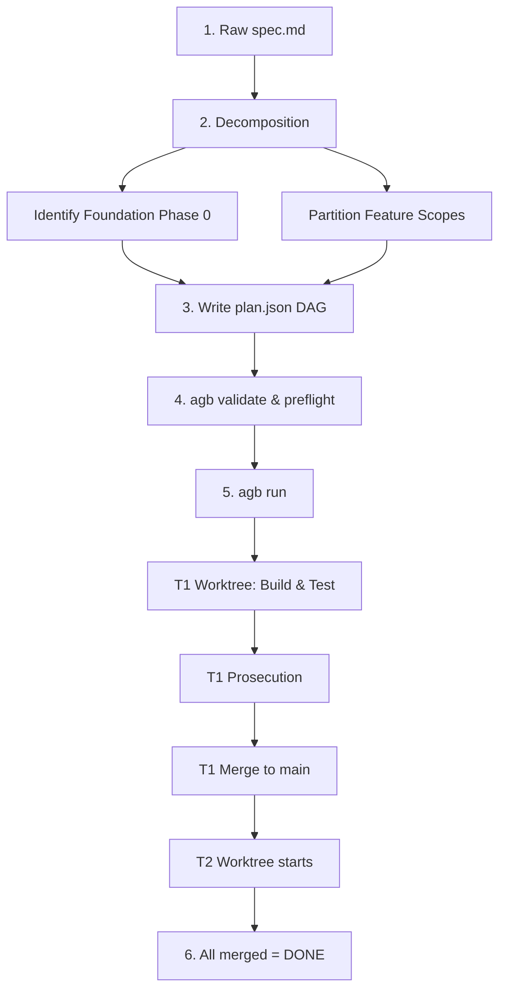

# Executing a Specification with agb: A Concrete Example

This guide explains how to translate a high-level specification (like the `do-better` specification at `../do-better-agb/spec.md`) into an executable `plan.json` and run it to "done" using `agb`.

---

## The Core Lifecycle: Spec → Plan → Done

You cannot run a raw `spec.md` directly through `agb`. A high-level spec contains broad architectural descriptions, non-functional goals, and cross-cutting requirements. 

To execute it with `agb`, the lifecycle follows these steps:



---

## Step 1: Decomposition Strategy

Looking at a specification like `do-better`, we must decompose it. We want to implement the initial CLI infrastructure and the `scan` (D-1) lifecycle command.

We divide this into two tickets:
1. **`T1` (Foundation):** Set up the `.dobetter/` directory creation, the command dispatcher inside `bin/dobetter.mjs`, and common types. This is the **foundation** that must land first.
2. **`T2` (D-1 Scan Command):** Implements `npx do-better scan`, calling the cheap model to build the codemap and size inventory, writing them into `.dobetter/comprehension/codemap.md`. This **depends on T1**.

---

## Step 2: The Concrete `plan.json`

Here is how we represent this decomposition as an executable, gated plan targeting the `do-better` repository:

```json
{
  "repo": "/abs/path/to/do-better",
  "base": "main",
  "gate": {
    "build": "npm run build-check",
    "test": "npm test"
  },
  "tickets": [
    {
      "id": "T1",
      "title": "CLI Entry point and directory layout foundation",
      "body": "Create the command dispatcher bin/dobetter.mjs supporting commands: scan, charter, audit, roadmap, rail, run, refresh. Create lib/dirs.mjs which handles idempotent creation of the .dobetter/ directory structures: .dobetter/comprehension/, .dobetter/findings/, .dobetter/backlog/. Write unit tests verifying dir creation.",
      "scope": [
        "bin/dobetter.mjs",
        "lib/dirs.mjs",
        "test/dirs.test.mjs"
      ],
      "rails": [
        "package.json"
      ],
      "edges": [
        { "to": "T2" }
      ],
      "tier": "mid",
      "pool_hint": "auto"
    },
    {
      "id": "T2",
      "title": "Implement D-1 scan command",
      "body": "Implement the 'scan' subcommand in bin/dobetter.mjs and lib/scan.mjs. It must inspect the target codebase (file sizes, types), send a prompt to the cheap model, and write a summary layout to .dobetter/comprehension/codemap.md. Use lib/dirs.mjs to ensure directory structures exist first. Write unit tests for scan output mapping.",
      "scope": [
        "lib/scan.mjs",
        "test/scan.test.mjs"
      ],
      "rails": [
        "bin/dobetter.mjs",
        "lib/dirs.mjs",
        "package.json"
      ],
      "edges": [],
      "tier": "cheap",
      "pool_hint": "gemini"
    }
  ]
}
```

### Why this plan is structured correctly for `agb`:
* **Disjoint Scopes:** `T1` owns `bin/dobetter.mjs` and `lib/dirs.mjs`. `T2` lists `bin/dobetter.mjs` and `lib/dirs.mjs` in its **`rails`** (read-only) rather than its scope. This prevents `T2`'s model from modifying the foundation code, preventing merge conflicts.
* **Explicit Dependency (`edges`):** `T1` points to `T2`. `agb` will wait until `T1` is fully completed, verified, and merged into `main` before starting `T2`.
* **Explicit bodies:** Each body lists files to create, commands to support, and what tests to write.

---

## Step 3: Local Validation

Before running, we run validation commands:

```bash
# Verify JSON structure, verify DAG has no loops, verify tier routing:
agb validate plan.json

# Check for scope overlap and verify model APIs are online and responsive:
agb preflight plan.json
```

---

## Step 4: Parallel Execution & Verification Flow

Once we run `agb run plan.json`, the orchestrator executes the following loop:

### 1. Building T1
* `agb` creates an isolated Git worktree: `.worktrees/agb-T1/`.
* It branches off `main` to `booster-T1`.
* It spawns the builder model (e.g., Claude Sonnet 4.6 if `tier` is `mid`) inside the worktree, passing it `T1`'s body.
* The model writes `bin/dobetter.mjs`, `lib/dirs.mjs`, and `test/dirs.test.mjs`.
* When the model prints `TICKET-DONE`, `agb` runs the gate: `npm run build-check` and `npm test` inside the worktree.

### 2. Prosecuting T1 (Cross-Model review)
* If the gates pass, `agb` takes the diff generated in `T1`'s worktree and submits it to a prosecutor from a **different model family** (e.g., Gemini 3.1 Pro).
* The prosecutor checks for specification gaps, bypassed tests, or security concerns:
  * *Example:* If the prosecutor finds that `lib/dirs.mjs` doesn't handle directory creation errors, it returns a reject verdict. The builder gets **one** attempt to fix this issue in its worktree.
  * If it passes, it outputs a clean verdict.

### 3. Merging T1
* `agb` acquires the repository lock.
* It checks out the main repository's target branch (`main`).
* It merges `booster-T1` into `main`.
* It runs the post-merge gates (`npm run build-check && npm test`) on `main`.
* Once this passes, the lock is released, and `T1` is marked **merged**.

### 4. Initiating T2
* Since `T1` is now merged, `T2`'s dependency is resolved.
* `agb` creates a new worktree `.worktrees/agb-T2/`, branching off the *updated* `main` branch (which now contains the files created in `T1`).
* The builder model (assigned Gemini 3.5 Flash because of `tier: cheap` and `pool_hint: gemini`) reads the stable `lib/dirs.mjs` under its read-only `rails` protection and builds `lib/scan.mjs`.
* The cycle repeats: Build → Gate → Prosecute (using Claude Sonnet this time) → Merge.

---

## Step 5: Done

When `T2` merges successfully, `agb` outputs a final run report:

```json
{
  "merged": ["T1", "T2"],
  "failed": {},
  "request_counts": {
    "gemini-3.5-flash-low": 4,
    "claude-sonnet-4.6": 2
  }
}
```

The CLI exits with code `0`. Your main branch is now updated with the fully tested, reviewed, and integrated implementation of the spec.
