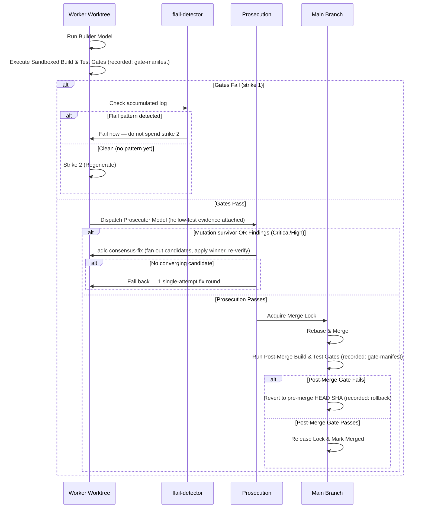

# ADLC & Architectural Guidelines

This document details the architectural principles, behavioral guidelines, and core doctrines that govern the operation of Antigravity Booster (`agb`).

## Table of Contents
1. [Architectural Philosophy](#architectural-philosophy)
2. [The Plan Phase](#the-plan-phase)
3. [ADLC Doctrine (P0-P7)](#adlc-doctrine-p0-p7)
4. [Execution Gates](#execution-gates)
5. [Cross-Model Prosecution](#cross-model-prosecution)
6. [Self-Orchestration Guidelines](#self-orchestration-guidelines)
7. [Design Tradeoffs](#design-tradeoffs)
8. [Live Rail Enforcement (ADLC P3)](#live-rail-enforcement-adlc-p3)
9. [Gate Evidence (ADLC gate-manifest)](#gate-evidence-adlc-gate-manifest)
10. [Review Self-Calibration (ADLC review-calibration)](#review-self-calibration-adlc-review-calibration--opt-in-not-automatic)
11. [CI Self-Protection](#ci-self-protection)

---

## Architectural Philosophy

The design of Antigravity Booster rests on a central premise:

> **Control flow belongs to code; judgment belongs to models.**

In conventional agent frameworks, models are often asked to determine execution pathways—deciding when a build has succeeded, whether to run a test, or which step to run next. This approach introduces non-determinism into the infrastructure loop. 

`agb` uses a **deterministic engine written in Node ESM** to manage the execution state machine:
1. **The Scheduler** manages the ticket dependency DAG, allocates worker worktrees, and schedules tasks.
2. **Semaphores** throttle calls based on the target API's quota pools.
3. **The Models** are restricted to bounded execution contexts: building a single ticket's scope, or prosecuting a diff against a specific checklist.

---

## The Plan Phase

**Planning belongs to Antigravity; compilation and gating belong to `agb`.**

Antigravity's plan phase already works well — both the desktop app's plan mode and planning conversations in `agy` sessions produce a reviewed, human-readable `implementation_plan.md` brain artifact. `agb` deliberately does not author plans, run planning interviews, or generate PRDs. Building a second planner would duplicate what the platform does well and dilute `agb`'s gate-shaped identity. Specs authored elsewhere enter the same pipeline via a raw file path — the gates, not the authoring surface, are the contract.

Instead, the boundary is a compiler boundary:

| Artifact | Role | Owner |
| :--- | :--- | :--- |
| `implementation_plan.md` (brain) | **Source.** Authored and reviewed by the human in Antigravity. | Antigravity plan phase |
| `plan.json` | **Compiled output.** Gated, provenance-stamped, executable ticket DAG. | `agb plan` |

Consequences of this boundary:

1. **The fix surface is always the plan.** When `agb plan` reports blocking findings it cannot resolve by re-conversion (underspecified tickets, ambiguous inter-ticket contracts), the remediation is to refine the plan in Antigravity and recompile — never to hand-edit the compiled JSON.
2. **The plan is a gated artifact like any other.** ADLC requires every artifact to pass gates before tokens are spent downstream. `agb plan` runs structural validation, scope-overlap forecasting, coldstart (per-ticket executability), parallax edge interrogation (per-edge contract ambiguity, ADLC D3), and an advisory premortem (ADLC C2) — closing what was previously the only ungated phase in the pipeline.
3. **Failures feed back before humans see them.** Conversion defects loop back into the converter model with compiler feedback; the human re-engages only at the markdown level, with measured findings, not raw invalid JSON.
4. **One plan format, two authoring surfaces.** Because the desktop app and `agy` share one harness and one brain directory, headless (CLI-only) workflows use the exact same pipeline: plan in an agy session, then `agb plan`.
5. **`plan.json` and `.adlc/tickets.json` are not two source-of-truth formats.** `plan.json` remains the execution artifact — it carries fields (`tier`, `pool_hint`) the `@adlc/core` ticket schema doesn't have, and `agb run` reads it. On every successful compile, `compilePlan` (`lib/plan.mjs`) also projects the gated ticket set into `<repo>/.adlc/tickets.json` via `lib/adlc-bridge.mjs`'s `planToAdlcTickets`/`writeAdlcTickets` — a pure, field-preserving projection (`id`, `title`, `body`, `scope`, `rails`, `edges`, `duration`; booster-only fields are dropped, never invented on the other side). This lets the adlc-antigravity plugin's rails-guard hook and the `adlc` CLI's gate tools (`coldstart`, `model-router`, `merge-forecast`, …) resolve the same active ticket set `agb` just compiled, without a human ever hand-editing `.adlc/tickets.json` directly. A blocked compile (`ok: false`) never publishes a projection — only a gate-clean plan becomes the active ticket set. The write is best-effort: a filesystem failure logs a warning but does not retroactively fail an already-successful compile.
6. **model-router replaces trusting the brain's own tier field.** Immediately after the projection above, `compilePlan` runs `adlc model-router --tickets <path> --json` (`applyModelRouterTiers`) and overwrites every ticket's `tier` with the router's deterministic, rails-density/critical-path-float-based assignment (ADLC D1) — before, tier came straight from whatever the brain conversion's free-form model output happened to produce, with no consistency guarantee across tickets. This is additive evidence, not a gate: an unavailable/failing router (`adlc` missing, timeout, unparseable output) logs a warning and leaves every ticket's existing tier untouched rather than failing an otherwise-successful compile. `p3Findings` (tickets too thinly railed to build cheaply) are logged, advisory only — they do not block the compile.
7. **merge-forecast is complementary to `forecastOverlaps`, not a replacement.** `lib/preflight.mjs`'s `forecastOverlaps` (used in the structural loop, above) is a hard-veto pairwise declared-scope check with no notion of *how many* tickets can run concurrently. `applyMergeForecast` (also `lib/preflight.mjs`) runs `adlc merge-forecast --tickets <path> --json` right after `applyModelRouterTiers` and annotates `plan.concurrencyCap` with the tool's `recommendedWidth` — its estimate of dependency pressure and merge backpressure across the whole DAG (ADLC D2). Annotates, does not gate: a scheduling-risk finding (`gateFailures`, e.g. a vetoed pair the DAG would otherwise schedule concurrently) is logged as advisory, and an unavailable/failing forecast leaves `plan.concurrencyCap` unset rather than failing an otherwise-successful compile. Nothing in `lib/scheduler.mjs` reads `concurrencyCap` yet — actually bounding fan-out width at dispatch time is a follow-on, out of scope here (that file is a declared rail for other in-flight tickets).

---

## ADLC Doctrine (P0-P7)

The Agentic Software Development Lifecycle (ADLC) enforces strict operating guidelines for agents working inside `agb`. These rules exist to address common model failure modes (such as hallucinating test results, expanding scope, or wasting quota).

### 1. Evidence or it didn't happen
- **"I fixed it" is a claim.** A command executed with quoted output showing the success is **evidence**. 
- Agents must never report a task as complete without running the verification commands and showing the terminal output.

### 2. Scope discipline
- Agents must strictly modify files matching the ticket's `scope` glob list. Any modification outside scope will fail the ticket validation mechanically.
- Files matching the `rails` glob list are read-only. Modifying a rail results in a failed build. If a rail requires modification, the agent must halt and report `TICKET-BLOCKED`.
- **Zero test deletion:** Agents are forbidden from deleting, disabling, or weakening tests to get a gate to pass. Suppressing existing assertions will fail prosecution.

### 3. Quota discipline
- Quota is a finite resource. Agents must not repeatedly re-read the same files in a single session.
- Diffs must be kept minimal and surgical. Under no circumstances should an agent rewrite an entire file to change only a few lines.

### 4. Completion protocol
- A builder agent must end its output with either `TICKET-DONE` (when all gates are green and verified) or `TICKET-BLOCKED: <reason>`. 
- No other text counts as completion.

---

## Execution Gates

`agb` enforces deterministic execution gates at two stages of a ticket's life.



### Sandboxed Gates
To protect the host machine from unverified execution paths, all gate scripts run sandboxed using macOS Seatbelt.
- If running on macOS, sandboxing is enabled by default.
- On other systems, gates fail closed unless running inside an isolated container with `AGB_SANDBOX_GATES=0`.
- The sandbox allows network access and standard build utilities (e.g., `git`, `npm`, `node`) but prevents unauthorized system interference.

### Pre-Merge Gates
Before a ticket is submitted for prosecution, its build and test scripts must pass in its isolated worktree (e.g. `.worktrees/agb-T1`). If the gate fails, a strike is logged against the ticket, and the outcome (pass/fail, strike count) is recorded via `adlc gate-manifest`. Between strikes, `adlc flail-detector` checks the accumulated log for a genuine flail pattern before a second strike is attempted — see [Self-Orchestration Guidelines](#self-orchestration-guidelines).

### Post-Merge Gates
To prevent integration errors when combining parallel changes:
1. The engine acquires a repository-wide merge lock.
2. The ticket's branch is merged sequentially into the base branch (`main`).
3. The build and test gates are executed again on `main`.
4. If the gate fails, the scheduler performs an automatic rollback (`git reset --hard`) to restore `main` to its exact pre-merge SHA, and the ticket is marked as failed.

---

## Cross-Model Prosecution

Standard code reviews done by the same model family that generated the code often miss structural issues due to family-specific blind spots. To bypass this, `agb` mandates **Cross-Model Prosecution**.

- **Alternating Families:** If a Gemini model builds the code, a Claude model must prosecute it, and vice versa.
- **Refute Charter:** The prosecutor is instructed to *refute* the change rather than write a generic review. It is rewarded for finding real, reproducible bugs or specification violations.
- **Verdict Contract:** The prosecutor must output a strict JSON verdict:
  ```json
  {
    "findings": [
      {
        "file": "lib/math.mjs",
        "severity": "critical",
        "message": "Division by zero throws unhandled exception instead of returning NaN as requested in T1."
      }
    ],
    "verdict": "reject"
  }
  ```
- **Severity Enforcement:** Only `critical` and `high` severity findings block a merge. Medium or low findings are flagged but do not halt progression.
- **Fix Loop:** If a prosecution fails, the scheduler first tries `adlc consensus-fix` — fan out N candidate fixes gated against the failing test (and, if configured, the full rail suite) — and applies the first winner, re-verifying it with a fresh gate + prosecution pass before merging. Only if consensus-fix doesn't converge (no survivors, all-divergent, or the tool itself unavailable) does the builder fall back to **one** single-attempt fix round in its worktree. If the code fails prosecution again after that, the ticket is failed.
- **Evidence, not self-report:** Before dispatching the prosecution prompt, `adlc hollow-test` mutates the changed lines and confirms the gate command actually catches every mutant. A mutation survivor is an automatic block the model's own verdict cannot overrule — the same "hollow test" doctrine (§1 above) applied to the reviewer's own evidence, not just the builder's tests.

---

## Self-Orchestration Guidelines

When utilizing `agb` to build large projects recursively (L3/L4), follow these decomposition guidelines:

1. **Foundation First:** Identify shared files, schemas, and contracts. Build, test, and merge this foundation to `main` before fanning out. Parallel builders must consume this foundation as read-only `rails`—they should never invent types or schemas concurrently.
2. **Partition Scopes:** Ensure no two concurrent tickets share files in their `scope` configuration. If they share files, they must be sequenced sequentially (via `edges` dependencies) or consolidated.
3. **Explicit Specs:** A ticket's `body` must contain the entire requirement set. Do not rely on "context" or high-level goals. Specify file names, parameter types, edge cases, and expected gate commands explicitly.
4. **Supervise, Don't Coach:** If a ticket exhausts its strikes, the scheduler halts. Do not attempt to force the agent to retry the same code. A repeated failure is a sign of an ambiguous spec, diagnosed mechanically (`adlc flail-detector` — repeated errors, scope violations, edit churn, or an oversized log — can end a ticket after strike one, without wasting a second attempt on a dead end). On a blocked prosecution specifically, the scheduler tries `adlc consensus-fix` (fan out candidate fixes, apply the first gated winner) before falling back to a single-attempt regeneration. If a ticket still fails after all of that, rewrite the ticket's `body` to be smaller or more explicit, adjust the rails, and re-run — don't just retry.

---

## Design Tradeoffs

### Rebase Without Re-Prosecution
When a ticket branch is rebased onto an updated base branch before merging, the combined diff is validated by the post-merge gate (build + tests) but is **not** re-run through cross-model prosecution. This avoids doubling the prosecution quota. The post-merge gate acts as the safety net for behavioural regressions.

### File-Based Repository Lock
`agb` implements a zero-dependency, file-based repository lock (via atomic `mkdir` and rename). While an OS-level lock (`flock`) is stronger, the file-based lock allows the tool to run dependency-free across node platforms while maintaining local concurrency safety.

### Untracked-File Window During Post-Merge Gates
Because post-merge gates can take several minutes to run, any untracked file created by a developer in the main repository checkout during this window will be deleted by `git clean -fd` if the post-merge gate fails and triggers a rollback. Developers should avoid editing the target repository directory while an `agb` run is active.

## Live Rail Enforcement (ADLC P3)

Once per `runPlan` call, the scheduler checks whether live in-session rail enforcement can be turned on for the run (`checkEnforcementAvailable` in `lib/scheduler.mjs`): the target repo must be ADLC-initialized (`.adlc/` present) and the installed `adlc-antigravity` plugin must pass a manifest-based contract handshake, not the old `agy plugin list` stdout-substring check. `readPluginContract` (`lib/adlc-bridge.mjs`) reads `plugin.json`'s `adlcContract` field from `AGB_PLUGIN_DIR` (default `~/.gemini/config/plugins/adlc-antigravity`) and compares it to the booster's own `SUPPORTED_PLUGIN_CONTRACT`:

- **compatible** (`adlcContract === SUPPORTED_PLUGIN_CONTRACT`) — live enforcement available.
- **incompatible** (present but different integer) — the run **aborts loudly before any repo mutation** (lock, `.gitignore` commit, worktrees), naming which side to upgrade.
- **missing-field / unreadable** (older or absent plugin) — never crashes; degrades to the post-hoc check alone, same as an uninitialized `.adlc/`.

When enforcement is unavailable but not aborted, every builder worktree still gets its own `.adlc/tickets.json`, but as a `planTicketToRailTicket` projection (`lib/adlc-bridge.mjs`) — id/title/scope/rails only, with `edges`/`body`/`duration` stripped, since a single-ticket file can't resolve edges to sibling tickets that aren't in it (dangling edges make the plugin's `loadTickets` fail closed and deny the whole build, not just rail paths). This is deliberately distinct from `planToAdlcTickets`, the full-DAG projection the `adlc` CLI consumes at plan-compile time. The builder's `agy --print` invocation is spawned with `ADLC_P4_ENFORCEMENT=1` and `ADLC_TICKET=<id>` set **for that spawn only** — `runAgy`'s `env` option merges onto `process.env`, it never mutates it, so concurrent tickets building in the same booster process never see each other's active-ticket signal.

When either precondition fails (short of an incompatible-contract abort), the run does not abort — it degrades to the post-hoc check alone and says so explicitly via `report.enforcementAvailable` / `report.enforcementReason` (never a silent no-op). The post-hoc check (`lib/scheduler.mjs`'s `checkRailsGuard`) calls `adlc rails-guard --rails <globs> --base <ref>` directly — the same engine the plugin's hook uses — instead of a bespoke glob comparison, and works regardless of whether the target repo is ADLC-initialized (it takes `--rails` flags straight from the ticket, not `--tickets`).

## Gate Evidence (ADLC gate-manifest)

Every gate transition a scheduler run produces — the worktree build, the prosecution verdict, the post-merge build, a rollback — is recorded as append-only, hash-chained evidence via `adlc gate-manifest record <gate> --ticket <id> --data '<json>'` (`lib/scheduler.mjs`'s `recordGate`), not just a `.booster/report.json` log line. `adlc gate-manifest show` / `verify` reconstruct a run's full gate history from `<repo>/.adlc/manifest.jsonl` alone. Best-effort, like the other CLI integrations: a recording failure (`adlc` missing, `.adlc` unwritable) is caught and ignored — a broken audit trail must not itself fail a build/merge that otherwise succeeded.

`lib/worktrees.mjs`'s `ensureGitignore` now also ignores `.adlc/*` (except `tickets.json`) in every target repo it runs against — without this, `.adlc/manifest.jsonl` written mid-run would make `isDirty(repo)` see the target repo as dirty, tripping the merge-time dirty-tree guard on a run that otherwise succeeded. This mirrors the exception this repo's own `.gitignore` already uses.

## Review Self-Calibration (ADLC review-calibration) — opt-in, not automatic

`lib/review.mjs`'s `reviewCalibration()` closes the "who reviews the reviewer" loop for `agb review` the way `adlc hollow-test` closes it for a single ticket's tests: it runs `adlc review-calibration --review-cmd <cmd> --json` (ADLC C8), which plants real mutants into a real commit and measures whether the review fleet's own findings actually catch them (recall), not just whether the fleet ran and said something.

**This is deliberately opt-in and periodic, NOT part of every `agb review` invocation.** review-calibration plants mutants into a real commit and runs a full reviewer pass per plant — real quota cost, multiplied by however many plants are requested. `reviewCalibration()` is exported for a human or a future scheduled job to call explicitly (e.g. weekly), not wired into `bin/agb.mjs`'s `review` command's default path — CLI wiring is a natural follow-up, intentionally out of this ticket's scope.

`reviewCmd` carries a `{base}` placeholder review-calibration substitutes with the commit ref under test; the natural choice re-uses the very fleet being measured: `agb review <repo> {base}` (JSON findings on stdout, the shape review-calibration's scorer expects). Like every other CLI integration here, it's additive evidence: an unavailable/failing calibration run (`adlc` missing, dirty tree, no LLM judge configured) degrades to `{ ok: false, error }` rather than throwing, and a below-threshold recall is still a valid, surfaced result (`{ ok: true, recall, ... }`) — only a genuinely unparseable/absent result is an operational error.

## CI Self-Protection

This repo dogfoods the ADLC on itself: `.adlc/tickets.json` is the tracked ticket contract, `.adlc/config.json` is the bootstrapped trust root, and `.github/workflows/adlc-rails-guard.yml` (copied from `../adlc/docs/ci/rails-guard.yml`) is the CI backstop behind the in-session hook. **The bootstrap is complete** — `.adlc/config.json` carries `acknowledgedNewRailBypass: true`, `securityMode: "unsigned-fallback"`, and `trustedCodeownersAttested: true`; branch protection on `main` enforces `require_code_owner_reviews: true` and `enforce_admins: true`; `CODEOWNERS` names `@voodootikigod` on `.github/workflows/**`. The rails-guard workflow runs as the live gate it was designed to be, not bootstrap mode.

Two things worth understanding about how that landed, since they're not obvious from the config alone:

- **The security-attestation fields (`acknowledgedNewRailBypass`, `trustedCodeownersAttested`) were never self-authored by an agent.** Each required an explicit, specific human confirmation of the exact JSON content before being committed — a general instruction like "make CI pass" was correctly treated as insufficient authorization, twice, by the harness's own safety classifier. If you're extending this config in the future, expect (and preserve) that same bar: name the exact field and value, don't infer consent from a broader task.
- **`trustedCodeownersAttested: true` could not be introduced through a normal PR.** The workflow's own check requires the flag to already be `true` on the base branch before it will accept a PR's diff — specifically so a PR can't attest its own trustworthiness. Landing it required a brief, explicit "protected-base admin ceremony": temporarily disable `enforce_admins`, push the already-reviewed commit directly to `main`, immediately restore `enforce_admins`, then verify with a disposable PR (closed without merging) that the gate now genuinely passes. If this ever needs to happen again (e.g. rotating to a new CODEOWNERS owner), that's the pattern — verify the exact branch-protection snapshot before and after, and don't skip the restoration step.

### Frozen rails going forward

`lib/lock.mjs` (merge-lock correctness, hardened over 7 adversarial-review rounds — regressions here are the highest-blast-radius bug class in this repo) and `lib/gates.mjs` (sandbox enforcement) are this repo's own candidate frozen rails. Any future ticket whose scope sits adjacent to either file must declare it in that ticket's `rails` array — this is policy, not a mechanically-enforced constraint today, since rails are declared per-ticket in `.adlc/tickets.json`, not repo-wide.
