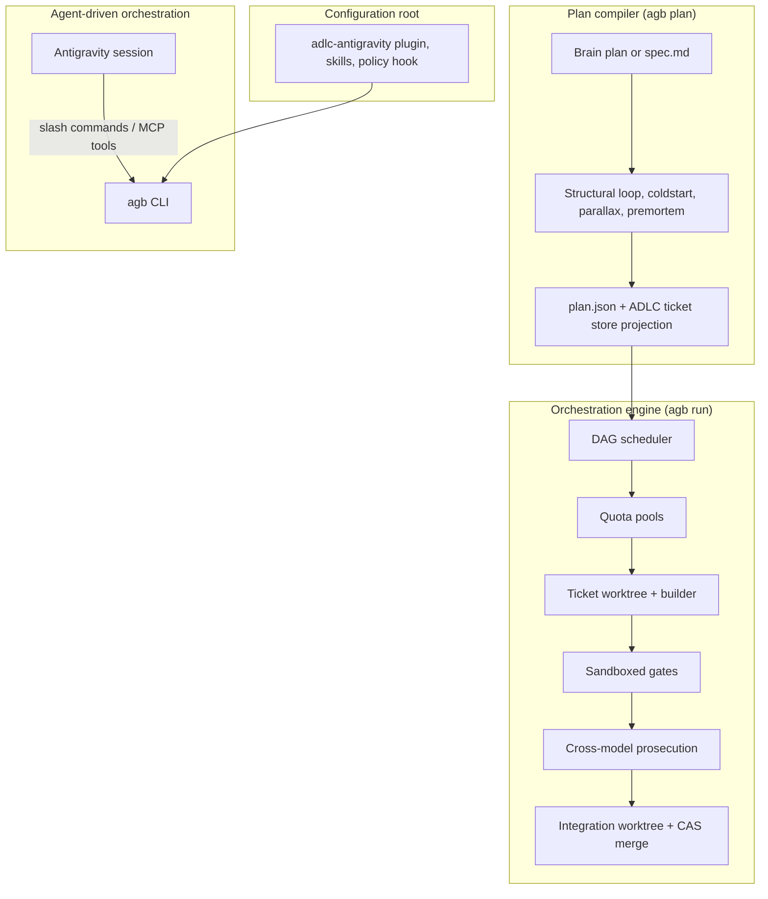

`agb` drives Google Antigravity (`agy`) through large, parallel build-outs. One rule shapes the design: **control flow is code, judgment is models**. The scheduler, pool router, sandbox, merge lock and every pass/fail gate are deterministic Node.js. Models are only asked to do the parts that need judgment: converting a plan into tickets, building a ticket, interrogating a plan, and prosecuting a diff. The scheduler header states the rule as "ADLC D0: control flow is code, judgment is models" ([lib/scheduler.mjs](https://github.com/voodootikigod/antigravity-booster/blob/v1.0.0/lib/scheduler.mjs#L1)).

## The four layers

| Layer | What it does | Deterministic parts | Model parts |
| --- | --- | --- | --- |
| Configuration root | `agb bootstrap` installs the companion plugin, skills and the `agb` shim; the PreToolUse policy hook guards in-session edits | Plugin handshake, policy guard | — |
| Orchestration engine | `agb run` schedules tickets as their predecessors merge, routes each to a pool, builds, gates, prosecutes and merges | Scheduler, pools, sandbox, rails-guard, merge | Builder, prosecutor |
| Agent-driven orchestration | An Antigravity session drives `agb` through the slash commands and the MCP server (`agb_plan`, `agb_run`, `agb_status`, ...) | Same engine | The session agent |
| Plan compiler | `agb plan` compiles a brain plan or `spec.md` into a gated `plan.json` | Schema, DAG and scope-overlap validation | Conversion, coldstart, parallax, premortem |

## Ticket lifecycle

The scheduler moves each ticket through `pending → building → gating → prosecuting → [fixing → gating → prosecuting] → merging → merged | failed` ([lib/scheduler.mjs](https://github.com/voodootikigod/antigravity-booster/blob/v1.0.0/lib/scheduler.mjs#L3-L11)). A ticket becomes ready the moment its edge predecessors merge, so there are no wave barriers. A ticket gets one regeneration with its failure context; a second failure fails the ticket, because at that point the ticket is wrong, not the agent.

## Where to go next

<Cards>
  <Card title="agb vs /boost" href="/docs/concepts/agb-vs-boost">When to use the built-in /boost and when to use agb.</Card>
  <Card title="Plan boundary" href="/docs/concepts/plan-boundary">The compile gates a plan passes before any build starts.</Card>
  <Card title="Pools and tiers" href="/docs/concepts/pools-and-tiers">Quota pools, tier candidates, caps and routing.</Card>
  <Card title="Gates and sandboxing" href="/docs/concepts/gates-and-sandboxing">How builders and gate commands are contained.</Card>
  <Card title="Prosecution" href="/docs/concepts/prosecution">Cross-model review, dry passes and hollow-test.</Card>
  <Card title="Rail enforcement" href="/docs/concepts/rail-enforcement">How frozen rails are enforced in session, at merge and in CI.</Card>
  <Card title="Gate evidence" href="/docs/concepts/gate-evidence">The append-only gate manifest.</Card>
</Cards>
