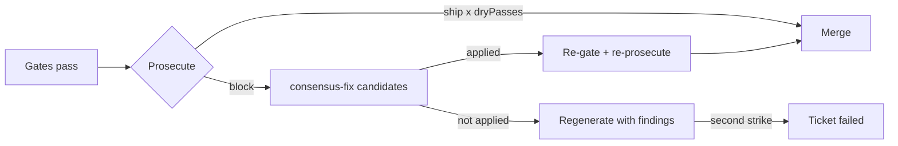

A green gate shows the tests pass. It does not show the change is right. After a ticket's gates pass, `agb` hands the branch diff to a **prosecutor**: a model from a different family than the builder, in a fresh context, charged with refuting the change ([lib/prosecute.mjs](https://github.com/voodootikigod/antigravity-booster/blob/v1.0.0/lib/prosecute.mjs#L58-L69)).

## Who prosecutes whom

[C20](https://github.com/voodootikigod/antigravity-booster/blob/v1.0.0/lib/pools.mjs#L104-L107) Gemini builders are prosecuted by `gpt-oss-120b-medium`; Claude and gpt-oss builders by `gemini-3.1-pro-high`. If the preferred prosecutor's pool has no capacity, `agb` falls back to the next cross-family candidate ([lib/pools.mjs](https://github.com/voodootikigod/antigravity-booster/blob/v1.0.0/lib/pools.mjs#L1800-L1825)). The full table is on [Pools and tiers](/docs/concepts/pools-and-tiers#prosecutor-mapping).

The prosecutor runs read-only in a scratch directory with an 8-minute timeout and must answer in a JSON schema ([lib/prosecute.mjs](https://github.com/voodootikigod/antigravity-booster/blob/v1.0.0/lib/prosecute.mjs#L91-L104), [lib/scheduler.mjs](https://github.com/voodootikigod/antigravity-booster/blob/v1.0.0/lib/scheduler.mjs#L1620-L1643)).

## How a verdict is decided

The JSON contract, not the model, decides ([lib/prosecute.mjs](https://github.com/voodootikigod/antigravity-booster/blob/v1.0.0/lib/prosecute.mjs#L114-L152)):

| Condition | Verdict |
| --- | --- |
| Empty diff | `block` (critical: no committed change) |
| Diff over 120,000 characters | `block`: a partial review cannot certify what it did not see; split the ticket |
| Any `critical` or `high` finding | `block`, whatever the model's own verdict says |
| `adlc hollow-test` reports a surviving mutant | `block` |
| `block` with no findings, or a verdict other than `ship`/`block` | `error` (schema violation) |
| Otherwise | the model's `ship` or `block` |

The oversize rule exists because truncating let a builder pad an early file and hide a change in a later one ([lib/prosecute.mjs](https://github.com/voodootikigod/antigravity-booster/blob/v1.0.0/lib/prosecute.mjs#L73-L87)).

## Hollow-test evidence

When the plan has a test gate, `agb` runs `adlc hollow-test --test-cmd <gate.test> --base <base>` in the ticket worktree before prosecuting. It mutates the changed lines and checks that the tests catch every mutant ([lib/prosecute.mjs](https://github.com/voodootikigod/antigravity-booster/blob/v1.0.0/lib/prosecute.mjs#L16-L56)).

- The result goes into the prosecutor's prompt as evidence.
- A survivor is added as a critical finding the model cannot overrule.
- If hollow-test cannot run (no test gate, `adlc` missing, timeout), the evidence is shown as unavailable and the cross-model pass still runs.

hollow-test runs again after merge in the integration worktree when the merged change touches `test/`; a failure there stops the merge ([lib/scheduler.mjs](https://github.com/voodootikigod/antigravity-booster/blob/v1.0.0/lib/scheduler.mjs#L2251-L2272)).

## Dry passes

One clean pass is a model prior, not a coverage certificate. `plan.prosecution.dryPasses` (default 1) sets how many consecutive `ship` verdicts a ticket needs. Any non-`ship` verdict ends the loop ([lib/scheduler.mjs](https://github.com/voodootikigod/antigravity-booster/blob/v1.0.0/lib/scheduler.mjs#L1962-L1984)).

```json title="plan.json (excerpt)"
{
  "prosecution": { "dryPasses": 2 }
}
```

## After a block



A block counts as a strike. `agb` first asks `adlc consensus-fix` for candidate fixes; an applied candidate must pass the rails check, the gates and prosecution again. Otherwise the builder regenerates with the blocking findings attached. Under the two-strike rule, a second failure fails the ticket ([lib/scheduler.mjs](https://github.com/voodootikigod/antigravity-booster/blob/v1.0.0/lib/scheduler.mjs#L1986-L1995)).

Each prosecution outcome is recorded as gate evidence: see [Gate evidence](/docs/concepts/gate-evidence). To prosecute a branch outside a run, use [`agb review`](/docs/guides/review).
