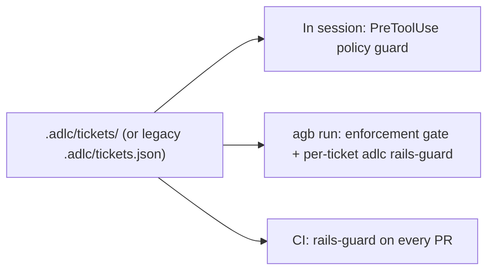

A **rail** is a path glob that must not change while the ticket declaring it is in flight: the tests that define done, a lock implementation, a trust root. Rails are declared in each ticket's `rails` array. A rail declared by any active ticket is frozen for every change in the repo, not only that ticket's.

`agb` enforces rails at three points, and all three read the same active-ticket set.

## Active tickets and their rails

`unionActiveRails` unions `rails` across every **active** ticket in the store ([lib/active-rails.mjs](https://github.com/voodootikigod/antigravity-booster/blob/v1.0.0/lib/active-rails.mjs#L90-L110)). A ticket is active unless it has `completed: true` or a `completed`, `closed` or `archived` status. A malformed ticket or an unknown status counts as active, and an unreadable store is reported as "rails present", so every caller fails closed ([lib/active-rails.mjs](https://github.com/voodootikigod/antigravity-booster/blob/v1.0.0/lib/active-rails.mjs#L13-L25)).

<Callout type="info">
Complete and archive a ticket once it merges. A completed ticket that is still in the active store keeps its rails frozen and can block unrelated work.
</Callout>

## In session: the PreToolUse policy guard

The plugin registers one `PreToolUse` hook for every tool (`"matcher": "*"`), run through `bin/hook-runner.sh` with a 9-second watchdog ([hooks.json](https://github.com/voodootikigod/antigravity-booster/blob/v1.0.0/hooks.json#L1-L16)). The guard reads the tool call and prints `deny`, `ask`, or nothing. It never prints `allow` ([hooks/pre-tool-use.mjs](https://github.com/voodootikigod/antigravity-booster/blob/v1.0.0/hooks/pre-tool-use.mjs#L1-L10)).

- **File and MCP tools** are checked exactly: a write to a path matching an active rail is denied ("Target path matches frozen rail"), as is a write to the standing implicit rails: `.git/`, `.adlc/config.json`, `.adlc/manifest.jsonl`, `.adlc/sessions.json`, `.adlc/tickets.json`, `.adlc/ticket-archive/`, `.adlc/ticket-transactions/` and `.adlc/leases/` ([hooks/policy/evaluate.mjs](https://github.com/voodootikigod/antigravity-booster/blob/v1.0.0/hooks/policy/evaluate.mjs#L256-L268), [hooks/policy/constants.mjs](https://github.com/voodootikigod/antigravity-booster/blob/v1.0.0/hooks/policy/constants.mjs#L72-L75)). An unreadable ticket store denies every mutation.
- **Shell commands** are lexed. In a repo with active rails, a command the guard cannot prove safe gets `ask` in an interactive session ([hooks/policy/shell.mjs](https://github.com/voodootikigod/antigravity-booster/blob/v1.0.0/hooks/policy/shell.mjs#L257-L261)).
- **`agb` workers** are marked with `AGB_WORKER_TICKET` or `AGB_WORKER_MODE`. For them every `ask` becomes `deny`, and a builder may only write inside its own ticket's scope ([hooks/policy/evaluate.mjs](https://github.com/voodootikigod/antigravity-booster/blob/v1.0.0/hooks/policy/evaluate.mjs#L272-L278), [hooks/policy/evaluate.mjs](https://github.com/voodootikigod/antigravity-booster/blob/v1.0.0/hooks/policy/evaluate.mjs#L442-L455)).

`agy` treats a hook that exits non-zero as a pass, so the runner always exits 0 and, on a crash or timeout, emits its fallback decision, which is `deny` by default ([bin/hook-runner.sh](https://github.com/voodootikigod/antigravity-booster/blob/v1.0.0/bin/hook-runner.sh#L1-L12)).

## During a run

Before dispatching anything, `agb run` evaluates an enforcement gate ([lib/scheduler.mjs](https://github.com/voodootikigod/antigravity-booster/blob/v1.0.0/lib/scheduler.mjs#L1365-L1376), [lib/run-integrity.mjs](https://github.com/voodootikigod/antigravity-booster/blob/v1.0.0/lib/run-integrity.mjs#L113-L131)). It refuses to dispatch or merge any ticket when:

- a rail glob is malformed;
- the ticket store is unreadable;
- rails are declared (by the plan or by active tickets) but the `adlc` binary is not authenticated.

After each build, the ticket's own rails plus every active store rail are checked with `adlc rails-guard --base <base>` in the worktree ([lib/scheduler.mjs](https://github.com/voodootikigod/antigravity-booster/blob/v1.0.0/lib/scheduler.mjs#L1907-L1915)). An operational error (missing `adlc`, timeout, unparseable output) counts as a violation and compromises the run ([lib/scheduler.mjs](https://github.com/voodootikigod/antigravity-booster/blob/v1.0.0/lib/scheduler.mjs#L968-L1000)).

## In CI

On every pull request, `.github/workflows/adlc-rails-guard.yml` runs `scripts/rails-guard-ci.mjs` **as stored on the base branch**, so a PR cannot weaken the guard that judges it ([adlc-rails-guard.yml](https://github.com/voodootikigod/antigravity-booster/blob/a99b3cd/.github/workflows/adlc-rails-guard.yml#L345-L349)). Since #87 (commit `a99b3cd`, after v1.0.0; decision D3) the guard reads rails from the `.adlc/tickets/` directory store and falls back to a legacy `.adlc/tickets.json`. Both stores at once is an error ([scripts/rails-guard-ci.mjs](https://github.com/voodootikigod/antigravity-booster/blob/a99b3cd/scripts/rails-guard-ci.mjs#L260-L279)). Before #87 the CI gate saw no `tickets.json` on a migrated repo and enforced only the trust roots.

The guard:

1. Unions the rails of the active tickets in the **base** store.
2. Denies any change to a trust root: `.adlc/config.json`, `.adlc/admin.pub`, the workflow itself, `CODEOWNERS`, the guard script and its hash file, plus the store manifests ([scripts/rails-guard-ci.mjs](https://github.com/voodootikigod/antigravity-booster/blob/a99b3cd/scripts/rails-guard-ci.mjs#L22-L25)).
3. Allows only these ticket transitions: unchanged, completed in place, or archived with a verified envelope.
4. Runs `adlc rails-guard` against the base, then repeats the rail diff with rename detection off, so a frozen file cannot be moved out from under its glob ([scripts/rails-guard-ci.mjs](https://github.com/voodootikigod/antigravity-booster/blob/a99b3cd/scripts/rails-guard-ci.mjs#L301-L330)).

Exit codes: `0` pass, `1` fail closed, `2` deny.

## Residual risks

<Callout type="warn" title="Print mode turns ask into allow">
In a user-launched `agy -p` session, Antigravity treats `ask` as allow. There the guard is deny-only: rail and protected-root denials still hold, but commands that would have prompted run. `agb`'s own workers are always marked and get `deny` instead. The merge-time and CI `rails-guard` checks remain the backstop.
</Callout>

<Callout type="warn" title="AGB_HOOK_DISABLE">
Setting `AGB_HOOK_DISABLE` to any non-empty value in the environment that launches `agy` bypasses the PreToolUse guard completely. The runner logs a `[CRITICAL NOTICE]` line to `~/.gemini/antigravity-cli/plugin_data/antigravity-booster/logs/hooks.log` and to stderr on every call ([bin/hook-runner.sh](https://github.com/voodootikigod/antigravity-booster/blob/v1.0.0/bin/hook-runner.sh#L19-L26)), and `agb doctor` warns with a count of those notices ([lib/doctor.mjs](https://github.com/voodootikigod/antigravity-booster/blob/v1.0.0/lib/doctor.mjs#L285-L293)). It is an operator killswitch: agents cannot set it for the parent process. The run-time and CI checks still apply.
</Callout>

The guard's internals are covered in [Policy guard](/docs/internals/policy-guard). This repo's own rails and CI self-protection are covered in [ADLC in this repo](/docs/project/adlc-in-this-repo).
