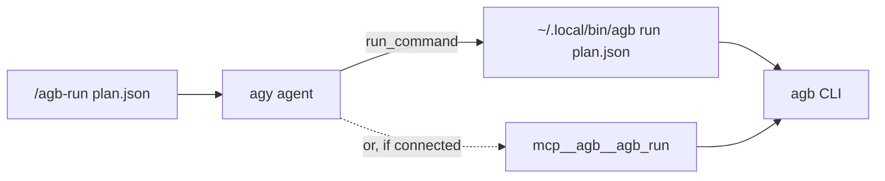

`agb` is a CLI first. Inside Antigravity it is reached two ways: **slash commands** that tell the agent to run the CLI, and an **MCP server** that exposes the same commands as tools. Both end up running the same `agb` binary, so behavior, exit codes and safety rails are identical.

## The slash-command model

The plugin ships seven commands: `/agb-bootstrap`, `/agb-doctor`, `/agb-migrate`, `/agb-plan`, `/agb-review`, `/agb-run` and `/agb-sidecar`. Each is a Markdown prompt, not code. It tells the agent to run the terminal shim `~/.local/bin/agb <command>` with its shell tool, pass the user's arguments through unchanged and quoted, wait, and report the output and exit code ([/agb-run](https://github.com/voodootikigod/antigravity-booster/blob/v1.0.0/commands/agb-run.md#L6-L20)).

- **The shim must exist.** It is written by `agb bootstrap`. If it is missing, the command tells the agent to stop and ask the user to bootstrap from a terminal, rather than hunting for the plugin's files ([missing shim](https://github.com/voodootikigod/antigravity-booster/blob/v1.0.0/commands/agb-run.md#L22-L28)).
- **Exit codes are reported as-is:** `0` pass, `2` gate failure or findings, `1` usage or internal error.
- **Long-running commands** (`/agb-run`, `/agb-sidecar`) say so: the agent confirms an ambiguous plan path before `run`, and starts the sidecar in the background ([/agb-sidecar](https://github.com/voodootikigod/antigravity-booster/blob/v1.0.0/commands/agb-sidecar.md#L6-L8)).

The full list with arguments is in [Slash commands](/docs/reference/slash-commands); the plugin's files are described in [Plugin layout](/docs/reference/plugin-layout).

## Headless use

Everything works without the desktop app. Plan in an `agy` session (or write `spec.md` yourself), then run `agb plan`, `agb run` and `agb status` from a terminal or CI job. `agb` itself drives `agy` headlessly: each builder, prosecutor and review lens is an `agy --print` call ([print-mode spawn](https://github.com/voodootikigod/antigravity-booster/blob/v1.0.0/lib/agy.mjs#L250)).

### Residual risk in print mode

The plugin's PreToolUse policy guard (`hooks.json`) only ever answers `deny`, `ask` or pass-through. In print mode (`agy -p`) there is no one to answer `ask`, and Antigravity treats it as allow ([residual risk](https://github.com/voodootikigod/antigravity-booster/blob/v1.0.0/USAGE.md#L57)).

- **Sessions started by `agb` are safe from this.** Every `agy` spawn is marked as a worker: `AGB_WORKER_TICKET=<id>` for builders, `AGB_WORKER_MODE=readonly` otherwise, with any inherited values removed first ([worker marking](https://github.com/voodootikigod/antigravity-booster/blob/v1.0.0/lib/agy.mjs#L813-L817)). The guard treats marked sessions as headless and returns `deny` where it would otherwise `ask` ([headless context](https://github.com/voodootikigod/antigravity-booster/blob/v1.0.0/hooks/policy/evaluate.mjs#L455), [example](https://github.com/voodootikigod/antigravity-booster/blob/v1.0.0/hooks/policy/evaluate.mjs#L211-L213)).
- **Your own `agy -p` sessions are not marked.** Frozen-rail and protected-root denials still apply, but any command that would have asked runs.
- **The backstop is merge time.** `adlc rails-guard` runs before anything reaches the base branch, in `agb` and in CI. See [Rail enforcement](/docs/concepts/rail-enforcement) and [Policy guard](/docs/internals/policy-guard).

<Callout type="warn">Do not run unattended `agy -p` sessions in a repo with frozen rails and assume the guard will stop a risky command. Run the work through `agb`, which marks its sessions, or review the result before it merges.</Callout>

## The MCP server

The plugin registers an MCP server named `agb`, launched through `bin/node-launcher.sh` with the bundled `dist/mcp-server.mjs` ([mcp_config.json](https://github.com/voodootikigod/antigravity-booster/blob/v1.0.0/mcp_config.json#L1-L8)). It speaks JSON-RPC over stdio and exposes six tools: `agb_plan`, `agb_run`, `agb_preflight`, `agb_status`, `agb_doctor` and `agb_review` ([tool list](https://github.com/voodootikigod/antigravity-booster/blob/v1.0.0/mcp/server.mjs#L36-L107)). Each tool runs the matching CLI command as a child process and returns its output, so a tool call and a slash command produce the same result.

Use the MCP tools when the agent needs structured calls (for example in recursive mode, see [Sweeps](/docs/guides/sweeps#recursive-mode)); use slash commands when a person is typing. Parameters, the CLI mapping and known issues (including the ignored `agb_run.concurrency` parameter) are documented in [MCP tools](/docs/reference/mcp-tools).
