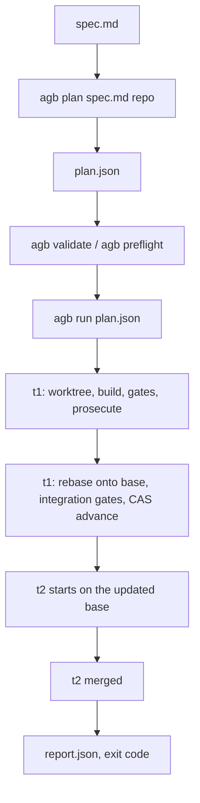

import { Step, Steps } from 'fumadocs-ui/components/steps';

This guide takes one spec through the whole `agb` lifecycle. The example target is a small CLI called `do-better`; substitute your own repository and spec file. Every behavior described here is linked to the v1.0.0 source.



## The example spec

The spec asks for a CLI foundation and one `scan` command. A sensible decomposition is two tickets:

1. **`T1` (foundation):** the command dispatcher `bin/dobetter.mjs` and `lib/dirs.mjs`, which creates the `.dobetter/` directories. Everything else builds on it, so it lands first.
2. **`T2` (scan):** `lib/scan.mjs`, which inventories the target codebase and writes `.dobetter/comprehension/codemap.md`. It depends on `T1`.

<Steps>
<Step>

### Compile the plan from the spec

The primary path is to let `agb` compile the plan. `agb plan` takes an Antigravity brain id **or** a local `spec.md`, plus the target repo, and writes `plan.json` (plan usage: [C27](https://github.com/voodootikigod/antigravity-booster/blob/v1.0.0/bin/agb.mjs#L185-L198)):

```bash
agb plan spec.md /abs/path/to/do-better
# options: --out plan.json  --force  --no-coldstart  --no-parallax  --no-premortem
```

The compiler runs the plan-boundary gates (see [Plan boundary](/docs/concepts/plan-boundary)). If any finding is blocking, nothing is written and the command exits `2`; the fix surface is the spec, not the JSON ([blocking path](https://github.com/voodootikigod/antigravity-booster/blob/v1.0.0/bin/agb.mjs#L222-L232)). Premortem risks are printed as advisory. An existing `plan.json` is only overwritten with `--force` ([overwrite guard](https://github.com/voodootikigod/antigravity-booster/blob/v1.0.0/bin/agb.mjs#L199-L203)).

</Step>
<Step>

### Read (or hand-write) plan.json

The compiled plan for the example looks like this. You can also write it by hand; see [Writing plans](/docs/guides/writing-plans).

```json
{
  "repo": "/abs/path/to/do-better",
  "base": "main",
  "gate": { "build": "npm run build-check", "test": "npm test" },
  "tickets": [
    {
      "id": "T1",
      "title": "CLI entry point and directory layout foundation",
      "body": "Create bin/dobetter.mjs dispatching scan, charter, audit. Create lib/dirs.mjs that idempotently creates .dobetter/comprehension/, .dobetter/findings/, .dobetter/backlog/. Add test/dirs.test.mjs covering directory creation.",
      "scope": ["bin/dobetter.mjs", "lib/dirs.mjs", "test/dirs.test.mjs"],
      "rails": ["package.json"],
      "edges": [{ "to": "T2" }],
      "tier": "mid",
      "pool_hint": "auto"
    },
    {
      "id": "T2",
      "title": "Implement the scan command",
      "body": "Implement lib/scan.mjs: inspect file sizes and types, ask the model for a summary, write .dobetter/comprehension/codemap.md using lib/dirs.mjs. Add test/scan.test.mjs.",
      "scope": ["lib/scan.mjs", "test/scan.test.mjs"],
      "rails": ["bin/dobetter.mjs", "lib/dirs.mjs", "package.json"],
      "tier": "cheap",
      "pool_hint": "gemini"
    }
  ]
}
```

- **Disjoint scopes.** `T2` lists `T1`'s files as **rails** (read-only), not scope, so it cannot rewrite the foundation.
- **Edges point forward.** `T1`'s edge `{ "to": "T2" }` makes `T1` a predecessor of `T2` ([edge semantics](https://github.com/voodootikigod/antigravity-booster/blob/v1.0.0/lib/scheduler.mjs#L1425-L1426)).
- **Gate commands** must match `npm test` or `npm run <script>` ([gate regex](https://github.com/voodootikigod/antigravity-booster/blob/v1.0.0/lib/plan.mjs#L248-L258)).

</Step>
<Step>

### Validate and preflight

```bash
agb validate plan.json     # schema, ids, edges, tier/pool routability; exit 2 if invalid
agb preflight plan.json    # scope overlap + per-ticket coldstart; refreshes quota telemetry
```

`validate` runs no models ([validate](https://github.com/voodootikigod/antigravity-booster/blob/v1.0.0/bin/agb.mjs#L286-L292)). `preflight` refreshes quota telemetry and runs coldstart unless you pass `--no-coldstart`, which skips both ([preflight](https://github.com/voodootikigod/antigravity-booster/blob/v1.0.0/bin/agb.mjs#L165-L184)).

</Step>
<Step>

### Run it

```bash
agb run plan.json
```

Before touching anything, `run` requires the repo to be on the plan's `base` branch and to have a clean tree ([base check](https://github.com/voodootikigod/antigravity-booster/blob/v1.0.0/lib/scheduler.mjs#L1342-L1349), [clean-tree guard](https://github.com/voodootikigod/antigravity-booster/blob/v1.0.0/lib/scheduler.mjs#L1383-L1393)). It then takes the run lock and writes `.booster/run.json` for [status](/docs/reference/cli/status) and the [sidecar dashboard](/docs/guides/sidecar-dashboard).

</Step>
</Steps>

## What happens to T1

1. **Worktree.** `agb` creates `.worktrees/agb-t1` on branch `agb/t1`: both names use the **lowercased** ticket id (worktree and branch names: [C5](https://github.com/voodootikigod/antigravity-booster/blob/v1.0.0/lib/worktrees.mjs#L119-L120)).
2. **Build.** A builder model is picked from the tier's candidate list (for `mid`: `gemini-3.8-flash-high`, `gemini-3.7-flash-medium`, `gemini-3.7-flash-high`, `gemini-3.6-flash-high`, `gemini-3.1-pro-low`), filtered by `pool_hint` and routed to the least-loaded pool (tier candidates: [C27](https://github.com/voodootikigod/antigravity-booster/blob/v1.0.0/lib/pools.mjs#L80-L100)). The builder ends with `TICKET-DONE` or `TICKET-BLOCKED: <reason>` ([charter](https://github.com/voodootikigod/antigravity-booster/blob/v1.0.0/lib/charters.mjs#L50-L51)).
3. **Gates.** `npm run build-check` and `npm test` run inside the worktree, sandboxed (see [Gates and sandboxing](/docs/concepts/gates-and-sandboxing)).
4. **Prosecution.** The diff goes to a prosecutor from a different model family: a Gemini builder is prosecuted by `gpt-oss-120b-medium` (falling back to `claude-sonnet-4-6`) ([prosecutor choice](https://github.com/voodootikigod/antigravity-booster/blob/v1.0.0/lib/pools.mjs#L1799-L1812)). By default one clean pass is required; `prosecution.dryPasses` raises that ([dry passes](https://github.com/voodootikigod/antigravity-booster/blob/v1.0.0/lib/scheduler.mjs#L1962-L1970)).
5. **Strikes.** A failed gate, a blocking prosecution or a blocked agent consumes a strike. Each ticket gets two; after the second the ticket fails ([two-strike rule](https://github.com/voodootikigod/antigravity-booster/blob/v1.0.0/lib/scheduler.mjs#L8-L11)).
6. **Merge.** Merges are **sequential and rebase-first** (lifecycle: [C27](https://github.com/voodootikigod/antigravity-booster/blob/v1.0.0/lib/scheduler.mjs#L3-L6)). The ticket branch is rebased onto the current base; a conflict fails the ticket and quarantines the candidate under `refs/quarantine/` ([rebase](https://github.com/voodootikigod/antigravity-booster/blob/v1.0.0/lib/scheduler.mjs#L2131-L2144)). The rebased commit is checked out in a throwaway integration worktree `.worktrees/agb-integration-<token8>` (integration worktree: [C5](https://github.com/voodootikigod/antigravity-booster/blob/v1.0.0/lib/worktrees.mjs#L277-L281)), the post-merge gates run there, and only then does the base ref advance with a compare-and-swap `update-ref` ([CAS advance](https://github.com/voodootikigod/antigravity-booster/blob/v1.0.0/lib/scheduler.mjs#L2283-L2285)). Your checkout is never used as the merge workspace.

<Callout type="info">There is no automatic rollback of your working tree. If integration gates fail, the base ref is simply not advanced and the candidate is quarantined. See [Run lifecycle](/docs/internals/run-lifecycle).</Callout>

## T2 and beyond

Dispatch is event-driven: `T2` becomes ready the moment all its predecessors have merged, with no wave barriers ([ready check](https://github.com/voodootikigod/antigravity-booster/blob/v1.0.0/lib/scheduler.mjs#L1464-L1468)). It gets `.worktrees/agb-t2` on `agb/t2`, branched from the updated base that already contains `T1`. With `tier: cheap` and `pool_hint: gemini` its builder is one of `gemini-3.8-flash-low`, `gemini-3.8-flash-medium`, `gemini-3.7-flash-low`, `gemini-3.6-flash-low`, `gemini-3.6-flash-medium`. If `T1` had failed, `T2` would be failed through as `blocked by failed predecessor` ([blocked](https://github.com/voodootikigod/antigravity-booster/blob/v1.0.0/lib/scheduler.mjs#L2382-L2389)).

## The report

When the run ends, `agb run` prints the report as JSON and writes it to `.booster/report.json` ([report shape](https://github.com/voodootikigod/antigravity-booster/blob/v1.0.0/lib/scheduler.mjs#L2418-L2428), [report.json](https://github.com/voodootikigod/antigravity-booster/blob/v1.0.0/lib/status.mjs#L117-L120)):

```json
{
  "runId": "run-mfx3k2a1",
  "merged": ["T1", "T2"],
  "failed": {},
  "requests": { "gemini-flash": 4, "gemini-pro": 0, "claude": 0, "gpt-oss": 2 },
  "enforcementAvailable": true,
  "enforcementReason": null,
  "compromised": null
}
```

| Key | Meaning |
| --- | --- |
| `runId` | `run-<base36 timestamp>`; also the log directory under `.booster/logs/` ([runId](https://github.com/voodootikigod/antigravity-booster/blob/v1.0.0/lib/scheduler.mjs#L1395-L1399)) |
| `merged` | Ticket ids that reached the base branch |
| `failed` | Map of ticket id to failure reason |
| `requests` | Request counts per pool (`gemini-flash`, `gemini-pro`, `claude`, `gpt-oss`) ([pools](https://github.com/voodootikigod/antigravity-booster/blob/v1.0.0/lib/agy.mjs#L90-L105)) |
| `enforcementAvailable` / `enforcementReason` | Whether live in-session rail enforcement was active, and why not |
| `compromised` | `null`, or the reason the run's integrity check failed |

The exit code is `0` when `failed` is empty and `2` otherwise; an invalid plan exits `1` (exit: [C27](https://github.com/voodootikigod/antigravity-booster/blob/v1.0.0/bin/agb.mjs#L124-L132)). See [Exit and error codes](/docs/reference/exit-and-error-codes).
