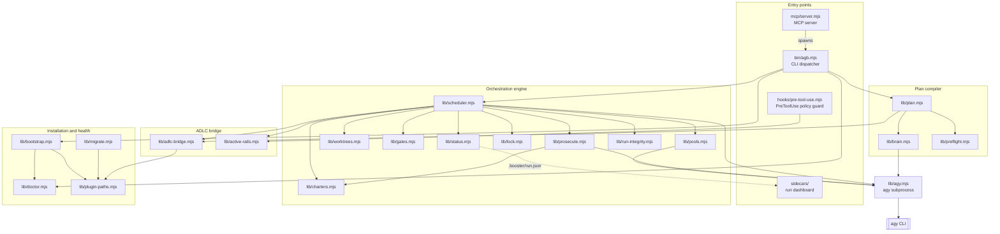

agb is a Node.js ESM codebase with no runtime dependencies in the installed plugin: every entry point is shipped as a self-contained bundle (see [Build and bundle](/docs/internals/build-and-bundle)). It drives Google Antigravity's `agy` CLI as a subprocess and enforces the ADLC through the `adlc` toolkit and the `adlc-antigravity` companion plugin.

## Layers

The diagram groups modules by role and is drawn from their actual `import` statements at v1.0.0. Arrows point from a module to what it uses.

### Entry points

- **`bin/agb.mjs`** parses arguments against a static `COMMANDS` table and dispatches to the library ([bin/agb.mjs](https://github.com/voodootikigod/antigravity-booster/blob/v1.0.0/bin/agb.mjs#L16)). Every subcommand is documented in the [CLI reference](/docs/reference/cli).
- **`mcp/server.mjs`** is a stdio JSON-RPC server. It imports no `lib/` code; each tool call spawns the agb CLI, resolving `dist/agb.mjs` next to itself when bundled and `bin/agb.mjs` in a source checkout ([mcp/server.mjs](https://github.com/voodootikigod/antigravity-booster/blob/v1.0.0/mcp/server.mjs#L13-L19)). See [MCP tools](/docs/reference/mcp-tools).
- **`hooks/pre-tool-use.mjs`** is the in-session guard agy calls before every tool use. It depends only on `hooks/policy/*` and `lib/active-rails.mjs`. See [Policy guard](/docs/internals/policy-guard).
- **`sidecars/`** is the optional local dashboard. It imports no `lib/` code and reads run state from disk. See [Sidecar dashboard](/docs/guides/sidecar-dashboard).

### Plan compiler

`lib/plan.mjs` compiles an Antigravity brain plan (read by `lib/brain.mjs`) or a spec file into a validated, gated `plan.json`. `lib/preflight.mjs` supplies the deterministic scope-overlap forecast and the coldstart model gate. See [Plan compiler](/docs/internals/plan-compiler).

### Orchestration engine

`lib/scheduler.mjs` (`runPlan`) runs the ticket DAG. It routes each ticket through the quota pools (`lib/pools.mjs`, class `PoolSet`), creates worktrees and runs integration transactions (`lib/worktrees.mjs`), runs sandboxed gates (`lib/gates.mjs`), prosecutes with a different model family (`lib/prosecute.mjs`, prompts from `lib/charters.mjs`), serializes runs per repository (`lib/lock.mjs`), writes `.booster/run.json` (`lib/status.mjs`) and checks that workers did not tamper with anything outside their worktree (`lib/run-integrity.mjs`) ([lib/scheduler.mjs](https://github.com/voodootikigod/antigravity-booster/blob/v1.0.0/lib/scheduler.mjs#L25-L40)). See [Run lifecycle](/docs/internals/run-lifecycle) and [Integration journal](/docs/internals/integration-journal).

`lib/lock.mjs` and `lib/gates.mjs` are this repository's own frozen rails: merge-lock correctness and sandbox enforcement.

### ADLC bridge

`lib/adlc-bridge.mjs` is the only place agb talks to the ADLC toolkit. It resolves and authenticates the `adlc` binary (the pinned vendored copy when bundled), projects plans into the ticket store, and reads the companion plugin's contract. Calls to `adlc` tools return `{ ok: false, error }` instead of throwing: audit gates such as `gate-manifest` degrade, while enforcement gates such as `rails-guard` are failed closed by their callers. `lib/active-rails.mjs` is the fail-closed reader of active rails, shared by the scheduler and the policy guard ([lib/active-rails.mjs](https://github.com/voodootikigod/antigravity-booster/blob/v1.0.0/lib/active-rails.mjs#L1-L4)).

### Installation and health

`lib/bootstrap.mjs` (`agb bootstrap`), `lib/doctor.mjs` (`agb doctor`), `lib/plugin-paths.mjs` (plugin root, safe `agy plugin install`, vendored tarball, terminal shim) and `lib/migrate.mjs` with `lib/migration-lock.mjs` (`agb migrate`). See [Plugin and migration](/docs/internals/plugin-and-migration).

### The agy boundary

`lib/agy.mjs` is the only module that spawns `agy`. It isolates runs with `--project`, parses `stream-json` output under hard-coded size caps, and enforces timeouts. Builders, prosecutors, plan conversion and quota telemetry all go through it. See [agy integration](/docs/reference/agy-integration).

## Where state lives

| Location | Owner | Contents |
|---|---|---|
| `<repo>/.worktrees/agb-*` | `lib/worktrees.mjs` | Ticket and integration worktrees |
| `<repo>/.booster/` | `lib/lock.mjs`, `lib/status.mjs` | Run lock, `run.json`, logs |
| `<repo>/.adlc/` | ADLC toolkit, `lib/adlc-bridge.mjs`, `lib/worktrees.mjs` | Ticket store, manifest, integration journal |
| `~/.gemini/config/plugins/` | `agy plugin install` | The `antigravity-booster` and `adlc-antigravity` plugins |
| `~/.gemini/antigravity-cli/plugin_data/antigravity-booster/` | `lib/migrate.mjs`, `bin/hook-runner.sh` | Migration state and snapshots, hook logs |

The full list is in [File layout](/docs/reference/file-layout). Every exported symbol, module by module, is in the generated [Module map](/docs/internals/module-map).
