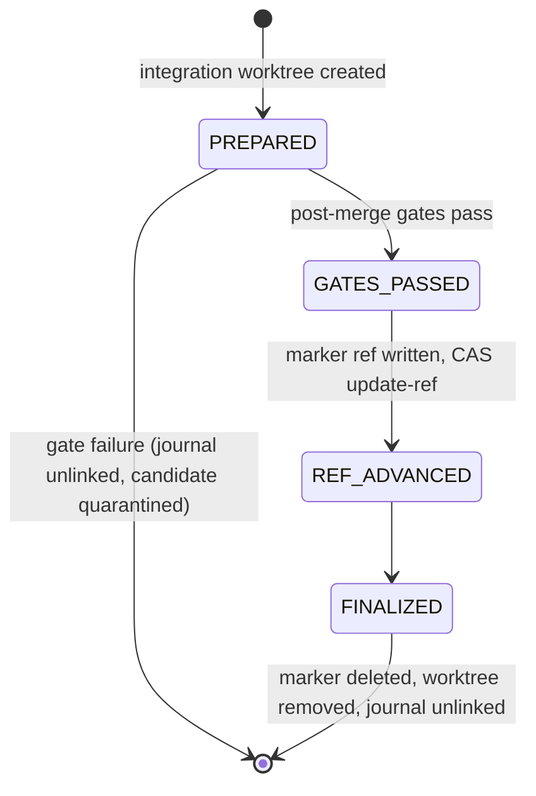

import { Step, Steps } from 'fumadocs-ui/components/steps';
import { TypeTable } from 'fumadocs-ui/components/type-table';

When `agb run` integrates a ticket, the base branch moves in a single compare-and-swap. The process can still die between "gates passed" and "branch advanced", or between "branch advanced" and "cleanup done". The **integration journal** records which of those points the transaction reached, so the next `agb run` can finish the job or roll it back instead of guessing.

## The file

The journal is a single JSON document at **`.adlc/integration_journal.json`** in the target repository ([C25](https://github.com/voodootikigod/antigravity-booster/blob/v1.0.0/lib/worktrees.mjs#L388)). Only one integration runs at a time (the scheduler holds the per-repo run lock and serializes merges through an in-process merge lock), so there is never more than one active journal. It is not an append-only log: each phase transition replaces the whole file.

Its shape is set where the scheduler builds it ([lib/scheduler.mjs](https://github.com/voodootikigod/antigravity-booster/blob/v1.0.0/lib/scheduler.mjs#L2189-L2196)):

<TypeTable
  type={{
    ticketId: { type: 'string', description: 'The ticket being integrated.' },
    transactionToken: { type: 'string', description: 'A random UUID for this integration attempt. Names the transaction marker ref and the integration worktree.' },
    preMergeSha: { type: 'string', description: 'The base branch tip before integration (the CAS "expected old value").' },
    candidateSha: { type: 'string', description: 'The ticket branch rebased onto preMergeSha (the CAS "new value").' },
    phase: { type: "'PREPARED' | 'GATES_PASSED' | 'REF_ADVANCED' | 'FINALIZED'", description: 'How far the transaction got.' },
    timestamp: { type: 'number', description: 'Date.now() at the last phase write.' },
  }}
/>

A journal missing `phase`, `ticketId` or `transactionToken`, an empty file, invalid JSON, or a symlink in place of the file is treated as **corrupted** ([lib/worktrees.mjs](https://github.com/voodootikigod/antigravity-booster/blob/v1.0.0/lib/worktrees.mjs#L449-L472)).

For the rest of the `.booster/` and `.adlc/` layout (the run lock directory, `run.json`, leases, the ticket store) see [File layout](/docs/reference/file-layout).

## Phases

The phase set is the `JOURNAL_PHASES` constant ([lib/worktrees.mjs](https://github.com/voodootikigod/antigravity-booster/blob/v1.0.0/lib/worktrees.mjs#L268-L273)). The spec's stale-claim table abbreviates it as `PREPARED` … `GATES_PASSED`; at v1.0.0 there are four phases:

| Phase | Written when | Base branch at this point |
|---|---|---|
| `PREPARED` | The integration worktree exists and holds the rebased candidate; post-merge gates have not run yet. | Unchanged (`preMergeSha`) |
| `GATES_PASSED` | Baseline-regression and candidate gates passed (and hollow-test, when tests changed). | Unchanged |
| `REF_ADVANCED` | Immediately after the CAS `update-ref` succeeded. | `candidateSha` |
| `FINALIZED` | Written right after `REF_ADVANCED`, before cleanup. | `candidateSha` |

Between `GATES_PASSED` and the CAS, the scheduler writes a durable **transaction marker** ref, `refs/transactions/<ticketId>/<transactionToken>`, pointing at the candidate ([lib/scheduler.mjs](https://github.com/voodootikigod/antigravity-booster/blob/v1.0.0/lib/scheduler.mjs#L2280-L2285)). The marker is the proof recovery uses before it will move the base branch on its own.

## Crash-atomic writes

Every phase write goes through `writeIntegrationJournal` ([lib/worktrees.mjs](https://github.com/voodootikigod/antigravity-booster/blob/v1.0.0/lib/worktrees.mjs#L374-L443)):

<Steps>
<Step>
Refuse to write if `.adlc` or the journal file is a symlink, or `.adlc` escapes the repository.
</Step>
<Step>
Open a uniquely named temp file in `.adlc/` with exclusive create (`wx`) and mode `0600`.
</Step>
<Step>
Write the full payload in a loop, then `fsync` the file.
</Step>
<Step>
Read the temp file back and parse it as JSON; a parse failure deletes the temp file and throws.
</Step>
<Step>
`rename` it over `.adlc/integration_journal.json` (atomic on one filesystem), then `fsync` the parent directory on POSIX.
</Step>
</Steps>

A reader therefore sees either the previous complete journal or the new complete journal, never a torn one.

## Recovery on restart

Before dispatching any ticket, `runPlan` calls `reconcileIntegrationJournal(repo, base)` and then reaps leftover `.worktrees/agb-integration-*` directories ([lib/scheduler.mjs](https://github.com/voodootikigod/antigravity-booster/blob/v1.0.0/lib/scheduler.mjs#L1415-L1416)). Reconciliation compares the journal against the current base tip ([lib/scheduler.mjs](https://github.com/voodootikigod/antigravity-booster/blob/v1.0.0/lib/scheduler.mjs#L1063-L1280)):

| Journal state | What recovery does |
|---|---|
| No journal, no marker ref | Nothing to do; reaps integration worktrees. |
| No journal, orphan `refs/transactions/*` marker | If the base already equals the marker, the marker is deleted (the merge landed). Otherwise the candidate is kept at `refs/quarantine/agb-<id>-failed-crash` and the marker deleted. |
| Corrupted journal | Renamed to `.adlc/integration_journal_corrupt_<ms>.json`; any marker is then handled like the orphan case above. |
| `PREPARED` | If the base moved away from `preMergeSha`, the journal is quarantined as `journal_conflict_<ms>.json` and the run stops with `external_ref_divergence`. Otherwise this is a clean rollback: the candidate goes to `refs/quarantine/agb-<id>-failed-crash`, the journal is removed. |
| `GATES_PASSED` | Moves forward only with proof: the marker must exist and equal `candidateSha`, and `candidateSha` must descend from `preMergeSha`. If the base is still at `preMergeSha` it runs the same CAS `update-ref` and finalizes; if it already equals the candidate it just finalizes. Anything else quarantines the journal and stops for an operator. |
| `REF_ADVANCED` | Checks ancestry again. If the base equals the candidate it finalizes; if it is still at `preMergeSha` it re-runs the CAS. Any other base tip is an `unexpected_base_ref_mutation` and stops the run. |
| `FINALIZED` | Only cleanup remains: delete the marker, unlink the journal, reap worktrees. |
| Unknown phase | Quarantined; the run stops with `unsupported_journal_phase`. |

<Callout type="info" title="Recovery never guesses">
Every branch that cannot prove what happened quarantines the journal (renaming it, never deleting it) and throws an error with a `kind`, so `agb run` refuses to start until an operator looks. A quarantined candidate stays reachable under `refs/quarantine/` and can be inspected with `git log refs/quarantine/agb-<id>-failed-crash`.
</Callout>

See [Run lifecycle](/docs/internals/run-lifecycle) for where these writes happen within a whole ticket.
