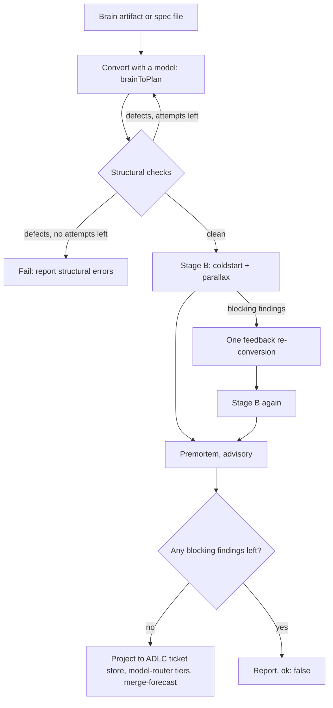

import { Step, Steps } from 'fumadocs-ui/components/steps';

`agb plan <brain-id-or-prefix | spec.md> <repo-path>` runs `compilePlan` in `lib/plan.mjs`. The design rule is in the module header: planning happens in Antigravity (plan mode or an `agy` planning conversation), and agb **compiles** that plan. It does not write or extend it ([lib/plan.mjs](https://github.com/voodootikigod/antigravity-booster/blob/v1.0.0/lib/plan.mjs#L1-L21)).

```text
implementation_plan.md ──convert──▶ ticket DAG ──gates──▶ plan.json
```

When a gate finds a problem, the fix belongs in the brain plan in Antigravity, not in the compiled JSON. See [The plan boundary](/docs/concepts/plan-boundary) for why.

## Pipeline



<Steps>
<Step>
### Read the source

`readBrain` takes either a brain id or id prefix from the Antigravity brain directory (`AGB_BRAIN_DIR` overrides the default), or a local file path ending in `.md`, `.json`, `.csv`, `.pdf` or `.txt` ([lib/brain.mjs](https://github.com/voodootikigod/antigravity-booster/blob/v1.0.0/lib/brain.mjs#L56-L70)). With no argument it uses the active session.
</Step>

<Step>
### Convert

`brainToPlan` asks a model to turn the plan into tickets. The compiler then overwrites `plan.repo` and `plan.source` itself, so the model's copies of the target repository and provenance are never trusted ([lib/plan.mjs](https://github.com/voodootikigod/antigravity-booster/blob/v1.0.0/lib/plan.mjs#L609-L628)).
</Step>

<Step>
### Stage A: the structural loop

Each conversion is checked by `validatePlan` plus the scope-overlap forecast. These checks cost nothing and need no model, so every defect is fed back into a new conversion, up to `maxAttempts` (default 3) ([lib/plan.mjs](https://github.com/voodootikigod/antigravity-booster/blob/v1.0.0/lib/plan.mjs#L630-L640)). If defects remain, compilation fails with those defects as `blocking`.
</Step>

<Step>
### Stage B: model gates, at most two passes

`coldstart` asks a model with no project context whether each ticket can be executed from its text alone. `parallax` has several readers interpret each edge's contract and a judge flag divergent readings. Both run in parallel. Blocking findings get **one** feedback re-conversion and a second gate pass ([lib/plan.mjs](https://github.com/voodootikigod/antigravity-booster/blob/v1.0.0/lib/plan.mjs#L642-L668)). `--no-coldstart` and `--no-parallax` turn them off.
</Step>

<Step>
### Premortem

`premortemPlan` stress-tests the plan that survived. It is advisory: it adds findings to the report but never blocks ([lib/plan.mjs](https://github.com/voodootikigod/antigravity-booster/blob/v1.0.0/lib/plan.mjs#L670-L671)). `--no-premortem` skips it.
</Step>

<Step>
### Project, route and forecast

Only a plan with no blocking findings is published. The compiler writes it into the repository's ADLC ticket store (the `.adlc/tickets/` directory store, or legacy `.adlc/tickets.json` if that is the backend in use) so the `adlc-antigravity` rails-guard hook and the `adlc` CLI see the same active tickets. It then cross-checks tiers with `adlc model-router` and annotates `plan.concurrencyCap` with `adlc merge-forecast` ([lib/plan.mjs](https://github.com/voodootikigod/antigravity-booster/blob/v1.0.0/lib/plan.mjs#L682-L712)). All three steps are best-effort: if `adlc` is missing or a write fails, a warning is logged and the compile still succeeds. `plan.json`, written by the CLI, stays the execution artifact; the ticket store is a generated view of it.
</Step>
</Steps>

## What `validatePlan` checks

`validatePlan` is also how the CLI loads an existing `plan.json` (for example in `agb run`) before executing anything ([bin/agb.mjs](https://github.com/voodootikigod/antigravity-booster/blob/v1.0.0/bin/agb.mjs#L113-L118), [lib/plan.mjs](https://github.com/voodootikigod/antigravity-booster/blob/v1.0.0/lib/plan.mjs#L242-L334)).

| Area | Rule |
|---|---|
| Plan | `repo` is required. `adlcBin` is rejected: the runtime resolves and authenticates the ADLC binary itself. |
| Gates | At least one of `gate.build` / `gate.test`. With strict gates on, each must match `^npm (test\|run [a-zA-Z0-9_:-]+)$`. Strict gates are always on when loading a plan file; during `agb plan`, `AGB_STRICT_GATES=0` turns them off. |
| Tickets | Non-empty list; each passes `@adlc/core`'s `validateTicket`. |
| Ids | Unique, match `^[A-Za-z0-9][A-Za-z0-9_.-]*$`, and no two ids may lowercase to the same worktree name ([lib/plan.mjs](https://github.com/voodootikigod/antigravity-booster/blob/v1.0.0/lib/plan.mjs#L265-L276)). |
| Body | A full, self-contained `body` is required. |
| Scope and rails | `scope` is a non-empty array. Every scope and rail entry must be a safe relative pathspec: no absolute paths, `.`/`..` segments, empty segments, or bare `*`/`**` ([lib/plan.mjs](https://github.com/voodootikigod/antigravity-booster/blob/v1.0.0/lib/plan.mjs#L93-L112)). A trailing `/` is normalized to `/**`. |
| Routing | `tier` is `cheap`, `mid` or `frontier`; `pool_hint` is `gemini`, `claude`, `claude-gpt`, `gpt-oss` or `auto`; the pair must have at least one model candidate. |
| Edges | Each edge has a `to` that names a known ticket, no self-edges, and the graph has no cycle ([lib/plan.mjs](https://github.com/voodootikigod/antigravity-booster/blob/v1.0.0/lib/plan.mjs#L326-L332)). |

## The scope-overlap gate

Two tickets that can run at the same time must not touch the same files. `forecastOverlaps` computes the transitive closure of the edge DAG; a pair where one ticket reaches the other is serialized and can never collide, even without a direct edge. Every other pair whose scopes overlap becomes a structural error that asks the converter to repartition the files or add an edge ([lib/preflight.mjs](https://github.com/voodootikigod/antigravity-booster/blob/v1.0.0/lib/preflight.mjs#L97-L124)).

## Result

`compilePlan` returns `{ ok, plan, brain, report }`. `report` holds `attempts`, `gatePasses`, `structuralErrors`, coldstart `gaps`, `parallax` results, the `premortem` and the final `blocking` list ([lib/plan.mjs](https://github.com/voodootikigod/antigravity-booster/blob/v1.0.0/lib/plan.mjs#L575-L580)). It throws only for programmer or environment errors such as a missing repository, a brain that cannot be found, or unavailable quota telemetry.

For the fields of the compiled file see [Plan schema](/docs/reference/plan-schema); for writing plans that compile cleanly see [Writing plans](/docs/guides/writing-plans).
