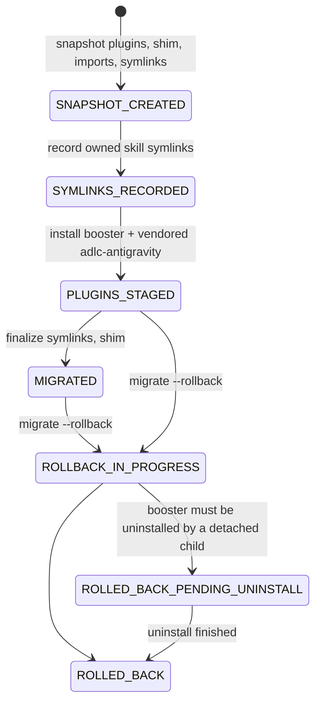

import { Tab, Tabs } from 'fumadocs-ui/components/tabs';

agb ships as a native `agy` plugin named `antigravity-booster`, installed under `~/.gemini/config/plugins/`. It depends on a second plugin, `adlc-antigravity` (npm package `@adlc/antigravity`), which carries the ADLC doctrine skills, the prosecutor agent and the rails-guard hook. This page covers how both are located, verified and installed, and how `agb migrate` moves an older npm-global install onto the plugin.

The design is specified in [.adlc/specs/native-plugin-installation.md](https://github.com/voodootikigod/antigravity-booster/blob/main/.adlc/specs/native-plugin-installation.md); the earlier draft lives at [docs/specs/native-plugin-installation.md](https://github.com/voodootikigod/antigravity-booster/blob/main/docs/specs/native-plugin-installation.md).

## Finding the booster plugin root

`resolvePluginRoot` walks up from its own file until it finds a `plugin.json` whose `name` is `antigravity-booster` (or starts with `antigravity-booster-`). `PLUGIN_ROOT` is honored only if it resolves to that same directory, so tooling such as direnv cannot point agb at different assets. If no root is found it throws, because a missing root means a broken installation ([lib/plugin-paths.mjs](https://github.com/voodootikigod/antigravity-booster/blob/v1.0.0/lib/plugin-paths.mjs#L51-L76)).

## Bundled mode

The plugin runs esbuild bundles (see [Build and bundle](/docs/internals/build-and-bundle)) built with `--define:__AGB_BUNDLED__=true`. Source runs (`npm test`, local development) see the identifier as undefined. The switch is a single constant ([lib/adlc-bridge.mjs](https://github.com/voodootikigod/antigravity-booster/blob/v1.0.0/lib/adlc-bridge.mjs#L342)):

```js
export const IS_BUNDLED = typeof __AGB_BUNDLED__ !== 'undefined' && __AGB_BUNDLED__ === true;
```

When it is true, developer overrides are ignored, so a repository's `.envrc` cannot redirect a user's install:

| Override | Effect when unbundled | Bundled |
|---|---|---|
| `AGB_PLUGIN_DIR` | Where the installed `adlc-antigravity` manifest is read from (the contract handshake) | Ignored; always `~/.gemini/config/plugins/adlc-antigravity` ([lib/adlc-bridge.mjs](https://github.com/voodootikigod/antigravity-booster/blob/v1.0.0/lib/adlc-bridge.mjs#L61-L65)) |
| `ADLC_CLI_PATH` / `AGB_ADLC_BIN` with `AGB_ALLOW_CUSTOM_ADLC_CLI=1` | A custom `adlc` binary, ahead of the vendored one | Ignored; only the digest-pinned vendored `adlc` under `vendor/adlc/` is used ([lib/adlc-bridge.mjs](https://github.com/voodootikigod/antigravity-booster/blob/v1.0.0/lib/adlc-bridge.mjs#L839-L855)) |
| `ADLC_ANTIGRAVITY_PLUGIN_PATH` with `AGB_DEV_ALLOW_UNVERIFIED_PLUGIN=1` | `agb bootstrap` installs the companion plugin from that directory, unverified | Ignored ([lib/bootstrap.mjs](https://github.com/voodootikigod/antigravity-booster/blob/v1.0.0/lib/bootstrap.mjs#L244-L251)) |

The MCP server has its own copy of the same check to choose between the bundled `dist/agb.mjs` and `bin/agb.mjs` ([mcp/server.mjs](https://github.com/voodootikigod/antigravity-booster/blob/v1.0.0/mcp/server.mjs#L17-L19)). Every bundled-mode guard on an environment variable is listed in [Environment variables](/docs/reference/environment).

## Resolving the companion plugin source (unbundled)

In source runs, `resolvePluginPath` picks the `adlc-antigravity` source directory in this order ([lib/bootstrap.mjs](https://github.com/voodootikigod/antigravity-booster/blob/v1.0.0/lib/bootstrap.mjs#L59-L81)):

1. `ADLC_ANTIGRAVITY_PLUGIN_PATH`, if set.
2. `@adlc/antigravity` in `node_modules`, found with `require.resolve('@adlc/antigravity/package.json')` (the package has no `main`/`exports`, so the `package.json` subpath is what resolves).
3. The sibling checkout `../adlc/plugins/adlc-antigravity`.

## Vendored tarball pinning

The plugin must work from a git-URL install with no `npm install`, so the repository commits the **pristine npm release tarball** of `@adlc/antigravity` at `vendor/cache/adlc-antigravity-<version>.tgz`. Its version and SHA-512 are constants ([lib/plugin-paths.mjs](https://github.com/voodootikigod/antigravity-booster/blob/v1.0.0/lib/plugin-paths.mjs#L23-L27)). The pin is checked three ways:

- **At install time:** `installPluginTarball` refuses a tarball whose SHA-512 does not match (`vendored-adlc-antigravity-tampered`), validates the archive's entries, extracts it into a temp directory and installs it with `agy plugin install` ([lib/plugin-paths.mjs](https://github.com/voodootikigod/antigravity-booster/blob/v1.0.0/lib/plugin-paths.mjs#L239-L264)). The integrity value cannot be overridden by a caller.
- **In CI:** the `plugin-integrity` job runs `npm pack @adlc/antigravity@<version>` and fails unless the committed tarball is byte-identical ([.github/workflows/ci.yml](https://github.com/voodootikigod/antigravity-booster/blob/v1.0.0/.github/workflows/ci.yml#L115-L121)). The version comes from `package.json` `devDependencies`, so the lockfile integrity must agree as well.
- **After install:** the staged plugin's directory tree digest must match the pinned digest for its version (below).

## Bootstrap and doctor decision table

`agb bootstrap` and `agb doctor` share one evaluation of `~/.gemini/config/plugins/adlc-antigravity`, `evaluateStagedAdlcPlugin`, applied in order ([lib/doctor.mjs](https://github.com/voodootikigod/antigravity-booster/blob/v1.0.0/lib/doctor.mjs#L94-L150)):

| Staged plugin | Report | `doctor` exit | `bootstrap` action |
|---|---|---|---|
| No `plugin.json` | `not-installed` | 1 | install |
| Manifest unreadable, invalid, or without a semver `version` | `corrupt-manifest` | 1 | fail (leave untouched) |
| Older than the bundled version | `outdated-plugin` | 1 | install |
| Pinned version, tree digest mismatch | `corrupt-tree` | 1 | reinstall |
| Pinned version, digest matches, contract not compatible | `incompatible-contract` | 1 | reinstall |
| Pinned version, digest matches, `adlcContract` compatible | `compatible` (rails trusted) | 0 | preserve |
| Same as bundled version but no digest recorded | `corrupt-tree` | 1 | reinstall |
| Newer, unpinned, compatible contract | `compatible (newer-unpinned)` | 0 | preserve |
| Newer, unpinned, no `adlcContract` | `tolerant (unconfirmed-contract)` | 0 | preserve |
| Newer, unpinned, other contract | `incompatible-contract` | 1 | fail |

Bootstrap installs only from the vendored tarball, never rewrites files inside a staged plugin, and re-evaluates afterwards: the install counts only if it lands on a row where `doctor` exits 0 ([lib/bootstrap.mjs](https://github.com/voodootikigod/antigravity-booster/blob/v1.0.0/lib/bootstrap.mjs#L196-L242)). `--force-reinstall` always reinstalls.

## `agb migrate`

`agb migrate` moves an npm-global or checkout install onto the native plugin, and `agb migrate --rollback` restores the state from before the first migration. All state lives under `~/.gemini/antigravity-cli/plugin_data/antigravity-booster/` ([lib/migrate.mjs](https://github.com/voodootikigod/antigravity-booster/blob/v1.0.0/lib/migrate.mjs#L1-L17)):

| Path | Contents |
|---|---|
| `migration-state.json` | The single state file |
| `.migration.lock.d/` | The migration lock (`meta.json`: pid, start time, token) |
| `snapshots/<stamp>/plugins/<name>/` | Copies of both plugin trees, excluding `node_modules`, `.worktrees` and `.git` |
| `snapshots/<stamp>/shim/agb` | The previous `~/.local/bin/agb` |
| `snapshots/<stamp>/import_manifest.json` | The previous booster and adlc import entries |
| `snapshots/<stamp>/pre-migration.baseline.json` | Written once, never overwritten; every restore reads from it |

### Lock

The migration lock is separate from the repository run lock in `lib/lock.mjs`. It is an atomic `mkdir`. A holder is reclaimed only when it is positively dead (the PID is gone, or was recycled, detected by comparing process start times). A live or unverifiable holder is never stolen, and reclaiming never removes a lock directory whose token changed since it was inspected ([lib/migration-lock.mjs](https://github.com/voodootikigod/antigravity-booster/blob/v1.0.0/lib/migration-lock.mjs#L1-L14)). `agb migrate --break-lock` removes a stuck lock after a `[y/N]` prompt, or without one with `--force`.

### States



Each forward step writes the state file only after it finishes ([lib/migrate.mjs](https://github.com/voodootikigod/antigravity-booster/blob/v1.0.0/lib/migrate.mjs#L312), [L348](https://github.com/voodootikigod/antigravity-booster/blob/v1.0.0/lib/migrate.mjs#L348), [L366](https://github.com/voodootikigod/antigravity-booster/blob/v1.0.0/lib/migrate.mjs#L366)), so a crash resumes from the last completed state.

<Tabs items={['agb migrate', 'agb migrate --rollback']}>
<Tab value="agb migrate">

Runs a pre-flight validation of the booster plugin, takes the lock, then acts on the current state ([lib/migrate.mjs](https://github.com/voodootikigod/antigravity-booster/blob/v1.0.0/lib/migrate.mjs#L567-L613)):

- **none:** start from the snapshot step.
- **`SNAPSHOT_CREATED`, `SYMLINKS_RECORDED`, `PLUGINS_STAGED`:** resume from that state.
- **`MIGRATED`:** refuse unless `--force`, which re-runs from a new snapshot (the baseline is kept).
- **`ROLLBACK_IN_PROGRESS`:** refuse; finish the rollback first.
- **`ROLLED_BACK_PENDING_UNINSTALL`:** finish the uninstall if the booster plugin is still present; otherwise treat as rolled back.
- **`ROLLED_BACK`:** archive the old state file and start fresh.
- **unknown:** refuse.

A staged plugin larger than 100 MB (after exclusions) stops the snapshot step.

</Tab>
<Tab value="agb migrate --rollback">

Acts on the current state ([lib/migrate.mjs](https://github.com/voodootikigod/antigravity-booster/blob/v1.0.0/lib/migrate.mjs#L528-L565)):

- **none** or **`ROLLED_BACK`:** nothing to do.
- **`MIGRATED`:** restore from the baseline, unless the staged plugins changed since migration; then `--force-rollback` is required.
- **`SNAPSHOT_CREATED` / `SYMLINKS_RECORDED`** with nothing staged and no earlier migration: delete the snapshot and clear the state, since nothing live changed.
- **any other state:** restore from the baseline.
- **`ROLLED_BACK_PENDING_UNINSTALL`:** hand the booster uninstall to a detached child (`agb migrate --finish-uninstall`), because the running process lives inside the plugin it is removing.

</Tab>
</Tabs>

All `migrate` entry points return an exit code (0 or 1) and do not throw.
