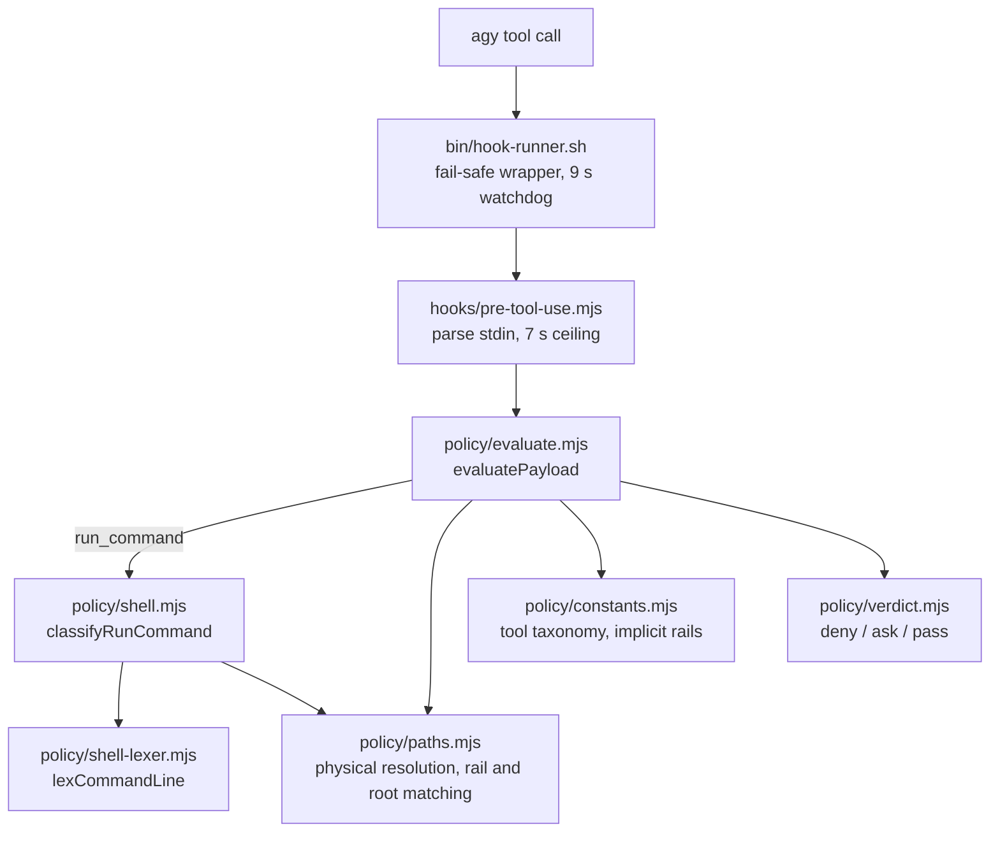

import { Step, Steps } from 'fumadocs-ui/components/steps';

The booster plugin registers one `PreToolUse` hook, `agb-policy-guard`, matching every tool (`"matcher": "*"`). It runs `bin/hook-runner.sh --timeout 9 dist/hooks/pre-tool-use.bundle.mjs` with a 15 s hook timeout ([hooks.json](https://github.com/voodootikigod/antigravity-booster/blob/v1.0.0/hooks.json#L1-L16)). Its job is to stop an agent in an interactive or headless session from editing frozen rails, the ADLC trust root, or the platform's own configuration, before the edit happens. The merge-time `adlc rails-guard` check in `agb run` and CI remains the mechanical guarantee; this hook catches problems earlier. See [Rail enforcement](/docs/concepts/rail-enforcement) for how the layers fit.

## Verdicts

The guard emits one of three outcomes ([hooks/policy/verdict.mjs](https://github.com/voodootikigod/antigravity-booster/blob/v1.0.0/hooks/policy/verdict.mjs#L1-L15)):

| Verdict | stdout | Meaning |
|---|---|---|
| `deny` | `{"decision":"deny","reason":...}` | The tool call is blocked. |
| `ask` | `{"decision":"ask","reason":...}` | agy asks the operator to confirm. |
| `pass` | empty | Neutral: agy applies its normal policy. |

It **never emits `allow`**. When a single call produces several verdicts (several paths, several subcommands), the most restrictive wins: deny over ask over pass.

## Layers

### `bin/hook-runner.sh`

agy fails open when a hook exits non-zero, so the runner always exits 0 and decides what to print itself ([bin/hook-runner.sh](https://github.com/voodootikigod/antigravity-booster/blob/v1.0.0/bin/hook-runner.sh#L1-L12)). If the child crashes, times out, or prints anything other than one well-formed `ask`/`deny` line, the runner falls back: deny in headless worker mode or for an unparseable payload; ask for shell commands and deny for other tools in an ADLC repository; otherwise its `--fallback` decision. A child that prints `allow` is treated as a failure. If the launcher cannot find Node 22.19 or later (exit 86) outside an ADLC repository, the runner passes through. `AGB_HOOK_DISABLE` in agy's launch environment bypasses the guard entirely and logs a critical notice to `~/.gemini/antigravity-cli/plugin_data/antigravity-booster/logs/hooks.log`.

### `hooks/pre-tool-use.mjs`

The entry point reads one JSON payload from stdin. Invalid JSON is denied. A valid payload goes to `evaluatePayload`, and only `deny` or `ask` is printed. An internal 7 s ceiling exits non-zero so the runner's fail-safe applies ([hooks/pre-tool-use.mjs](https://github.com/voodootikigod/antigravity-booster/blob/v1.0.0/hooks/pre-tool-use.mjs#L13-L46)).

### `policy/constants.mjs`

The closed tool taxonomy, using agy's step-type names in lowercase ([hooks/policy/constants.mjs](https://github.com/voodootikigod/antigravity-booster/blob/v1.0.0/hooks/policy/constants.mjs#L5-L34)):

- **Read-only tools** (`view_file`, `grep_search`, `list_directory`, ...) and **orchestration tools** (`invoke_subagent`, `send_message`, ...).
- **Control steps**: only `finish`, whose arguments are the model's answer and are never scanned for paths.
- **Path-mutating tools** (`write_to_file`, `replace_file_content`, `delete_file`, `move`, ...), with per-tool schemas listing which argument keys carry paths.
- The booster's own MCP tools (`agb_plan`, `agb_run`, ...).
- **Implicit rails** that apply in every ADLC repository whether or not a ticket declares them: the directories `.git`, `.adlc/ticket-archive`, `.adlc/ticket-transactions`, `.adlc/leases`, and the files `.adlc/config.json`, `.adlc/manifest.jsonl`, `.adlc/sessions.json`, `.adlc/tickets.json` ([hooks/policy/constants.mjs](https://github.com/voodootikigod/antigravity-booster/blob/v1.0.0/hooks/policy/constants.mjs#L74-L76)).

### `policy/shell-lexer.mjs`

A conservative POSIX lexer for `run_command` lines. It splits on control operators, tokenizes with POSIX quoting, records redirect targets and leading `VAR=value` assignments, and marks every construct whose effect cannot be known statically (expansions, substitutions, globs, subshells, heredocs, comments) as **dynamic**. It never evaluates anything. Unbalanced quoting makes the whole line un-lexable, which callers treat as dynamic ([hooks/policy/shell-lexer.mjs](https://github.com/voodootikigod/antigravity-booster/blob/v1.0.0/hooks/policy/shell-lexer.mjs#L1-L10)).

### `policy/paths.mjs`

Path handling shared by both classifiers: home expansion (`~`, `~user`, `$HOME`), physical resolution that follows symlinks within an evaluation budget, repository-relative paths, implicit and declared rail matching, and ticket-scope matching. It also defines the **protected roots**: `~/.gemini`, `~/.config/antigravity-booster`, `~/.local/bin/agb`, the usual Node version-manager directories, `/opt/homebrew` and `/usr/local` ([hooks/policy/paths.mjs](https://github.com/voodootikigod/antigravity-booster/blob/v1.0.0/hooks/policy/paths.mjs#L127-L150)).

## Evaluation order

`evaluatePayload` is pure apart from reading the target repositories' ticket stores ([hooks/policy/evaluate.mjs](https://github.com/voodootikigod/antigravity-booster/blob/v1.0.0/hooks/policy/evaluate.mjs#L467-L484)):

<Steps>
<Step>
A payload with no tool name is denied. `finish` passes immediately.
</Step>
<Step>
**Step 1** inspects the paths every non-shell tool names, reads included. Reading or changing booster plugin data or credentials is denied; changing a protected root is denied; an unresolvable mutation target (symlink loop, oversized path) is denied ([hooks/policy/evaluate.mjs](https://github.com/voodootikigod/antigravity-booster/blob/v1.0.0/hooks/policy/evaluate.mjs#L282-L310)).
</Step>
<Step>
Read-only and orchestration tools then pass.
</Step>
<Step>
`run_command` goes to the shell classifier (below).
</Step>
<Step>
**File tools** are the exact layer. Every target path is resolved physically. A target that contains a protected root or an ADLC repository is denied, as is any rail or implicit-rail match. New ticket shards under `.adlc/tickets/` must be valid tickets whose filename matches the id. A headless worker (`AGB_WORKER_TICKET`) may write only inside its own repository's ticket scope; a read-only worker (`AGB_WORKER_MODE`) may not write at all ([hooks/policy/evaluate.mjs](https://github.com/voodootikigod/antigravity-booster/blob/v1.0.0/hooks/policy/evaluate.mjs#L331-L386)).
</Step>
<Step>
**MCP tools**: any path-like argument that hits a rail or the trust root is denied. The booster's own tools then pass (except `agb_run` for read-only workers). Third-party MCP tools are denied for read-only and headless workers in ADLC repositories, and need operator confirmation (ask) in an active-rail ADLC repository ([hooks/policy/evaluate.mjs](https://github.com/voodootikigod/antigravity-booster/blob/v1.0.0/hooks/policy/evaluate.mjs#L388-L414)).
</Step>
<Step>
**Unknown tools** get the same rail and trust-root check on every path-like argument, in any repository. They are then denied in an ADLC repository with active frozen rails (or for any headless worker in an ADLC repository), since their effect cannot be verified ([hooks/policy/evaluate.mjs](https://github.com/voodootikigod/antigravity-booster/blob/v1.0.0/hooks/policy/evaluate.mjs#L416-L433)).
</Step>
</Steps>

## Shell classification

`policy/shell.mjs` is explicitly best-effort defense in depth. A shell cannot be parsed soundly, so it blocks the cheap, high-value spellings and fails closed when it cannot follow the shell ([hooks/policy/shell.mjs](https://github.com/voodootikigod/antigravity-booster/blob/v1.0.0/hooks/policy/shell.mjs#L1-L10)).

`classifyRunCommand` first requires a working directory: in an ADLC repository, a relative `Cwd` or one outside the declared workspace paths is denied ([hooks/policy/shell.mjs](https://github.com/voodootikigod/antigravity-booster/blob/v1.0.0/hooks/policy/shell.mjs#L490-L503)). Each subcommand is then classified, following `cd`/`pushd` where the target is static. Inline scripts (`sh -c`, `eval`) are classified recursively, up to three levels deep ([hooks/policy/shell.mjs](https://github.com/voodootikigod/antigravity-booster/blob/v1.0.0/hooks/policy/shell.mjs#L393-L443)):

| Stage | Commands | Verdict |
|---|---|---|
| Target checks | Any write, delete or redirect aimed at a rail, the trust root, a protected root, or a glob that could reach them | deny |
| Ticket lifecycle | `adlc ticket complete/archive/update/...` | deny without `--authorize`; ask with it (deny for headless workers) |
| 1 | Pure readers (`cat`, `head`, `tail`, `grep`, `ls`, `wc`) and `git status/diff/log/show/blame` with known-safe flags, with no assignments, redirects or dynamic parts | pass |
| 2 | `adlc ticket create`, and `git add` of literal ticket-shard paths | pass |
| Destructive | Repository-wide `git clean`, a hard `git reset`, `git stash -u/-a`, or `rm`/`mv` on a repository root or its parent | deny |
| Shim, `cd`, `git --output` | Invoking `agb` through the shim; a directory change; `git diff/log --output` | ask in an active-rail ADLC repository (deny for headless workers using the shim) |
| Routine | Headless worker test commands; `git add` / `git commit` without root pathspecs when not headless | pass |
| 5 | Everything else, including anything dynamic | ask in an active-rail ADLC repository; deny for headless or read-only workers in an ADLC repository; otherwise pass |

The Stage 5 rule is in `stage5` ([hooks/policy/shell.mjs](https://github.com/voodootikigod/antigravity-booster/blob/v1.0.0/hooks/policy/shell.mjs#L251-L262)).
