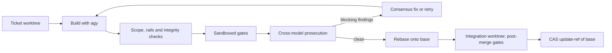

import { Step, Steps } from 'fumadocs-ui/components/steps';

`agb run` executes a compiled plan with `runPlan` in `lib/scheduler.mjs`. This page follows one ticket from dispatch to merge. The short version:

## Before any ticket runs

`runPlan` refuses a plan whose ticket DAG has a cycle, checks the `agy` binary, verifies the rails enforcement gate, snapshots run integrity, and refuses a dirty checkout unless `AGB_ALLOW_DIRTY=1` ([lib/scheduler.mjs](https://github.com/voodootikigod/antigravity-booster/blob/v1.0.0/lib/scheduler.mjs#L1289-L1392)). It then takes the per-repo run lock (`.booster/run.lock.d/`), reconciles any [integration journal](/docs/internals/integration-journal) left by a crashed run, reaps stale integration worktrees, reconciles quota leases and refreshes quota telemetry ([lib/scheduler.mjs](https://github.com/voodootikigod/antigravity-booster/blob/v1.0.0/lib/scheduler.mjs#L1412-L1420)).

With `AGB_ALLOW_DIRTY=1`, uncommitted changes in your checkout are left untouched: hard resets run only inside the ticket worktree and the integration worktree, and the base branch moves by compare-and-swap `update-ref`. Those changes are not part of the run's base, and the error and warning text says so.

## One ticket, step by step

<Steps>
<Step>
### Route and create the worktree

The ticket's `tier` and `pool_hint` pick a model from the quota pools. The scheduler creates a worktree at **`.worktrees/agb-<lowercased ticket id>`** on branch **`agb/<lowercased ticket id>`**, branched from the base ([C5](https://github.com/voodootikigod/antigravity-booster/blob/v1.0.0/lib/worktrees.mjs#L119-L121)). A leftover worktree or branch with the same name from an earlier run is removed first. Ticket ids must match `^[A-Za-z0-9][A-Za-z0-9_.-]*$`, and plan validation rejects two ids that lowercase to the same worktree.
</Step>

<Step>
### Build (up to two strikes)

Each attempt gets an isolated per-attempt Git database and a generated `AGENTS.md` describing the ticket, then the builder runs through `agy` ([lib/scheduler.mjs](https://github.com/voodootikigod/antigravity-booster/blob/v1.0.0/lib/scheduler.mjs#L1717-L1751)). A ticket has two strikes. From the second attempt on, `adlc flail-detector` can end the ticket early if the builder is repeating itself.
</Step>

<Step>
### Verify what the builder did

The host fetches the candidate commit out of the worktree (the builder never writes the main repository's refs), checks that the root repository's Git state was not tampered with, and runs the authoritative scope and anti-no-op check: every changed file must match the ticket's `scope`, and the diff must not be empty ([lib/scheduler.mjs](https://github.com/voodootikigod/antigravity-booster/blob/v1.0.0/lib/scheduler.mjs#L1884-L1904)). When the ticket declares rails, `adlc rails-guard` runs too; a rail violation uses up every strike at once. A rail or scope strike resets the ticket worktree to the base so the bad commit does not carry into the next attempt.
</Step>

<Step>
### Gates in a sandbox

The plan's `gate.build` / `gate.test` commands run inside the worktree under the platform sandbox, because the builder could have rewritten the scripts they call. Before that, `verifyGateScriptIntegrity` compares the candidate's `package.json` scripts and lifecycle hooks against the base ([lib/scheduler.mjs](https://github.com/voodootikigod/antigravity-booster/blob/v1.0.0/lib/scheduler.mjs#L1955-L1956)). See [Gates and sandboxing](/docs/concepts/gates-and-sandboxing).
</Step>

<Step>
### Prosecution until dry

A prosecutor from a different model family reviews the branch diff in a scratch directory. The ticket needs `plan.prosecution.dryPasses` consecutive clean passes (default 1) ([lib/scheduler.mjs](https://github.com/voodootikigod/antigravity-booster/blob/v1.0.0/lib/scheduler.mjs#L1964)). Blocking findings first go to `adlc consensus-fix`; a fix candidate is re-verified (scope, rails, gates, prosecution) before it is accepted. Otherwise the strike counts and the builder retries with the findings added to its prompt. See [Prosecution](/docs/concepts/prosecution).
</Step>

<Step>
### Rebase under the merge lock

Merges are serialized. Under the lock the scheduler re-verifies run integrity, checks the checkout is still on the base branch, rebases the ticket branch onto the current base tip inside the ticket worktree, and fetches the result into the repository. A rebase conflict quarantines the candidate at `refs/quarantine/agb-<id>-failed-conflict` and fails the ticket. An empty result fails the anti-no-op gate ([lib/scheduler.mjs](https://github.com/voodootikigod/antigravity-booster/blob/v1.0.0/lib/scheduler.mjs#L2110-L2171)).
</Step>

<Step>
### Post-merge gates in an integration worktree

A disposable integration worktree is created at **`.worktrees/agb-integration-<first 8 chars of the transaction token>`** ([C5](https://github.com/voodootikigod/antigravity-booster/blob/v1.0.0/lib/worktrees.mjs#L277-L281)) and set to the rebased candidate. The journal is written as `PREPARED`. Two gate passes run there, both sandboxed ([lib/scheduler.mjs](https://github.com/voodootikigod/antigravity-booster/blob/v1.0.0/lib/scheduler.mjs#L2198-L2273)):

- **Pass 1, baseline regression:** the base commit's `test/` directory is checked out over the candidate and `gate.test` runs, so a candidate cannot pass by weakening the existing tests.
- **Pass 2, candidate gates:** the candidate's own build and test. If the ticket changed files under `test/`, `adlc hollow-test` must also pass.
</Step>

<Step>
### Advance the base with compare-and-swap

The journal moves to `GATES_PASSED`, a marker ref is written, and the base branch advances with `git update-ref refs/heads/<base> <candidate> <preMergeSha>` ([C24](https://github.com/voodootikigod/antigravity-booster/blob/v1.0.0/lib/scheduler.mjs#L2283-L2285)). Git applies that only if the base still points at `preMergeSha`, so a concurrent change to the branch makes the update fail instead of being overwritten. The journal then records `REF_ADVANCED` and `FINALIZED`, and the marker, integration worktree, ticket worktree and journal are cleaned up.
</Step>

<Step>
### Sync your checkout, if it is safe

If your checkout was clean, on the base branch and at `preMergeSha` when the merge began (and still is), its files are moved forward with `git read-tree -u -m`. Otherwise agb leaves it untouched and prints a notice to run `git checkout <base> && git merge --ff-only` yourself ([lib/scheduler.mjs](https://github.com/voodootikigod/antigravity-booster/blob/v1.0.0/lib/scheduler.mjs#L2364-L2367)).
</Step>
</Steps>

## What a failure leaves behind

There is no automatic hard reset or clean of your checkout. All rollback happens through refs and disposable worktrees ([C24](https://github.com/voodootikigod/antigravity-booster/blob/v1.0.0/lib/scheduler.mjs#L2305-L2333)):

- If a post-merge gate fails before the CAS, the base branch was never touched. The candidate is kept at `refs/quarantine/agb-<id>-failed-post-merge`, the marker and `agb/<id>` branch are deleted, the journal is unlinked and the integration worktree removed.
- If something fails after the CAS succeeded, the merge stands. The error is reported as `integration_finalization_failure` with `baseRefAdvanced: true`, and the next run's journal reconciliation finishes cleanup.
- The worktree-level hard reset (`resetToBase`) runs only in the ticket worktree after a rail or scope strike ([lib/worktrees.mjs](https://github.com/voodootikigod/antigravity-booster/blob/v1.0.0/lib/worktrees.mjs#L241-L246)). It excludes `AGENTS.md`, `.adlc` and `.agb_home` from cleaning.

Tickets whose predecessors failed are marked `blocked` and never start. The run report lists `merged`, `failed` (with reasons) and whether the run was flagged `compromised` by the final integrity check ([lib/scheduler.mjs](https://github.com/voodootikigod/antigravity-booster/blob/v1.0.0/lib/scheduler.mjs#L2418-L2426)).
