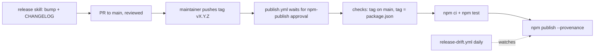

A release goes from a version bump on `main` to an npm publish with provenance. Each step is gated, and a person makes every decision.

## The release skill

[`skills/release`](https://github.com/voodootikigod/antigravity-booster/blob/v1.0.0/skills/release/SKILL.md) runs the maintainer side. It checks for a clean, up-to-date `main`, a `repository.url`, no `file:` dependencies and a passing `npm test`. Then it bumps the version with `npm version --no-git-tag-version` and moves the `[Unreleased]` changelog entries under the new version. The bump lands through a PR because `main` is protected. After the merge, the maintainer tags the merged commit and pushes the tag.

<Callout type="info">
The generic `/release` skill reads its project facts from `.claude/release-profile.md`, which is tracked in this repository even though the rest of `.claude/` is ignored. The profile names the bump sites, the preconditions (including the website generator check), the `npm-publish` environment and the registry checks that prove a publish landed.
</Callout>

## Before releasing: the readiness audit

`/release-audit` is the question asked before the mechanical cut: is the tree in a shippable state? It is a Claude Code project skill under `.claude/skills/release-audit/`, ported from adlc and reshaped for this repository. It gives every shipped surface its own read-only agent (the CLI, the scheduler, the ADLC gates, the PreToolUse policy guard, the MCP server, install and migrate, the vendored adlc, the shipped skills, the sidecar), adds suite-level agents for cross-surface drift, documentation accuracy and supply chain, shards the open issue backlog across sweep agents, and sends a refute agent after every blocker candidate.

The verdict is **GO**, **GO-WITH-RISK** or **NO-GO**, and it is computed by `scripts/release-audit-synthesize.mjs`, not summarised by a model: a finding is a blocker only when its quoted evidence appears verbatim in the cited file, its three-part blocker test is fully asserted, and the refute pass failed to break it. Anything else is demoted with the reason named, never deleted. A surface that produced no report, a report that examined no files, a red or uncaptured `npm test`, or an omitted suite log each force NO-GO.

Before any agent runs, `scripts/release-audit-collect.mjs` runs the mechanical probes this repository already owns: the plugin.json, package.json and lockfile versions agree (D11), the vendored adlc matches the digests pinned in `lib/adlc-bridge.mjs`, the cached bootstrap tarball hashes to the lockfile integrity, a fresh build leaves `dist/` and `vendor/` unchanged, the website partials are current, and the previous release is not stranded (the same classifier `release-drift.yml` runs daily). A probe that cannot run is named in the verdict, never counted as clean.

## The publish workflow

Pushing a `v*` tag is the only trigger for [`publish.yml`](https://github.com/voodootikigod/antigravity-booster/blob/v1.0.0/.github/workflows/publish.yml#L11). It has no `workflow_dispatch`, so it always runs the workflow file from the tagged commit. The job:

1. Runs in the `npm-publish` protected environment ([publish.yml#L27](https://github.com/voodootikigod/antigravity-booster/blob/v1.0.0/.github/workflows/publish.yml#L27)), which needs a reviewer to approve it.
2. Refuses a tag whose commit is not an ancestor of `origin/main` ([publish.yml#L41](https://github.com/voodootikigod/antigravity-booster/blob/v1.0.0/.github/workflows/publish.yml#L41)).
3. Refuses a tag that does not match the `package.json` version ([publish.yml#L82](https://github.com/voodootikigod/antigravity-booster/blob/v1.0.0/.github/workflows/publish.yml#L82)).
4. Upgrades to npm 11 for OIDC trusted publishing ([publish.yml#L70](https://github.com/voodootikigod/antigravity-booster/blob/v1.0.0/.github/workflows/publish.yml#L70)), then runs `npm ci` and `npm test`.
5. Publishes with `npm publish --provenance --access public` ([publish.yml#L101](https://github.com/voodootikigod/antigravity-booster/blob/v1.0.0/.github/workflows/publish.yml#L101)), using the `id-token: write` permission ([publish.yml#L16](https://github.com/voodootikigod/antigravity-booster/blob/v1.0.0/.github/workflows/publish.yml#L16)) instead of a long-lived token.

## Rulesets

[`docs/github-rulesets/`](https://github.com/voodootikigod/antigravity-booster/blob/v1.0.0/docs/github-rulesets/README.md) keeps the publish gates in version control. The `release-tag-ruleset.json` file lets only admins create, delete or move `refs/tags/v*` tags. `apply.sh` sets up the `npm-publish` environment and applies that ruleset. Branch protection for `main` is configured by hand in GitHub and is not in this directory.

## Release drift

[`release-drift.yml`](https://github.com/voodootikigod/antigravity-booster/blob/v1.0.0/.github/workflows/release-drift.yml#L21) runs once a day and on demand. It runs [`scripts/release-drift.mjs`](https://github.com/voodootikigod/antigravity-booster/blob/v1.0.0/scripts/release-drift.mjs) ([release-drift.yml#L50](https://github.com/voodootikigod/antigravity-booster/blob/v1.0.0/.github/workflows/release-drift.yml#L50)) to catch a version that reached `main` but never reached npm: either a publish waiting for an approval nobody gave, or a bump with no tag pushed. A grace window ([90 minutes](https://github.com/voodootikigod/antigravity-booster/blob/v1.0.0/scripts/release-drift.mjs#L21)) keeps a healthy release in progress from being reported.
