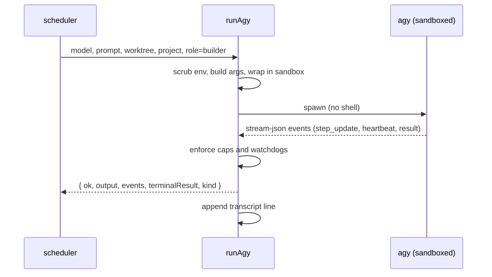

Every model call agb makes goes through one function, [`runAgy`](https://github.com/voodootikigod/antigravity-booster/blob/v1.0.0/lib/agy.mjs#L221-L245) in `lib/agy.mjs`: one call, one agy process, one structured result. It never throws on an agent failure; it returns `{ ok, output, ms, error, kind }` and lets the caller decide. agb requires agy 1.2.6 or later (`agb doctor` checks this) ([MIN_AGY_VERSION](https://github.com/voodootikigod/antigravity-booster/blob/v1.0.0/lib/doctor.mjs#L26)).

## Invocation

```text
agy --print <prompt> --print-timeout <timeout> --model <slug>
    [--output-format json|stream-json] [--json-schema <schema>]
    [--project <name> --add-dir <cwd>] [--sandbox]
```

The arguments are built as an array and spawned without a shell, so nothing in a prompt is shell-interpreted ([argument list](https://github.com/voodootikigod/antigravity-booster/blob/v1.0.0/lib/agy.mjs#L249-L260)). Display names such as `Gemini 3.5 Flash (Low)` are mapped to agy model slugs first. The agy binary is `AGB_AGY_BIN` if set, else `agy` on `PATH`.



## `--project` isolation

`--project <name>` scopes agy's conversation and state to a named project, and agb adds `--add-dir <cwd>` so that project can see the ticket worktree ([project args](https://github.com/voodootikigod/antigravity-booster/blob/v1.0.0/lib/agy.mjs#L257-L260)). `agb run` passes the `--project` you give on the command line ([flag parsing](https://github.com/voodootikigod/antigravity-booster/blob/v1.0.0/bin/agb.mjs#L22-L27)); without one, every builder in the run shares a fresh project named `agb-` followed by the run id, for example `agb-run-lq2x1k`, so a run never leaks into your interactive Antigravity conversations ([default project](https://github.com/voodootikigod/antigravity-booster/blob/v1.0.0/lib/scheduler.mjs#L1396)). `review` and `preflight` pass `--project` through the same way.

`agb sweep --project <name>` behaves the same way: the sweep is converted to a plan and run with that project, so every builder and prosecutor session in the sweep runs under it.

## Output formats

| Format | Used for | What agb reads |
|---|---|---|
| text (default) | short prompts such as `agb probe` | stdout; a trailing `Error: timed out waiting for response` line on short output is treated as an agy timeout ([isAgyTimeout](https://github.com/voodootikigod/antigravity-booster/blob/v1.0.0/lib/agy.mjs#L165-L170)) |
| `json` | structured calls (plan gates, prosecution) | the parsed envelope; `status: error` or `failed` becomes `kind: envelope_error`; with `--json-schema`, `structured_output` is validated and a mismatch becomes `kind: schema_violation` |
| `stream-json` | builders ([scheduler](https://github.com/voodootikigod/antigravity-booster/blob/v1.0.0/lib/scheduler.mjs#L1582-L1583)) | newline-delimited events: `step_update`, `heartbeat`, and a terminal `result` with `status` `SUCCESS` or `ERROR` and `exit_code` ([event parsing](https://github.com/voodootikigod/antigravity-booster/blob/v1.0.0/lib/agy.mjs#L968-L976)) |

### Conversation ids

The json and stream-json outputs carry agy's conversation metadata, including the conversation id. agb does not parse that field itself: it returns the whole parsed envelope as `result.envelope` for json ([C34](https://github.com/voodootikigod/antigravity-booster/blob/v1.0.0/lib/agy.mjs#L1124)) and the parsed events plus `terminalResult` for stream-json ([C34](https://github.com/voodootikigod/antigravity-booster/blob/v1.0.0/lib/agy.mjs#L1116-L1119)), so callers can read it. When agb itself runs inside an Antigravity conversation, `ANTIGRAVITY_CONVERSATION_ID` is forwarded to child agy processes even when the environment is scrubbed ([forwarding](https://github.com/voodootikigod/antigravity-booster/blob/v1.0.0/lib/agy.mjs#L797-L799)).

## Stream limits

stream-json output is bounded by three hard-coded caps ([C2](https://github.com/voodootikigod/antigravity-booster/blob/v1.0.0/lib/agy.mjs#L18-L20)):

| Limit | Value |
|---|---|
| One line | 1 MB |
| Whole stream | 50 MB |
| Consecutive unparseable output | 5 MB |

Exceeding any of them kills the process tree and fails the call. There are no environment variables for these limits.

## Timeouts

A builder call is bounded by up to three independent timers. Whichever fires first kills the agy process tree (SIGTERM, then SIGKILL after 10 s) and the call fails with `kind: timeout`.

| Timer | Default | Set by | Notes |
|---|---|---|---|
| Per-call timeout | `5m` for builders | `AGB_BUILD_TIMEOUT` ([C19](https://github.com/voodootikigod/antigravity-booster/blob/v1.0.0/lib/scheduler.mjs#L822)) | Passed to agy as `--print-timeout`, enforced locally after a grace period (`AGB_KILL_GRACE_MS`, default 15 s). For stream-json, an empty value or `0` means no per-call limit ([C19](https://github.com/voodootikigod/antigravity-booster/blob/v1.0.0/lib/agy.mjs#L249)). |
| Wall-clock ceiling | `30m` | `AGB_BUILD_MAX_TIMEOUT` | Always on, even when the per-call timeout is unlimited ([C19](https://github.com/voodootikigod/antigravity-booster/blob/v1.0.0/lib/agy.mjs#L910)). |
| No-progress watchdog | `5m` | `AGB_EVENT_PROGRESS_TIMEOUT` | Reset by each stream event; fires when agy goes silent ([C19](https://github.com/voodootikigod/antigravity-booster/blob/v1.0.0/lib/agy.mjs#L911-L921)). |

Timeouts accept `90s`, `10m` or `1h`; a bare number means minutes, and an unparseable value falls back to 10 minutes ([parseTimeoutMs](https://github.com/voodootikigod/antigravity-booster/blob/v1.0.0/lib/agy.mjs#L194-L204)). Long builds are not capped by agy itself: with stream-json and `AGB_BUILD_TIMEOUT=0`, a build may run until the 30 minute ceiling as long as it keeps emitting events.

## Environment

Builder calls (and any call with `sanitizeEnv`) get a scrubbed environment ([sanitizing spawn env](https://github.com/voodootikigod/antigravity-booster/blob/v1.0.0/lib/agy.mjs#L788-L810)). A variable is passed only if it is on the allowlist (`PATH`, `HOME`, `USER`, `LANG`, `TERM`, `NODE_ENV`, `TMPDIR`, git config isolation variables) or starts with `AGB_` or `ADLC_`, and is not a known secret, does not match `KEY|TOKEN|SECRET|PASSWORD|AUTH|CREDENTIAL|PRIVATE|CERT`, and is not a runtime-injection variable such as `NODE_OPTIONS` or `LD_PRELOAD` ([isAllowedEnvVar](https://github.com/voodootikigod/antigravity-booster/blob/v1.0.0/lib/agy.mjs#L65-L78)). Each builder also gets a ticket-scoped `ADLC_TICKET` and `ADLC_P4_ENFORCEMENT` when live enforcement is available, and a worker marker (`AGB_WORKER_TICKET` or `AGB_WORKER_MODE=readonly`) the in-session policy guard reads. See [Security](/docs/reference/security).

## Sandbox

Builders must run sandboxed: agb passes `--sandbox` to agy and also wraps the agy process itself: in `sandbox-exec` on macOS, with writes limited to the worktree and temp directories and reads of credential files such as `~/.ssh`, `~/.aws` and `~/.npmrc` denied ([Seatbelt profile](https://github.com/voodootikigod/antigravity-booster/blob/v1.0.0/lib/agy.mjs#L771-L773)), and in bubblewrap on Linux, with the worktree writable and the rest of the host read-only. On macOS and Linux an unsandboxed builder is refused outright; on Windows it needs a verified `sandboxBypassAttestation` ([builder sandbox rule](https://github.com/voodootikigod/antigravity-booster/blob/v1.0.0/lib/agy.mjs#L263-L291)). Details are on [Gates and sandboxing](/docs/concepts/gates-and-sandboxing).

## Failure kinds

| `kind` | Cause |
|---|---|
| `timeout` | One of the timers above fired. |
| `server` | agy reported an error, or a terminal `result` with status `ERROR` or a non-zero `exit_code`. |
| `spawn` | agy could not start. |
| `containment_unavailable` | The required sandbox could not be set up, or a bypass was denied. |
| `envelope_error` | The json envelope reported an error status. |
| `schema_violation` | Structured output did not match `--json-schema`. |
